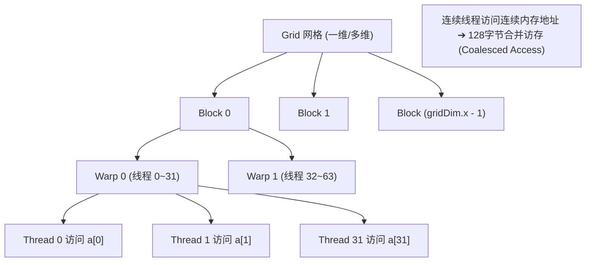
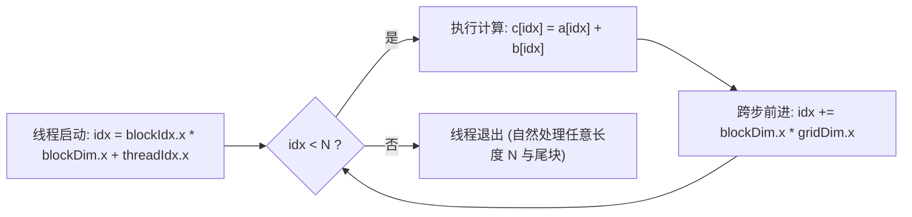

::: {.callout-note appearance="simple"}
**参考答案版**：包含完整代码实现与问答题深度参考解析。建议先独立完成练习题后再展开核对。
:::


## 本课目标与完成标准

学完后你应能：从 thread/block/grid 映射一维数据，并写出处理任意 N 的合并访存 kernel。

通过必须同时满足：

- 独立补齐本课唯一的代码填空题，并通过给定检查；
- 三个问答题均说明因果链，而不是只报术语；
- 能指出至少一个正确性边界和一个性能取舍；
- 总分不低于 8/10，且没有一票否决级概念错误。

## 前置关系

- 课程前置：C/C++、线性代数、基本并行编程
- 本课在路线中的作用：Vector Add 是最小 CUDA 工作流：host launch 决定 grid，device thread 用全局索引定位元素。

## 核心心智模型


### 核心操作与执行流程图解


<p class="caption" align="center"><em>图 1-1：GPU 线程层次（Grid/Block/Warp/Thread）与合并访存映射架构</em></p>


<p class="caption" align="center"><em>图 1-2：Grid-Stride Loop 网格跨步循环执行控制流</em></p>


### 核心操作与执行流程图解


<p class="caption" align="center"><em>图 1-1：GPU 线程层次（Grid/Block/Warp/Thread）与合并访存映射架构</em></p>


<p class="caption" align="center"><em>图 1-2：Grid-Stride Loop 网格跨步循环执行控制流</em></p>


### 1. 它是什么，解决什么问题

Vector Add 是最小 CUDA 工作流：host launch 决定 grid，device thread 用全局索引定位元素。

### 2. 它如何工作

全局索引为 blockIdx.x·blockDim.x+threadIdx.x；grid-stride loop 每轮跨整个 grid，使固定 grid 也能覆盖任意长度。

### 3. 正确性条件与常见误区

循环条件必须保护 N=0 与尾块；相邻线程访问相邻元素才有利于合并访存。

### 4. 性能与工程取舍

更大 block 不必然更快；寄存器、occupancy、launch 数和内存带宽共同决定。

## 具体演示

N=1000、block=256、grid=4 时共 1024 个线程，最后 24 个线程被边界条件屏蔽；若 grid 限制为 2，每线程第二轮继续处理。

请在阅读后先合上这一节，用自己的语言复述“输入状态 → 中间状态 → 输出状态”，再做练习。

## 实践任务：唯一代码填空题

补齐全局下标与 stride，不改变边界循环。

规则：只能修改 `TODO`/`______` 所在位置；不要删除断言或放宽误差。代码注释说明了每个边界条件。

```{python}
#| course_role: exercise
%%writefile /tmp/01_vector_add.cu
#include <cuda_runtime.h>

// Vector Add: c[i] = a[i] + b[i]
//
// 这是 CUDA 面试里最基础的算子，重点不是算法复杂，
// 而是确认你理解 thread/block/grid 映射和 coalesced memory access。
__global__ void vector_add_kernel(
    const float* __restrict__ a,
    const float* __restrict__ b,
    float* __restrict__ c,
    int n
) {
    int idx = ______;  // TODO 1: 当前线程全局下标
    int stride = ______;  // TODO 2: 整个 grid 的线程跨度

    // grid-stride loop 的好处：
    // 1. kernel 可以处理任意 n，不要求 grid 覆盖全部元素后就停止。
    // 2. 如果 n 很大，每个线程可以处理多个元素，代码仍然简单。
    // 3. 相邻线程访问相邻 idx，读写都是合并访存。
    for (int i = idx; i < n; i += stride) {
        c[i] = a[i] + b[i];
    }
}

void launch_vector_add(
    const float* a,
    const float* b,
    float* c,
    int n,
    cudaStream_t stream
) {
    constexpr int BLOCK_SIZE = 256;
    int grid = (n + BLOCK_SIZE - 1) / BLOCK_SIZE;

    // 限制 grid 上限是常见写法，避免 n 极大时创建过多 block。
    // grid-stride loop 会保证剩余元素继续被处理。
    grid = grid > 4096 ? 4096 : grid;

    vector_add_kernel<<<grid, BLOCK_SIZE, 0, stream>>>(a, b, c, n);
}
```

### 检查方法

有 CUDA 环境时执行 `nvcc -std=c++17 -c /tmp/01_vector_add.cu -o /tmp/01_vector_add.cu.o`；无 CUDA 环境时只做静态审查并登记待验证。

提交时请给出：补齐后的代码、实际运行输出（环境不可用时注明“仅静态审查”）以及对失败用例的解释。

### Q1

不要背定义：请从输入、状态变化和输出三个阶段解释“线程映射与 grid-stride loop”的工作机制。

**你的答案：**

### Q2

删掉 `i < n` 后为什么小尺寸测试也可能偶尔看似正常？

**你的答案：**

### Q3

若 N 远大于最大 grid，为什么 grid-stride loop 仍能覆盖全部元素？

**你的答案：**

## 评分与通过规则

- 代码 4 分：正常输入 2 分，边界输入 1 分，解释实现 1 分；
- Q1～Q3 各 2 分；
- 一票否决：结果碰巧正确但核心因果链错误、删除边界检查、把未运行结果说成实测。

需要提示时按四级机制请求：概念区域 → 具体方向 → 关键局部 → 完整答案。


::: {.callout-tip collapse="true" title="💡 点击展开参考答案与详细代码实现" icon="false"}
## 参考答案（仅 answer 分支）

先完成题目再核对。即使代码一致，也要能解释关键步骤，并尝试更换一个输入规模。

```{python}
#| course_role: solution
%%writefile /tmp/01_vector_add.cu
#include <cuda_runtime.h>

// Vector Add: c[i] = a[i] + b[i]
//
// 这是 CUDA 面试里最基础的算子，重点不是算法复杂，
// 而是确认你理解 thread/block/grid 映射和 coalesced memory access。
__global__ void vector_add_kernel(
    const float* __restrict__ a,
    const float* __restrict__ b,
    float* __restrict__ c,
    int n
) {
    int idx = blockIdx.x * blockDim.x + threadIdx.x;
    int stride = blockDim.x * gridDim.x;

    // grid-stride loop 的好处：
    // 1. kernel 可以处理任意 n，不要求 grid 覆盖全部元素后就停止。
    // 2. 如果 n 很大，每个线程可以处理多个元素，代码仍然简单。
    // 3. 相邻线程访问相邻 idx，读写都是合并访存。
    for (int i = idx; i < n; i += stride) {
        c[i] = a[i] + b[i];
    }
}

void launch_vector_add(
    const float* a,
    const float* b,
    float* c,
    int n,
    cudaStream_t stream
) {
    constexpr int BLOCK_SIZE = 256;
    int grid = (n + BLOCK_SIZE - 1) / BLOCK_SIZE;

    // 限制 grid 上限是常见写法，避免 n 极大时创建过多 block。
    // grid-stride loop 会保证剩余元素继续被处理。
    grid = grid > 4096 ? 4096 : grid;

    vector_add_kernel<<<grid, BLOCK_SIZE, 0, stream>>>(a, b, c, n);
}
```

### Q1 参考答案

全局索引为 blockIdx.x·blockDim.x+threadIdx.x；grid-stride loop 每轮跨整个 grid，使固定 grid 也能覆盖任意长度。

### Q2 参考答案

判断时先检查本课不变量：循环条件必须保护 N=0 与尾块；相邻线程访问相邻元素才有利于合并访存。  若不成立，最终数值或系统状态即使暂时正常也不可信。

### Q3 参考答案

迁移时先保证正确性，再比较代价。这里的核心取舍是：更大 block 不必然更快；寄存器、occupancy、launch 数和内存带宽共同决定。

## 参考资料

- [CUDA Programming Guide](https://docs.nvidia.com/cuda/cuda-programming-guide/)
- [CUDA Best Practices Guide](https://docs.nvidia.com/cuda/cuda-c-best-practices-guide/)

资料用于建立事实基线；面试回答仍需用自己的语言组织。
:::
