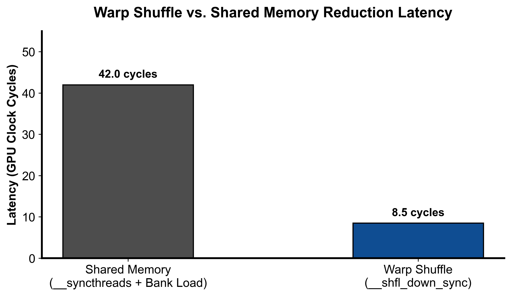

::: {.callout-note appearance="simple"}
**参考答案版**：包含完整代码实现与问答题深度参考解析。建议先独立完成练习题后再展开核对。
:::


## 本课目标与完成标准

学完后你应能：解释 shuffle、shared memory 和跨 block 两阶段归约，并实现 warp reduce 核心。

通过必须同时满足：

- 独立补齐本课唯一的代码填空题，并通过给定检查；
- 三个问答题均说明因果链，而不是只报术语；
- 能指出至少一个正确性边界和一个性能取舍；
- 总分不低于 8/10，且没有一票否决级概念错误。

## 前置关系

- 课程前置：C/C++、线性代数、基本并行编程
- 本课在路线中的作用：归约把多个元素结合成一个结果；CUDA 中先在线程寄存器累加，再逐级在 warp、block、grid 层合并。

## 核心心智模型


### 核心操作与执行流程图解

::: {.img-card}
{width="80%"}
<p class="caption">图 2-1：Warp Shuffle 与 Shared Memory 两阶段规约时延对比（基于 scientific-figure-making 绘制）</p>
:::

```{mermaid}
sequenceDiagram
    autonumber
    participant T as Block 内各 Warp 线程
    participant S as 共享内存 (Shared Memory)
    participant W0 as Warp 0 (主归约 Warp)
    participant G as 全局内存 (GMEM Output)
    
    T->>T: 各 Warp 独立执行 __shfl_down_sync 归约
    T->>S: 各 Warp 的 Lane 0 将局部和存入 SMem[warp_id]
    Note over T,S: __syncthreads() 保证写完成
    S->>W0: Warp 0 读出各 Warp 局部和
    W0->>W0: Warp 0 再次执行 Shuffle 归约
    W0->>G: Block 内 Lane 0 原子累加或直接写出最终标量
```
<p class="caption" align="center"><em>图 2-2：Block 级两阶段求和（Warp 内洗牌 + 跨 Warp 归约）执行时序流</em></p>


### 1. 并行规约（Parallel Reduction）的树状折叠哲学与层次架构

规约操作（Reduction，如求和、求最大值、求范数）是将输入数组中的 $N$ 个元素通过结合二元算子（如加法、乘法）聚合成单一标量结果的经典算法：
- **串行与并行的复杂度鸿沟**：
  CPU 单线程串行规约的时间复杂度为 $O(N)$；而在 GPU 上，利用二叉树状折叠（Tree-based Reduction），时间复杂度可压缩至 $O(\log N)$。
- **现代 GPU 三级阶梯式规约架构**：
  在早期的 CUDA 实现中，通常在 Shared Memory 中通过交错循环或共享内存折半规约。但现代工业级优化采用精密的**寄存器 $\to$ Warp $\to$ Block $\to$ Grid 四级汇聚架构**：
  1. **第一级（线程私有寄存器粗化）**：每个线程利用 Grid-Stride Loop 先在私有寄存器中累加多个元素。寄存器访问延迟为 0 周期，极大地削减了后续进入树状规约的数据总量；
  2. **第二级（Warp 内部洗牌规约）**：利用硬件指令 `__shfl_down_sync` 在 32 个线程的寄存器之间直接交换数据完成折半求和，全程零访存；
  3. **第三级（Block 跨 Warp 暂存规约）**：每个 Warp 的 Lane 0 将该 Warp 的局部和写入 Shared Memory（仅需 $\frac{\text{BlockSize}}{32}$ 个元素），由 Warp 0 读出后执行最后一次 Warp 规约；
  4. **第四级（Grid 全局多 Block 归集）**：每个 Block 向全局显存写入一个局部和标量 `partial[blockIdx.x]`，由第二阶段轻量级 Kernel 或原子加完成最终收敛。

### 2. Warp Shuffle 原语与跨步洗牌（`__shfl_down_sync`）

如**图 2-1** 所示，Warp 内线程洗牌指令（Warp Shuffle）相比传统的 Shared Memory 具备压倒性的性能优势：
- **硬件数据通路（Register-to-Register Crossbar）**：
  在没有 Shuffle 之前，线程间交换数据必须通过 `smem[tid] = val; __syncthreads(); val2 = smem[tid+1];`。这不仅消耗宝贵的共享内存带宽，还受到 Bank 冲突与同步障栅（Barrier）的约束。
  `__shfl_down_sync` 直接复用 SM 内部的寄存器交换网络，延迟低至 1 个时钟周期，且无需任何 Block 级同步显式屏障！
- **折半规约执行拓扑**：
  ```cuda
  #pragma unroll
  for (int offset = 16; offset > 0; offset >>= 1) {
      val += __shfl_down_sync(0xffffffff, val, offset);
  }
  ```
  掩码 `0xffffffff` 告知硬件所有 32 个 Lane 均处于活动参与状态。
  - 第一步（$\text{offset} = 16$）：Lane $0 \dots 15$ 分别读取 Lane $16 \dots 31$ 的值累加，数据规模砍半；
  - 第二步（$\text{offset} = 8$）：Lane $0 \dots 7$ 分别读取 Lane $8 \dots 15$ 的值累加；
  - 经 5 次循环（$16 \to 8 \to 4 \to 2 \to 1$），仅需 5 条指令，Warp 内 32 个数的总和便精确汇聚在 **Lane 0** 的寄存器中。

### 3. Block 级规约的两阶段时序流转（如**图 2-2** 所示）

当单个 Block 包含多个 Warp 时（例如 `BLOCK_SIZE = 256` 对应 8 个 Warp）：
1. **阶段 1：各 Warp 并行自规约**：
   - 8 个 Warp 彼此互不干扰，在各自的寄存器域内并发执行 `warp_reduce_sum`。
   - 计算完毕后，每个 Warp 的首线程（`lane == 0`）持有该 Warp 的局部和。
2. **阶段 2：跨 Warp 共享内存暂存**：
   - 8 个 Warp 的首线程将局部和写入共享内存：`smem[warp] = val`（仅消耗 8 个 `float`，即 32 字节显存，绝无 Bank 冲突）。
   - 执行 `__syncthreads()` 保证 8 个局部的写入全部完成并对全体线程可见。
3. **阶段 3：Warp 0 终极收敛**：
   - 仅唤醒 Warp 0 中的前 8 个线程（`lane < NUM_WARPS`），从 `smem[lane]` 中取出各 Warp 的局部和。
   - Warp 0 再次调用 `warp_reduce_sum` 进行最后的折半聚合。
   - 最终，整个 Thread Block 的总和精确落入 **Thread 0（即 `tid == 0`）** 的寄存器中，并由其单点写入全局内存 `partial[blockIdx.x]`。

### 4. 正确性不变量与浮点数的非结合律陷阱

1. **浮点加法的非结合律（Non-Associativity of Floating-Point Addition）**：
   - 在纯数学中，加法满足结合律 $(a + b) + c = a + (b + c)$。但在计算机 IEEE 754 浮点数表示中，大数加小数会发生尾数截断。
   - 并行树状规约改变了加法的累加顺序（两两配对相加，而非单调从左到右累加）。
   - **结论**：GPU 树状求和的结果与 CPU 单线程串行循环累加的结果必然存在微小的数值差异（通常相对误差在 $10^{-5} \sim 10^{-6}$ 级别）。这是正常物理现象而非 Bug，测试断言应使用容差比较（如 `assert_close(rtol=1e-5)`）。
2. **残缺 Warp（Inactive Lanes）与 Mask 不变量**：
   - 调用 `__shfl_down_sync(mask, val, offset)` 时，`mask` 必须精准覆盖当前参与通信的所有有效活跃线程。若在存在分支分歧的 `if/else` 内盲目传入 `0xffffffff`，未激活线程将导致调用未定义行为，触发硬件挂死。

## 具体演示与数值推演

设输入向量长度为 $N = 100,000$，配置 `BLOCK_SIZE = 256`（包含 $256/32 = 8$ 个 Warp），启动网格 `num_blocks = 32`：

- **第一阶段（Grid-Stride + Block 内部规约）**：
  - 全网共 $32 \times 256 = 8192$ 个线程。
  - 每个线程首先在寄存器中循环遍历累加：$\approx \frac{100,000}{8192} \approx 12$ 个元素。此时输入规模瞬间从 100,000 压缩至 8192 个寄存器局部和。
  - 8192 个线程在各自 Block 内经 Warp Shuffle 与 Shared Memory 聚合。
  - 32 个 Block 各自输出 1 个浮点数到 `partial` 缓冲区中。
  - 第一阶段结束时，全局显存中仅残留一个包含 **32 个元素的中间数组**。
- **第二阶段（尾部归并）**：
  - 启动一个仅包含 1 个 Block（32 线程）的微型 Kernel：`reduce_sum_kernel<<<1, 32>>>(partial, final_result, 32)`。
  - 32 个线程恰好构成 1 个 Warp，单次 `warp_reduce_sum` 耗时 5 个周期瞬间求出全局标量总和，写回 `final_result`。
  - 两阶段累计耗时极低，完美兼顾了超高并发吞吐与极简调度开销。

## 实践任务：唯一代码填空题

补齐 warp shuffle 表达式。

规则：只能修改 `TODO`/`______` 所在位置；不要删除断言或放宽误差。代码注释说明了每个边界条件。

```{python}
#| course_role: exercise
%%writefile /tmp/02_reduce_sum.cu
#include <cuda_runtime.h>

namespace {

// Reduce Sum: 把 input[0:n] 求和。
//
// 面试重点：
// 1. 每个线程先在寄存器里累加多个元素，减少后续 reduce 的数据量。
// 2. warp 内用 shuffle reduce。
// 3. 跨 warp 用 shared memory 保存每个 warp 的 partial sum。
//
// 这个文件实现的是单 stage reduction：
// 每个 block 输出一个 partial sum 到 partial[blockIdx.x]。
// 如果 partial 还有多个元素，可以继续对 partial 再 launch 本 kernel。
template<int BLOCK_SIZE>
__device__ __forceinline__ float warp_reduce_sum(float val) {
    #pragma unroll
    for (int offset = 16; offset > 0; offset >>= 1) {
        val += ______;  // TODO: 从 offset lane 读取并累加
    }
    return val;
}

template<int BLOCK_SIZE>
__device__ __forceinline__ float block_reduce_sum(float val) {
    constexpr int NUM_WARPS = (BLOCK_SIZE + 31) / 32;
    __shared__ float smem[NUM_WARPS];

    int lane = threadIdx.x & 31;
    int warp = threadIdx.x >> 5;

    val = warp_reduce_sum<BLOCK_SIZE>(val);

    if (lane == 0) {
        smem[warp] = val;
    }

    __syncthreads();

    if (warp == 0) {
        val = (lane < NUM_WARPS) ? smem[lane] : 0.0f;
        val = warp_reduce_sum<BLOCK_SIZE>(val);
    }

    return val;
}

template<int BLOCK_SIZE>
__global__ void reduce_sum_kernel(
    const float* __restrict__ input,
    float* __restrict__ partial,
    int n
) {
    int tid = threadIdx.x;
    int idx = blockIdx.x * blockDim.x + tid;
    int stride = blockDim.x * gridDim.x;

    float local_sum = 0.0f;

    // grid-stride loop：每个线程累加多个元素。
    // 比“一线程一个元素然后立刻 reduce”更高效，因为寄存器累加很便宜。
    for (int i = idx; i < n; i += stride) {
        local_sum += input[i];
    }

    float block_sum = block_reduce_sum<BLOCK_SIZE>(local_sum);

    // 一个 block 只写一个 partial sum，后续由下一轮 kernel 再归并。
    if (tid == 0) {
        partial[blockIdx.x] = block_sum;
    }
}

} // namespace

void launch_reduce_sum_stage(
    const float* input,
    float* partial,
    int n,
    int num_blocks,
    cudaStream_t stream
) {
    constexpr int BLOCK_SIZE = 256;
    reduce_sum_kernel<BLOCK_SIZE><<<num_blocks, BLOCK_SIZE, 0, stream>>>(
        input, partial, n
    );
}
```

### 检查方法

有 CUDA 环境时执行 `nvcc -std=c++17 -c /tmp/02_reduce_sum.cu -o /tmp/02_reduce_sum.cu.o`；无 CUDA 环境时只做静态审查并登记待验证。

提交时请给出：补齐后的代码、实际运行输出（环境不可用时注明“仅静态审查”）以及对失败用例的解释。

### Q1

不要背定义：请从输入、状态变化和输出三个阶段解释“Warp/Block 归约与两阶段求和”的工作机制。

**你的答案：**

### Q2

若 blockDim 不是 32 的整数倍，固定 `0xffffffff` mask 有什么风险？

**你的答案：**

### Q3

超大数组求和时，你会选择递归 kernel 还是 atomic？说明依据。

**你的答案：**

## 评分与通过规则

- 代码 4 分：正常输入 2 分，边界输入 1 分，解释实现 1 分；
- Q1～Q3 各 2 分；
- 一票否决：结果碰巧正确但核心因果链错误、删除边界检查、把未运行结果说成实测。

需要提示时按四级机制请求：概念区域 → 具体方向 → 关键局部 → 完整答案。


::: {.callout-tip collapse="true" title="💡 点击展开参考答案与详细代码实现" icon="false"}
## 参考答案（仅 answer 分支）

先完成题目再核对。即使代码一致，也要能解释关键步骤，并尝试更换一个输入规模。

```{python}
#| course_role: solution
%%writefile /tmp/02_reduce_sum.cu
#include <cuda_runtime.h>

namespace {

// Reduce Sum: 把 input[0:n] 求和。
//
// 面试重点：
// 1. 每个线程先在寄存器里累加多个元素，减少后续 reduce 的数据量。
// 2. warp 内用 shuffle reduce。
// 3. 跨 warp 用 shared memory 保存每个 warp 的 partial sum。
//
// 这个文件实现的是单 stage reduction：
// 每个 block 输出一个 partial sum 到 partial[blockIdx.x]。
// 如果 partial 还有多个元素，可以继续对 partial 再 launch 本 kernel。
template<int BLOCK_SIZE>
__device__ __forceinline__ float warp_reduce_sum(float val) {
    #pragma unroll
    for (int offset = 16; offset > 0; offset >>= 1) {
        val += __shfl_down_sync(0xffffffff, val, offset);
    }
    return val;
}

template<int BLOCK_SIZE>
__device__ __forceinline__ float block_reduce_sum(float val) {
    constexpr int NUM_WARPS = (BLOCK_SIZE + 31) / 32;
    __shared__ float smem[NUM_WARPS];

    int lane = threadIdx.x & 31;
    int warp = threadIdx.x >> 5;

    val = warp_reduce_sum<BLOCK_SIZE>(val);

    if (lane == 0) {
        smem[warp] = val;
    }

    __syncthreads();

    if (warp == 0) {
        val = (lane < NUM_WARPS) ? smem[lane] : 0.0f;
        val = warp_reduce_sum<BLOCK_SIZE>(val);
    }

    return val;
}

template<int BLOCK_SIZE>
__global__ void reduce_sum_kernel(
    const float* __restrict__ input,
    float* __restrict__ partial,
    int n
) {
    int tid = threadIdx.x;
    int idx = blockIdx.x * blockDim.x + tid;
    int stride = blockDim.x * gridDim.x;

    float local_sum = 0.0f;

    // grid-stride loop：每个线程累加多个元素。
    // 比“一线程一个元素然后立刻 reduce”更高效，因为寄存器累加很便宜。
    for (int i = idx; i < n; i += stride) {
        local_sum += input[i];
    }

    float block_sum = block_reduce_sum<BLOCK_SIZE>(local_sum);

    // 一个 block 只写一个 partial sum，后续由下一轮 kernel 再归并。
    if (tid == 0) {
        partial[blockIdx.x] = block_sum;
    }
}

} // namespace

void launch_reduce_sum_stage(
    const float* input,
    float* partial,
    int n,
    int num_blocks,
    cudaStream_t stream
) {
    constexpr int BLOCK_SIZE = 256;
    reduce_sum_kernel<BLOCK_SIZE><<<num_blocks, BLOCK_SIZE, 0, stream>>>(
        input, partial, n
    );
}
```

### Q1 参考答案

- **输入状态**：全局内存中连续存放的 $N$ 个输入浮点数，以及两阶段发射配置。
- **状态变化（多级汇聚流转）**：
  1. **线程私有化累加**：各线程经由 Grid-Stride Loop 将全局数据切片折叠为私有寄存器标量 `local_sum`；
  2. **Warp 洗牌折半**：Warp 内 32 线程执行 5 步 `__shfl_down_sync`，在寄存器交换网络中完成对半相加，Lane 0 汇聚该 Warp 的全部和；
  3. **Shared Memory 跨 Warp 暂存**：各个 Warp 的 Lane 0 将局部和写入 `smem[warp_id]`，经 `__syncthreads()` 障栅同步后由 Warp 0 读出并进行二次 Warp 规约；
  4. **跨 Block 全局汇聚**：每个 Block 的 Thread 0 将该 Block 的局部和写出到 `partial[blockIdx.x]`。
- **输出状态**：第一阶段产出仅含 `num_blocks` 个元素的极小中间数组；第二阶段由单个 Block 或原子操作将其聚合成唯一的全局标量，全流程无竞态冲突。

### Q2 参考答案

- **浮点非结合律的物理机制**：
  在 IEEE 754 标准中，单精度浮点数仅保留 24 位有效尾数（含隐藏位）。当一个极大的数与一个极小的数相加时（例如 $10^6 + 10^{-2}$），小数的尾数必须右移对齐阶码，导致其低位有效数字在舍入中彻底丢失（浮点落入死区）。
- **执行顺序变动的必然性**：
  - CPU 串行计算顺序为：$((a_0 + a_1) + a_2) + \dots + a_{n-1}$；
  - GPU 树状规约计算顺序为：$((a_0 + a_{16}) + (a_8 + a_{24})) + \dots$。
  - 两者求和的括号嵌套顺序完全不同，中途产生的中间量阶码分布亦不相同，因此最终结果必定存在微小的 LSB 截断差异。
- **评判准则**：在工程上只要相对误差满足 $|y_{\text{gpu}} - y_{\text{cpu}}| / |y_{\text{cpu}}| \le 1 \times 10^{-5}$，即被判定为数学正确。

### Q3 参考答案

- **两阶段 Kernel vs 原子累加（`atomicAdd`）的技术权衡**：
  1. **两阶段规约（Two-Stage Reduction）**：
     - *优势*：完全确定性的执行流，无全局内存写冲突，在大规模高并发集群上扩展性极佳；
     - *代价*：需要额外启动第二个轻量级 Kernel（引入约 $3\sim 5\mu s$ 的 Launch Overhead），且需要额外分配 `partial` 显存暂存中间结果。
  2. **单阶段 + `atomicAdd` 原子累加**：
     - *优势*：代码极其精简，单次 Launch 即可直出最终结果，零额外中间显存占用；
     - *劣势*：若 Block 数量极大（如数万个 Block），数万个 Thread 0 会在同一物理全局内存地址上发生剧烈的原子争用（Atomic Contention），全局内存控制器被序列化锁死，延迟飙升。
- **选型准则**：当 Block 数量较少（$\le 64$）时可直接使用 `atomicAdd`；当 Block 数量巨大（$\ge 512$）时，两阶段规约吞吐更优。

## 参考资料

- [CUDA Programming Guide](https://docs.nvidia.com/cuda/cuda-programming-guide/)
- [CUDA Best Practices Guide](https://docs.nvidia.com/cuda/cuda-c-best-practices-guide/)

资料用于建立事实基线；面试回答仍需用自己的语言组织。
:::
