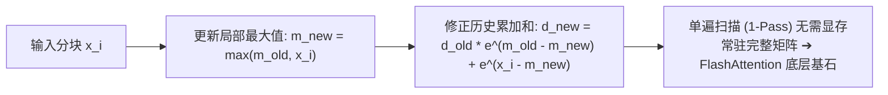
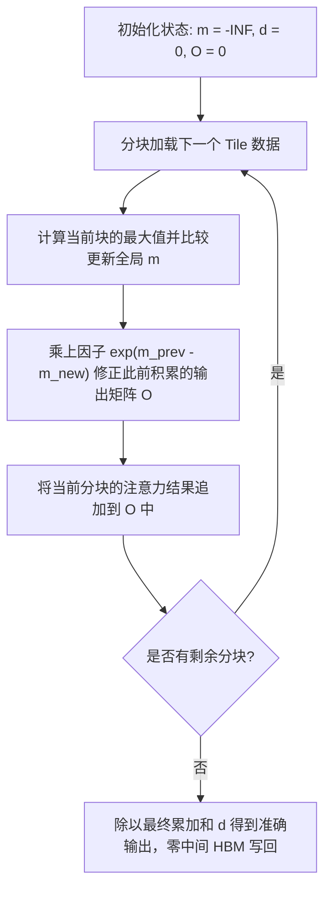

::: {.callout-note appearance="simple"}
**参考答案版**：包含完整代码实现与问答题深度参考解析。建议先独立完成练习题后再展开核对。
:::


## 本课目标与完成标准

学完后你应能：推导并实现 `(m,d)` 状态合并，为 FlashAttention 建立数值基础。

通过必须同时满足：

- 独立补齐本课唯一的代码填空题，并通过给定检查；
- 三个问答题均说明因果链，而不是只报术语；
- 能指出至少一个正确性边界和一个性能取舍；
- 总分不低于 8/10，且没有一票否决级概念错误。

## 前置关系

- 课程前置：C/C++、线性代数、基本并行编程
- 本课在路线中的作用：Online softmax 用最大值 m 与重标定分母 d 描述一个分片，使分片能流式合并而无需保存所有 logits。

## 核心心智模型


### 核心操作与执行流程图解


<p class="caption" align="center"><em>图 7-1：Online Softmax 可结合状态增量递推配平机制</em></p>


<p class="caption" align="center"><em>图 7-2：单遍扫描 Online Softmax 增量更新与缩放流程</em></p>


### 核心操作与执行流程图解

```{mermaid}
flowchart LR
    Input["输入分块 x_i"] --> Max["更新局部最大值: m_new = max(m_old, x_i)"]
    Max --> Scale["修正历史累加和: d_new = d_old * e^(m_old - m_new) + e^(x_i - m_new)"]
    Scale --> Flash["单遍扫描 (1-Pass) 无需显存常驻完整矩阵 ➔ FlashAttention 底层基石"]
```
<p class="caption" align="center"><em>图 7-1：Online Softmax 可结合状态增量递推配平机制</em></p>

```{mermaid}
flowchart TD
    Init["初始化状态: m = -INF, d = 0, O = 0"] --> Load["分块加载下一个 Tile 数据"]
    Load --> UpdateM["计算当前块的最大值并比较更新全局 m"]
    UpdateM --> Rescale["乘上因子 exp(m_prev - m_new) 修正此前积累的输出矩阵 O"]
    Rescale --> Acc["将当前分块的注意力结果追加到 O 中"]
    Acc --> Check{"是否有剩余分块?"}
    Check -->|是| Load
    Check -->|否| Final["除以最终累加和 d 得到准确输出，零中间 HBM 写回"]
```
<p class="caption" align="center"><em>图 7-2：单遍扫描 Online Softmax 增量更新与缩放流程</em></p>


### 1. 它是什么，解决什么问题

Online softmax 用最大值 m 与重标定分母 d 描述一个分片，使分片能流式合并而无需保存所有 logits。

### 2. 它如何工作

合并状态时 m=max(m1,m2)，再把两边分母分别乘 exp(m_old-m) 后相加。

### 3. 正确性条件与常见误区

每次 m 改变都必须重标旧分母；空分片的单位元要谨慎定义为 m=-∞、d=0。

### 4. 性能与工程取舍

流式状态减少中间存储，但 combine 比普通 sum 更昂贵；收益来自 IO 而非更少指数运算。

## 具体演示

分片 [1,2] 的状态与 [3] 合并时，前一分母必须乘 exp(2-3)，否则分母过大。

请在阅读后先合上这一节，用自己的语言复述“输入状态 → 中间状态 → 输出状态”，再做练习。

## 实践任务：唯一代码填空题

补齐 online combine。

规则：只能修改 `TODO`/`______` 所在位置；不要删除断言或放宽误差。代码注释说明了每个边界条件。

```{python}
#| course_role: exercise
%%writefile /tmp/07_online_softmax.cu
#include <float.h>
#include <cuda_runtime.h>

// Online Softmax 里每个局部状态用两个数表示：
// m = 当前看过元素的最大值
// d = sum(exp(x_i - m))
//
// 如果两个分片状态分别是 (m1, d1) 和 (m2, d2)，合并时新的最大值是：
// m = max(m1, m2)
//
// 原来的 d1 基于 m1，d2 基于 m2；合并到新 m 后需要重新缩放：
// d = d1 * exp(m1 - m) + d2 * exp(m2 - m)
//
// 这个合并公式是 online softmax 的核心。
__device__ __forceinline__ void online_combine(
    float& m1,
    float& d1,
    float m2,
    float d2
) {
    float m = fmaxf(m1, m2);
    d1 = ______;  // TODO: 把两个分母重标到新最大值
    m1 = m;
}

// warp 内把 32 个线程各自的 (m, d) 合并成一个状态。
// shuffle_down 每次把 offset 位置的线程状态读过来，然后用 online_combine 合并。
__device__ __forceinline__ void warp_reduce_online(float& m, float& d) {
    unsigned mask = 0xffffffff;

    #pragma unroll
    for (int offset = 16; offset > 0; offset >>= 1) {
        float m2 = __shfl_down_sync(mask, m, offset);
        float d2 = __shfl_down_sync(mask, d, offset);
        online_combine(m, d, m2, d2);
    }
}

// Softmax: 对 [M, N] 的每一行做 softmax。
//
// 传统稳定 softmax 通常是 3 pass：
// 1. 求 max
// 2. 求 sum(exp(x - max))
// 3. 写 output
//
// 这个版本是 2 pass online softmax：
// 1. 一次扫描同时得到整行 max 和 denominator
// 2. 第二次扫描写 output
//
// 一个 block 负责一行。这样一行的 max/sum 只算一次，
// 避免“每个输出元素都重复扫整行”的 O(N^2) 写法。
template<int BLOCK_SIZE>
__global__ void softmax_online_2pass(
    const float* __restrict__ input,
    float* __restrict__ output,
    int M,
    int N
) {
    int row = blockIdx.x;
    int tid = threadIdx.x;

    if (row >= M) return;

    const float* row_in = input + row * N;
    float* row_out = output + row * N;

    // 每个线程维护自己负责列的 online 状态。
    float local_m = -FLT_MAX;
    float local_d = 0.0f;

    // Pass 1：每个线程 stride 扫一部分列。
    // 对新元素 x，把当前状态 (local_m, local_d) 和单元素状态 (x, 1) 合并。
    for (int col = tid; col < N; col += BLOCK_SIZE) {
        float x = row_in[col];

        float new_m = fmaxf(local_m, x);
        local_d = local_d * expf(local_m - new_m) + expf(x - new_m);
        local_m = new_m;
    }

    // 先在每个 warp 内合并 local 状态。
    warp_reduce_online(local_m, local_d);

    constexpr int NUM_WARPS = (BLOCK_SIZE + 31) / 32;

    __shared__ float smem_m[NUM_WARPS];
    __shared__ float smem_d[NUM_WARPS];

    int lane = tid & 31;
    int warp = tid >> 5;

    // 每个 warp 的 lane 0 把该 warp 的结果放到 shared memory。
    if (lane == 0) {
        smem_m[warp] = local_m;
        smem_d[warp] = local_d;
    }

    __syncthreads();

    // warp 0 负责把所有 warp 的 partial 状态合成整行状态。
    float row_m = -FLT_MAX;
    float row_d = 0.0f;

    if (warp == 0) {
        if (lane < NUM_WARPS) {
            row_m = smem_m[lane];
            row_d = smem_d[lane];
        }

        warp_reduce_online(row_m, row_d);

        // 把最终整行 max 和 denominator 广播用的数据写回 smem[0]。
        if (lane == 0) {
            smem_m[0] = row_m;
            smem_d[0] = row_d;
        }
    }

    __syncthreads();

    row_m = smem_m[0];
    row_d = smem_d[0];

    // Pass 2：整行 max 和 denominator 已知后，写最终 softmax。
    for (int col = tid; col < N; col += BLOCK_SIZE) {
        row_out[col] = expf(row_in[col] - row_m) / row_d;
    }
}

void launch_softmax_online_2pass(
    const float* input,
    float* output,
    int M,
    int N,
    cudaStream_t stream
) {
    constexpr int BLOCK_SIZE = 256;
    softmax_online_2pass<BLOCK_SIZE><<<M, BLOCK_SIZE, 0, stream>>>(
        input, output, M, N
    );
}
```

### 检查方法

有 CUDA 环境时执行 `nvcc -std=c++17 -c /tmp/07_online_softmax.cu -o /tmp/07_online_softmax.cu.o`；无 CUDA 环境时只做静态审查并登记待验证。

提交时请给出：补齐后的代码、实际运行输出（环境不可用时注明“仅静态审查”）以及对失败用例的解释。

### Q1

不要背定义：请从输入、状态变化和输出三个阶段解释“Online Softmax 与可结合状态”的工作机制。

**你的答案：**

### Q2

如果更新 m 却不重标 d，softmax 和为何不再是 1？

**你的答案：**

### Q3

这个二元状态如何扩展到带 value 累积的 attention 输出？

**你的答案：**

## 评分与通过规则

- 代码 4 分：正常输入 2 分，边界输入 1 分，解释实现 1 分；
- Q1～Q3 各 2 分；
- 一票否决：结果碰巧正确但核心因果链错误、删除边界检查、把未运行结果说成实测。

需要提示时按四级机制请求：概念区域 → 具体方向 → 关键局部 → 完整答案。


::: {.callout-tip collapse="true" title="💡 点击展开参考答案与详细代码实现" icon="false"}
## 参考答案（仅 answer 分支）

先完成题目再核对。即使代码一致，也要能解释关键步骤，并尝试更换一个输入规模。

```{python}
#| course_role: solution
%%writefile /tmp/07_online_softmax.cu
#include <float.h>
#include <cuda_runtime.h>

// Online Softmax 里每个局部状态用两个数表示：
// m = 当前看过元素的最大值
// d = sum(exp(x_i - m))
//
// 如果两个分片状态分别是 (m1, d1) 和 (m2, d2)，合并时新的最大值是：
// m = max(m1, m2)
//
// 原来的 d1 基于 m1，d2 基于 m2；合并到新 m 后需要重新缩放：
// d = d1 * exp(m1 - m) + d2 * exp(m2 - m)
//
// 这个合并公式是 online softmax 的核心。
__device__ __forceinline__ void online_combine(
    float& m1,
    float& d1,
    float m2,
    float d2
) {
    float m = fmaxf(m1, m2);
    d1 = d1 * expf(m1 - m) + d2 * expf(m2 - m);
    m1 = m;
}

// warp 内把 32 个线程各自的 (m, d) 合并成一个状态。
// shuffle_down 每次把 offset 位置的线程状态读过来，然后用 online_combine 合并。
__device__ __forceinline__ void warp_reduce_online(float& m, float& d) {
    unsigned mask = 0xffffffff;

    #pragma unroll
    for (int offset = 16; offset > 0; offset >>= 1) {
        float m2 = __shfl_down_sync(mask, m, offset);
        float d2 = __shfl_down_sync(mask, d, offset);
        online_combine(m, d, m2, d2);
    }
}

// Softmax: 对 [M, N] 的每一行做 softmax。
//
// 传统稳定 softmax 通常是 3 pass：
// 1. 求 max
// 2. 求 sum(exp(x - max))
// 3. 写 output
//
// 这个版本是 2 pass online softmax：
// 1. 一次扫描同时得到整行 max 和 denominator
// 2. 第二次扫描写 output
//
// 一个 block 负责一行。这样一行的 max/sum 只算一次，
// 避免“每个输出元素都重复扫整行”的 O(N^2) 写法。
template<int BLOCK_SIZE>
__global__ void softmax_online_2pass(
    const float* __restrict__ input,
    float* __restrict__ output,
    int M,
    int N
) {
    int row = blockIdx.x;
    int tid = threadIdx.x;

    if (row >= M) return;

    const float* row_in = input + row * N;
    float* row_out = output + row * N;

    // 每个线程维护自己负责列的 online 状态。
    float local_m = -FLT_MAX;
    float local_d = 0.0f;

    // Pass 1：每个线程 stride 扫一部分列。
    // 对新元素 x，把当前状态 (local_m, local_d) 和单元素状态 (x, 1) 合并。
    for (int col = tid; col < N; col += BLOCK_SIZE) {
        float x = row_in[col];

        float new_m = fmaxf(local_m, x);
        local_d = local_d * expf(local_m - new_m) + expf(x - new_m);
        local_m = new_m;
    }

    // 先在每个 warp 内合并 local 状态。
    warp_reduce_online(local_m, local_d);

    constexpr int NUM_WARPS = (BLOCK_SIZE + 31) / 32;

    __shared__ float smem_m[NUM_WARPS];
    __shared__ float smem_d[NUM_WARPS];

    int lane = tid & 31;
    int warp = tid >> 5;

    // 每个 warp 的 lane 0 把该 warp 的结果放到 shared memory。
    if (lane == 0) {
        smem_m[warp] = local_m;
        smem_d[warp] = local_d;
    }

    __syncthreads();

    // warp 0 负责把所有 warp 的 partial 状态合成整行状态。
    float row_m = -FLT_MAX;
    float row_d = 0.0f;

    if (warp == 0) {
        if (lane < NUM_WARPS) {
            row_m = smem_m[lane];
            row_d = smem_d[lane];
        }

        warp_reduce_online(row_m, row_d);

        // 把最终整行 max 和 denominator 广播用的数据写回 smem[0]。
        if (lane == 0) {
            smem_m[0] = row_m;
            smem_d[0] = row_d;
        }
    }

    __syncthreads();

    row_m = smem_m[0];
    row_d = smem_d[0];

    // Pass 2：整行 max 和 denominator 已知后，写最终 softmax。
    for (int col = tid; col < N; col += BLOCK_SIZE) {
        row_out[col] = expf(row_in[col] - row_m) / row_d;
    }
}

void launch_softmax_online_2pass(
    const float* input,
    float* output,
    int M,
    int N,
    cudaStream_t stream
) {
    constexpr int BLOCK_SIZE = 256;
    softmax_online_2pass<BLOCK_SIZE><<<M, BLOCK_SIZE, 0, stream>>>(
        input, output, M, N
    );
}
```

### Q1 参考答案

合并状态时 m=max(m1,m2)，再把两边分母分别乘 exp(m_old-m) 后相加。

### Q2 参考答案

判断时先检查本课不变量：每次 m 改变都必须重标旧分母；空分片的单位元要谨慎定义为 m=-∞、d=0。  若不成立，最终数值或系统状态即使暂时正常也不可信。

### Q3 参考答案

迁移时先保证正确性，再比较代价。这里的核心取舍是：流式状态减少中间存储，但 combine 比普通 sum 更昂贵；收益来自 IO 而非更少指数运算。

## 参考资料

- [CUDA Programming Guide](https://docs.nvidia.com/cuda/cuda-programming-guide/)
- [CUDA Best Practices Guide](https://docs.nvidia.com/cuda/cuda-c-best-practices-guide/)

资料用于建立事实基线；面试回答仍需用自己的语言组织。
:::
