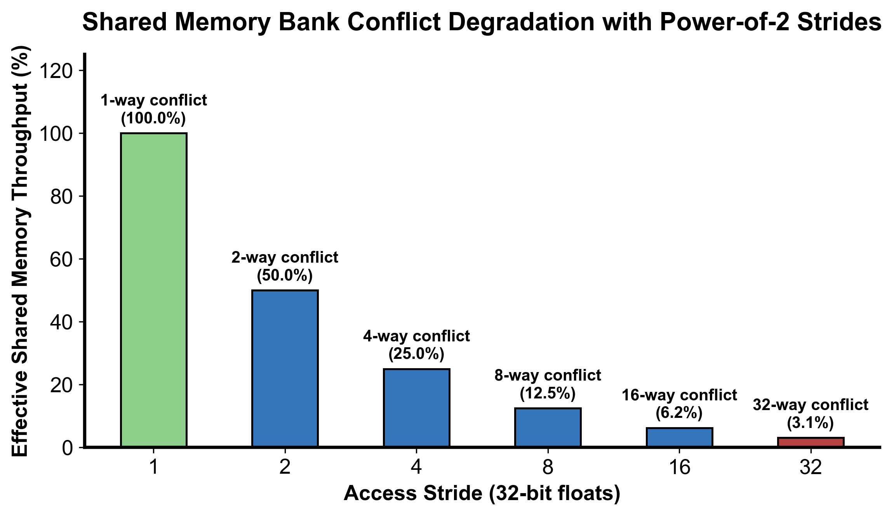

::: {.callout-note appearance="simple"}
**参考答案版**：包含完整代码实现与问答题深度参考解析。建议先独立完成练习题后再展开核对。
:::


## 本课目标与完成标准

学完后你应能：实现 32×32 tiled transpose，解释 `+1` padding 消除 bank conflict。

通过必须同时满足：

- 独立补齐本课唯一的代码填空题，并通过给定检查；
- 三个问答题均说明因果链，而不是只报术语；
- 能指出至少一个正确性边界和一个性能取舍；
- 总分不低于 8/10，且没有一票否决级概念错误。

## 前置关系

- 课程前置：C/C++、线性代数、基本并行编程
- 本课在路线中的作用：共享内存 tile 把 global 的跨步写转换为 tile 内转置，再以连续地址写回。

## 核心心智模型


### 核心操作与执行流程图解

::: {.img-card}
{width="85%"}
<p class="caption">图 9-1：Shared Memory 跨步冲突对有效吞吐的影响及填充消除原理（基于 scientific-figure-making 绘制）</p>
:::

```{mermaid}
sequenceDiagram
    autonumber
    participant GM_In as 全局内存输入 A
    participant SM as 共享内存 tile[32][33]
    participant GM_Out as 全局内存输出 B
    
    GM_In->>SM: 线程合并读取 A[y, x] 并写入本地 tile[ty][tx]
    Note over SM: __syncthreads() 保证整个 Tile 填满
    SM->>GM_Out: 线程按转置坐标合并读取 tile[tx][ty]，并合并写入 B[x, y]
    Note over GM_In,GM_Out: 读写双向全部达成合并访存且 SMem 无 Bank 冲突
```
<p class="caption" align="center"><em>图 9-2：基于共享内存中继的双向合并转置执行流</em></p>


### 1. 它是什么，解决什么问题

**共享内存分块转置（Tiled Transpose with Shared Memory）** 是解决显存读写不对称性、达成“读端与写端双向 100% 合并访存”的经典架构范式。

**上一课暴露的物理困境**：
- 朴素转置在全局显存中直接跨步写入，导致显存总线事务被切碎为 32 个独立的散落写请求，写入带宽仅剩 12.5%；
- **分块中继解决方案（图 9-2）**：将输入矩阵切分为 $32 \times 32$ 的数据瓦片（Tiles）。线程块先以连续地址将数据合并读入片上极高速的共享内存（Shared Memory，带宽达数十 TB/s）；在共享内存内部完成行列坐标调换；最后再次以连续地址将转置后的数据合并写回全局显存！
- **随之而来的新瓶颈：Bank Conflict（图 9-1）**：共享内存被组织为 32 个交错的存储体（Banks）。当线程转置读取共享内存的一列数据时，各线程访问的地址刚好相差 32 个单字，导致 32 个线程同时争抢同一个 Bank（32 路 Bank Conflict），使原本单周期的片上访问被硬件强制串行化为 32 个连续周期！本课通过添加关键的 **`+1` 填充（Padding）** 彻底化解此冲突。

### 2. 它如何工作（结合图 9-1 与图 9-2）

算法采用由 256 个线程构成的 2D 线程块（`dim3 block(32, 8)`），每个线程通过 4 次循环循环搬运覆盖 $32 \times 32$ 的 Tile：
1. **第一阶段：合并读取与写入共享内存**
   - 线程全局坐标为 $(x, y)$。线程以循环跨步（`j = 0, 8, 16, 24`）读取 Global Memory 中的连续数据 `input[row * N + col]`（其中连续的 `threadIdx.x` 读取连续地址，100% 合并）；
   - 将读取到的数据存入共享内存缓冲：`tile[threadIdx.y + j][threadIdx.x]`。此处写入也是按行连续写入，完全没有 Bank Conflict。
2. **第二阶段：片上块同步栅障（`__syncthreads()`）**
   - 调用 `__syncthreads()`，强制 Block 内全部 256 个线程全部完成 Tile 的写入，防止后续读操作读取到未初始化的陈旧脏数据。
3. **第三阶段：转置读取共享内存与合并写回**
   - 逻辑坐标对调：将原有的分块坐标 `blockIdx.x` 与 `blockIdx.y` 颠倒，映射到输出矩阵的目标分块位置；
   - 线程从共享内存中读取转置后的元素：`tile[threadIdx.x][threadIdx.y + j]`（注意行号由 `threadIdx.x` 决定）；
   - 若共享内存定义为 `tile[32][33]`，各线程访问的元素恰好分散在 32 个不同的 Bank 中，单周期并行读出；
   - 线程将数据以连续地址写入目标显存：`output[row * M + col]`。写端成功实现 100% 合并访存！

### 3. 正确性条件与常见误区

1. **同步栅障的严格必要性（WAR 与 RAW 冒险）**：
   - 线程块内的 8 个 Warp 并非锁步执行。如果在写完 SMEM 和读出 SMEM 之间省略 `__syncthreads()`，执行速度较快的 Warp 会立刻执行读操作，而速度慢的 Warp 尚未完成全局显存加载，导致读出未初始化的垃圾数据；
2. **长宽与边界守卫的双向翻转**：
   - 第一阶段读取输入时，合法条件为 `row < M && col < N`；
   - 第二阶段写回输出时，矩阵行列颠倒，合法条件必须相应调整为 `row < N && col < M`；
   - 填充字段（Padding）仅用于改变共享内存在物理寻址上的步长，绝对不能改变任何业务边界逻辑。

### 4. 性能与工程取舍

1. **Bank Conflict 的微观数学机理（图 9-1）**：
   - NVIDIA GPU 共享内存包含 32 个 Bank，每个 Bank 宽度为 4 字节（1 个 32-bit 字），采用循环交错映射：$\text{Bank ID} = (\text{Word Address}) \pmod{32}$；
   - 若定义 `tile[32][32]`，同一列相邻行的元素相隔 32 个单字。当 Warp 内 32 个线程沿列读取 `tile[threadIdx.x][固定列]` 时，线程 $k$ 访问的地址为 $k \times 32$，其 Bank 号为 $(k \times 32) \pmod{32} \equiv 0$！全部 32 个线程挤在 Bank 0，吞吐跌至 $\frac{1}{32}$；
   - 若定义 `tile[32][33]`，行步长被人工扩充为 33 个单字。线程 $k$ 访问的地址为 $k \times 33$，其 Bank 号为 $(32k + k) \pmod{32} = k \pmod{32} = k$。32 个线程精准均匀命中 Bank 0 到 Bank 31，Bank Conflict 完全清零！
2. **Padding 内存开销 vs. Swizzling 地址变换**：
   - `+1` Padding 仅多消耗 $32 \times 1 \times 4\text{ B} = 128\text{ 字节}$ 共享内存，代价几乎为零，是经典工程首选；
   - 在 CUTLASS 等高度定制的现代算子库中，还可以使用 **XOR Swizzling（异或地址混洗）**：通过对逻辑地址的高位与低位进行异或映射消除冲突，连 128 字节的 Padding 空间都无需浪费。

## 具体演示：32 路 Bank Conflict 与 Padding 消除数学推演

考虑单个 Warp（32 个线程，Lane 0 ~ 31）并发读取一列数据（列号固定为 0）：
- **无 Padding：`float tile[32][32]`**
  - Lane 0 访问 `tile[0][0]` $\to$ 单字偏移 $0 \times 32 + 0 = 0$ $\to$ Bank $0 \pmod{32} = 0$；
  - Lane 1 访问 `tile[1][0]` $\to$ 单字偏移 $1 \times 32 + 0 = 32$ $\to$ Bank $32 \pmod{32} = 0$；
  - Lane 2 访问 `tile[2][0]` $\to$ 单字偏移 $2 \times 32 + 0 = 64$ $\to$ Bank $64 \pmod{32} = 0$；
  - $\dots$
  - Lane 31 访问 `tile[31][0]` $\to$ 单字偏移 $31 \times 32 = 992$ $\to$ Bank $992 \pmod{32} = 0$；
  - **结果**：32 个线程的物理请求全部冲突在 Bank 0。硬件只能将该指令拆解为 32 个连续时钟周期的单访存事务，片上延迟拉长 32 倍。
- **添加 Padding：`float tile[32][33]`**
  - Lane 0 访问 `tile[0][0]` $\to$ 单字偏移 $0 \times 33 + 0 = 0$ $\to$ Bank $0 \pmod{32} = 0$；
  - Lane 1 访问 `tile[1][0]` $\to$ 单字偏移 $1 \times 33 + 0 = 33$ $\to$ Bank $33 \pmod{32} = 1$；
  - Lane 2 访问 `tile[2][0]` $\to$ 单字偏移 $2 \times 33 + 0 = 66$ $\to$ Bank $66 \pmod{32} = 2$；
  - $\dots$
  - Lane $k$ 访问 `tile[k][0]` $\to$ 单字偏移 $k \times 33$ $\to$ Bank $(32k + k) \pmod{32} = k$；
  - **结果**：Lane $k$ 独占 Bank $k$。所有 32 个线程在 1 个时钟周期内全部无冲突完成加载！

## 实践任务：唯一代码填空题

补齐 shared-memory 第二维。

规则：只能修改 `TODO`/`______` 所在位置；不要删除断言或放宽误差。代码注释说明了每个边界条件。

```{python}
#| course_role: exercise
%%writefile /tmp/09_transpose_tiled.cu
#include <cuda_runtime.h>

namespace {

constexpr int TILE_DIM = 32;
constexpr int BLOCK_ROWS = 8;

// Tiled Transpose:
// input:  [M, N] row-major
// output: [N, M] row-major
//
// naive transpose 的问题：
// 读 input 是连续的，但写 output 会变成大步长 strided write，
// 一个 warp 写出去的地址不连续，global memory store 不合并。
//
// 优化思路：
// 1. 先把 input 的 32x32 tile 合并读取到 shared memory。
// 2. 再从 shared memory 转置后合并写到 output。
// 3. shared memory 第二维用 33，避免 tile[col][row] 访问时 32 路 bank conflict。
__global__ void transpose_tiled_kernel(
    const float* __restrict__ input,
    float* __restrict__ output,
    int M,
    int N
) {
    __shared__ float tile[TILE_DIM][______];  // TODO: padding 后的 leading dimension

    int x = blockIdx.x * TILE_DIM + threadIdx.x;
    int y = blockIdx.y * TILE_DIM + threadIdx.y;

    // 一个 block 只有 32x8=256 个线程。
    // 每个线程用 j 循环搬 4 行，合起来覆盖 32x32 tile。
    for (int j = 0; j < TILE_DIM; j += BLOCK_ROWS) {
        int row = y + j;
        int col = x;
        if (row < M && col < N) {
            tile[threadIdx.y + j][threadIdx.x] = input[row * N + col];
        }
    }

    __syncthreads();

    // 交换 blockIdx.x 和 blockIdx.y，实现 tile 级转置后的写回位置。
    x = blockIdx.y * TILE_DIM + threadIdx.x;
    y = blockIdx.x * TILE_DIM + threadIdx.y;

    for (int j = 0; j < TILE_DIM; j += BLOCK_ROWS) {
        int row = y + j;
        int col = x;
        if (row < N && col < M) {
            output[row * M + col] = tile[threadIdx.x][threadIdx.y + j];
        }
    }
}

} // namespace

void launch_transpose_tiled(
    const float* input,
    float* output,
    int M,
    int N,
    cudaStream_t stream
) {
    dim3 block(TILE_DIM, BLOCK_ROWS);
    dim3 grid((N + TILE_DIM - 1) / TILE_DIM, (M + TILE_DIM - 1) / TILE_DIM);
    transpose_tiled_kernel<<<grid, block, 0, stream>>>(input, output, M, N);
}
```

### 检查方法

有 CUDA 环境时执行 `nvcc -std=c++17 -c /tmp/09_transpose_tiled.cu -o /tmp/09_transpose_tiled.cu.o`；无 CUDA 环境时只做静态审查并登记待验证。

提交时请给出：补齐后的代码、实际运行输出（环境不可用时注明“仅静态审查”）以及对失败用例的解释。

### Q1

不要背定义：请从输入、状态变化和输出三个阶段解释“共享内存转置与 bank conflict”的工作机制。

**你的答案：**

### Q2

删除中间 `__syncthreads()` 为什么是数据竞争而不只是性能下降？

**你的答案：**

### Q3

在 bank 宽度或元素类型变化后，+1 是否总是最优？

**你的答案：**

## 评分与通过规则

- 代码 4 分：正常输入 2 分，边界输入 1 分，解释实现 1 分；
- Q1～Q3 各 2 分；
- 一票否决：结果碰巧正确但核心因果链错误、删除边界检查、把未运行结果说成实测。

需要提示时按四级机制请求：概念区域 → 具体方向 → 关键局部 → 完整答案。


::: {.callout-tip collapse="true" title="💡 点击展开参考答案与详细代码实现" icon="false"}
## 参考答案（仅 answer 分支）

先完成题目再核对。即使代码一致，也要能解释关键步骤，并尝试更换一个输入规模。

```{python}
#| course_role: solution
%%writefile /tmp/09_transpose_tiled.cu
#include <cuda_runtime.h>

namespace {

constexpr int TILE_DIM = 32;
constexpr int BLOCK_ROWS = 8;

// Tiled Transpose:
// input:  [M, N] row-major
// output: [N, M] row-major
//
// naive transpose 的问题：
// 读 input 是连续的，但写 output 会变成大步长 strided write，
// 一个 warp 写出去的地址不连续，global memory store 不合并。
//
// 优化思路：
// 1. 先把 input 的 32x32 tile 合并读取到 shared memory。
// 2. 再从 shared memory 转置后合并写到 output。
// 3. shared memory 第二维用 33，避免 tile[col][row] 访问时 32 路 bank conflict。
__global__ void transpose_tiled_kernel(
    const float* __restrict__ input,
    float* __restrict__ output,
    int M,
    int N
) {
    __shared__ float tile[TILE_DIM][TILE_DIM + 1];

    int x = blockIdx.x * TILE_DIM + threadIdx.x;
    int y = blockIdx.y * TILE_DIM + threadIdx.y;

    // 一个 block 只有 32x8=256 个线程。
    // 每个线程用 j 循环搬 4 行，合起来覆盖 32x32 tile。
    for (int j = 0; j < TILE_DIM; j += BLOCK_ROWS) {
        int row = y + j;
        int col = x;
        if (row < M && col < N) {
            tile[threadIdx.y + j][threadIdx.x] = input[row * N + col];
        }
    }

    __syncthreads();

    // 交换 blockIdx.x 和 blockIdx.y，实现 tile 级转置后的写回位置。
    x = blockIdx.y * TILE_DIM + threadIdx.x;
    y = blockIdx.x * TILE_DIM + threadIdx.y;

    for (int j = 0; j < TILE_DIM; j += BLOCK_ROWS) {
        int row = y + j;
        int col = x;
        if (row < N && col < M) {
            output[row * M + col] = tile[threadIdx.x][threadIdx.y + j];
        }
    }
}

} // namespace

void launch_transpose_tiled(
    const float* input,
    float* output,
    int M,
    int N,
    cudaStream_t stream
) {
    dim3 block(TILE_DIM, BLOCK_ROWS);
    dim3 grid((N + TILE_DIM - 1) / TILE_DIM, (M + TILE_DIM - 1) / TILE_DIM);
    transpose_tiled_kernel<<<grid, block, 0, stream>>>(input, output, M, N);
}
```

### Q1 参考答案

1. **输入阶段（Coalesced Tile Load & Conflict-Free SMEM Write）**：
   - 线程块以 $32 \times 8$ 的线程配置映射输入矩阵的 $32 \times 32$ 区域。每个线程以 8 行跨步循环 4 次，相邻线程在 X 维度读取 Global Memory 连续数据，以 100% 合并访存读入；
   - 线程将数据写入片上共享内存：`tile[threadIdx.y + j][threadIdx.x]`。由于在 X 维度上写入连续地址，同一 Warp 的 32 个线程正好写入当前行的 32 个连续位置，分别落入 32 个不同的 Bank，片上写入完全无 Bank Conflict；
2. **状态变化阶段（Block Barrier & Coordinate Transpose in SRAM）**：
   - 执行 `__syncthreads()` 强制同步，确保全 Block 的 256 个线程全部将当前 $32 \times 32$ 数据瓦片写入完毕；
   - 逻辑坐标反转：调换分块索引 `blockIdx.x` 与 `blockIdx.y` 定位输出矩阵的目标区域；线程在读取共享内存时将行列索引对调（`tile[threadIdx.x][threadIdx.y + j]`），在片上完成矩阵转置；
   - **Padding 破除冲突**：若声明为 `tile[32][33]`，列访问时的物理跨度变成 33 个单字，$\text{Bank ID} = (32k + k) \pmod{32} = k$。32 个线程同时读取 32 个不同 Bank，在单时钟周期内无冲突完成转置读取；
3. **输出阶段（Coalesced Global Write-back）**：
   - 线程将从共享内存读出的元素写回全局显存 `output[row * M + col]`。由于各线程写入的行索引 `row` 相同而列索引 `col` 连续，写操作同样达成了 100% 合并访存。

### Q2 参考答案

删除中间的 `__syncthreads()` 会构成典型的并发**数据竞争（Data Race / RAW & WAR Hazard）**，导致计算结果产生严重的随机脏数据：
1. **Warp 异步调度的物理现实**：
   - 一个 Block 包含 8 个 Warp（256 个线程）。GPU 的 Warp 调度器（Warp Scheduler）在时钟周期级别动态并发调度各个 Warp，各 Warp 的物理执行进度完全不可预测，绝非锁步执行；
2. **读写冒险（RAW & WAR 冲突）**：
   - **写后读冒险（RAW）**：执行转置读取的线程需要读取整个 $32 \times 32$ 区域内的任意位置。若没有同步栅障，执行速度较快的 Warp 0 进入读阶段时，负责写入该位置的 Warp 7 可能还卡在全局显存加载的长流水线上。Warp 0 读到的将是未经初始化的显存随机脏值；
   - **读后写冒险（WAR）**：在带循环的算子中，跑得过快的线程可能会在其他线程尚未读完当前 Tile 时过早覆盖共享内存槽位；
   - **因果总结**：`__syncthreads()` 提供了在 Block 级别绝对的执行屏障与内存可见性（Memory Ordering）。省略栅障不仅不是性能优化，反而会彻底摧毁程序执行的时序不变性，破坏数据一致性。

### Q3 参考答案

`+1` 并非放之四海皆准的银弹，最优 Padding 策略与数据类型宽度、访存向量化粒度紧密耦合：
1. **元素宽度变化（以 FP16/BF16 为例）**：
   - GPU 共享内存 Bank 的物理基本单位恒为 4 字节（32-bit Word）。FP16/BF16 每个元素仅为 2 字节，一个 Bank 内并排容纳 2 个半精度浮点数；
   - 若简单做 `+1` 个 half 的填充（2 字节），会导致行起始地址发生半字错位，相邻线程可能因访问同一 4 字节单字的上下半部而触发 2 路 Bank Conflict；
   - 对于 FP16，通常采用 `half2` 向量化读取（每次 4 字节），此时必须对齐到单字边界，或者采用 `+2`（增加 4 字节）才能保持各行 Bank 偏移循环轮转；
2. **向量化宽加载（以 `float4` 为例）**：
   - 每个线程一次性加载 16 字节，单次访问直接跨越 4 个连续的 Bank。若仍使用标量 `+1` padding，相邻线程的 Bank 跨度会被打乱，依然会产生严重的跨 Bank 重叠冲突；
3. **现代工程的最优替代方案（XOR Swizzling）**：
   - 在高精尖算子库（如 CUTLASS、FlashAttention、CuTe）中，已经极少使用显式 Padding，转而采用 **XOR 混洗（Swizzling）**：
     $$\text{col}_{\text{bank}} = \text{col} \oplus \left(\lfloor \text{row} / K \rfloor \pmod{32}\right)$$
   - 通过在逻辑地址索引计算中加入低开销位运算异或，彻底打乱访问在 Bank 维度的投影，既达成了 100% 零 Bank Conflict，又无需多分配哪怕 1 个字节的共享内存空间。

## 参考资料

- [CUDA Programming Guide](https://docs.nvidia.com/cuda/cuda-programming-guide/)
- [CUDA Best Practices Guide](https://docs.nvidia.com/cuda/cuda-c-best-practices-guide/)

资料用于建立事实基线；面试回答仍需用自己的语言组织。
:::
