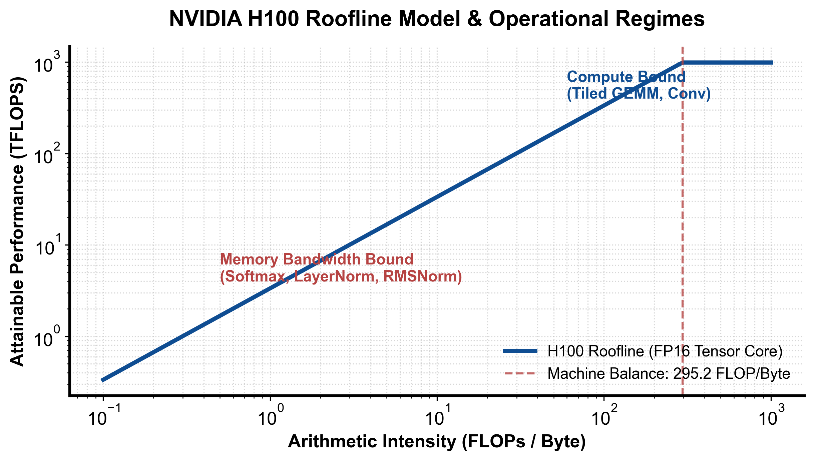

::: {.callout-note appearance="simple"}
**参考答案版**：包含完整代码实现与问答题深度参考解析。建议先独立完成练习题后再展开核对。
:::


## 本课目标与完成标准

学完后你应能：实现基础 GEMM K-tile 累加，解释数据复用和两个同步点。

通过必须同时满足：

- 独立补齐本课唯一的代码填空题，并通过给定检查；
- 三个问答题均说明因果链，而不是只报术语；
- 能指出至少一个正确性边界和一个性能取舍；
- 总分不低于 8/10，且没有一票否决级概念错误。

## 前置关系

- 课程前置：C/C++、线性代数、基本并行编程
- 本课在路线中的作用：Tiled GEMM 让一个 A/B 子块被 block 内多个输出复用，降低每次 FMA 对 global memory 的需求。

## 核心心智模型


### 核心操作与执行流程图解

::: {.img-card}
{width="85%"}
<p class="caption">图 10-1：NVIDIA H100 Roofline 性能模型与分块 GEMM 算力/访存比（基于 scientific-figure-making 绘制）</p>
:::

```{mermaid}
flowchart LR
    LoadTile["从全局显存加载下一个 A/B 瓦片到 SMem"] --> Sync1["__syncthreads()"]
    Sync1 --> Compute["各线程从 SMem 读入寄存器，执行外积/乘加累加"]
    Compute --> Sync2["__syncthreads()"]
    Sync2 --> NextK{"K 维是否结束?"}
    NextK -->|否| LoadTile
    NextK -->|是| WriteOut["将寄存器 C 结果合并写回全局显存"]
```
<p class="caption" align="center"><em>图 10-2：分块矩阵乘法双层同步与步进累加流程图</em></p>


### 1. 它是什么，解决什么问题

Tiled GEMM 让一个 A/B 子块被 block 内多个输出复用，降低每次 FMA 对 global memory 的需求。

### 2. 它如何工作

每轮协作加载 A、B tile，同步后线程计算一个 C 元素的 K 子段，再同步防止下一轮覆盖。

### 3. 正确性条件与常见误区

越界加载要填 0；K 尾块也必须执行相同同步，不能让部分线程提前 return。

### 4. 性能与工程取舍

每线程一个输出易懂但寄存器复用低；高性能实现使用 register tile、向量化和异步流水。

## 具体演示

16×16 tile 每轮加载 512 个数，产生 16³ 次 FMA；相较每次 FMA 都读 global 有 16 倍级复用。

请在阅读后先合上这一节，用自己的语言复述“输入状态 → 中间状态 → 输出状态”，再做练习。

## 实践任务：唯一代码填空题

补齐 tile 内乘加。

规则：只能修改 `TODO`/`______` 所在位置；不要删除断言或放宽误差。代码注释说明了每个边界条件。

```{python}
#| course_role: exercise
%%writefile /tmp/10_gemm_tiled.cu
#include <cuda_runtime.h>

namespace {

constexpr int TILE = 16;

// Tiled GEMM: C = A * B
// A: [M, K] row-major
// B: [K, N] row-major
// C: [M, N] row-major
//
// 面试里的重点不是打赢 cuBLAS，而是讲清楚：
// 1. naive GEMM 每个 C 元素都要读一整行 A 和一整列 B。
// 2. shared memory tiling 把 A/B 子块缓存下来，让一个 tile 内多个线程复用。
// 3. 每个 thread 负责一个 C[row, col]，在 K 维上分块累加。
//
// 这是精简版：每线程算一个输出元素，TILE=16。
// 更高性能版本会让每线程算多个元素、用寄存器 tile、向量化、cp.async 等。
__global__ void gemm_tiled_kernel(
    const float* __restrict__ A,
    const float* __restrict__ B,
    float* __restrict__ C,
    int M,
    int N,
    int K
) {
    __shared__ float As[TILE][TILE];
    __shared__ float Bs[TILE][TILE];

    int row = blockIdx.y * TILE + threadIdx.y;
    int col = blockIdx.x * TILE + threadIdx.x;

    float acc = 0.0f;

    // 沿 K 维一块一块推进。
    // 每一轮加载 A 的 [row, k_tile:k_tile+TILE)
    // 和 B 的 [k_tile:k_tile+TILE, col] 到 shared memory。
    for (int k0 = 0; k0 < K; k0 += TILE) {
        int a_col = k0 + threadIdx.x;
        int b_row = k0 + threadIdx.y;

        As[threadIdx.y][threadIdx.x] =
            (row < M && a_col < K) ? A[row * K + a_col] : 0.0f;

        Bs[threadIdx.y][threadIdx.x] =
            (b_row < K && col < N) ? B[b_row * N + col] : 0.0f;

        __syncthreads();

        #pragma unroll
        for (int k = 0; k < TILE; ++k) {
            acc += ______;  // TODO: 当前 K 位置的一次 FMA
        }

        // 下一轮会覆盖 As/Bs，所以所有线程必须先算完当前 tile。
        __syncthreads();
    }

    if (row < M && col < N) {
        C[row * N + col] = acc;
    }
}

} // namespace

void launch_gemm_tiled(
    const float* A,
    const float* B,
    float* C,
    int M,
    int N,
    int K,
    cudaStream_t stream
) {
    dim3 block(TILE, TILE);
    dim3 grid((N + TILE - 1) / TILE, (M + TILE - 1) / TILE);
    gemm_tiled_kernel<<<grid, block, 0, stream>>>(A, B, C, M, N, K);
}
```

### 检查方法

有 CUDA 环境时执行 `nvcc -std=c++17 -c /tmp/10_gemm_tiled.cu -o /tmp/10_gemm_tiled.cu.o`；无 CUDA 环境时只做静态审查并登记待验证。

提交时请给出：补齐后的代码、实际运行输出（环境不可用时注明“仅静态审查”）以及对失败用例的解释。

### Q1

不要背定义：请从输入、状态变化和输出三个阶段解释“共享内存 Tiled GEMM”的工作机制。

**你的答案：**

### Q2

把边界线程直接 return 为什么可能让其余线程死锁？

**你的答案：**

### Q3

从 TILE=16 改 32 时资源与 occupancy 会怎样变化？

**你的答案：**

## 评分与通过规则

- 代码 4 分：正常输入 2 分，边界输入 1 分，解释实现 1 分；
- Q1～Q3 各 2 分；
- 一票否决：结果碰巧正确但核心因果链错误、删除边界检查、把未运行结果说成实测。

需要提示时按四级机制请求：概念区域 → 具体方向 → 关键局部 → 完整答案。


::: {.callout-tip collapse="true" title="💡 点击展开参考答案与详细代码实现" icon="false"}
## 参考答案（仅 answer 分支）

先完成题目再核对。即使代码一致，也要能解释关键步骤，并尝试更换一个输入规模。

```{python}
#| course_role: solution
%%writefile /tmp/10_gemm_tiled.cu
#include <cuda_runtime.h>

namespace {

constexpr int TILE = 16;

// Tiled GEMM: C = A * B
// A: [M, K] row-major
// B: [K, N] row-major
// C: [M, N] row-major
//
// 面试里的重点不是打赢 cuBLAS，而是讲清楚：
// 1. naive GEMM 每个 C 元素都要读一整行 A 和一整列 B。
// 2. shared memory tiling 把 A/B 子块缓存下来，让一个 tile 内多个线程复用。
// 3. 每个 thread 负责一个 C[row, col]，在 K 维上分块累加。
//
// 这是精简版：每线程算一个输出元素，TILE=16。
// 更高性能版本会让每线程算多个元素、用寄存器 tile、向量化、cp.async 等。
__global__ void gemm_tiled_kernel(
    const float* __restrict__ A,
    const float* __restrict__ B,
    float* __restrict__ C,
    int M,
    int N,
    int K
) {
    __shared__ float As[TILE][TILE];
    __shared__ float Bs[TILE][TILE];

    int row = blockIdx.y * TILE + threadIdx.y;
    int col = blockIdx.x * TILE + threadIdx.x;

    float acc = 0.0f;

    // 沿 K 维一块一块推进。
    // 每一轮加载 A 的 [row, k_tile:k_tile+TILE)
    // 和 B 的 [k_tile:k_tile+TILE, col] 到 shared memory。
    for (int k0 = 0; k0 < K; k0 += TILE) {
        int a_col = k0 + threadIdx.x;
        int b_row = k0 + threadIdx.y;

        As[threadIdx.y][threadIdx.x] =
            (row < M && a_col < K) ? A[row * K + a_col] : 0.0f;

        Bs[threadIdx.y][threadIdx.x] =
            (b_row < K && col < N) ? B[b_row * N + col] : 0.0f;

        __syncthreads();

        #pragma unroll
        for (int k = 0; k < TILE; ++k) {
            acc += As[threadIdx.y][k] * Bs[k][threadIdx.x];
        }

        // 下一轮会覆盖 As/Bs，所以所有线程必须先算完当前 tile。
        __syncthreads();
    }

    if (row < M && col < N) {
        C[row * N + col] = acc;
    }
}

} // namespace

void launch_gemm_tiled(
    const float* A,
    const float* B,
    float* C,
    int M,
    int N,
    int K,
    cudaStream_t stream
) {
    dim3 block(TILE, TILE);
    dim3 grid((N + TILE - 1) / TILE, (M + TILE - 1) / TILE);
    gemm_tiled_kernel<<<grid, block, 0, stream>>>(A, B, C, M, N, K);
}
```

### Q1 参考答案

每轮协作加载 A、B tile，同步后线程计算一个 C 元素的 K 子段，再同步防止下一轮覆盖。

### Q2 参考答案

判断时先检查本课不变量：越界加载要填 0；K 尾块也必须执行相同同步，不能让部分线程提前 return。  若不成立，最终数值或系统状态即使暂时正常也不可信。

### Q3 参考答案

迁移时先保证正确性，再比较代价。这里的核心取舍是：每线程一个输出易懂但寄存器复用低；高性能实现使用 register tile、向量化和异步流水。

## 参考资料

- [CUDA Programming Guide](https://docs.nvidia.com/cuda/cuda-programming-guide/)
- [CUDA Best Practices Guide](https://docs.nvidia.com/cuda/cuda-c-best-practices-guide/)

资料用于建立事实基线；面试回答仍需用自己的语言组织。
:::
