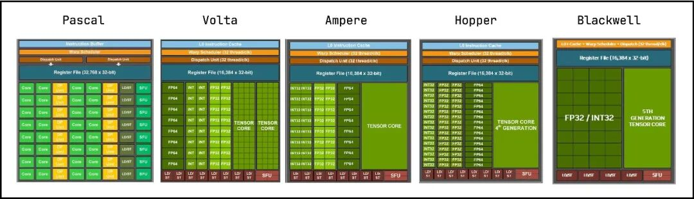
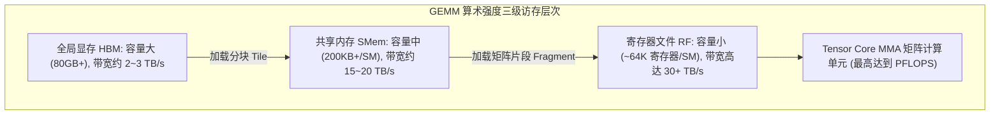

::: {.callout-note appearance="simple"}
**参考答案版**：包含完整代码实现与问答题深度参考解析。建议先独立完成练习题后再展开核对。
:::


## 本课目标与完成标准

学完后你应能：把 thread/warp/CTA/SM 与 CUTLASS 的 threadblock/warp/instruction tiling 对齐，并用 roofline 判断优化方向。

通过必须同时满足：

- 独立补齐本课唯一的代码填空题，并通过给定检查；
- 三个问答题均说明因果链，而不是只报术语；
- 能指出至少一个正确性边界和一个性能取舍；
- 总分不低于 8/10，且没有一票否决级概念错误。

## 前置关系

- 课程前置：CUDA 线程模型、GEMM、C++ 模板基础
- 本课在路线中的作用：CUTLASS 是分层组合的 GEMM/卷积模板库，CuTe 用 layout algebra 描述数据与线程映射；Tensor Core 是 warp 协作矩阵指令而非单线程单元。

## 核心心智模型

::: {.img-card}
{width="90%"}
<p class="caption">图 1-1：从 Volta 到 Blackwell 的 NVIDIA GPU SM 架构演进与 Tensor Core 升级</p>
:::


<p class="caption" align="center"><em>图 1-2：算术强度在 GPU 存储金字塔（GMEM-SMem-RF）中的分层复用流</em></p>


### 1. 它是什么，解决什么问题

CUTLASS 是分层组合的 GEMM/卷积模板库，CuTe 用 layout algebra 描述数据与线程映射；Tensor Core 是 warp 协作矩阵指令而非单线程单元。

### 2. 它如何工作

GEMM 从 CTA tile 分到 warp tile，再分到 MMA instruction；数据从 HBM→L2→shared memory→register，复用层次决定算术强度。

### 3. 正确性条件与常见误区

tile 必须与数据类型、目标 SM 和 MMA atom 兼容；理论 FLOPs 高不等于 kernel 达到峰值。

### 4. 性能与工程取舍

增大 tile 提高复用，却增加 shared memory/寄存器并可能降低 occupancy；先判断 compute-bound 还是 memory-bound。

## 核心操作与流程图解

::: {.img-card}
{width="90%"}
<p class="caption">图 1-1：从 Volta 到 Blackwell 的 NVIDIA GPU SM 架构演进与 Tensor Core 升级</p>
:::

```{mermaid}
flowchart TD
    subgraph MemHierarchy["GEMM 算术强度三级访存层次"]
        GMEM["全局显存 HBM: 容量大 (80GB+), 带宽约 2~3 TB/s"] -->|加载分块 Tile| SMEM["共享内存 SMem: 容量中 (200KB+/SM), 带宽约 15~20 TB/s"]
        SMEM -->|加载矩阵片段 Fragment| RF["寄存器文件 RF: 容量小 (~64K 寄存器/SM), 带宽高达 30+ TB/s"]
        RF --> TC["Tensor Core MMA 矩阵计算单元 (最高达到 PFLOPS)"]
    end
```
<p class="caption" align="center"><em>图 1-2：算术强度在 GPU 存储金字塔（GMEM-SMem-RF）中的分层复用流</em></p>

## 具体演示

M=N=K=128 的 GEMM 约 2MNK FLOPs；若 A/B/C 各只搬一次，其算术强度远高于逐元素加法。

请在阅读后先合上这一节，用自己的语言复述“输入状态 → 中间状态 → 输出状态”，再做练习。

## 实践任务：唯一代码填空题

补齐 GEMM 的理想算术强度估算（忽略 cache 重复和 beta 读）。

规则：只能修改 `TODO`/`______` 所在位置；不要删除断言或放宽误差。代码注释说明了每个边界条件。

```{python}
#| course_role: exercise
def gemm_intensity(m, n, k, bytes_per_element=2):
    """返回 FLOPs / 最少字节数。"""
    # TODO：只补齐下面这个表达式。
    return ______

assert abs(gemm_intensity(128,128,128,2) - 42.666666666666664) < 1e-12
assert gemm_intensity(1,1,1,2) == 1/3
```

### 检查方法

运行本单元格；所有 `assert` 必须通过。另手工构造一个边界输入，解释预期结果。

提交时请给出：补齐后的代码、实际运行输出（环境不可用时注明“仅静态审查”）以及对失败用例的解释。

### Q1

不要背定义：请从输入、状态变化和输出三个阶段解释“GPU 层级、Tensor Core 与算术强度”的工作机制。

**你的答案：**

### Q2

只看到 Tensor Core utilization 低就盲目增大 tile，为什么可能让性能更差？

**你的答案：**

### Q3

给定 HBM 带宽和 Tensor Core 峰值，如何用 ridge point 判断优化优先级？

**你的答案：**

## 评分与通过规则

- 代码 4 分：正常输入 2 分，边界输入 1 分，解释实现 1 分；
- Q1～Q3 各 2 分；
- 一票否决：结果碰巧正确但核心因果链错误、删除边界检查、把未运行结果说成实测。

需要提示时按四级机制请求：概念区域 → 具体方向 → 关键局部 → 完整答案。


::: {.callout-tip collapse="true" title="💡 点击展开参考答案与详细代码实现" icon="false"}
## 参考答案（仅 answer 分支）

先完成题目再核对。即使代码一致，也要能解释关键步骤，并尝试更换一个输入规模。

```{python}
#| course_role: solution
def gemm_intensity(m, n, k, bytes_per_element=2):
    """返回 FLOPs / 最少字节数。"""
    # 参考实现：表达式直接对应上文不变量。
    return (2.0 * m * n * k) / (bytes_per_element * (m * k + k * n + m * n))

assert abs(gemm_intensity(128,128,128,2) - 42.666666666666664) < 1e-12
assert gemm_intensity(1,1,1,2) == 1/3
```

### Q1 参考答案

GEMM 从 CTA tile 分到 warp tile，再分到 MMA instruction；数据从 HBM→L2→shared memory→register，复用层次决定算术强度。

### Q2 参考答案

判断时先检查本课不变量：tile 必须与数据类型、目标 SM 和 MMA atom 兼容；理论 FLOPs 高不等于 kernel 达到峰值。  若不成立，最终数值或系统状态即使暂时正常也不可信。

### Q3 参考答案

迁移时先保证正确性，再比较代价。这里的核心取舍是：增大 tile 提高复用，却增加 shared memory/寄存器并可能降低 occupancy；先判断 compute-bound 还是 memory-bound。

## 参考资料

- [CuTe Layout Algebra](https://docs.nvidia.com/cutlass/latest/media/docs/cpp/cute/01_layout.html)
- [CuTe Tensors](https://docs.nvidia.com/cutlass/latest/media/docs/cpp/cute/03_tensor.html)
- [CuTe Algorithms](https://docs.nvidia.com/cutlass/latest/media/docs/cpp/cute/04_algorithms.html)
- [CUTLASS GEMM API](https://docs.nvidia.com/cutlass/latest/media/docs/cpp/gemm_api.html)
- [CUTLASS repository](https://github.com/NVIDIA/cutlass)

资料用于建立事实基线；面试回答仍需用自己的语言组织。
:::
