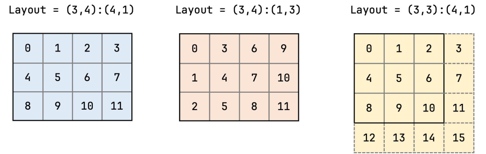

::: {.callout-note appearance="simple"}
**参考答案版**：包含完整代码实现与问答题深度参考解析。建议先独立完成练习题后再展开核对。
:::


## 本课目标与完成标准

学完后你应能：读写 `shape:stride`，手算坐标到线性索引，并识别 layout 的余域与别名。

通过必须同时满足：

- 独立补齐本课唯一的代码填空题，并通过给定检查；
- 三个问答题均说明因果链，而不是只报术语；
- 能指出至少一个正确性边界和一个性能取舍；
- 总分不低于 8/10，且没有一票否决级概念错误。

## 前置关系

- 课程前置：CUDA 线程模型、GEMM、C++ 模板基础
- 本课在路线中的作用：CuTe Layout 是坐标到整数索引的函数，由层级 Shape 和 Stride 组合；它描述映射，不拥有内存。

## 核心心智模型


### 核心操作与执行流程图解

::: {.img-card}
{width="90%"}
<p class="caption">图 2-1：CuTe Layout 核心代数：Shape、Stride 与多维逻辑坐标到一维内存物理偏移的映射</p>
:::

```{mermaid}
flowchart LR
    Coord["逻辑坐标 (m, n)"] --> InnerProduct["坐标与步长做代数内积: offset = m * stride_m + n * stride_n"]
    InnerProduct --> MemOffset["物理内存一维下标 1D Pointer Offset"]
    MemOffset --> Memory["高效定位全局显存或共享内存单元"]
```
<p class="caption" align="center"><em>图 2-2：CuTe 核心代数坐标变换与内存地址计算流水</em></p>


### 1. 它是什么，解决什么问题

CuTe Layout 是坐标到整数索引的函数，由层级 Shape 和 Stride 组合；它描述映射，不拥有内存。

### 2. 它如何工作

对二维 `(M,N):(sM,sN)`，坐标 `(m,n)` 映射到 `m*sM+n*sN`；嵌套 shape 允许按层级组合 tile。

### 3. 正确性条件与常见误区

layout 的 size 不等于 cosize；stride 为 0 或不互素时可能多个坐标别名，不能假设总是紧凑一一映射。

### 4. 性能与工程取舍

编译期 Int 带来静态推导和专门化，动态维度更灵活但限制可化简程度。

## 具体演示

shape=(2,3)、stride=(3,1) 是 row-major：坐标 (1,2)→5；stride=(1,2) 则是 column-major。

请在阅读后先合上这一节，用自己的语言复述“输入状态 → 中间状态 → 输出状态”，再做练习。

## 实践任务：唯一代码填空题

补齐 row-major CuTe layout 的 stride。

规则：只能修改 `TODO`/`______` 所在位置；不要删除断言或放宽误差。代码注释说明了每个边界条件。

```{python}
#| course_role: exercise
%%writefile /tmp/cute_layout.cu
#include <cute/layout.hpp>
using namespace cute;

int main() {
  auto layout = make_layout(make_shape(Int<2>{}, Int<3>{}),
                            make_stride(______, ______));
  static_assert(decltype(layout(Int<1>{}, Int<2>{}))::value == 5);
}
```

### 检查方法

在配置 CUTLASS include 路径后用 nvcc 编译；无环境时手算 6 个坐标映射并检查无别名。

提交时请给出：补齐后的代码、实际运行输出（环境不可用时注明“仅静态审查”）以及对失败用例的解释。

### Q1

不要背定义：请从输入、状态变化和输出三个阶段解释“CuTe Layout：Shape、Stride 与坐标映射”的工作机制。

**你的答案：**

### Q2

把 size 当作实际占用地址范围会在哪种 stride 下出错？

**你的答案：**

### Q3

如何用 layout 表示 batch 维有 padding 的矩阵？

**你的答案：**

## 评分与通过规则

- 代码 4 分：正常输入 2 分，边界输入 1 分，解释实现 1 分；
- Q1～Q3 各 2 分；
- 一票否决：结果碰巧正确但核心因果链错误、删除边界检查、把未运行结果说成实测。

需要提示时按四级机制请求：概念区域 → 具体方向 → 关键局部 → 完整答案。


::: {.callout-tip collapse="true" title="💡 点击展开参考答案与详细代码实现" icon="false"}
## 参考答案（仅 answer 分支）

先完成题目再核对。即使代码一致，也要能解释关键步骤，并尝试更换一个输入规模。

```{python}
#| course_role: solution
%%writefile /tmp/cute_layout.cu
#include <cute/layout.hpp>
using namespace cute;

int main() {
  auto layout = make_layout(make_shape(Int<2>{}, Int<3>{}),
                            make_stride(Int<3>{}, Int<1>{}));
  static_assert(decltype(layout(Int<1>{}, Int<2>{}))::value == 5);
}
```

### Q1 参考答案

对二维 `(M,N):(sM,sN)`，坐标 `(m,n)` 映射到 `m*sM+n*sN`；嵌套 shape 允许按层级组合 tile。

### Q2 参考答案

判断时先检查本课不变量：layout 的 size 不等于 cosize；stride 为 0 或不互素时可能多个坐标别名，不能假设总是紧凑一一映射。  若不成立，最终数值或系统状态即使暂时正常也不可信。

### Q3 参考答案

迁移时先保证正确性，再比较代价。这里的核心取舍是：编译期 Int 带来静态推导和专门化，动态维度更灵活但限制可化简程度。

## 参考资料

- [CuTe Layout Algebra](https://docs.nvidia.com/cutlass/latest/media/docs/cpp/cute/01_layout.html)
- [CuTe Tensors](https://docs.nvidia.com/cutlass/latest/media/docs/cpp/cute/03_tensor.html)
- [CuTe Algorithms](https://docs.nvidia.com/cutlass/latest/media/docs/cpp/cute/04_algorithms.html)
- [CUTLASS GEMM API](https://docs.nvidia.com/cutlass/latest/media/docs/cpp/gemm_api.html)
- [CUTLASS repository](https://github.com/NVIDIA/cutlass)

资料用于建立事实基线；面试回答仍需用自己的语言组织。
:::
