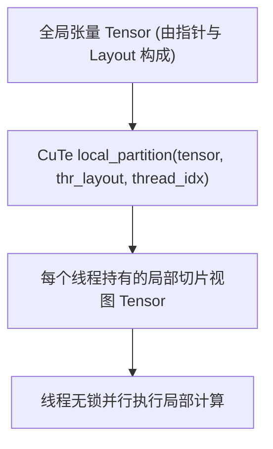

::: {.callout-note appearance="simple"}
**参考答案版**：包含完整代码实现与问答题深度参考解析。建议先独立完成练习题后再展开核对。
:::


## 本课目标与完成标准

学完后你应能：区分 engine/layout，解释 tensor view、local_tile 和线程 fragment 的生命周期。

通过必须同时满足：

- 独立补齐本课唯一的代码填空题，并通过给定检查；
- 三个问答题均说明因果链，而不是只报术语；
- 能指出至少一个正确性边界和一个性能取舍；
- 总分不低于 8/10，且没有一票否决级概念错误。

## 前置关系

- 课程前置：CUDA 线程模型、GEMM、C++ 模板基础
- 本课在路线中的作用：CuTe Tensor 是 Engine 与 Layout 的组合：Engine 提供存储/指针语义，Layout 把逻辑坐标映射到 Engine。

## 核心心智模型

::: {.img-card}
{width="90%"}
<p class="caption">图 3-1：CuTe API make_tensor 与内存抽象视图</p>
:::


<p class="caption" align="center"><em>图 3-2：CuTe 张量线程分区（Thread Partitioning）与数据切分流</em></p>


### 1. 它是什么，解决什么问题

CuTe Tensor 是 Engine 与 Layout 的组合：Engine 提供存储/指针语义，Layout 把逻辑坐标映射到 Engine。

### 2. 它如何工作

`make_tensor(ptr,layout)` 建视图；`local_tile` 选 CTA tile；tiled copy/MMA 再把 tile partition 成每线程持有的 fragment。

### 3. 正确性条件与常见误区

视图不延长底层内存生命周期；register fragment 与 global/shared tensor 的 layout 相同不代表 stride 或存储空间相同。

### 4. 性能与工程取舍

视图组合零拷贝且利于静态推导，但错误 layout 也会静默地产生错误地址。

## 核心操作与流程图解

::: {.img-card}
{width="90%"}
<p class="caption">图 3-1：CuTe API make_tensor 与内存抽象视图</p>
:::

```{mermaid}
flowchart TD
    GlobalTensor["全局张量 Tensor (由指针与 Layout 构成)"] --> Partition["CuTe local_partition(tensor, thr_layout, thread_idx)"]
    Partition --> ThreadLocalTensor["每个线程持有的局部切片视图 Tensor"]
    ThreadLocalTensor --> Math["线程无锁并行执行局部计算"]
```
<p class="caption" align="center"><em>图 3-2：CuTe 张量线程分区（Thread Partitioning）与数据切分流</em></p>

## 具体演示

全局 A 矩阵可先按 `(BLK_M,BLK_K)` 切块，再由每线程获得小 fragment；数据真正搬运发生在 copy，而非建视图。

请在阅读后先合上这一节，用自己的语言复述“输入状态 → 中间状态 → 输出状态”，再做练习。

## 实践任务：唯一代码填空题

补齐二维 row-major tensor 的全局内存 layout。

规则：只能修改 `TODO`/`______` 所在位置；不要删除断言或放宽误差。代码注释说明了每个边界条件。

```{python}
#| course_role: exercise
%%writefile /tmp/cute_tensor.cu
#include <cute/tensor.hpp>
using namespace cute;

template<class T>
auto make_matrix_view(T* ptr, int m, int n) {
  auto shape = make_shape(m, n);
  auto stride = make_stride(______, ______); // row-major, leading dimension n
  return make_tensor(make_gmem_ptr(ptr), make_layout(shape, stride));
}
```

### 检查方法

静态检查 `(1,0)` 映射到 n、`(0,1)` 映射到 1；有 CUTLASS 环境再编译。

提交时请给出：补齐后的代码、实际运行输出（环境不可用时注明“仅静态审查”）以及对失败用例的解释。

### Q1

不要背定义：请从输入、状态变化和输出三个阶段解释“CuTe Tensor、视图与线程分区”的工作机制。

**你的答案：**

### Q2

为什么 `make_tensor` 成功编译不能证明 pointer/layout 匹配？

**你的答案：**

### Q3

同一逻辑 shape 的 gmem tensor 与 register fragment 为什么 stride 常不同？

**你的答案：**

## 评分与通过规则

- 代码 4 分：正常输入 2 分，边界输入 1 分，解释实现 1 分；
- Q1～Q3 各 2 分；
- 一票否决：结果碰巧正确但核心因果链错误、删除边界检查、把未运行结果说成实测。

需要提示时按四级机制请求：概念区域 → 具体方向 → 关键局部 → 完整答案。


::: {.callout-tip collapse="true" title="💡 点击展开参考答案与详细代码实现" icon="false"}
## 参考答案（仅 answer 分支）

先完成题目再核对。即使代码一致，也要能解释关键步骤，并尝试更换一个输入规模。

```{python}
#| course_role: solution
%%writefile /tmp/cute_tensor.cu
#include <cute/tensor.hpp>
using namespace cute;

template<class T>
auto make_matrix_view(T* ptr, int m, int n) {
  auto shape = make_shape(m, n);
  auto stride = make_stride(n, Int<1>{});
  return make_tensor(make_gmem_ptr(ptr), make_layout(shape, stride));
}
```

### Q1 参考答案

`make_tensor(ptr,layout)` 建视图；`local_tile` 选 CTA tile；tiled copy/MMA 再把 tile partition 成每线程持有的 fragment。

### Q2 参考答案

判断时先检查本课不变量：视图不延长底层内存生命周期；register fragment 与 global/shared tensor 的 layout 相同不代表 stride 或存储空间相同。  若不成立，最终数值或系统状态即使暂时正常也不可信。

### Q3 参考答案

迁移时先保证正确性，再比较代价。这里的核心取舍是：视图组合零拷贝且利于静态推导，但错误 layout 也会静默地产生错误地址。

## 参考资料

- [CuTe Layout Algebra](https://docs.nvidia.com/cutlass/latest/media/docs/cpp/cute/01_layout.html)
- [CuTe Tensors](https://docs.nvidia.com/cutlass/latest/media/docs/cpp/cute/03_tensor.html)
- [CuTe Algorithms](https://docs.nvidia.com/cutlass/latest/media/docs/cpp/cute/04_algorithms.html)
- [CUTLASS GEMM API](https://docs.nvidia.com/cutlass/latest/media/docs/cpp/gemm_api.html)
- [CUTLASS repository](https://github.com/NVIDIA/cutlass)

资料用于建立事实基线；面试回答仍需用自己的语言组织。
:::
