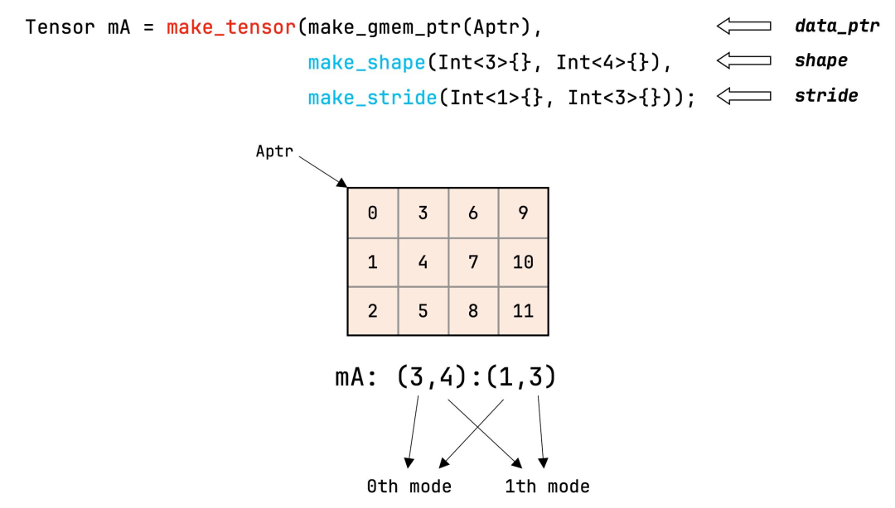

::: {.callout-note appearance="simple"}
**参考答案版**：包含完整代码实现与问答题深度参考解析。建议先独立完成练习题后再展开核对。
:::


## 本课目标与完成标准

学完后你应能：区分 engine/layout，解释 tensor view、local_tile 和线程 fragment 的生命周期。

通过必须同时满足：

- 独立补齐本课唯一的代码填空题，并通过给定检查；
- 三个问答题均说明因果链，而不是只报术语；
- 能指出至少一个正确性边界和一个性能取舍；
- 总分不低于 8/10，且没有一票否决级概念错误。

## 前置关系

- 课程前置：CUDA 线程模型、GEMM、C++ 模板基础
- 本课在路线中的作用：CuTe Tensor 是 Engine 与 Layout 的组合：Engine 提供存储/指针语义，Layout 把逻辑坐标映射到 Engine。

## 核心心智模型


### 核心操作与执行流程图解

::: {.img-card}
{width="90%"}
<p class="caption">图 3-1：CuTe API make_tensor 与内存抽象视图</p>
:::

```{mermaid}
flowchart TD
    GlobalTensor["全局张量 Tensor (由指针与 Layout 构成)"] --> Partition["CuTe local_partition(tensor, thr_layout, thread_idx)"]
    Partition --> ThreadLocalTensor["每个线程持有的局部切片视图 Tensor"]
    ThreadLocalTensor --> Math["线程无锁并行执行局部计算"]
```
<p class="caption" align="center"><em>图 3-2：CuTe 张量线程分区（Thread Partitioning）与数据切分流</em></p>


### 1. 它是什么，解决什么问题

**CuTe Tensor（张量抽象与视图分区）** 是连接纯数学布局代数（Layout）与物理硬件存储（HBM、Shared Memory、Register File）的核心载体。

**为什么不能只有裸指针或标准多维数组（结合图 3-1 与图 3-2）**：
- **存储介质与排布算法的正交解耦**：在手写 CUDA 中，从 Global Memory 搬运到 Shared Memory、再搬运到寄存器，每个存储层次的索引逻辑完全割裂；
- **CuTe Tensor 的正交组合**：
  $$\text{Tensor} = \text{Engine (存储引擎 / 指针语义)} + \text{Layout (代数映射函数)}$$
  - Engine 负责提供对内存或寄存器的访问接口（例如 `make_gmem_ptr` 代表全局显存、`make_smem_ptr` 代表片上共享内存、`Array<T, N>` 代表寄存器数组）；
  - Layout 负责提供从多维逻辑坐标到该存储介质内部相对偏移的映射；
- **零开销视图抽象（Zero-Cost View Abstraction）**：构造一个 Tensor 仅仅是把指针和编译期 Layout 结构体打包，**不产生任何内存拷贝，不申请任何堆空间**；所有的分块切片（`local_tile`）与线程分区（`local_partition`）都是对指针和布局的纯静态推导（图 3-1）。

### 2. 它如何工作（结合图 3-1 与图 3-2）

CuTe 通过三步优雅的代数流水线，将巨大的全局张量切分到各个线程私有寄存器中：
1. **构造全局张量视图（`make_tensor`）**：
   - 结合全局显存指针与矩阵形状：`Tensor gA = make_tensor(make_gmem_ptr(A), make_layout(shape, stride))`；
2. **CTA 级瓦片切片（`local_tile`）**：
   - 每个 ThreadBlock（CTA）根据自己的分块坐标 `blockIdx.x` 与 `blockIdx.y`，从全局张量中提取属于当前 Block 的局部 Tile 视图：
     ```cpp
     Tensor gA_tile = local_tile(gA, make_shape(BLK_M, BLK_K), make_coord(blockIdx.x, k_tile));
     ```
   - 这一步依旧是零拷贝视图，返回一个相对于当前 Block 基准指针的局部 Tensor。
3. **线程级数据分区（`local_partition`，图 3-2）**：
   - 在 Block 内部，通过传入该 Block 的线程拓扑布局（`thr_layout`）和当前线程索引 `threadIdx.x`，自动解算出当前线程专享持有的数据切片（Fragment）；
   - 每个线程获得一个尺寸极小的本地 Tensor（通常绑定在线程私有寄存器中），直接参与后续的数学指令。

### 3. 正确性条件与常见误区

1. **视图生命周期陷阱（Dangling View Hazard）**：
   - Tensor 只是指针和布局的组合视图，**绝不持有或延长底层内存的生命周期**；
   - 若用栈上临时分配的共享内存数组或局部变量构造 Tensor 并跨作用域传递，一旦底层内存失效，Tensor 会沦为野指针视图，读取时产生静默数据错乱；
2. **编译期通过并不保证物理空间合法**：
   - `make_tensor` 是弱约束的视图构造器。只要指针类型和 Layout 类型符合 C++ 语法，哪怕传入的指针只有 1 字节有效空间，而 Layout 的 `cosize` 高达 1 GB，代码依然能 100% 顺利编译通过；只有在硬件实际发生访存越界时才会崩溃。

### 4. 性能与工程取舍

1. **类型擦除 vs. 纯静态泛型推导**：
   - CuTe Tensor 全程利用 C++17/20 模板元编程，在编译期将多层 Tile 切片推导直接折叠为单条 SASS 内存寻址指令；
   - 相比于传统 PyTorch Tensor 的动态元数据调度，CuTe Tensor 拥有极致的零运行时开销，完全消除了任何动态下标解析逻辑；
2. **寄存器 Fragment 的紧凑性与独立步长**：
   - 全局张量 `gA` 的 Stride 通常很大（如包含成千上万的 Leading Dimension）；
   - 而通过 `local_partition` 提取出的寄存器张量，其底层 Engine 是线程私有的硬件寄存器组，其 Stride 必定被折叠为致密紧凑的小步长（通常是 1 或 2），使得寄存器访问效率达到物理极限。

## 具体演示：全局张量到线程 Fragment 的切分全景

假设有一个全局行优先矩阵 $A_{8 \times 8}$（FP16，行步长为 8，列步长为 1）：
1. **全局视图定义**：
   - `Shape = (8, 8), Stride = (8, 1)`；
2. **CTA 级分块（`local_tile`）**：
   - 设当前 Block 分配的瓦片大小为 $4 \times 4$；
   - Block 坐标为 $(0, 0)$，则 `gA_tile` 覆盖行 $0 \sim 3$、列 $0 \sim 3$；
   - 此时 `gA_tile` 依然继承了全局的大步长（跨行步长仍为 8），只是逻辑坐标原点平移到了当前 Block 的起始位置；
3. **线程级分区（`local_partition`）**：
   - 若 Block 包含 4 个线程，线程按行优先排布为 $2 \times 2$ 拓扑；
   - 线程 0（`threadIdx.x = 0`）负责偶数行和偶数列，获取到 $2 \times 2$ 的局部切片；
   - 当调用 `copy(gA_partition, rA_fragment)` 时，数据才真正从全局显存被指令硬件加载进线程 0 的专属寄存器中，完成由“全局大步长显存视图”向“紧凑寄存器私有实体”的物理流转。

## 实践任务：唯一代码填空题

补齐二维 row-major tensor 的全局内存 layout。

规则：只能修改 `TODO`/`______` 所在位置；不要删除断言或放宽误差。代码注释说明了每个边界条件。

```{python}
#| course_role: exercise
%%writefile /tmp/cute_tensor.cu
#include <cute/tensor.hpp>
using namespace cute;

template<class T>
auto make_matrix_view(T* ptr, int m, int n) {
  auto shape = make_shape(m, n);
  auto stride = make_stride(______, ______); // row-major, leading dimension n
  return make_tensor(make_gmem_ptr(ptr), make_layout(shape, stride));
}
```

### 检查方法

静态检查 `(1,0)` 映射到 n、`(0,1)` 映射到 1；有 CUTLASS 环境再编译。

提交时请给出：补齐后的代码、实际运行输出（环境不可用时注明“仅静态审查”）以及对失败用例的解释。

### Q1

不要背定义：请从输入、状态变化和输出三个阶段解释“CuTe Tensor、视图与线程分区”的工作机制。

**你的答案：**

### Q2

为什么 `make_tensor` 成功编译不能证明 pointer/layout 匹配？

**你的答案：**

### Q3

同一逻辑 shape 的 gmem tensor 与 register fragment 为什么 stride 常不同？

**你的答案：**

## 评分与通过规则

- 代码 4 分：正常输入 2 分，边界输入 1 分，解释实现 1 分；
- Q1～Q3 各 2 分；
- 一票否决：结果碰巧正确但核心因果链错误、删除边界检查、把未运行结果说成实测。

需要提示时按四级机制请求：概念区域 → 具体方向 → 关键局部 → 完整答案。


::: {.callout-tip collapse="true" title="💡 点击展开参考答案与详细代码实现" icon="false"}
## 参考答案（仅 answer 分支）

先完成题目再核对。即使代码一致，也要能解释关键步骤，并尝试更换一个输入规模。

```{python}
#| course_role: solution
%%writefile /tmp/cute_tensor.cu
#include <cute/tensor.hpp>
using namespace cute;

template<class T>
auto make_matrix_view(T* ptr, int m, int n) {
  auto shape = make_shape(m, n);
  auto stride = make_stride(n, Int<1>{});
  return make_tensor(make_gmem_ptr(ptr), make_layout(shape, stride));
}
```

### Q1 参考答案

1. **输入阶段（Global Tensor Definition & Zero-Copy View Wrap）**：
   - 算法获取全局显存基准指针（`make_gmem_ptr`），结合张量的几何形状与主序步长，通过 `make_tensor` 构造顶层全局张量视图；
   - 此时未发生任何实际内存申请或数据搬运，仅在 C++ 类型系统层面绑定指针与代数坐标映射关系；
2. **状态变化阶段（Hierarchical Slicing & Thread-Level Partitioning）**：
   - **CTA 级瓦片提取（`local_tile`）**：每个 ThreadBlock 依据其 Grid 坐标，从全局张量中切取出当前 CTA 专属的子张量视图，原点指针偏移到当前瓦片起点；
   - **线程级分区（`local_partition`）**：结合硬件执行的线程拓扑（`ThreadLayout`），调用 `local_partition` 将 CTA 瓦片进一步正交切分为每个线程独立持有的微小分片视图（Partitioned Tensor），确定每个物理线程具体负责哪些坐标点；
3. **输出阶段（Physical Copy to Register Fragment）**：
   - 各线程分配专属的私有寄存器数组（`Array<T, N>`），包装为本地寄存器张量 `rA`（Register Fragment）；
   - 执行 `copy(tiled_copy, gA_partition, rA)`，GPU 硬件正式触发显存加载指令，将属于该线程的数据从 Global Memory 批量搬入本地寄存器，供 Tensor Core 执行运算。

### Q2 参考答案

`make_tensor` 能够成功编译通过，仅仅代表**C++ 静态语法和类型约束通过**，根本无法证明指针与 Layout 在物理运行时是安全匹配的，主要原因包括：
1. **编译器对物理内存边界的“完全无知”（No Runtime Bound Knowledge）**：
   - `make_tensor` 接收的底层参数是一个迭代器或指针（如 `float*`）与一个静态 Layout 类型；
   - C++ 编译器在编译期根本不知道该指针在运行时实际通过 `cudaMalloc` 分配了多少字节的物理堆内存！若实际只分配了 16 字节，而 Layout 的 `cosize` 计算出的物理跨度为 1000 字节，编译期类型推导依然 100% 成功，但在运行时一旦越界读写就会当场崩溃；
2. **内存主序与跨步的静默倒置（Silent Layout Mismatch）**：
   - 编译器无法探知物理内存中到底是以行主序还是列主序存放数据的；
   - 若上游算子以列主序（Column-Major）写入数据，而你在下游调用 `make_tensor` 时传入了行主序（Row-Major）的 Stride，程序同样能够零警告编译通过；运行时会静默地读出转置后的错误特征数据，产生隐蔽性极高、没有任何报错但模型精度彻底暴跌的“静默数据污染（Silent Data Corruption）”。

### Q3 参考答案

对于完全相同的逻辑形状（如 `Shape = (4, 8)`），Global Memory 张量与线程寄存器 Fragment 的 Stride 通常截然不同，这是由**存储拓扑与硬件并发模型的物理差异**决定的：
1. **全局显存张量（GMEM Tensor）的 Stride 特性**：
   - GMEM 存储的是整个大矩阵的全局物理数据，其各行之间由整个矩阵的全局 Leading Dimension（例如行长 $N = 4096$）隔开；
   - 因此对于行主序张量，其行步长通常为非常庞大的数值（如 `stride_m = 4096`），并且该物理空间是由 Grid 内成千上万个线程共享寻址的；
2. **寄存器张量（Register Fragment）的 Stride 特性**：
   - 寄存器是**单个物理线程完全私有的物理硬件资源**。寄存器文件内部根本不存在由多个线程共享的统一线性编址空间；
   - 通过 `local_partition` 切分出的每个线程持有的 Fragment，其物理载体是当前线程独占的若干个 32 位寄存器（逻辑上如同本地数组 `T rmem[32]`）；
   - 为了实现最高的指令发射效率与紧凑性，寄存器张量的 Stride 必须被完全压平为最小的紧凑步长（例如 `Stride = (1, 4)` 或 `(8, 1)`），直接映射到本地寄存器阵列的物理编号；
3. **因果总结**：GMEM Tensor 的 Stride 描述的是“大矩阵在 DRAM 上的跨步”，而 Register Fragment 的 Stride 描述的是“切片在单个线程私有寄存器内部的致密排列”，二者物理语义完全不同，Stride 必然发生剧烈分化。

## 参考资料

- [CuTe Layout Algebra](https://docs.nvidia.com/cutlass/latest/media/docs/cpp/cute/01_layout.html)
- [CuTe Tensors](https://docs.nvidia.com/cutlass/latest/media/docs/cpp/cute/03_tensor.html)
- [CuTe Algorithms](https://docs.nvidia.com/cutlass/latest/media/docs/cpp/cute/04_algorithms.html)
- [CUTLASS GEMM API](https://docs.nvidia.com/cutlass/latest/media/docs/cpp/gemm_api.html)
- [CUTLASS repository](https://github.com/NVIDIA/cutlass)

资料用于建立事实基线；面试回答仍需用自己的语言组织。
:::
