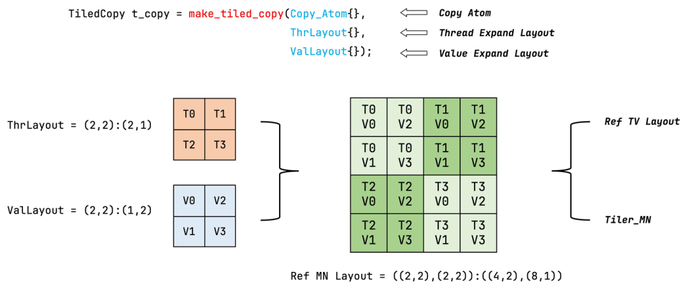

::: {.callout-note appearance="simple"}
**参考答案版**：包含完整代码实现与问答题深度参考解析。建议先独立完成练习题后再展开核对。
:::


## 本课目标与完成标准

学完后你应能：设计线程—数据映射，区分逻辑边界 mask 与对齐/向量化条件。

通过必须同时满足：

- 独立补齐本课唯一的代码填空题，并通过给定检查；
- 三个问答题均说明因果链，而不是只报术语；
- 能指出至少一个正确性边界和一个性能取舍；
- 总分不低于 8/10，且没有一票否决级概念错误。

## 前置关系

- 课程前置：CUDA 线程模型、GEMM、C++ 模板基础
- 本课在路线中的作用：Tiled Copy 把 copy atom 与线程/值 layout 组合，描述哪些线程搬哪些元素；它是数据运动的可组合对象。

## 核心心智模型


### 核心操作与执行流程图解

::: {.img-card}
{width="90%"}
<p class="caption">图 4-1：CUTLASS Tiled Copy 构造与数据搬运抽象</p>
:::

```{mermaid}
sequenceDiagram
    autonumber
    participant T as 线程集
    participant Pred as 边界掩码 (Predication)
    participant HW as cp.async 硬件引擎
    participant SM as 共享内存 (SMem)
    
    T->>Pred: 判定坐标是否位于张量有效边界内
    alt 边界内
        Pred->>HW: 发射 128 位宽向量化 cp.async 异步拷贝指令
        HW->>SM: 硬件直通写入共享内存 (无需经过寄存器)
    else 越界
        Pred->>SM: 写入 0 (Padding 零填充保护)
    end
```
<p class="caption" align="center"><em>图 4-2：Tiled Copy 向量化加载与掩码谓词保护执行时序</em></p>


### 1. 它是什么，解决什么问题

**CuTe Tiled Copy（分块数据搬运与向量化掩码）** 是 CUTLASS 3.x 中管理片上与全局数据流转的高阶抽象。

**数据搬运的硬件瓶颈与抽象突破（结合图 4-1 与图 4-2）**：
- **低效标量加载 vs. 硬件向量指令**：若每个线程逐个读取 2 字节（FP16）或 4 字节（FP32），GPU 显存总线将被海量的小事务指令挤爆，指令发射器严重过载。现代 GPU 提供了 128-bit（16 字节）宽向量指令（如 `LDG.E.128`、Ampere 异步显存拷贝 `cp.async`，以及 Hopper 硬件级张量内存加速器 TMA）；
- **Tiled Copy 的统一建模（图 4-1）**：
  $$\text{TiledCopy} = \text{Copy\_Atom (硬件拷贝微指令)} + \text{ThreadLayout (线程拓扑)} + \text{ValLayout (向量值排布)}$$
  它以声明式的方式精确描述了：“Block 内哪些线程以何种向量粒度、按何种空间步长协作搬运哪一块 Tile”；
- **非对齐尾块的数据越界防护（Predication）**：在实际业务中，矩阵维度极少恰好是分块尺寸（如 128 或 256）的整数倍。Tiled Copy 通过自动生成谓词掩码（Predication Tensor），在硬件层面安全遮蔽越界访问，杜绝显存段错误。

### 2. 它如何工作（结合图 4-1 与图 4-2）

以 Ampere 架构下的异步搬运 `cp.async` 为例，Tiled Copy 的执行流水线如下：
1. **构建原子搬运（Copy Atom）与 Tiled Copy**：
   - 选取硬件原子指令，如 `Copy_Atom<SM80_CP_ASYNC_CACHEGLOBAL<uint128_t>, half_t>`；
   - 组合 128 线程的拓扑布局（如 `(32, 4)` 形状），构造出一次可搬运 $128 \times 64$ 字节的 `tiled_copy` 对象；
2. **张量分区与局部切片绑定**：
   - 全局张量 `gA` 与共享内存张量 `sA` 分别调用 `tiled_copy.get_slice(threadIdx.x)` 提取当前线程持有的源切片 `tAgA` 和目标切片 `tAsA`；
3. **坐标映射与谓词掩码生成（图 4-2）**：
   - CuTe 结合张量的逻辑有效边界（如真实尺寸 $M, K$），利用 `create_predicate_tensor` 自动为每个向量元素生成布尔谓词（Predicate Mask）；
4. **硬件级条件拷贝（Predicated Execution）**：
   - 调用 `copy_if(tiled_copy, tApA, tAgA, tAsA)`；
   - 对于边界内的合法坐标，硬件直接发起 128-bit 异步拷贝，**数据直接从全局显存写入共享内存，全程不占用任何物理通用寄存器（Bypass Register File）**；
   - 对于越界坐标，硬件谓词置为假，自动在共享内存写入填充值 `0`，确保后续 Tensor Core 矩阵乘法结果不受脏数据干扰。

### 3. 正确性条件与常见误区

1. **谓词掩码（Predicate）绝无法修复物理非对齐（Misalignment Trap）**：
   - **致命误区**：很多开发者以为“只要开启了 Predicate，就能对任意奇数地址使用 128-bit 向量指令”；
   - **硬件铁律**：128-bit 向量指令（`uint128_t` / 16 字节）在 GPU 硬件体系中**必须严格满足基准物理地址按 16 字节对齐（`ptr % 16 == 0`）**！
   - 谓词掩码仅用于保护**逻辑坐标是否越界**；如果传入的显存指针物理地址未对齐，硬件执行到该指令时会直接触发 `misaligned address` 硬件陷阱异常，整个 Kernel 当场崩溃；
2. **连续维度的跨步不连续风险**：
   - 向量化读取要求沿连续维度（如行主序的列向）在物理显存上也是完全紧凑连续的（Stride 为 1）。若在 Leading Dimension 跨步方向错误地尝试向量化，会导致指令跨越非连续地址。

### 4. 性能与工程取舍

1. **宽向量高吞吐 vs. 边界对齐严苛性**：
   - 采用 128 位向量（16 字节）可将指令发射数降至标量读取的 $\frac{1}{8}$，能以极高密度榨干显存总线带宽；
   - 但若数据尾部存在零散残留（例如 $N=130$，剩余 2 个 half 仅占 4 字节），128 位向量将无法覆盖该残片，必须在边界处降级为标量处理或填充虚拟空间；
2. **循环剥离：无谓词主路径 vs. 谓词尾路径（Loop Peeling）**：
   - 在矩阵收缩维度 $K$ 上，若 $K$ 很大（如 4096），前绝大多数 Tile 都是完整的内部块，完全不需要任何边界检查；
   - **生产级优化**：将主循环（Mainloop）编译为纯粹无谓词的直通路径（Unpredicated Path），消除每一轮的谓词求值与分支预测开销；仅在最后一个可能越界的尾块（Tail Block / Residue Tile）执行带 Predicate 的安全保护路径，端到端吞吐可提升 10%~20%。

## 具体演示：尾块切分与向量谓词生成演算

考虑矩阵列长 $N = 130$（半精度 FP16，每元素 2 字节），采用 8 个 half（128-bit，16 字节）的向量拷贝单元：
- **前段对齐数据**：
  - 索引 $0 \sim 127$ 共 128 个元素，刚好被 $128 / 8 = 16$ 个完整的 128 位向量拷贝覆盖；
  - 所有向量对应的 Predicate 均为全真 `[True, True, True, True, True, True, True, True]`，硬件流水线全速发射。
- **边界尾部向量（起始基准偏移量 `base = 128`）**：
  - 该向量覆盖的 8 个物理槽位全局坐标为：$128, 129, 130, 131, 132, 133, 134, 135$；
  - 由于矩阵真实有效列长只有 $N = 130$（仅 128 和 129 合法）：
  - 各 Lane 谓词判定公式：$\text{valid}_k = (\text{base} + k < 130)$；
  - 自动解算生成的 Predicate 掩码为：
    $$\text{Mask} = [\text{True}, \text{True}, \text{False}, \text{False}, \text{False}, \text{False}, \text{False}, \text{False}]$$
  - 硬件据此精准只搬运前 2 个 half，后 6 个槽位在共享内存中自动清零填充，完美化解了尾块内存溢出危机。

## 实践任务：唯一代码填空题

补齐向量 copy 的 lane 有效掩码。

规则：只能修改 `TODO`/`______` 所在位置；不要删除断言或放宽误差。代码注释说明了每个边界条件。

```{python}
#| course_role: exercise
def copy_mask(base, lanes, logical_size):
    """base 是本向量首元素，返回每个 lane 是否在逻辑边界内。"""
    # TODO：只补齐下面这个表达式。
    return ______

assert copy_mask(128, 8, 130) == [True, True, False, False, False, False, False, False]
assert all(copy_mask(0, 8, 8))
```

### 检查方法

运行本单元格；所有 `assert` 必须通过。另手工构造一个边界输入，解释预期结果。

提交时请给出：补齐后的代码、实际运行输出（环境不可用时注明“仅静态审查”）以及对失败用例的解释。

### Q1

不要背定义：请从输入、状态变化和输出三个阶段解释“Tiled Copy、向量化与 Predication”的工作机制。

**你的答案：**

### Q2

有 predicate 就能安全执行任意未对齐的 128-bit load 吗？

**你的答案：**

### Q3

如何把规则主体与尾块拆成两个路径，何时值得？

**你的答案：**

## 评分与通过规则

- 代码 4 分：正常输入 2 分，边界输入 1 分，解释实现 1 分；
- Q1～Q3 各 2 分；
- 一票否决：结果碰巧正确但核心因果链错误、删除边界检查、把未运行结果说成实测。

需要提示时按四级机制请求：概念区域 → 具体方向 → 关键局部 → 完整答案。


::: {.callout-tip collapse="true" title="💡 点击展开参考答案与详细代码实现" icon="false"}
## 参考答案（仅 answer 分支）

先完成题目再核对。即使代码一致，也要能解释关键步骤，并尝试更换一个输入规模。

```{python}
#| course_role: solution
def copy_mask(base, lanes, logical_size):
    """base 是本向量首元素，返回每个 lane 是否在逻辑边界内。"""
    # 参考实现：表达式直接对应上文不变量。
    return [base + lane < logical_size for lane in range(lanes)]

assert copy_mask(128, 8, 130) == [True, True, False, False, False, False, False, False]
assert all(copy_mask(0, 8, 8))
```

### Q1 参考答案

1. **输入阶段（Tiled Copy Construction & Thread Slicing）**：
   - 算法结合硬件拷贝微原语（如 128-bit 的 `cp.async`）、Block 内的线程网格排布（Thread Layout）与每个线程负责的值排布（Value Layout），构造声明式的 `TiledCopy` 算子；
   - 每个物理线程调用 `get_slice(threadIdx.x)`，从全局显存瓦片（GMEM Tile）与片上共享内存瓦片（SMEM Tile）中分别切出属于当前线程的一对源与目标局部切片（`tAgA` 与 `tAsA`）；
2. **状态变化阶段（Coordinate Evaluation & Predicate Generation）**：
   - CuTe 通过恒等坐标张量（Identity Tensor）提取出各个待搬运元素的真实全局多维坐标；
   - 算子将多维物理坐标与矩阵的实际有效形状（Logical Shape）进行比较，在寄存器中生成布尔谓词张量（Predicate Mask Tensor）。每个待搬运的向量元素对应一个由 1 位谓词寄存器（Predicate Register `@p`）保护的合法性标志；
3. **输出阶段（Predicated Async Hardware Dispatch）**：
   - 调用 `copy_if` 发射硬件指令：对谓词为真的合法元素，硬件直接发射 128-bit 宽的异步显存加载指令（`cp.async.ca`），数据绕过通用寄存器直通 Shared Memory；
   - 对谓词为假的越界元素，硬件抑制该加载事务并在 Shared Memory 对应物理槽位中就地填充数值 `0`（Padding Zero），防止越界访存引发非法地址崩溃或污染下游 Tensor Core 计算。

### Q2 参考答案

绝对不能！拥有 Predicate **绝不代表可以对未对齐的指针安全执行 128-bit 向量化加载**，这是由 GPU 底层内存控制器的硬件异常机制决定的：
1. **指令解码与对齐校验的时序前置性**：
   - GPU 硬件在执行 128 位宽指令（如 `LDG.E.128` 或 `cp.async 16B`）时，地址解码单元在将请求下发给内存子系统之前，**首先强制检查物理指针低 4 位是否为零（`ptr % 16 == 0`）**；
   - 如果指针物理地址未按 16 字节对齐（例如起始地址为奇数偏移量），硬件会直接在指令发射或地址译码阶段触发**非对齐内存访问硬件陷阱（Misaligned Address Trap）**，引发致命段错误 `cudaErrorIllegalAddress`，导致整个 CUDA 上下文被销毁；
2. **谓词掩码（Predicate）的真实物理管辖边界**：
   - 谓词掩码 `@p` 仅仅是在指令执行阶段决定“是否向显存发出读请求”或“是否将读取结果写回寄存器/SMEM”；它根本无法改变物理地址本身的对齐属性；
   - 只要当前指令的谓词为 True（即至少有 1 个元素需要被搬运），硬件就会根据基准地址发起向量事务；若基准地址不对齐，硬件当场崩溃；
   - **工程准则**：向量化加载（128-bit）的前提必须是**基准物理显存地址严格 16 字节对齐**，且**连续维度在物理空间完全紧凑**。若地址未对齐，只能降级为 64-bit、32-bit 甚至 8-bit 的标量 Copy Atom。

### Q3 参考答案

将规则主体与尾块拆分为“主循环路径”与“尾块路径”（Loop Peeling / Tail Specialization）是工业级高性能 GEMM 算子库（如 CUTLASS、cuBLAS）压榨峰值算力的标配架构：
1. **具体拆分实现方案**：
   - **主循环路径（Mainloop Unpredicated Path）**：
     针对完全落在矩阵合法边界内的所有常规 Tile，将 `for` 循环完全特化为**无谓词直通版本（Unpredicated Copy）**。在代码中直接使用无条件的 `copy(tiled_copy, ...)`，编译器由此可彻底消除所有坐标比较指令、分支跳转和谓词寄存器生成逻辑，将指令发射效率打到理论极限；
   - **尾块路径（Residue / Tail Predicated Path）**：
     将循环的最后一步（$K$ 维度无法整除分块尺寸的剩余部分），或者矩阵右侧/下侧边界处的 Block，独立剥离出来，专门编译一段带有 `copy_if` 和边界谓词判定的安全处理分支；
2. **何时值得做此拆分**：
   - **当收缩维度 $K$ 很大时（如 $K \ge 1024$）**：
     此时主循环执行成百上千轮，而尾块仅仅只执行 1 轮。主循环占据了 98% 以上的运行时间。消除主循环中每一轮迭代的谓词求值与分支跳转开销，能带来 **10%~20% 的确定性端到端加速**，收益极其显著；
   - **何时不值得拆分**：
     若针对超小尺寸矩阵（如 $K \le 64$），主循环轮数极少（仅 1~2 轮），此时拆分路径会导致生成的代码二进制体积翻倍（I-Cache 压力剧增），且编译器优化收益被代码膨胀抵消，此时直接使用统一的 Predicated 路径更为经济稳健。

## 参考资料

- [CuTe Layout Algebra](https://docs.nvidia.com/cutlass/latest/media/docs/cpp/cute/01_layout.html)
- [CuTe Tensors](https://docs.nvidia.com/cutlass/latest/media/docs/cpp/cute/03_tensor.html)
- [CuTe Algorithms](https://docs.nvidia.com/cutlass/latest/media/docs/cpp/cute/04_algorithms.html)
- [CUTLASS GEMM API](https://docs.nvidia.com/cutlass/latest/media/docs/cpp/gemm_api.html)
- [CUTLASS repository](https://github.com/NVIDIA/cutlass)

资料用于建立事实基线；面试回答仍需用自己的语言组织。
:::
