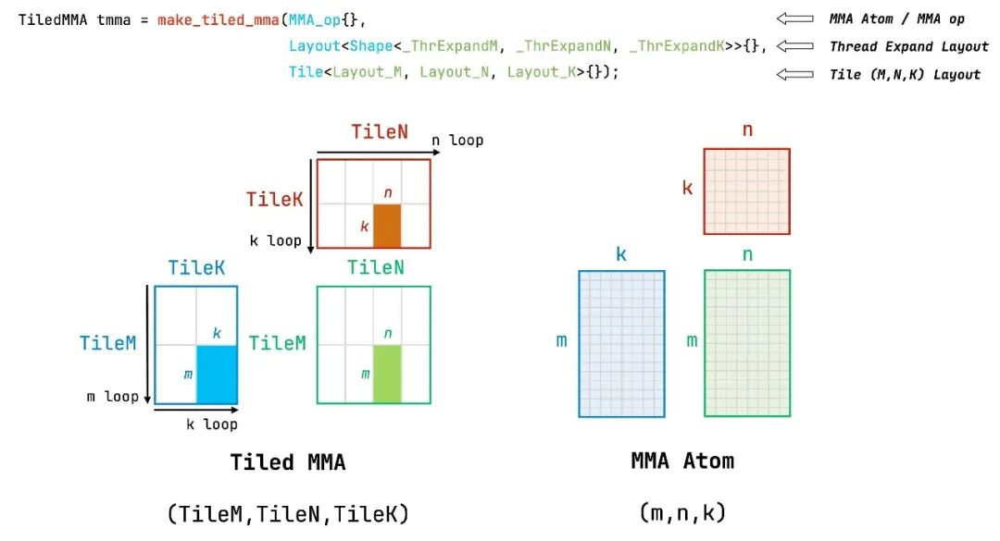

::: {.callout-note appearance="simple"}
**参考答案版**：包含完整代码实现与问答题深度参考解析。建议先独立完成练习题后再展开核对。
:::


## 本课目标与完成标准

学完后你应能：从指令 atom 推导 warp/CTA tile，并检查 A/B/C fragment 分区的一致性。

通过必须同时满足：

- 独立补齐本课唯一的代码填空题，并通过给定检查；
- 三个问答题均说明因果链，而不是只报术语；
- 能指出至少一个正确性边界和一个性能取舍；
- 总分不低于 8/10，且没有一票否决级概念错误。

## 前置关系

- 课程前置：CUDA 线程模型、GEMM、C++ 模板基础
- 本课在路线中的作用：MMA Atom 封装一条硬件矩阵指令的操作数类型、shape 和线程映射；Tiled MMA 在 atom 上复制线程布局与 value layout。

## 核心心智模型

### 1. 它是什么，解决什么问题

MMA Atom 封装一条硬件矩阵指令的操作数类型、shape 和线程映射；Tiled MMA 在 atom 上复制线程布局与 value layout。

### 2. 它如何工作

instruction tile 先组成 warp tile，多个 warp 再组成 CTA tile；partition_A/B/C 必须来自同一 tiled MMA 才能让寄存器布局匹配。

### 3. 正确性条件与常见误区

M、N、K 方向的 tile 与 transpose/layout 模式必须对应；仅 shape 数字相等不能证明 fragment 语义相同。

### 4. 性能与工程取舍

更大 warp/CTA tile 提高复用，但寄存器 fragment 变大；K tile 还影响流水级和 shared memory。

## 图解



请沿着本课的层级/数据流重新标注图中对象；图片只辅助建立结构，不替代代码与边界推理。

## 具体演示

SM80 16×8×16 atom 若沿 M、N 各复制 2，可形成更大的 warp 工作域；具体 fragment 仍由 atom 定义。

请在阅读后先合上这一节，用自己的语言复述“输入状态 → 中间状态 → 输出状态”，再做练习。

## 实践任务：唯一代码填空题

补齐 SM80 FP16 MMA atom 的 K 维。

规则：只能修改 `TODO`/`______` 所在位置；不要删除断言或放宽误差。代码注释说明了每个边界条件。

```{python}
#| course_role: exercise
%%writefile /tmp/mma_shape.cu
// 概念检查：硬件 atom 的逻辑 shape，而非完整 kernel。
constexpr int MMA_M = 16;
constexpr int MMA_N = 8;
constexpr int MMA_K = ______;
static_assert(MMA_M * MMA_N * MMA_K == 2048);
```

### 检查方法

编译静态断言，并在纸上画出 instruction→warp→CTA 三层 shape；注意这不是吞吐 FLOPs 计算。

提交时请给出：补齐后的代码、实际运行输出（环境不可用时注明“仅静态审查”）以及对失败用例的解释。

### Q1

不要背定义：请从输入、状态变化和输出三个阶段解释“MMA Atom、Tiled MMA 与三级 Tiling”的工作机制。

**你的答案：**

### Q2

为什么两个 fragment 的 shape 相同仍不能直接互换？

**你的答案：**

### Q3

给定寄存器溢出，优先缩 M/N tile 还是 K tile？你还需看哪些证据？

**你的答案：**

## 评分与通过规则

- 代码 4 分：正常输入 2 分，边界输入 1 分，解释实现 1 分；
- Q1～Q3 各 2 分；
- 一票否决：结果碰巧正确但核心因果链错误、删除边界检查、把未运行结果说成实测。

需要提示时按四级机制请求：概念区域 → 具体方向 → 关键局部 → 完整答案。


::: {.callout-tip collapse="true" title="💡 点击展开参考答案与详细代码实现" icon="false"}
## 参考答案（仅 answer 分支）

先完成题目再核对。即使代码一致，也要能解释关键步骤，并尝试更换一个输入规模。

```{python}
#| course_role: solution
%%writefile /tmp/mma_shape.cu
constexpr int MMA_M = 16;
constexpr int MMA_N = 8;
constexpr int MMA_K = 16;
static_assert(MMA_M * MMA_N * MMA_K == 2048);
```

### Q1 参考答案

instruction tile 先组成 warp tile，多个 warp 再组成 CTA tile；partition_A/B/C 必须来自同一 tiled MMA 才能让寄存器布局匹配。

### Q2 参考答案

判断时先检查本课不变量：M、N、K 方向的 tile 与 transpose/layout 模式必须对应；仅 shape 数字相等不能证明 fragment 语义相同。  若不成立，最终数值或系统状态即使暂时正常也不可信。

### Q3 参考答案

迁移时先保证正确性，再比较代价。这里的核心取舍是：更大 warp/CTA tile 提高复用，但寄存器 fragment 变大；K tile 还影响流水级和 shared memory。

## 参考资料

- [CuTe Layout Algebra](https://docs.nvidia.com/cutlass/latest/media/docs/cpp/cute/01_layout.html)
- [CuTe Tensors](https://docs.nvidia.com/cutlass/latest/media/docs/cpp/cute/03_tensor.html)
- [CuTe Algorithms](https://docs.nvidia.com/cutlass/latest/media/docs/cpp/cute/04_algorithms.html)
- [CUTLASS GEMM API](https://docs.nvidia.com/cutlass/latest/media/docs/cpp/gemm_api.html)
- [CUTLASS repository](https://github.com/NVIDIA/cutlass)

资料用于建立事实基线；面试回答仍需用自己的语言组织。
:::
