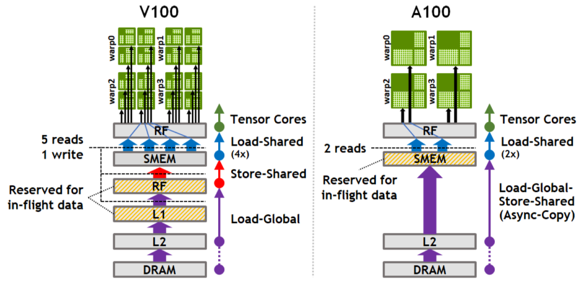

::: {.callout-note appearance="simple"}
**参考答案版**：包含完整代码实现与问答题深度参考解析。建议先独立完成练习题后再展开核对。
:::


## 本课目标与完成标准

学完后你应能：安排 global→shared→register 多 stage 流水，并解释 fence/wait/barrier 的正确顺序。

通过必须同时满足：

- 独立补齐本课唯一的代码填空题，并通过给定检查；
- 三个问答题均说明因果链，而不是只报术语；
- 能指出至少一个正确性边界和一个性能取舍；
- 总分不低于 8/10，且没有一票否决级概念错误。

## 前置关系

- 课程前置：CUDA 线程模型、GEMM、C++ 模板基础
- 本课在路线中的作用：GEMM mainloop 用 shared memory 缓冲 A/B tile；多 stage 让下一 tile 的加载与当前 tile 的 MMA 重叠。

## 核心心智模型

### 1. 它是什么，解决什么问题

GEMM mainloop 用 shared memory 缓冲 A/B tile；多 stage 让下一 tile 的加载与当前 tile 的 MMA 重叠。

### 2. 它如何工作

prologue 预取若干 stage；steady state 每轮等待将消费的 stage、同步可见性、执行 MMA，再回收 stage 给后续加载。

### 3. 正确性条件与常见误区

不能在异步 copy 完成前读取 shared memory，也不能在所有消费者结束前覆盖该 stage；barrier 作用域必须覆盖 CTA。

### 4. 性能与工程取舍

stage 多提高隐藏延迟能力，却线性消耗 shared memory并可能降低 occupancy。

## 图解



请沿着本课的层级/数据流重新标注图中对象；图片只辅助建立结构，不替代代码与边界推理。

## 具体演示

若 copy 延迟 300 cycles、每 tile MMA 120 cycles，至少约 3 stage 才可能完全隐藏，但资源限制可能不允许。

请在阅读后先合上这一节，用自己的语言复述“输入状态 → 中间状态 → 输出状态”，再做练习。

## 实践任务：唯一代码填空题

补齐覆盖 copy 延迟所需的最小 stage 数（包含正在计算的一 stage）。

规则：只能修改 `TODO`/`______` 所在位置；不要删除断言或放宽误差。代码注释说明了每个边界条件。

```{python}
#| course_role: exercise
def minimum_stages(copy_cycles, compute_cycles):
    """两个参数必须为正整数。"""
    # TODO：只补齐下面这个表达式。
    return ______

assert minimum_stages(300,120) == 4
assert minimum_stages(120,120) == 2
assert minimum_stages(1,120) == 2
```

### 检查方法

运行本单元格；所有 `assert` 必须通过。另手工构造一个边界输入，解释预期结果。

提交时请给出：补齐后的代码、实际运行输出（环境不可用时注明“仅静态审查”）以及对失败用例的解释。

### Q1

不要背定义：请从输入、状态变化和输出三个阶段解释“Shared Memory 布局与异步流水”的工作机制。

**你的答案：**

### Q2

只增加 stage 数而不检查 shared-memory occupancy，为什么可能变慢？

**你的答案：**

### Q3

在 profiler 中看到 memory dependency stalls，如何区分 stage 不足与访存不合并？

**你的答案：**

## 评分与通过规则

- 代码 4 分：正常输入 2 分，边界输入 1 分，解释实现 1 分；
- Q1～Q3 各 2 分；
- 一票否决：结果碰巧正确但核心因果链错误、删除边界检查、把未运行结果说成实测。

需要提示时按四级机制请求：概念区域 → 具体方向 → 关键局部 → 完整答案。


::: {.callout-tip collapse="true" title="💡 点击展开参考答案与详细代码实现" icon="false"}
## 参考答案（仅 answer 分支）

先完成题目再核对。即使代码一致，也要能解释关键步骤，并尝试更换一个输入规模。

```{python}
#| course_role: solution
def minimum_stages(copy_cycles, compute_cycles):
    """两个参数必须为正整数。"""
    # 参考实现：表达式直接对应上文不变量。
    return (copy_cycles + compute_cycles - 1) // compute_cycles + 1

assert minimum_stages(300,120) == 4
assert minimum_stages(120,120) == 2
assert minimum_stages(1,120) == 2
```

### Q1 参考答案

prologue 预取若干 stage；steady state 每轮等待将消费的 stage、同步可见性、执行 MMA，再回收 stage 给后续加载。

### Q2 参考答案

判断时先检查本课不变量：不能在异步 copy 完成前读取 shared memory，也不能在所有消费者结束前覆盖该 stage；barrier 作用域必须覆盖 CTA。  若不成立，最终数值或系统状态即使暂时正常也不可信。

### Q3 参考答案

迁移时先保证正确性，再比较代价。这里的核心取舍是：stage 多提高隐藏延迟能力，却线性消耗 shared memory并可能降低 occupancy。

## 参考资料

- [CuTe Layout Algebra](https://docs.nvidia.com/cutlass/latest/media/docs/cpp/cute/01_layout.html)
- [CuTe Tensors](https://docs.nvidia.com/cutlass/latest/media/docs/cpp/cute/03_tensor.html)
- [CuTe Algorithms](https://docs.nvidia.com/cutlass/latest/media/docs/cpp/cute/04_algorithms.html)
- [CUTLASS GEMM API](https://docs.nvidia.com/cutlass/latest/media/docs/cpp/gemm_api.html)
- [CUTLASS repository](https://github.com/NVIDIA/cutlass)

资料用于建立事实基线；面试回答仍需用自己的语言组织。
:::
