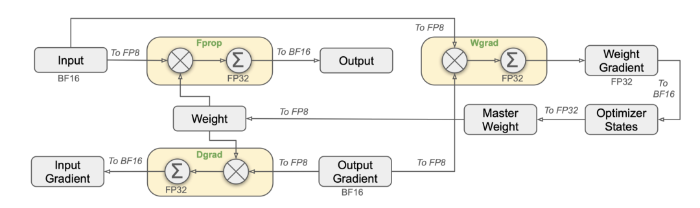

::: {.callout-note appearance="simple"}
**参考答案版**：包含完整代码实现与问答题深度参考解析。建议先独立完成练习题后再展开核对。
:::


## 本课目标与完成标准

学完后你应能：区分输入、累加、输出精度，并设计带 alpha/beta/activation 的 epilogue。

通过必须同时满足：

- 独立补齐本课唯一的代码填空题，并通过给定检查；
- 三个问答题均说明因果链，而不是只报术语；
- 能指出至少一个正确性边界和一个性能取舍；
- 总分不低于 8/10，且没有一票否决级概念错误。

## 前置关系

- 课程前置：CUDA 线程模型、GEMM、C++ 模板基础
- 本课在路线中的作用：CUTLASS 把 mainloop 与 epilogue 分离；常见做法是低精度输入、FP32 accumulator，再在 epilogue 缩放/融合并转换输出。

## 核心心智模型

::: {.img-card}
{width="90%"}
<p class="caption">图 7-1：DeepSeek-V3 / 现代大模型中的 FP8 精度计算与分块缩放机制</p>
:::


<p class="caption" align="center"><em>图 7-2：CUTLASS 混合精度累加与 Epilogue 融合输出流水线</em></p>


### 1. 它是什么，解决什么问题

CUTLASS 把 mainloop 与 epilogue 分离；常见做法是低精度输入、FP32 accumulator，再在 epilogue 缩放/融合并转换输出。

### 2. 它如何工作

主循环只产生 accumulator；epilogue 计算 D=activation(alpha·Acc+beta·C)，转换前应在足够高精度完成。

### 3. 正确性条件与常见误区

beta=0 时不应读取未初始化 C；输出转换需定义 round/saturate，FP8 还需要 scale 与格式变体。

### 4. 性能与工程取舍

融合降低 HBM 流量和 launch 次数，但 epilogue 过重会增加寄存器并限制可复用性。

## 核心操作与流程图解

::: {.img-card}
{width="90%"}
<p class="caption">图 7-1：DeepSeek-V3 / 现代大模型中的 FP8 精度计算与分块缩放机制</p>
:::

```{mermaid}
flowchart LR
    Inputs["低精度输入 (FP8 / BF16)"] --> MMA["Tensor Core 高速矩阵乘"]
    MMA --> Accum["FP32 高精度累加器 (防止下溢与累加误差)"]
    Accum --> Epilogue["Epilogue 算子融合 (Bias + ReLU/SiLU + 量化缩放)"]
    Epilogue --> Out["写回目标格式到全局显存"]
```
<p class="caption" align="center"><em>图 7-2：CUTLASS 混合精度累加与 Epilogue 融合输出流水线</em></p>

## 具体演示

alpha=2、Acc=3、beta=.5、C=4，则激活前为 8；若先把 Acc 截成低精度，误差会被 alpha 放大。

请在阅读后先合上这一节，用自己的语言复述“输入状态 → 中间状态 → 输出状态”，再做练习。

## 实践任务：唯一代码填空题

补齐线性 epilogue，beta 为 0 时不得读取 c。

规则：只能修改 `TODO`/`______` 所在位置；不要删除断言或放宽误差。代码注释说明了每个边界条件。

```{python}
#| course_role: exercise
def linear_epilogue(acc, alpha, beta, c=None):
    """返回 alpha*acc + beta*c。"""
    # TODO：只补齐下面这个表达式。
    return ______

assert linear_epilogue(3.,2.,0.,None) == 6.
assert linear_epilogue(3.,2.,.5,4.) == 8.
```

### 检查方法

运行本单元格；所有 `assert` 必须通过。另手工构造一个边界输入，解释预期结果。

提交时请给出：补齐后的代码、实际运行输出（环境不可用时注明“仅静态审查”）以及对失败用例的解释。

### Q1

不要背定义：请从输入、状态变化和输出三个阶段解释“混合精度、Accumulator 与 Epilogue”的工作机制。

**你的答案：**

### Q2

beta=0 仍无条件 load C 会造成什么正确性与性能问题？

**你的答案：**

### Q3

何时把 activation 放进 epilogue，何时保持独立 kernel？

**你的答案：**

## 评分与通过规则

- 代码 4 分：正常输入 2 分，边界输入 1 分，解释实现 1 分；
- Q1～Q3 各 2 分；
- 一票否决：结果碰巧正确但核心因果链错误、删除边界检查、把未运行结果说成实测。

需要提示时按四级机制请求：概念区域 → 具体方向 → 关键局部 → 完整答案。


::: {.callout-tip collapse="true" title="💡 点击展开参考答案与详细代码实现" icon="false"}
## 参考答案（仅 answer 分支）

先完成题目再核对。即使代码一致，也要能解释关键步骤，并尝试更换一个输入规模。

```{python}
#| course_role: solution
def linear_epilogue(acc, alpha, beta, c=None):
    """返回 alpha*acc + beta*c。"""
    # 参考实现：表达式直接对应上文不变量。
    return alpha * acc if beta == 0 else alpha * acc + beta * c

assert linear_epilogue(3.,2.,0.,None) == 6.
assert linear_epilogue(3.,2.,.5,4.) == 8.
```

### Q1 参考答案

主循环只产生 accumulator；epilogue 计算 D=activation(alpha·Acc+beta·C)，转换前应在足够高精度完成。

### Q2 参考答案

判断时先检查本课不变量：beta=0 时不应读取未初始化 C；输出转换需定义 round/saturate，FP8 还需要 scale 与格式变体。  若不成立，最终数值或系统状态即使暂时正常也不可信。

### Q3 参考答案

迁移时先保证正确性，再比较代价。这里的核心取舍是：融合降低 HBM 流量和 launch 次数，但 epilogue 过重会增加寄存器并限制可复用性。

## 参考资料

- [CuTe Layout Algebra](https://docs.nvidia.com/cutlass/latest/media/docs/cpp/cute/01_layout.html)
- [CuTe Tensors](https://docs.nvidia.com/cutlass/latest/media/docs/cpp/cute/03_tensor.html)
- [CuTe Algorithms](https://docs.nvidia.com/cutlass/latest/media/docs/cpp/cute/04_algorithms.html)
- [CUTLASS GEMM API](https://docs.nvidia.com/cutlass/latest/media/docs/cpp/gemm_api.html)
- [CUTLASS repository](https://github.com/NVIDIA/cutlass)

资料用于建立事实基线；面试回答仍需用自己的语言组织。
:::
