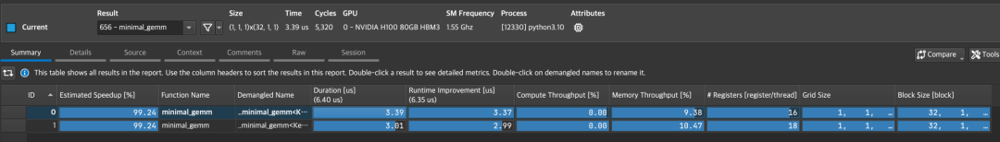

::: {.callout-note appearance="simple"}
**参考答案版**：包含完整代码实现与问答题深度参考解析。建议先独立完成练习题后再展开核对。
:::


## 本课目标与完成标准

学完后你应能：为 shape/dtype/SM 选择候选 kernel，用正确 benchmark 方法而非单次计时做决策。

通过必须同时满足：

- 独立补齐本课唯一的代码填空题，并通过给定检查；
- 三个问答题均说明因果链，而不是只报术语；
- 能指出至少一个正确性边界和一个性能取舍；
- 总分不低于 8/10，且没有一票否决级概念错误。

## 前置关系

- 课程前置：CUDA 线程模型、GEMM、C++ 模板基础
- 本课在路线中的作用：生产 CUTLASS 集成通常由多个 kernel specialization 与 dispatch 组成；不存在对所有 shape 都最佳的单一 tile。

## 核心心智模型


### 核心操作与执行流程图解

::: {.img-card}
{width="90%"}
<p class="caption">图 8-1：Nsight Compute (NCU) 算子性能分析概览界面</p>
:::

```{mermaid}
flowchart TD
    Shape["输入 GEMM 形状 (M, N, K)"] --> Heuristic["启发式规则 / 预调优表格"]
    Heuristic --> Config["选定最优 Tile 尺寸与多级流水级数"]
    Config --> Dispatch["C++ 模板特化 Kernel Dispatch"]
    Dispatch --> Run["GPU 高性能并发执行"]
```
<p class="caption" align="center"><em>图 8-2：CUTLASS Kernel 动态配置选型与分发调度流程</em></p>


### 1. 它是什么，解决什么问题

生产 CUTLASS 集成通常由多个 kernel specialization 与 dispatch 组成；不存在对所有 shape 都最佳的单一 tile。

### 2. 它如何工作

先按硬约束过滤 architecture、dtype、alignment、workspace，再 warmup、同步、多次计时并按 shape 分桶选取。

### 3. 正确性条件与常见误区

结果必须与参考实现按 dtype 合理容差比较；计时要排除编译、初始化和异步未同步。

### 4. 性能与工程取舍

更多 specialization 提高峰值却扩大二进制、编译时间和维护面；只保留有稳定收益的分桶。

## 具体演示

同一 kernel 在 4096³ 方阵表现好，不代表 M=1 的 decode GEMM 好；后者并行维和内存复用完全不同。

请在阅读后先合上这一节，用自己的语言复述“输入状态 → 中间状态 → 输出状态”，再做练习。

## 实践任务：唯一代码填空题

补齐受带宽和计算双重上限约束的 roofline 时间。

规则：只能修改 `TODO`/`______` 所在位置；不要删除断言或放宽误差。代码注释说明了每个边界条件。

```{python}
#| course_role: exercise
def roofline_seconds(flops, bytes_moved, peak_flops, bandwidth):
    """理想时间取计算时间与内存时间的较大者。"""
    # TODO：只补齐下面这个表达式。
    return ______

assert roofline_seconds(100,200,100,100) == 2
assert roofline_seconds(200,100,100,100) == 2
```

### 检查方法

运行本单元格；所有 `assert` 必须通过。另手工构造一个边界输入，解释预期结果。

提交时请给出：补齐后的代码、实际运行输出（环境不可用时注明“仅静态审查”）以及对失败用例的解释。

### Q1

不要背定义：请从输入、状态变化和输出三个阶段解释“Kernel 组合、Dispatch 与 Profiling”的工作机制。

**你的答案：**

### Q2

只用 CUDA Event 测一次就选择 kernel，遗漏了哪些噪声与正确性风险？

**你的答案：**

### Q3

dispatch 表应该按精确 shape 还是 shape bucket？说明维护与性能取舍。

**你的答案：**

## 评分与通过规则

- 代码 4 分：正常输入 2 分，边界输入 1 分，解释实现 1 分；
- Q1～Q3 各 2 分；
- 一票否决：结果碰巧正确但核心因果链错误、删除边界检查、把未运行结果说成实测。

需要提示时按四级机制请求：概念区域 → 具体方向 → 关键局部 → 完整答案。


::: {.callout-tip collapse="true" title="💡 点击展开参考答案与详细代码实现" icon="false"}
## 参考答案（仅 answer 分支）

先完成题目再核对。即使代码一致，也要能解释关键步骤，并尝试更换一个输入规模。

```{python}
#| course_role: solution
def roofline_seconds(flops, bytes_moved, peak_flops, bandwidth):
    """理想时间取计算时间与内存时间的较大者。"""
    # 参考实现：表达式直接对应上文不变量。
    return max(flops / peak_flops, bytes_moved / bandwidth)

assert roofline_seconds(100,200,100,100) == 2
assert roofline_seconds(200,100,100,100) == 2
```

### Q1 参考答案

先按硬约束过滤 architecture、dtype、alignment、workspace，再 warmup、同步、多次计时并按 shape 分桶选取。

### Q2 参考答案

判断时先检查本课不变量：结果必须与参考实现按 dtype 合理容差比较；计时要排除编译、初始化和异步未同步。  若不成立，最终数值或系统状态即使暂时正常也不可信。

### Q3 参考答案

迁移时先保证正确性，再比较代价。这里的核心取舍是：更多 specialization 提高峰值却扩大二进制、编译时间和维护面；只保留有稳定收益的分桶。

## 参考资料

- [CuTe Layout Algebra](https://docs.nvidia.com/cutlass/latest/media/docs/cpp/cute/01_layout.html)
- [CuTe Tensors](https://docs.nvidia.com/cutlass/latest/media/docs/cpp/cute/03_tensor.html)
- [CuTe Algorithms](https://docs.nvidia.com/cutlass/latest/media/docs/cpp/cute/04_algorithms.html)
- [CUTLASS GEMM API](https://docs.nvidia.com/cutlass/latest/media/docs/cpp/gemm_api.html)
- [CUTLASS repository](https://github.com/NVIDIA/cutlass)

资料用于建立事实基线；面试回答仍需用自己的语言组织。
:::
