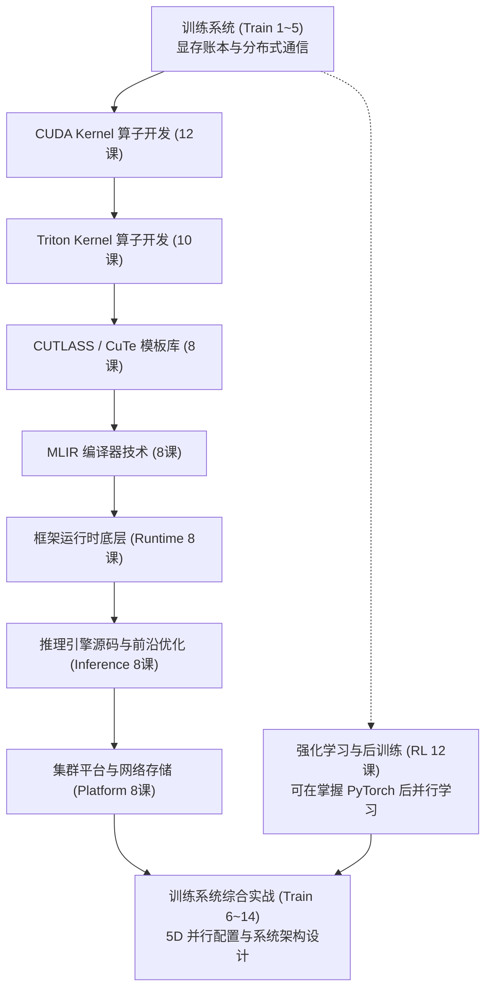

::: {.callout-note}
### 课程定位与使用原则
- 本版本为 **参考答案版**：包含全部 88 节课的代码实现与 3 个核心问答题参考解析。
- **逐课通关机制**：按模块编号依次学习，建议独立完成代码填空与问答后再核对答案。
- **评分标准**：代码填空 4 分、问答题 Q1～Q3 各 2 分，通过线为 8/10 分。
:::

## 六条核心主线

| 模块 | 课数 | 核心产出 | 前置条件 |
|:---|:---:|:---|:---|
| [**训练系统 / Ultra-Scale**](train/index.qmd) | 14 | 精确计算显存/通信账本，设计 5D 并行训练配置方案 | Transformer 与基础 PyTorch |
| [**CUDA Kernel 算子开发**](cuda/index.qmd) | 12 | 掌握 GPU 线程映射、归约、Tiling 与数值稳定算子实现 | C/C++、线性代数、并行编程 |
| [**CUTLASS / CuTe 模板库**](cutlass/index.qmd) | 8 | 掌握 Layout 代数与分层 GEMM 算子架构 | CUDA 线程模型、C++ 模板 |
| [**Triton Kernel 算子开发**](triton/index.qmd) | 10 | 掌握 SPMD 编程模型、Block 级操作与常用深度学习算子 | Python、PyTorch、CUDA 基础 |
| [**MLIR 编译器技术**](mlir/index.qmd) | 8 | 掌握 SSA、方言体系、模式重写与 GPU/LLVM 逐级 Lowering | 编译原理基础、C++ 阅读 |
| [**强化学习与大模型后训练**](rl/index.qmd) | 12 | 掌握 MDP、REINFORCE/RLOO 到 RLHF/RLVR、GRPO 变体及 Rollout 系统 | Python、概率统计、深度学习 |

---

## 三条 AI Infra 补充主线

针对工业界大模型落地与万卡集群场景的深度扩展，不重复基础算子，直击系统核心：

| 模块 | 课数 | 核心产出 | 前置条件 |
|:---|:---:|:---|:---|
| [**推理引擎源码与优化**](inference/index.qmd) | 8 | 走读 vLLM/SGLang 源码，掌握量化、稀疏与投机采样 | 训练 1～5、CUDA/Triton、Transformer |
| [**框架运行时底层机制**](runtime/index.qmd) | 8 | 掌握 PyTorch Dispatcher、Compile、通信与数据流水线 | Python、PyTorch、CUDA 基础 |
| [**集群平台与可靠性**](platform/index.qmd) | 8 | 掌握智算中心拓扑、RDMA、存储 IO、调度与容错 | Linux/网络基础、分布式训练基础 |

---

## 推荐学习路径



---

## 本地开发与在线预览

你可以使用 Quarto 官方工具在本地进行实时热更新预览：

```bash
# 1. 启动本地实时预览服务器（代码修改实时刷新）
quarto preview

# 2. 静态编译全站
quarto render

# 3. 将单篇 .qmd 导出为 Jupyter Notebook (.ipynb)
quarto convert train/lesson01.qmd --output train/lesson01.ipynb
```

---

## 验证基线与事实依据

- **课程标准**：以 Ultra-Scale Playbook、vLLM/SGLang 固定源码快照、NVIDIA CUDA/CUTLASS 官方文档、Triton/MLIR 官方文档和原始前沿论文为事实基线。
- **环境要求**：支持静态审查与多平台运行，云端通过 Quarto 静态机制直接托管于 GitHub Pages，无需本地或云端 NVIDIA GPU 依赖即可随时查阅。
