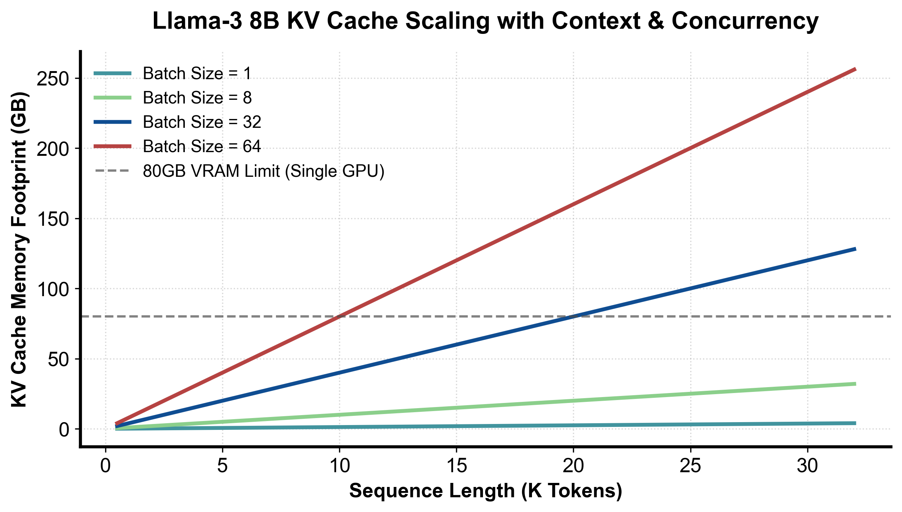

::: {.callout-note appearance="simple"}
**参考答案版**：包含完整代码实现与问答题深度参考解析。建议先独立完成练习题后再展开核对。
:::


## 本课目标与通过标准

本课产出：能逐段解释 `Scheduler.schedule` 如何用统一 token budget 覆盖 prefill/decode/speculation，并追踪 prefix hit、block 分配、抢占和释放的完整状态变化。

通过要求：唯一代码填空题通过全部断言；Q1～Q3 都能沿源码对象给出因果链；能指出一个正确性不变量、一个性能边界和一个需要 benchmark 才能确认的结论；总分至少 8/10。

## 源码版本与阅读方法

本课程使用固定 commit 的永久链接保证行号可复现，同时链接 current docs 供核对最新变化。阅读时先画调用图和状态所有权，再进入分支；不要从大文件第一行机械顺读。

源码阅读主轴：

1. `vllm/v1/core/sched/scheduler.py::schedule`：先读顶部注释，再标记 RUNNING 循环、WAITING 接纳、`allocate_slots` 失败与 `_preempt_request`。
2. `vllm/v1/core/kv_cache_manager.py::get_computed_blocks`：理解为何只复用完整 block、全命中仍要重算最后 token。
3. 同文件 `allocate_slots`：区分 cached blocks、new computed blocks、lookahead slots 与 watermark/reservation。
4. `vllm/v1/core/block_pool.py`：追 `get_cached_block`、`get_new_blocks`、`cache_full_blocks` 和 free queue。
5. `docs/design/prefix_caching.md` 与 `hybrid_kv_cache_manager.md`：把源码细节还原为设计约束。

源码快照：vLLM `8e958902eee5`。

## 核心对象


### 核心操作与执行流程图解

::: {.img-card}
{width="85%"}
<p class="caption">图 2-1：Llama-3 8B 不同并发度与上下文长度下 KV Cache 显存暴涨曲线（基于 scientific-figure-making 绘制）</p>
:::

```{mermaid}
flowchart TD
    ScheduleStart["进入 step() 调度周期"] --> CheckWaiting["检查等待队列 (Waiting Queue)"]
    CheckWaiting --> MatchPrefix["查询 Prefix Cache 命中已有块"]
    MatchPrefix --> Budget{"Token 预算与物理 Block 是否充足以容纳新请求?"}
    Budget -->|充足| Promote["晋升至运行队列 (Running Queue) 触发 Prefill"]
    Budget -->|不足| PreemptCheck{"Running 队列能否满足 Decode 扩张?"}
    PreemptCheck -->|受阻| Preempt["抢占低优先级请求 (Preempt / Recompute)"]
    PreemptCheck -->|充足| Exec["构造当前批次元数据并下发 GPU"]
```
<p class="caption" align="center"><em>图 2-2：vLLM V1 统一调度器动态分发与抢占决策流程</em></p>


## 核心心智模型

### 核心操作与执行流程图解

::: {.img-card}
{width="85%"}
<p class="caption">图 2-1：Llama-3 8B 不同并发度与上下文长度下 KV Cache 显存暴涨曲线（基于 scientific-figure-making 绘制）</p>
:::

```{mermaid}
flowchart TD
    ScheduleStart["进入 step() 调度周期"] --> CheckWaiting["检查等待队列 (Waiting Queue)"]
    CheckWaiting --> MatchPrefix["查询 Prefix Cache 命中已有块"]
    MatchPrefix --> Budget{"Token 预算与物理 Block 是否充足以容纳新请求?"}
    Budget -->|充足| Promote["晋升至运行队列 (Running Queue) 触发 Prefill"]
    Budget -->|不足| PreemptCheck{"Running 队列能否满足 Decode 扩张?"}
    PreemptCheck -->|受阻| Preempt["抢占低优先级请求 (Preempt / Recompute)"]
    PreemptCheck -->|充足| Exec["构造当前批次元数据并下发 GPU"]
```
<p class="caption" align="center"><em>图 2-2：vLLM V1 统一调度器动态分发与抢占决策流程</em></p>


### 1. 它是什么，解决什么问题

在 LLM 推理服务中，KV Cache 是最昂贵、最具爆发性的显存开销源头（图 2-1）。随着并发请求数与序列长度的增长，显存消耗呈陡峭的超线性爆发。传统推理系统将调度粗暴划分为“Prefill 批次”与“Decode 批次”两个互斥世界，由此引发了恶劣的**调度气泡与延迟剧烈抖动**：长 Prompt 的 Prefill 计算会把正在流水线生成的 Decode 请求完全阻断数十秒，导致首字延迟（TTFT）与字间生成延迟（ITL / TPOT）的双重崩溃。

vLLM V1 统一调度器（Unified Scheduler）与 `KVCacheManager` 彻底颠覆了这种二元割裂：
- **统一 Token 预算抽象（Unified Token Budget）**：调度器不再关注请求究竟处于 Prefill 还是 Decode 阶段，而是将每个请求抽象为一个简单的状态计数缺口：
  $$ \text{need\_tokens} = \text{total\_tokens\_with\_spec} - \text{num\_computed\_tokens} $$
  系统每轮分配一个全局固定的 Token 预算（例如 `token_budget = 4096`），新请求的分块分段输入（Chunked Prefill）、在线请求的单步自回归（Decode）、以及投机采样（Speculative Decoding）的验证批次，统一在同一套流水线下瓜分预算；
- **分层前缀缓存（Prefix Caching）**：通过前缀哈希链表识别跨会话、跨请求公用的 System Prompt 或历史上下文，实现物理 Block 级别的零拷贝复用，从根源上平抑图 2-1 所示的显存陡增曲线。

### 2. 它如何工作

统一调度器动态分发与抢占决策时序如图 2-2 所示：

1. **RUNNING 队列绝对优先准则**：
   在每个 `step()` 循环开始时，调度器**首先且严格优先保障正在运行的 RUNNING 队列**。因为正在生成的请求已经持有了大量的物理 KV Cache，若其中断会导致昂贵的显存被闲置占用。调度器优先为 RUNNING 请求分配本轮继续生成所需的 Token 预算与后继 Block。
2. **前缀检索与准入接纳（图 2-2）**：
   若 RUNNING 队列满足后全局 Token Budget 仍有盈余，调度器按顺序扫描 WAITING 队列中的新请求：
   - 提取新请求的 Prompt Tokens，在 `KVCacheManager` 的全局哈希树中执行 `get_computed_blocks` 前缀匹配；
   - 若匹配到已有完整物理 Block，直接递增该 Block 的引用计数并绑定给新请求，将其初始已计算计数 `num_computed_tokens` 直接推高至命中边界；
   - 检查物理显存池容量：调用 `allocate_slots` 验证剩余物理 Block 与安全水位线（Watermark），若满足则将请求从 WAITING 晋升至 RUNNING，纳入本轮 GPU 执行批次。
3. **动态抢占机制（Preemption & Self-Healing，图 2-2）**：
   若突发并发激增导致物理显存耗尽、无法满足 RUNNING 队列中现有请求的自回归扩张时，调度器启动抢占防护：
   - 依据调度优先级（或队尾最年轻原则）选取牺牲者请求；
   - 将被抢占请求从 RUNNING 踢回 WAITING 队列，调用 `KVCacheManager` 强制释放其所占有的私有 Block 并重置其计算进度（待显存充裕时自动触发重计算恢复）；
   - 坚决杜绝 GPU 发生底层的 CUDA Out of Memory 致命崩溃。

### 3. 正确性条件与常见误区

- **Prompt 全命中时的“最后 Token 强制重算”不变量**：
  若某个新请求的 Prompt 在 Prefix Cache 中获得了 100% 的完美全命中，`get_computed_blocks` 必须且**只能返回 `prompt_length - 1`，严禁返回整个 Prompt 长度**！
  - **因果律断言**：KV Cache 仅仅缓存了历史上下文的 Key 和 Value 投影张量，它**从来不缓存模型最后一层的 Logits 输出**！
  - 为了合法地采样生成第一个新 Token，模型必须对 Prompt 的最后一个 Token 执行一次前向计算（Forward Pass）以产出对应的预测 Logits。若错误地将全部 Prompt 标为已计算，采样器将因缺失 Logits 而抛出空指针或读取未初始化内存崩溃。
- **Block 物理状态的严格互斥性**：
  物理 Block 严禁同时处于 Free Queue（空闲池）与某个请求的活跃 Block Table 中。释放操作必须伴随着引用计数的严格原子递减，清零时方可回收入队。
- **Watermark 与预留机制的本质**：
  `scheduler_reserve_full_isl` 是一种准入控制防抖机制，其目的是防止“某个请求的第 1 个 Chunk 勉强能塞下、但后续 Decode 刚走两步就因显存不足被反复抢占踢回”的系统级惊群抖动，而非真正扩充了物理显存容量。

### 4. 性能与工程取舍

- **Block Size 粒度的系统级博弈**：
  - **较小块（Block Size = 8 或 16）**：显存碎片率低，Prefix Cache 匹配粒度极其精细，适合多轮短对话；但缺点是 Block Table 长度翻倍，Kernel 寻址开销增加，且高并发下 CPU 端哈希更新成为新瓶颈；
  - **较大块（Block Size = 32 或 64）**：GPU 显存连续访存带宽利用率极高，符合 Tensor Core 访存合并要求；缺点是尾部内碎片比例显著升高，长 Prompt 复用率下降。
- **Chunked Prefill 的平滑效果**：
  通过将长达数万 Token 的超长 Prompt 切分为若干个 512 或 1024 Token 的微块（Chunk），将单一请求的巨型 Prefill 均匀分摊到多个 step 中，与短 Decode 请求无缝交织执行。这不仅彻底消除了 ITL（字间延迟）的断崖式尖刺，还使得 GPU SM 计算核心与显存带宽始终维持在饱和高吞吐区间。

## 具体演示：统一 Token 预算分配与无阶段分支调度

设当前配置全局统一预算 `token_budget = 8`。调度器待处理请求队列如下：
- 请求 A（处于 `running` 状态）：已计算 `computed = 6`，包含投机预测的总目标 `total_with_spec = 10`。缺口 $\text{need}_A = 10 - 6 = 4$；
- 请求 B（处于 `waiting` 状态）：刚到达的新请求，`computed = 0`，Prompt 总长 `total_with_spec = 7`。缺口 $\text{need}_B = 7 - 0 = 7$。

**统一调度器步进执行**：
1. **优先处理 RUNNING 请求 A**：
   - 提取需求：$\text{need}_A = 4$；
   - 分配预算：$\text{take}_A = \min(4, 8) = 4$；
   - 扣减全局预算：`token_budget` 从 8 降为 $8 - 4 = 4$；
   - 请求 A 被计划执行 4 个 Token（这可能代表 1 步 Decode 加上 3 个 Speculative Verification Tokens）。
2. **随后处理 WAITING 请求 B**：
   - 提取需求：$\text{need}_B = 7$；
   - 分配预算：当前剩余预算为 4，因此 $\text{take}_B = \min(7, 4) = 4$；
   - 扣减全局预算：`token_budget` 降为 0，调度循环退出；
   - 请求 B 被计划执行 4 个 Token（这正是典型的分块 Chunked Prefill）。

最终输出调度计划为：`{"decode_or_spec": 4, "prefill": 4}`，剩余预算为 0。整个算法完全不依赖任何 `if status == "prefill"` 的硬编码条件分支，以统一的代数数学模型自洽表达了所有异构推理形态。

## 实践任务：唯一代码填空题

实现统一 token budget 的教学版计划器。RUNNING 请求优先于 WAITING；每个请求按 `total_with_spec-computed` 领取预算，不引入 prefill/decode 分支。

只能修改 `TODO`/`______` 位置，不得删除断言或放宽通过条件。

```{python}
#| course_role: exercise
def unified_token_plan(requests, token_budget):
    if token_budget < 0:
        raise ValueError("negative token budget")
    if any(r["computed"] < 0 or r["total_with_spec"] < r["computed"] for r in requests):
        raise ValueError("invalid request counters")

    # Scheduler 源码先处理 running，再处理 waiting；同组保持输入次序。
    ordered = [r for r in requests if r["status"] == "running"] + [
        r for r in requests if r["status"] == "waiting"
    ]
    plan = {}
    for request in ordered:
        if token_budget == 0:
            break
        # TODO：只根据统一 token 缺口分配，不判断阶段名称。
        need = ______
        take = ______
        if take:
            plan[request["id"]] = take
            token_budget -= take
    return plan, token_budget

reqs = [
    {"id": "prefill", "status": "waiting", "computed": 0, "total_with_spec": 7},
    {"id": "decode_or_spec", "status": "running", "computed": 6, "total_with_spec": 10},
]
assert unified_token_plan(reqs, 8) == ({"decode_or_spec": 4, "prefill": 4}, 0)
assert unified_token_plan(reqs, 20) == ({"decode_or_spec": 4, "prefill": 7}, 9)
```

### 检查方法

运行断言；增加一个 `computed==total_with_spec` 的请求，确认它不消耗预算，再解释真实源码还需通过哪些 KV/encoder 条件。

### Q1

为什么统一 token budget 能同时表达 chunked prefill、decode 与 speculative verification？它没有消除什么复杂度？

**你的答案：**

### Q2

Prefix cache 全命中 prompt 时，为什么源码仍限制最大命中到 `prompt_length-1`？

**你的答案：**

### Q3

`allocate_slots` 失败后立即把 `max_num_seqs` 调大是否合理？请给出源码级因果链。

**你的答案：**

## 评分规则

- 代码 4 分：主路径 2 分、边界条件 1 分、能映射回源码对象 1 分；
- Q1～Q3 各 2 分：必须包含对象、状态变化、正确性或成本链；
- 一票否决：把论文峰值写成普遍生产结论；把源码支持写成所有模型/硬件可用；混淆算法正确性与性能；只背类名而说不清状态所有权。


::: {.callout-tip collapse="true" title="💡 点击展开参考答案与详细代码实现" icon="false"}
## 参考答案（仅 answer 分支）

先独立完成。核对后请更换一个 batch、cache 或硬件条件重新推演，不能只复制。

```{python}
#| course_role: solution
def unified_token_plan(requests, token_budget):
    if token_budget < 0:
        raise ValueError("negative token budget")
    if any(r["computed"] < 0 or r["total_with_spec"] < r["computed"] for r in requests):
        raise ValueError("invalid request counters")

    ordered = [r for r in requests if r["status"] == "running"] + [
        r for r in requests if r["status"] == "waiting"
    ]
    plan = {}
    for request in ordered:
        if token_budget == 0:
            break
        need = request["total_with_spec"] - request["computed"]
        take = min(need, token_budget)
        if take:
            plan[request["id"]] = take
            token_budget -= take
    return plan, token_budget

reqs = [
    {"id": "prefill", "status": "waiting", "computed": 0, "total_with_spec": 7},
    {"id": "decode_or_spec", "status": "running", "computed": 6, "total_with_spec": 10},
]
assert unified_token_plan(reqs, 8) == ({"decode_or_spec": 4, "prefill": 4}, 0)
assert unified_token_plan(reqs, 20) == ({"decode_or_spec": 4, "prefill": 7}, 9)
```

### Q1 参考答案

1. **统一表达的数学统一性**：
   - 无论是新请求的分块 Prefill、在线请求的自回归 Decode，还是投机解码（Speculative Decoding）的 Draft 验证，其本质在代数上完全统一为同一个数学关系：
     $$ \text{need} = \text{total\_tokens\_with\_spec} - \text{num\_computed\_tokens} $$
   - Prefill 只是 $\text{need}$ 较大，被 Chunk 切分为固定长度；Decode 只是 $\text{need} = 1$；Speculative Verification 只是 $\text{need} = K + 1$（验证 $K$ 个草稿 Token 并多预测 1 个 Bonus Token）。在统一预算循环中，调度器只需依次扣减 $\min(\text{need}, \text{budget})$，彻底消除了历史框架中 Prefill 与 Decode 互斥分支带来的调度气泡。
2. **未消除的底层复杂性矩阵**：
   统一 Token 计数仅解决了“计算量切分”的上层抽象，**丝毫没有消除物理资源层面的严苛约束**：
   - **非均匀显存占用（Memory Asymmetry）**：同样分配 512 个 Token 预算，Prefill 是对单个序列写入大量连续 KV，而 512 个并发 Decode 请求则分散在 512 条独立的 Block Table 中，对物理显存池、TLB 寻址与访存带宽造成完全不同的压力；
   - **KV Block 边界与对齐问题**：必须协同 `KVCacheManager` 检查物理 Block 能否分配（`allocate_slots`）、处理跨跨多 KV Group（MHA/GQA/MLA）的对齐；
   - **投机回滚与采样状态更新**：投机验证后可能只接受前 $m$ 个 Token 并拒绝后续 $K-m$ 个，调度器必须在执行后动态裁剪 `total_tokens` 并退还未使用的预留 Block。

### Q2 参考答案

当某个请求的 Prompt 在前缀树（Prefix Cache）中被 100% 完整匹配命中时，源码必须且只能将最大命中块数限制在覆盖至 `prompt_length - 1` 个 Token，**强制留出最后一个 Token 进行前向推理**，核心原因如下：
1. **KV Cache 与 Logits 的本质区别**：
   - PagedAttention 的 KV Cache 显存池中持久化存储的仅仅是注意力层的 Key 张量和 Value 张量；
   - **KV Cache 内部绝不保存模型最后一层 Linear 投影出的预测 Logits**！
2. **采样的前置因果依赖（Sampling Prerequisite）**：
   - 自回归模型要生成输出序列的第 1 个 Completion Token，采样器（Sampler）必须依赖 Prompt 最后一个 Token 在经过整个 Transformer 后的输出 Logits 向量进行 Softmax 与概率采样；
   - 若错误地将全部 Prompt 标为已计算（`num_computed = prompt_length`），调度器会认为该请求已不需要任何前向计算，GPU Worker 将直接跳过前向网络。此时由于没有任何可用的 Logits 张量，采样器将无法工作，直接抛出空指针或读取未初始化的非法内存导致崩溃。因此，“留 1 个 Token 重算 Logits”是保证自回归采样正确性的底层绝对不变量。

### Q3 参考答案

当 `allocate_slots` 抛出分配失败时，盲目将配置参数 `max_num_seqs`（最大并发序列数）调大是**极其荒谬且具有破坏性的错误操作**，因果链如下：
1. **显存瓶颈的物理本质**：`allocate_slots` 失败，确凿证明当前 GPU 的物理显存池（Block Pool）已经达到了警戒水位线（Watermark），无法为现有请求分配更多的物理 KV Block，或者现有空闲块不足以支撑下一轮生成的 Lookahead 预留。这是**纯粹的物理显存容量不足**问题；
2. **调大 `max_num_seqs` 的雪上加霜效应**：
   - `max_num_seqs` 控制的是准许进入 RUNNING 队列的最大并发请求数上限；
   - 若调大该上限，调度器在检测到 Token 预算尚有微弱空余时，会盲目将更多 WAITING 队列中的新请求晋升为 RUNNING；
   - 更多并发请求会并发申请分配首块 KV Block，使得原本已经枯竭的显存池更加不堪重负；
3. **系统崩溃因果链路**：
   - 更多请求分配失败 $\implies$ 触发调度器紧急抢占机制（`_preempt_request`）；
   - 调度器被迫从 RUNNING 队列中频繁牺牲正在生成的长请求，将其踢回 WAITING 并丢弃其非共享 Block；
   - 被踢请求在显存稍有空余时再次被唤醒并重新执行 Prefill 重计算（Recompute），引发灾难性的**“内存抖动与惊群抢占”（Trashing & Preemption Cascades）**；
   - 系统的有效产出（Goodput）趋向于 0，首字延迟与尾延迟（P99）恶化数百倍。
4. **正确工程实践**：当 `allocate_slots` 频繁失败时，应当降低 `max_num_seqs`、缩小 `max_num_batched_tokens`、调大 `scheduler_reserve_full_isl` 门禁，或者开启多级 KV Cache 卸载与量化（FP8/INT4 KV Cache）。

## 参考资料

- [vLLM V1 Scheduler source](https://github.com/vllm-project/vllm/blob/8e958902eee56ca5158728f1dd5a32246f0246f3/vllm/v1/core/sched/scheduler.py#L439-L1264)
- [vLLM KVCacheManager source](https://github.com/vllm-project/vllm/blob/8e958902eee56ca5158728f1dd5a32246f0246f3/vllm/v1/core/kv_cache_manager.py#L230-L628)
- [vLLM BlockPool source](https://github.com/vllm-project/vllm/blob/8e958902eee56ca5158728f1dd5a32246f0246f3/vllm/v1/core/block_pool.py)
- [vLLM prefix caching design](https://docs.vllm.ai/en/latest/design/prefix_caching/)
- [vLLM hybrid KV cache manager design](https://github.com/vllm-project/vllm/blob/8e958902eee56ca5158728f1dd5a32246f0246f3/docs/design/hybrid_kv_cache_manager.md)
- [vLLM scheduler configuration](https://docs.vllm.ai/en/latest/api/vllm/config/scheduler/)

源码链接固定到本课审阅 commit；current docs、支持矩阵和默认参数会变化，面试或部署前必须按目标版本重新核对。
:::
