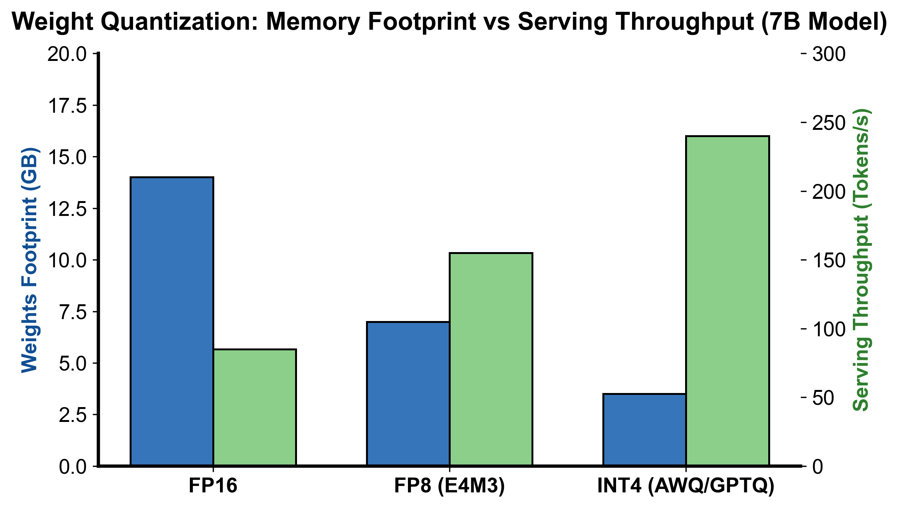
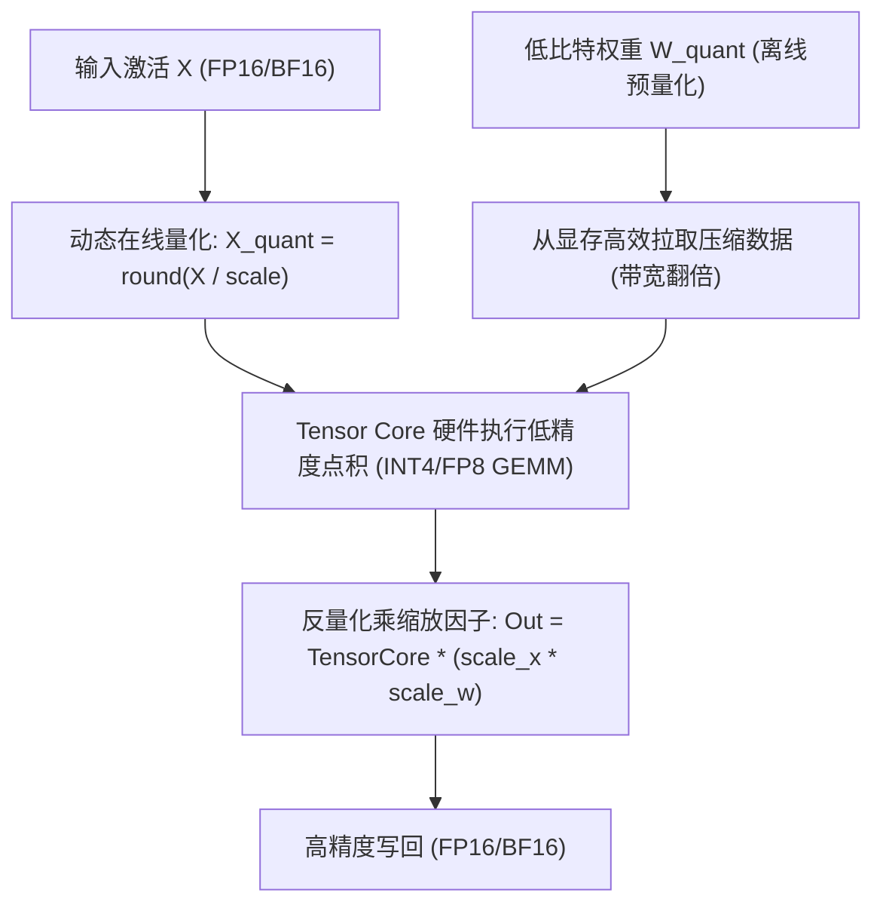

::: {.callout-note appearance="simple"}
**参考答案版**：包含完整代码实现与问答题深度参考解析。建议先独立完成练习题后再展开核对。
:::


## 本课目标与通过标准

本课产出：能从 vLLM/SGLang quantization registry 追到 QuantizationConfig、layer method 与 kernel，并根据硬件、瓶颈和质量证据选择 W4A16、W8A8/FP8、FP4 或 KV 量化。

通过要求：唯一代码填空题通过全部断言；Q1～Q3 都能沿源码对象给出因果链；能指出一个正确性不变量、一个性能边界和一个需要 benchmark 才能确认的结论；总分至少 8/10。

## 源码版本与阅读方法

本课程使用固定 commit 的永久链接保证行号可复现，同时链接 current docs 供核对最新变化。阅读时先画调用图和状态所有权，再进入分支；不要从大文件第一行机械顺读。

源码阅读顺序：

1. vLLM `model_executor/layers/quantization/__init__.py`：`QuantizationMethods` 与 `get_quantization_config`。
2. vLLM `base_config.py`：`QuantizationConfig.get_quant_method` 与 `QuantizeMethodBase.create_weights/apply`。
3. vLLM `compressed_tensors/schemes/`：按 W4A16、W8A8 FP8、NVFP4、MXFP4 比较 scheme，不要只看文件名。
4. SGLang `layers/quantization/__init__.py`：平台条件下的 registry、CPU/外部平台 override。
5. SGLang `fp8.py`、`mxfp4.py`、`nvfp4_online.py`、`kv_cache.py`：追 checkpoint metadata 到实际 op。

源码快照：vLLM `8e958902eee5`；SGLang `9deb6952afa4`。

## 核心对象


### 核心操作与执行流程图解

::: {.img-card}
{width="85%"}
<p class="caption">图 6-1：FP16 vs FP8 vs INT4 显存占用与推理吞吐权衡对比（基于 scientific-figure-making 绘制）</p>
:::


<p class="caption" align="center"><em>图 6-2：量化 GEMM 在线标定、Tensor Core 计算与反量化流水线</em></p>


### 核心操作与执行流程图解

::: {.img-card}
{width="85%"}
<p class="caption">图 6-1：FP16 vs FP8 vs INT4 显存占用与推理吞吐权衡对比（基于 scientific-figure-making 绘制）</p>
:::

```{mermaid}
flowchart TD
    Act["输入激活 X (FP16/BF16)"] --> DynamicQuant["动态在线量化: X_quant = round(X / scale)"]
    Weight["低比特权重 W_quant (离线预量化)"] --> WeightLoad["从显存高效拉取压缩数据 (带宽翻倍)"]
    DynamicQuant & WeightLoad --> TensorCore["Tensor Core 硬件执行低精度点积 (INT4/FP8 GEMM)"]
    TensorCore --> ScaleMul["反量化乘缩放因子: Out = TensorCore * (scale_x * scale_w)"]
    ScaleMul --> Out["高精度写回 (FP16/BF16)"]
```
<p class="caption" align="center"><em>图 6-2：量化 GEMM 在线标定、Tensor Core 计算与反量化流水线</em></p>


量化方案由四层合同组成：数值格式（INT/FP、bit width、scale/zero point）、粒度（tensor/channel/group/micro-block/token）、checkpoint metadata（packing、axis、scheme）和执行 kernel（输入 dtype、反量化融合、硬件 capability）。registry 只完成“名字→配置类”；配置类再为具体 Linear/MoE/Attention layer 选择 quant method，method 创建 packed weights 并在 `apply` 调 kernel。

W4A16 主要压权重带宽与容量，常适合低 batch decode；W8A8/FP8 同时量化激活，更依赖原生低精度 Tensor Core；NVFP4/MXFP4 是 micro-scaling 4-bit 路线，scale 编码和 block size 不同；KV quantization 独立影响长上下文容量和 attention 误差。

## 调用链与状态变化

加载时读取模型 quant config，runtime registry 解析为 `QuantizationConfig`；每层通过 prefix/layer type 获得 method，`create_weights` 建立 packed parameter 与 scales，checkpoint loader 填充，`process_weights_after_loading` 重排/pack，forward 时 `apply` 根据 shape/platform 选择 Marlin、CUTLASS/FlashInfer、Triton 或其他 kernel。

Online/dynamic activation quant 每次 forward 计算 scale；静态校准使用保存的 scale。Micro-scaling 把连续小 block 共享 scale，减少 outlier 对全 tensor 的污染，但增加 scale metadata 和 layout 约束。

## 正确性条件与常见误区

格式名称相同不保证 layout/kernel 相同；checkpoint metadata、group size、zero point、scale dtype 和 axis 必须与 loader/kernel 一致。目标硬件没有原生/优化 kernel 时，低 bit 可能因解包和转换更慢。量化质量必须以目标 tokenizer、模型 revision、长上下文和任务集验证。

不要把模型文件缩小比例直接当 GPU 显存或吞吐提升：还要计 KV、workspace、未量化层、scales、CUDA graph 和 allocator reserve。

## 当前前沿与工程取舍

当前生产前沿是硬件感知的混合路线，而非单一算法冠军：Hopper/部分平台常用 FP8 W8A8；Blackwell 原生 NVFP4 提供 W4A4 路线；MXFP4强调标准化 micro-scaling/跨平台潜力；W4A16 INT4 仍是广泛适用的权重容量方案；KV FP8/FP4 面向长上下文。MR-GPTQ、旋转/scale 优化等论文改善 FP4 质量，但是否已被目标 engine/kernel 集成必须另行核对。

## 具体推演

values `[0,1,-2,8]` 若整 tensor 共用 scale，8 这个 outlier 会让前三项格点变粗；按 2 元素 micro-block 分组后，前两项和后两项各自得到 scale。更细粒度降低局部误差，却增加 scale 数和 kernel 访存/转换成本。

请先口头复述“输入 → 状态所有者 → 状态迁移 → 输出/指标”，再做练习。

## 实践任务：唯一代码填空题

补齐对称 micro-block fake quantization。它用于理解 scale 粒度，不冒充 NVFP4/MXFP4 的完整格式实现。

只能修改 `TODO`/`______` 位置，不得删除断言或放宽通过条件。

```{python}
#| course_role: exercise
def blockwise_symmetric_fake_quant(values, block_size, qmax):
    if block_size <= 0 or qmax <= 0:
        raise ValueError("invalid quantization geometry")
    restored, scales = [], []
    for start in range(0, len(values), block_size):
        block = values[start:start + block_size]
        max_abs = max((abs(x) for x in block), default=0.0)
        # TODO：零 block 使用 scale=1；其他 block 映射到 [-qmax,qmax]。
        scale = ______
        scales.append(scale)
        for value in block:
            q = ______
            restored.append(q * scale)
    return restored, scales

restored, scales = blockwise_symmetric_fake_quant([0.0, 1.0, -2.0, 8.0], 2, 7)
assert scales == [1/7, 8/7]
assert abs(restored[1] - 1.0) < 1e-12
assert abs(restored[-1] - 8.0) < 1e-12
assert blockwise_symmetric_fake_quant([0.0, 0.0], 2, 7) == ([0.0, 0.0], [1.0])
```

### 检查方法

运行断言；把 block size 改为 4，比较数值误差和 scale 数。说明该模型遗漏了真实 FP4 的哪些编码细节。

### Q1

从 `--quantization` 到实际 GEMM kernel，中间至少经过哪些源码层？

**你的答案：**

### Q2

为什么不能笼统地说“NVFP4 比 INT4 先进，所以一定更好”？

**你的答案：**

### Q3

模型量化后权重显存减半，但最大并发只提升 10%，应如何做账和定位？

**你的答案：**

## 评分规则

- 代码 4 分：主路径 2 分、边界条件 1 分、能映射回源码对象 1 分；
- Q1～Q3 各 2 分：必须包含对象、状态变化、正确性或成本链；
- 一票否决：把论文峰值写成普遍生产结论；把源码支持写成所有模型/硬件可用；混淆算法正确性与性能；只背类名而说不清状态所有权。


::: {.callout-tip collapse="true" title="💡 点击展开参考答案与详细代码实现" icon="false"}
## 参考答案（仅 answer 分支）

先独立完成。核对后请更换一个 batch、cache 或硬件条件重新推演，不能只复制。

```{python}
#| course_role: solution
def blockwise_symmetric_fake_quant(values, block_size, qmax):
    if block_size <= 0 or qmax <= 0:
        raise ValueError("invalid quantization geometry")
    restored, scales = [], []
    for start in range(0, len(values), block_size):
        block = values[start:start + block_size]
        max_abs = max((abs(x) for x in block), default=0.0)
        scale = max_abs / qmax if max_abs else 1.0
        scales.append(scale)
        for value in block:
            q = max(-qmax, min(qmax, round(value / scale)))
            restored.append(q * scale)
    return restored, scales

restored, scales = blockwise_symmetric_fake_quant([0.0, 1.0, -2.0, 8.0], 2, 7)
assert scales == [1/7, 8/7]
assert abs(restored[1] - 1.0) < 1e-12
assert abs(restored[-1] - 8.0) < 1e-12
assert blockwise_symmetric_fake_quant([0.0, 0.0], 2, 7) == ([0.0, 0.0], [1.0])
```

### Q1 参考答案

CLI/model config 先解析量化名和 checkpoint metadata；registry 返回 `QuantizationConfig`；config 按 layer/prefix 选择 `QuantizeMethodBase`/Linear/MoE method；method 创建 packed weights/scales并在 load 后重排；forward 的 `apply` 根据 platform、shape 和 scheme 调具体 kernel。任何一层 layout/dtype/capability 不匹配都可能报错、fallback 或产生错误数值。

### Q2 参考答案

NVFP4 是带两级 micro-block scale、面向原生硬件的 FP4 路线，可实现 W4A4 高吞吐，但要求相应 GPU/kernel和校准；INT4 W4A16 在更多 GPU 上有成熟 weight-only kernel，低 batch decode 和容量受限场景可能更实际。还要比较模型敏感性、激活 outlier、scales、quality、TTFT/ITL 和成本。先进格式不是跨硬件的支配关系。

### Q3 参考答案

拆分 weights、KV、workspace/CUDA graph、activations、scales/packing 和 allocator reserve。若 KV/graph 占主导，权重节省不会同比转成并发；也可能 runtime 解包或保留高精度副本。应读取实际 memory snapshot/engine KV capacity，再按 prompt/output 长度压测，而不是从 checkpoint 文件大小推断。

## 参考资料

- [vLLM quantization registry](https://github.com/vllm-project/vllm/blob/8e958902eee56ca5158728f1dd5a32246f0246f3/vllm/model_executor/layers/quantization/__init__.py)
- [vLLM quantization base contracts](https://github.com/vllm-project/vllm/blob/8e958902eee56ca5158728f1dd5a32246f0246f3/vllm/model_executor/layers/quantization/base_config.py)
- [SGLang quantization registry](https://github.com/sgl-project/sglang/blob/9deb6952afa483e38f96385a375b96f463da5303/python/sglang/srt/layers/quantization/__init__.py)
- [vLLM quantization documentation](https://docs.vllm.ai/en/stable/features/quantization/)
- [LLM Compressor schemes](https://docs.vllm.ai/projects/llm-compressor/en/latest/guides/compression_schemes/)
- [FP4 promise/performance study (MR-GPTQ)](https://arxiv.org/abs/2509.23202)

源码链接固定到本课审阅 commit；current docs、支持矩阵和默认参数会变化，面试或部署前必须按目标版本重新核对。
:::
