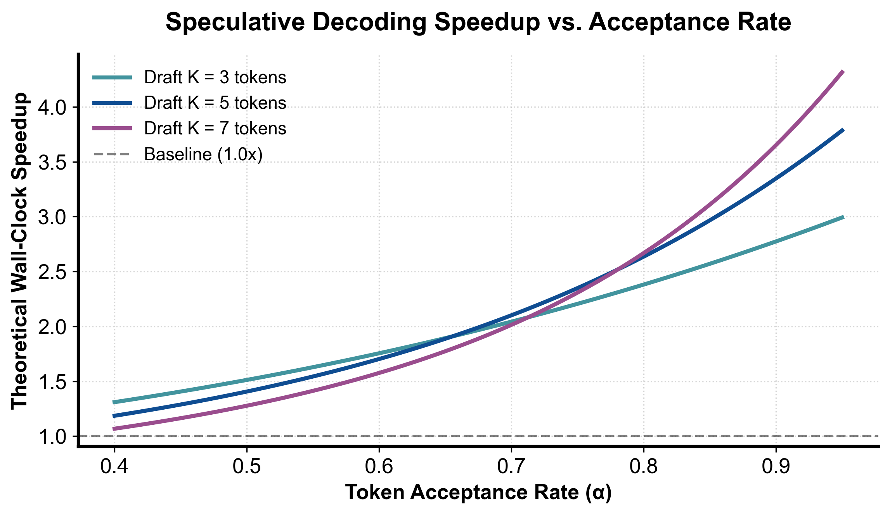

::: {.callout-note appearance="simple"}
**参考答案版**：包含完整代码实现与问答题深度参考解析。建议先独立完成练习题后再展开核对。
:::


## 本课目标与通过标准

本课产出：能推导一般采样下的逐 token 接受概率和 residual distribution，解释 greedy 验证为何只是特例，并从 vLLM rejection sampler 源码追到 sampling parameters。

通过要求：唯一代码填空题通过全部断言；Q1～Q3 都能沿源码对象给出因果链；能指出一个正确性不变量、一个性能边界和一个需要 benchmark 才能确认的结论；总分至少 8/10。

## 源码版本与阅读方法

本课程使用固定 commit 的永久链接保证行号可复现，同时链接 current docs 供核对最新变化。阅读时先画调用图和状态所有权，再进入分支；不要从大文件第一行机械顺读。

阅读路线：

1. 原始 speculative decoding/sampling 论文：先推导单步分布，再看多 token 连续接受。
2. vLLM `v1/worker/gpu/spec_decode/rejection_sampler.py::_verify`：target logits 先经过哪些 sampling params。
3. `rejection_sample` kernel 调用：输入 draft logits/tokens、target logits、temperature/seeds 和位置映射。
4. `__call__`：理解 ragged logits、chunk verification、`num_sampled/num_rejected`。
5. 再回 scheduler：accepted token 数怎样推进 computed/output state，draft tokens 怎样进入下一轮。

源码快照：vLLM `8e958902eee5`。

## 核心概念与运行机制

### 核心操作与执行流程图解

::: {.img-card}
{width="85%"}
<p class="caption">图 7-1：投机采样理论加速比与 Token 接受率 α / 草稿步数关系模型（基于 scientific-figure-making 绘制）</p>
:::

```{mermaid}
flowchart LR
    Eval["比对第 i 个候选 Token"] --> ProbCheck{"生成随机数 u ~ U[0,1] < min(1, p_i / q_i) ?"}
    ProbCheck -->|接受| NextToken["接受候选 x_i，继续校验第 i+1 个 Token"]
    ProbCheck -->|拒绝| Resample["拒绝 x_i，从残差分布 max(0, p - q) 重新采样替代词"]
    Resample --> Truncate["截断后续所有投机 Token 并完成本轮提交"]
```
<p class="caption" align="center"><em>图 7-2：严格数学无偏的投机采样拒绝校正与截断决策树流程</em></p>

### 1. 它是什么，解决什么问题

大语言模型的自回归生成（Autoregressive Decoding）本质上是一种串行工作流：生成第 $t+1$ 个 Token 必须以第 $t$ 个 Token 为输入。在单请求或小并发场景下，巨大的模型权重张量每次前向仅服务 1 个 Token 的计算，导致计算单元（Tensor Cores）长期处于饥饿等待状态，硬件处于极度访存受限（Memory-Bound）。

**投机采样（Speculative Decoding / Sampling）**是一种在**严格数学保证输出分布无损（Distributionally Lossless）**的前提下打破自回归串行依赖的革命性范式：
- **两阶段协作机制**：由一个极小的高速草稿模型（Draft Model，如小规模 LM、EAGLE/Medusa 多头预测器或 n-gram 查找表）以极低时延连续推测生成 $\gamma$ 个候选 Tokens；随后由强大的目标模型（Target Model）仅通过**单次前向批量并行验证（Parallel Verification）**这 $\gamma$ 个候选词的条件概率；
- **打破时延物理下限**：如图 7-1 所示，若候选词接受率 $\alpha$ 足够高，原本需要 $\gamma$ 次串行大模型前向的时间被压缩为“$\gamma$ 次轻量草稿生成 + 1 次目标模型验证”，理论加速比可达到 2~3 倍以上；
- **数学等价性而非经验近似**：投机采样并非牺牲生成质量换取速度的启发式剪枝，通过严格设计的**拒绝采样校正机制（Rejection Sampling Correction）**，其最终输出的离散概率分布与直接使用目标模型逐字采样在数学上具有 100% 的精确一致性。

### 2. 它如何工作

投机采样的正确性基石建立在无偏拒绝采样与因果残差分布重构之上（流程如图 7-2 所示）：

1. **单步无偏接受准则**：
   - 设第 $i$ 步草稿模型的提议分布为 $q(x)$，采出的候选 Token 为 $x \sim q(x)$；
   - 目标模型在相同上下文前缀下计算出的真实分布为 $p(x)$；
   - 生成独立均匀随机数 $u \sim \mathcal{U}(0, 1)$，当且仅当满足下式时**接受**候选词 $x$：
     $$u < \min\left(1, \frac{p(x)}{q(x)}\right)$$
2. **残差分布拒绝校正（Residual Distribution Correction）**：
   - 一旦候选词 $x$ 未通过校验被**拒绝**，系统绝对不能盲目重新从原始目标分布 $p$ 中采样，否则会导致整个序列分布偏向 $q$ 与 $p$ 的交叉重叠区；
   - 算法必须从经严格数学归一化的**正残差分布（Residual Distribution）**中采样替代词 $y$：
     $$r(y) = \frac{\max(0, p(y) - q(y))}{\sum_v \max(0, p(v) - q(v))}$$
3. **多步投机与因果链截断（Multi-Step Verification & Truncation）**：
   - 连续验证草稿序列 $[x_1, x_2, \dots, x_\gamma]$。必须从头按顺序逐词检验：
     - 若前 $k-1$ 个词全部接受，但第 $k$ 个词被拒绝，则从 $r_k$ 中采样纠正词 $x'_k$；
     - **后续的所有投机草稿 $[x_{k+1}, \dots, x_\gamma]$ 必须立即被硬性截断作废**；
     - 本轮向用户提交被接受的有效前缀加上纠正词 $[x_1, \dots, x_{k-1}, x'_k]$；
   - 若全部 $\gamma$ 个词均被完美接受，目标模型的前向验证还可附赠一个额外的 Bonus Token，单轮步进跨度达到 $\gamma + 1$ 个 Tokens。

### 3. 正确性条件与常见误区

- **数学等价性证明（Proof of Exact Equivalence）**：
  - 最终采样出任意词 $y$ 的边缘概率等于“接受路径概率”与“拒绝校正路径概率”之和：
    $$P(y) = q(y) \cdot \min\left(1, \frac{p(y)}{q(y)}\right) + P(\text{reject}) \cdot r(y)$$
  - 接受路径贡献 $\min(p(y), q(y))$；全词表总拒绝概率为：
    $$P(\text{reject}) = 1 - \sum_v \min(p(v), q(v)) = \sum_v \max(0, p(v) - q(v))$$
  - 两项相消后，拒绝路径贡献恰好为 $\max(0, p(y) - q(y))$；
  - 二者相加：
    $$P(y) = \min(p(y), q(y)) + \max(0, p(y) - q(y)) \equiv p(y)$$
    此恒等式证明了投机采样输出分布在全概率空间与 Target 模型绝对无偏。
- **采样参数与 Logits Processor 严格同态不变量**：
  - *常见误区*：直接拿 Target 模型的裸 Logits 计算 $p$，但忘记应用 Temperature、Top-$P$、Top-$K$、Repetition Penalty 或结构化 Grammar 掩码；
  - *正确性要求*：验证器必须将请求的所有采样超参数与约束完全施加在 Target Logits 之上，生成最终的条件概率 $p$。一旦 $p$ 与 $q$ 处于不同的约束流形（例如 Grammar 掩码强制某 Token 概率为 0，而 Draft 却采出了该词），$p(x)/q(x)$ 的比值将引发概率空间未定义错误。
- **“贪心匹配等于分布匹配”的误区**：
  - 贪心解码（Greedy Decoding，即 Temperature=0）下，接受条件退化为简单的 $\text{argmax}(p) == \text{argmax}(q)$。但一旦温度大于 0，绝对不能因为 Draft 词恰好是 Target 的 Argmax 就无条件接受，必须严格遵循随机数拒绝校验。

### 4. 性能与工程取舍

- **理论加速比的临界崩溃面（Speedup Breakdown Threshold）**：
  - 如图 7-1 所示，加速比受平均接受率 $\alpha$、投机步数 $\gamma$ 与相对耗时比 $c = T_{\text{draft}} / T_{\text{target}}$ 共同支配：
    $$\text{Speedup} = \frac{1 - \alpha^{\gamma + 1}}{(1 - \alpha)(\gamma \cdot c + 1)}$$
  - 若在复杂推理任务中 $\alpha$ 跌落至 0.4 以下，或者 Draft 模型耗时比 $c$ 过大，投机采样的加速比将跌破 1.0，导致推理反而比单纯的 Target 单步自回归更慢（负收益）。
- **高并发吞吐 vs. 单请求时延**：
  - 投机采样极度擅长降低单请求端到端时延（Latency）；
  - 然而在超大批处理（High Concurrency / High Throughput）场景下，Target 模型在验证阶段需要执行长为 $\gamma + 1$ 的多 Token 并行 Attention 计算，显存与计算带宽已被完全榨干。此时引入投机采样反而会侵占宝贵的 GPU 算力，导致整机总吞吐（Goodput）发生显著下降。

## 具体演示

设词表仅有 2 个词 $\{0, 1\}$。目标模型分布为 $p = [0.7, 0.3]$，草稿模型提议分布为 $q = [0.4, 0.6]$：
1. **草稿模型提议 Token 1**：
   - 提取概率值：$q(1) = 0.6$，$p(1) = 0.3$；
   - 计算接受概率：$\alpha = \min(1.0, 0.3 / 0.6) = 0.5$；
   - 掷均匀随机数 $u \in [0, 1)$：若 $u < 0.5$ 则接受 Token 1 并完成本步；
   - 若 $u \ge 0.5$，拒绝 Token 1。计算残差分布质量：
     $$\text{mass} = [\max(0.7 - 0.4, 0), \max(0.3 - 0.6, 0)] = [0.3, 0.0]$$
   - 归一化残差分布：$r = [1.0, 0.0]$；
   - 纠正采样：以 100% 概率强制采出 Token 0 替换原候选词。
2. **草稿模型提议 Token 0**：
   - 提取概率值：$q(0) = 0.4$，$p(0) = 0.7$；
   - 接受概率：$\alpha = \min(1.0, 0.7 / 0.4) = 1.0$（必然 100% 接受）。
3. **两路径概率收敛**：
   - Token 0 最终概率：$q(0) \times 1.0 + q(1) \times 0.5 \times 1.0 = 0.4 + 0.3 = 0.7$；
   - Token 1 最终概率：$q(1) \times 0.5 = 0.6 \times 0.5 = 0.3$；
   - 最终边缘分布完全等于 $[0.7, 0.3]$，完美复现 Target 分布。

## 实践任务：唯一代码填空题

补齐单步拒绝采样的接受率与 residual distribution。练习计算分布，不生成随机数。

只能修改 `TODO`/`______` 位置，不得删除断言或放宽通过条件。

```{python}
#| course_role: exercise
def rejection_rule(target_probs, draft_probs, draft_token):
    if len(target_probs) != len(draft_probs) or not target_probs:
        raise ValueError("distribution shapes differ")
    if any(x < 0 for x in target_probs + draft_probs):
        raise ValueError("negative probability")
    if abs(sum(target_probs) - 1.0) > 1e-9 or abs(sum(draft_probs) - 1.0) > 1e-9:
        raise ValueError("distributions must sum to one")
    qx = draft_probs[draft_token]
    if qx <= 0:
        raise ValueError("draft token must have positive proposal mass")

    # TODO：接受概率 min(1,p/q)；拒绝时使用正差 residual。
    accept_probability = ______
    residual_mass = [______ for p, q in zip(target_probs, draft_probs)]
    normalizer = sum(residual_mass)
    residual = ([x / normalizer for x in residual_mass]
                if normalizer else list(target_probs))
    return accept_probability, residual

alpha, residual = rejection_rule([0.7, 0.3], [0.4, 0.6], 1)
assert abs(alpha - 0.5) < 1e-12
assert residual == [1.0, 0.0]
assert rejection_rule([0.7, 0.3], [0.4, 0.6], 0)[0] == 1.0
```

### 检查方法

运行断言；手算接受/拒绝两条路径重构 target distribution。再测试 `p==q`，解释 residual fallback 为什么不可达。

### Q1

请证明单步拒绝校正后的输出分布等于 target p。

**你的答案：**

### Q2

为什么 repetition penalty、top-p 或 grammar mask 必须在 draft/target verification 中保持一致？

**你的答案：**

### Q3

为什么第一处拒绝之后不能继续接受后面碰巧相同的 draft token？

**你的答案：**

## 评分规则

- 代码 4 分：主路径 2 分、边界条件 1 分、能映射回源码对象 1 分；
- Q1～Q3 各 2 分：必须包含对象、状态变化、正确性或成本链；
- 一票否决：把论文峰值写成普遍生产结论；把源码支持写成所有模型/硬件可用；混淆算法正确性与性能；只背类名而说不清状态所有权。


::: {.callout-tip collapse="true" title="💡 点击展开参考答案与详细代码实现" icon="false"}
## 参考答案（仅 answer 分支）

先独立完成。核对后请更换一个 batch、cache 或硬件条件重新推演，不能只复制。

```{python}
#| course_role: solution
def rejection_rule(target_probs, draft_probs, draft_token):
    if len(target_probs) != len(draft_probs) or not target_probs:
        raise ValueError("distribution shapes differ")
    if any(x < 0 for x in target_probs + draft_probs):
        raise ValueError("negative probability")
    if abs(sum(target_probs) - 1.0) > 1e-9 or abs(sum(draft_probs) - 1.0) > 1e-9:
        raise ValueError("distributions must sum to one")
    qx = draft_probs[draft_token]
    if qx <= 0:
        raise ValueError("draft token must have positive proposal mass")

    accept_probability = min(1.0, target_probs[draft_token] / qx)
    residual_mass = [max(p - q, 0.0) for p, q in zip(target_probs, draft_probs)]
    normalizer = sum(residual_mass)
    residual = ([x / normalizer for x in residual_mass]
                if normalizer else list(target_probs))
    return accept_probability, residual

alpha, residual = rejection_rule([0.7, 0.3], [0.4, 0.6], 1)
assert abs(alpha - 0.5) < 1e-12
assert residual == [1.0, 0.0]
assert rejection_rule([0.7, 0.3], [0.4, 0.6], 0)[0] == 1.0
```

### Q1 参考答案

投机采样的无偏性（Lossless Distributional Equivalence）可以通过全概率公式展开严格证明：
1. **定义概率空间与提议过程**：设词表为 $\mathcal{V}$，草稿模型提议分布为 $q$，目标模型验证分布为 $p$。对于采样出的候选词 $x \sim q$，接受准则定义为：
   $$\alpha(x) = \min\left(1, \frac{p(x)}{q(x)}\right)$$
2. **计算接受路径的边缘概率贡献**：对于词表中的任意给定 Token $y \in \mathcal{V}$，它作为候选词被提出且被接受的概率为：
   $$P_{\text{accept}}(y) = q(y) \cdot \alpha(y) = q(y) \cdot \min\left(1, \frac{p(y)}{q(y)}\right) = \min(p(y), q(y))$$
3. **计算全词表总拒绝概率**：全词表总接受概率为 $P_{\text{acc\_total}} = \sum_{v \in \mathcal{V}} \min(p(v), q(v))$。因此总拒绝概率为：
   $$P_{\text{reject}} = 1 - \sum_{v \in \mathcal{V}} \min(p(v), q(v)) = \sum_{v \in \mathcal{V}} p(v) - \sum_{v \in \mathcal{V}} \min(p(v), q(v)) = \sum_{v \in \mathcal{V}} \max(0, p(v) - q(v))$$
4. **计算拒绝校正路径的边缘概率贡献**：一旦拒绝，算法从正残差分布中采样：
   $$r(y) = \frac{\max(0, p(y) - q(y))}{\sum_{v \in \mathcal{V}} \max(0, p(v) - q(v))} = \frac{\max(0, p(y) - q(y))}{P_{\text{reject}}}$$
   因此在拒绝路径下最终输出 $y$ 的联合概率为：
   $$P_{\text{reject\_sample}}(y) = P_{\text{reject}} \cdot r(y) = P_{\text{reject}} \cdot \frac{\max(0, p(y) - q(y))}{P_{\text{reject}}} = \max(0, p(y) - q(y))$$
5. **综合全概率恒等式**：将接受路径与拒绝校正路径相加：
   $$P_{\text{final}}(y) = P_{\text{accept}}(y) + P_{\text{reject\_sample}}(y) = \min(p(y), q(y)) + \max(0, p(y) - q(y)) \equiv p(y)$$
   证毕。对于词表中任何元素，输出概率精确恒等于目标分布 $p(y)$，数学上绝对无偏。

### Q2 参考答案

Logits 处理器（Temperature、Top-$P$、Top-$K$、Repetition Penalty）与结构化约束（Regex/CFG Grammar Mask）在验证器中必须与目标请求保持严格同态：
1. **条件概率空间的同构性前提**：上述数学无偏证明的前提是目标分布 $p$ 与草稿分布 $q$ 映射在完全相同的离散概率空间。如果 Target 使用了经过温度缩放、Top-$P$ 截断和重复惩罚重构后的概率，而验证器使用的却是原始未处理的 Logits，则公式中的 $p(x)/q(x)$ 失去概率测度意义，残差分布 $r(y)$ 也将无法归一化；
2. **语法硬约束的边界击穿**：若用户启用了结构化输出（JSON Schema），Grammar Mask 会将所有不合语法的 Token 概率强制抹平为 0（$p(x) = 0$）。若验证器未严格注入 Grammar 掩码，残差重采样可能再次选出破坏语法的非法 Token；若 Draft 强行过滤了非法词导致 $q(x)=0$，而 Target 却未过滤导致 $p(x)>0$，则会导致除以零未定义异常；
3. **高并发批处理状态隔离**：在 vLLM `RejectionSampler` 的 GPU 实现中，多个并发请求被打包进 Ragged Tensor 统一验证。每个请求持有独立的温度、惩罚状态与随机种子。若请求状态映射错位，会导致跨请求的采样污染与不可复现的玄学 Bug。

### Q3 参考答案

自回归生成的根本数学定义是马尔可夫链式条件概率分解：
$$P(x_1, x_2, \dots, x_\gamma) = P(x_1) \prod_{i=2}^\gamma P(x_i \mid x_1, \dots, x_{i-1})$$
1. **因果条件前缀的彻底断裂**：第 $k$ 步之后的任何后续候选词 $x_j$（$j > k$），其在草稿模型中的提议分布完全是以先前生成的投机序列 $[x_1, \dots, x_k]$ 为历史前缀的，即 $q(x_j \mid x_{<j})$。当第 $k$ 步被拒绝并被替代为修正词 $x'_k$（$x'_k \neq x_k$）后，真实的上下文历史已经永久改写为 $[x_1, \dots, x_{k-1}, x'_k]$。后续草稿词所依赖的“前置因果条件”已不复存在；
2. **符号偶然相等的伪相关**：即便第 $k+1$ 个候选词在字符串符号上恰好等于 Target 模型在新前缀下的最高概率词，它也只是无因果支撑的巧合，绝不代表正确的条件概率分布。若越过拒绝点继续接受，将违背全概率证明，导致生成的自回归分布严重畸变；
3. **KV Cache 显存状态的原子回滚**：在 GPU 底层，Target 模型为了批量并行验证，在 Paged KV Cache 中为草稿词预分配了连续的设备槽位。一旦第 $k$ 步被拒，其后所有槽位记录的 Key-Value 浮点张量均是在错误上下文下的脏数据，调度器必须立即触发显存状态回滚（Rollback/Rewind），截断并释放后续槽位，重置有效序列长度。

## 参考资料

- [Speculative decoding original paper](https://arxiv.org/abs/2211.17192)
- [vLLM RejectionSampler source](https://github.com/vllm-project/vllm/blob/8e958902eee56ca5158728f1dd5a32246f0246f3/vllm/v1/worker/gpu/spec_decode/rejection_sampler.py#L70-L274)
- [vLLM speculative decoding docs](https://docs.vllm.ai/en/latest/features/spec_decode/)
- [Speculative decoding performance study](https://arxiv.org/abs/2601.11580)

源码链接固定到本课审阅 commit；current docs、支持矩阵和默认参数会变化，面试或部署前必须按目标版本重新核对。
:::
