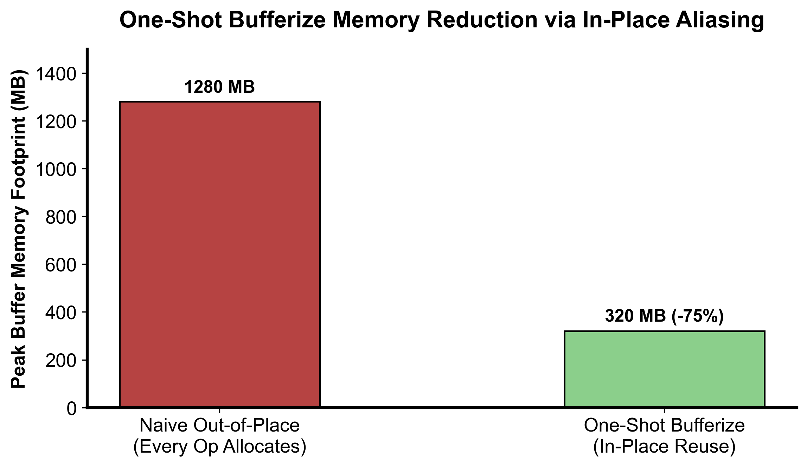
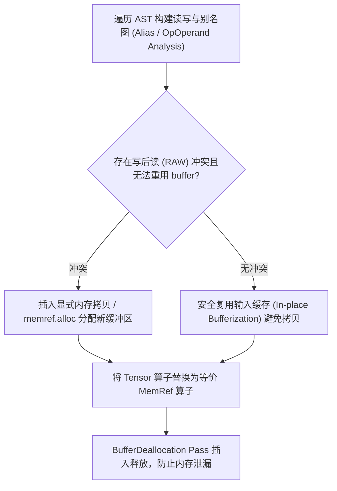

::: {.callout-note appearance="simple"}
**参考答案版**：包含完整代码实现与问答题深度参考解析。建议先独立完成练习题后再展开核对。
:::


## 本课目标与完成标准

学完后你应能：解释 tensor value semantics 到 buffer reference semantics 的变化，识别 in-place 冲突。

通过必须同时满足：

- 独立补齐本课唯一的代码填空题，并通过给定检查；
- 三个问答题均说明因果链，而不是只报术语；
- 能指出至少一个正确性边界和一个性能取舍；
- 总分不低于 8/10，且没有一票否决级概念错误。

## 前置关系

- 课程前置：编译原理基础、C++ 阅读能力
- 本课在路线中的作用：Bufferization 为 tensor SSA 值选择 memref 存储；One-Shot Bufferize 通过读写与别名分析决定复用还是分配。

## 核心心智模型


### 核心操作与执行流程图解

::: {.img-card}
{width="85%"}
<p class="caption">图 6-1：One-Shot Bufferize 原地复用别名对峰值显存占用的削减（基于 scientific-figure-making 绘制）</p>
:::


<p class="caption" align="center"><em>图 6-2：One-Shot Bufferize 原地复用别名判定与内存分配下发流程</em></p>


### 核心操作与执行流程图解

::: {.img-card}
{width="85%"}
<p class="caption">图 6-1：One-Shot Bufferize 原地复用别名对峰值显存占用的削减（基于 scientific-figure-making 绘制）</p>
:::

```{mermaid}
flowchart TD
    Analyze["遍历 AST 构建读写与别名图 (Alias / OpOperand Analysis)"] --> Detect{"存在写后读 (RAW) 冲突且无法重用 buffer?"}
    Detect -->|冲突| Alloc["插入显式内存拷贝 / memref.alloc 分配新缓冲区"]
    Detect -->|无冲突| InPlace["安全复用输入缓存 (In-place Bufferization) 避免拷贝"]
    Alloc & InPlace --> RewriteOps["将 Tensor 算子替换为等价 MemRef 算子"]
    RewriteOps --> Dealloc["BufferDeallocation Pass 插入释放，防止内存泄漏"]
```
<p class="caption" align="center"><em>图 6-2：One-Shot Bufferize 原地复用别名判定与内存分配下发流程</em></p>


### 1. 它是什么，解决什么问题

Bufferization 为 tensor SSA 值选择 memref 存储；One-Shot Bufferize 通过读写与别名分析决定复用还是分配。

### 2. 它如何工作

若后续仍需旧 tensor 值，而某 op 会原地写同一 buffer，就存在 RaW conflict，必须 out-of-place 或复制。

### 3. 正确性条件与常见误区

tensor 是不可变值语义，memref 有可变别名；错误 in-place 会让旧 SSA 值观察到新内容，违反原 IR。

### 4. 性能与工程取舍

in-place 少分配/拷贝但受别名限制；destination-passing style 能显式提供可复用输出并提高成功率。

## 具体演示

`%b=tensor.insert ... into %a` 后若 `%a` 仍被读取，%a/%b 不能无条件共享同一可写 buffer。

请在阅读后先合上这一节，用自己的语言复述“输入状态 → 中间状态 → 输出状态”，再做练习。

## 实践任务：唯一代码填空题

补齐最小 RaW 冲突判定。

规则：只能修改 `TODO`/`______` 所在位置；不要删除断言或放宽误差。代码注释说明了每个边界条件。

```{python}
#| course_role: exercise
def needs_copy(writes_buffer, old_value_used_after_write, proven_no_alias):
    """教学模型：无法证明无别名且旧值后用时，写会要求 copy。"""
    # TODO：只补齐下面这个表达式。
    return ______

assert needs_copy(True,True,False)
assert not needs_copy(True,False,False)
assert not needs_copy(True,True,True)
```

### 检查方法

运行本单元格；所有 `assert` 必须通过。另手工构造一个边界输入，解释预期结果。

提交时请给出：补齐后的代码、实际运行输出（环境不可用时注明“仅静态审查”）以及对失败用例的解释。

### Q1

不要背定义：请从输入、状态变化和输出三个阶段解释“Tensor→MemRef Bufferization 与别名”的工作机制。

**你的答案：**

### Q2

为什么“SSA 值只赋值一次”不能自动保证 memref 无别名？

**你的答案：**

### Q3

如何用 destination-style op 提高 in-place bufferization 机会？

**你的答案：**

## 评分与通过规则

- 代码 4 分：正常输入 2 分，边界输入 1 分，解释实现 1 分；
- Q1～Q3 各 2 分；
- 一票否决：结果碰巧正确但核心因果链错误、删除边界检查、把未运行结果说成实测。

需要提示时按四级机制请求：概念区域 → 具体方向 → 关键局部 → 完整答案。


::: {.callout-tip collapse="true" title="💡 点击展开参考答案与详细代码实现" icon="false"}
## 参考答案（仅 answer 分支）

先完成题目再核对。即使代码一致，也要能解释关键步骤，并尝试更换一个输入规模。

```{python}
#| course_role: solution
def needs_copy(writes_buffer, old_value_used_after_write, proven_no_alias):
    """教学模型：无法证明无别名且旧值后用时，写会要求 copy。"""
    # 参考实现：表达式直接对应上文不变量。
    return writes_buffer and old_value_used_after_write and not proven_no_alias

assert needs_copy(True,True,False)
assert not needs_copy(True,False,False)
assert not needs_copy(True,True,True)
```

### Q1 参考答案

若后续仍需旧 tensor 值，而某 op 会原地写同一 buffer，就存在 RaW conflict，必须 out-of-place 或复制。

### Q2 参考答案

判断时先检查本课不变量：tensor 是不可变值语义，memref 有可变别名；错误 in-place 会让旧 SSA 值观察到新内容，违反原 IR。  若不成立，最终数值或系统状态即使暂时正常也不可信。

### Q3 参考答案

迁移时先保证正确性，再比较代价。这里的核心取舍是：in-place 少分配/拷贝但受别名限制；destination-passing style 能显式提供可复用输出并提高成功率。

## 参考资料

- [One-Shot Bufferize](https://mlir.llvm.org/docs/Bufferization/)

资料用于建立事实基线；面试回答仍需用自己的语言组织。
:::
