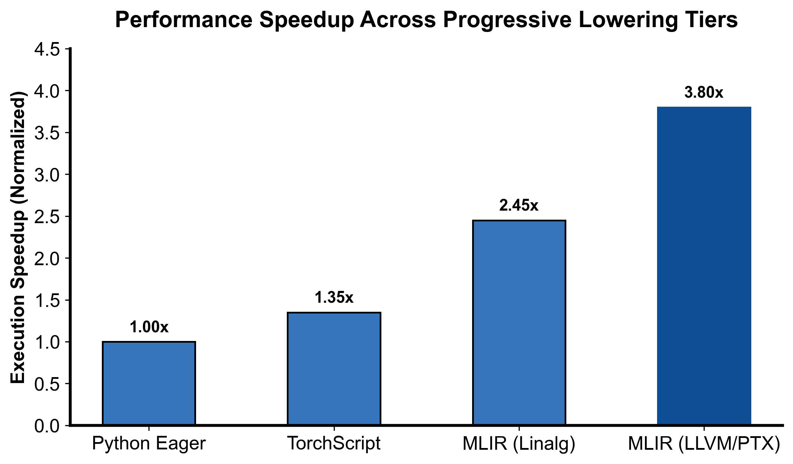
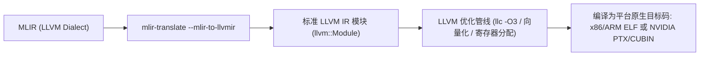

::: {.callout-note appearance="simple"}
**参考答案版**：包含完整代码实现与问答题深度参考解析。建议先独立完成练习题后再展开核对。
:::


## 本课目标与完成标准

学完后你应能：设计高层→linalg/scf→cf/memref→LLVM 的 lowering pipeline，并区分 LLVM dialect 与 LLVM IR。

通过必须同时满足：

- 独立补齐本课唯一的代码填空题，并通过给定检查；
- 三个问答题均说明因果链，而不是只报术语；
- 能指出至少一个正确性边界和一个性能取舍；
- 总分不低于 8/10，且没有一票否决级概念错误。

## 前置关系

- 课程前置：编译原理基础、C++ 阅读能力
- 本课在路线中的作用：MLIR 通常保留多层 IR：高层语义先变为结构化计算，再降控制流/内存，最后到 LLVM dialect 并翻译成 LLVM IR。

## 核心心智模型


### 核心操作与执行流程图解

::: {.img-card}
{width="85%"}
<p class="caption">图 7-1：MLIR 渐进式多级降低与代码生成阶段性能加速比（基于 scientific-figure-making 绘制）</p>
:::


<p class="caption" align="center"><em>图 7-2：从 LLVM Dialect 到底层硬件二进制目标代码的翻译运行流程</em></p>


### 核心操作与执行流程图解

::: {.img-card}
{width="85%"}
<p class="caption">图 7-1：MLIR 渐进式多级降低与代码生成阶段性能加速比（基于 scientific-figure-making 绘制）</p>
:::

```{mermaid}
flowchart LR
    MLIR["MLIR (LLVM Dialect)"] --> MLIRTrans["mlir-translate --mlir-to-llvmir"]
    MLIRTrans --> LLVMIR["标准 LLVM IR 模块 (llvm::Module)"]
    LLVMIR --> Opt["LLVM 优化管线 (llc -O3 / 向量化 / 寄存器分配)"]
    Opt --> Target["编译为平台原生目标码: x86/ARM ELF 或 NVIDIA PTX/CUBIN"]
```
<p class="caption" align="center"><em>图 7-2：从 LLVM Dialect 到底层硬件二进制目标代码的翻译运行流程</em></p>


### 1. 它是什么，解决什么问题

MLIR 通常保留多层 IR：高层语义先变为结构化计算，再降控制流/内存，最后到 LLVM dialect 并翻译成 LLVM IR。

### 2. 它如何工作

每阶段只消除一类抽象并保留可验证接口；`convert-func-to-llvm`、`convert-arith-to-llvm` 等需要类型和依赖 dialect 已准备好。

### 3. 正确性条件与常见误区

pass 顺序是前置条件图，不是随意列表；LLVM dialect 仍是 MLIR operation，尚未等于 `.ll` 文本或机器码。

### 4. 性能与工程取舍

早降 LLVM 兼容性强但失去 tensor/loop 语义；晚降保留优化机会却需要更多 dialect 支持。

## 具体演示

`arith.addi` 可降成 `llvm.add`；若 operand 还是未转换的 index/tensor，转换会失败或需 materialization。

请在阅读后先合上这一节，用自己的语言复述“输入状态 → 中间状态 → 输出状态”，再做练习。

## 实践任务：唯一代码填空题

补齐 LLVM dialect 的整数加法与返回。

规则：只能修改 `TODO`/`______` 所在位置；不要删除断言或放宽误差。代码注释说明了每个边界条件。

```{python}
#| course_role: exercise
%%writefile /tmp/lesson07.mlir
module {
  llvm.func @add(%a: i32, %b: i32) -> i32 {
    %sum = ______ %a, %b : i32
    ______ %sum : i32
  }
}
```

### 检查方法

用 `mlir-opt` 验证，再用 `mlir-translate --mlir-to-llvmir` 检查得到 LLVM IR；无工具时标记待验证。

提交时请给出：补齐后的代码、实际运行输出（环境不可用时注明“仅静态审查”）以及对失败用例的解释。

### Q1

不要背定义：请从输入、状态变化和输出三个阶段解释“逐级 Lowering 到 LLVM Dialect”的工作机制。

**你的答案：**

### Q2

为什么看到 `llvm.*` op 还不能声称已经生成机器码？

**你的答案：**

### Q3

若目标是 GPU/NVVM，应在哪一层分叉 pipeline？

**你的答案：**

## 评分与通过规则

- 代码 4 分：正常输入 2 分，边界输入 1 分，解释实现 1 分；
- Q1～Q3 各 2 分；
- 一票否决：结果碰巧正确但核心因果链错误、删除边界检查、把未运行结果说成实测。

需要提示时按四级机制请求：概念区域 → 具体方向 → 关键局部 → 完整答案。


::: {.callout-tip collapse="true" title="💡 点击展开参考答案与详细代码实现" icon="false"}
## 参考答案（仅 answer 分支）

先完成题目再核对。即使代码一致，也要能解释关键步骤，并尝试更换一个输入规模。

```{python}
#| course_role: solution
%%writefile /tmp/lesson07.mlir
module {
  llvm.func @add(%a: i32, %b: i32) -> i32 {
    %sum = llvm.add %a, %b : i32
    llvm.return %sum : i32
  }
}
```

### Q1 参考答案

每阶段只消除一类抽象并保留可验证接口；`convert-func-to-llvm`、`convert-arith-to-llvm` 等需要类型和依赖 dialect 已准备好。

### Q2 参考答案

判断时先检查本课不变量：pass 顺序是前置条件图，不是随意列表；LLVM dialect 仍是 MLIR operation，尚未等于 `.ll` 文本或机器码。  若不成立，最终数值或系统状态即使暂时正常也不可信。

### Q3 参考答案

迁移时先保证正确性，再比较代价。这里的核心取舍是：早降 LLVM 兼容性强但失去 tensor/loop 语义；晚降保留优化机会却需要更多 dialect 支持。

## 参考资料

- [MLIR Toy Tutorial](https://mlir.llvm.org/docs/Tutorials/Toy/)
- [Dialect Conversion](https://mlir.llvm.org/docs/DialectConversion/)
- [LLVM Dialect](https://mlir.llvm.org/docs/Dialects/LLVM/)

资料用于建立事实基线；面试回答仍需用自己的语言组织。
:::
