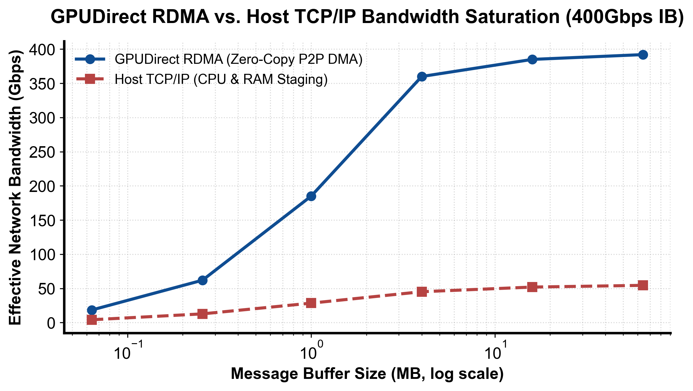

::: {.callout-note appearance="simple"}
**参考答案版**：包含完整代码实现与问答题深度参考解析。建议先独立完成练习题后再展开核对。
:::


## 本课目标与完成标准

本课产出：计算考虑协议效率和 oversubscription 的消息时间，并解释零拷贝成立的完整条件。

通过要求：唯一代码填空题通过给定检查；Q1～Q3 都给出因果链；能指出一个正确性边界和一个性能/运营取舍；总分至少 8/10。

## 与既有六条主线的边界

`runtime/lesson04` 建模 collective；本课展开其下方网络：HCA/NIC、RDMA verbs、lossless fabric、拥塞与 GPU Direct。

前置：Linux/网络基础、runtime 补充线、train 分布式章节。本课只补 AI Infra 缺口，不重复已经完成的 kernel 或并行算法推导。

## 核心心智模型


### 核心操作与执行流程图解

::: {.img-card}
{width="85%"}
<p class="caption">图 2-1：GPUDirect RDMA 与传统 Host TCP/IP 网络吞吐与带宽饱和对比（基于 scientific-figure-making 绘制）</p>
:::

```{mermaid}
flowchart TD
    Setup["初始化 InfiniBand 设备与上下文"] --> RegMR["注册内存区域 (ibv_reg_mr 锁定物理页)"]
    RegMR --> CreateQP["创建发送/接收队列对 (Queue Pair: QP)"]
    CreateQP --> Exchange["带外通信 (TCP) 交换 QP 元数据并进入 RTS 状态"]
    Exchange --> PostSend["下发异步传输请求 (ibv_post_send / RDMA Write)"]
    PostSend --> PollCQ["网卡硬件自主搬运并轮询完成队列 (ibv_poll_cq)"]
```
<p class="caption" align="center"><em>图 2-2：RDMA 队列对 (QP) 建立、内存注册与硬件自驱动传输流水线</em></p>


### 它是什么、解决什么问题

RDMA 让 NIC 直接访问注册内存，减少 CPU 数据拷贝；GPUDirect RDMA 进一步让 GPU memory 与 NIC DMA。InfiniBand 与 RoCE 都可承载，但控制平面和拥塞管理不同。

### 数据与控制如何流动

通信库注册 GPU virtual address 并建立 queue pair/连接，发送端 NIC 经 PCIe 读取 GPU memory，交换网络转发，接收端 NIC 直接 DMA 到目标 GPU；完成事件再与 CUDA stream 建立可见性。

### 正确性条件与常见误区

“支持 RDMA”不等于实际走 GPU direct：需 GPU/NIC 拓扑、驱动、DMA-BUF 或 peer-memory、内存注册和通信库支持。RoCE 还依赖正确的无损/拥塞配置。

### 性能、成本与工程取舍

更高链路速率只有在 endpoint 注入、PCIe、交换网络和协议效率都跟上时才有效；多作业 oversubscription 会降低每流有效带宽并放大尾延迟。

## 具体演示

400 Gb/s 链路理论 50 GB/s；效率 80%、2:1 oversub 后每流约 20 GB/s。传 4 GB 数据仅带宽项约 0.2s，另加软件/网络延迟。

请先独立复述“输入 → 状态变化 → 输出/指标”，再开始填空。

## 实践任务：唯一代码填空题

补齐网络消息时间；link_gbps 是 bit/s 标称值。

只能修改 `TODO`/`______` 位置，不得删除断言或放宽通过条件。

```{python}
#| course_role: exercise
def message_time_s(nbytes, link_gbps, efficiency=1.0,
                   oversubscription=1.0, latency_s=0.0):
    if nbytes < 0 or link_gbps <= 0 or not 0 < efficiency <= 1 or oversubscription < 1 or latency_s < 0:
        raise ValueError("invalid network model")
    effective_Bps = link_gbps * 1e9 / 8 * efficiency / oversubscription
    # TODO：总时间 = 固定延迟 + 传输字节/有效带宽。
    return ______

assert abs(message_time_s(4e9, 400, 0.8, 2, 5e-6) - 0.200005) < 1e-12
```

### 检查方法

运行本单元格，所有断言必须通过；再补一个边界输入并解释预期。

### Q1

RDMA、GPUDirect RDMA 和 NCCL 三者分别在哪一层？

**你的答案：**

### Q2

RoCE 网络平均带宽正常但 p99 collective 抖动，优先查什么？

**你的答案：**

### Q3

为什么内存注册缓存既提升性能又带来风险？

**你的答案：**

## 评分规则

- 代码 4 分：正常输入 2 分、边界输入 1 分、解释 1 分；
- Q1～Q3 各 2 分；
- 一票否决：混淆测量与推测、忽略租户/请求隔离、用平均值掩盖尾延迟、删除失败路径。


::: {.callout-tip collapse="true" title="💡 点击展开参考答案与详细代码实现" icon="false"}
## 参考答案（仅 answer 分支）

先独立完成。核对后请改变一个规模或故障条件重新推演。

```{python}
#| course_role: solution
def message_time_s(nbytes, link_gbps, efficiency=1.0,
                   oversubscription=1.0, latency_s=0.0):
    if nbytes < 0 or link_gbps <= 0 or not 0 < efficiency <= 1 or oversubscription < 1 or latency_s < 0:
        raise ValueError("invalid network model")
    effective_Bps = link_gbps * 1e9 / 8 * efficiency / oversubscription
    return latency_s + nbytes / effective_Bps

assert abs(message_time_s(4e9, 400, 0.8, 2, 5e-6) - 0.200005) < 1e-12
```

### Q1 参考答案

RDMA 是 NIC 对注册内存的远程直接访问能力；GPUDirect RDMA 让注册目标可直接是 GPU memory；NCCL 是上层 collective 库，选择网络插件/路径并编排 GPU 间通信。它们不是同义词。

### Q2 参考答案

查 PFC/ECN、拥塞和热点、丢包/重传计数、QoS/traffic class、路由/rail、NIC 队列与共享租户流量；再核对 GPU-NIC 绑定。平均吞吐会掩盖 microburst。

### Q3 参考答案

避免每次 pin/register 的高开销，但必须与 GPU virtual address 生命周期同步；内存释放/重映射后缓存失效若处理错误，会 DMA 到无效地址或数据损坏。

## 参考资料

- [GPUDirect RDMA](https://docs.nvidia.com/cuda/gpudirect-rdma/index.html)
- [NCCL User Guide](https://docs.nvidia.com/deeplearning/nccl/user-guide/index.html)

API 与平台能力会演进；部署前应按目标版本重新核对。
:::
