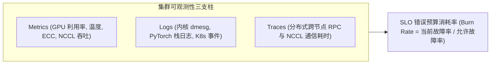

::: {.callout-note appearance="simple"}
**参考答案版**：包含完整代码实现与问答题深度参考解析。建议先独立完成练习题后再展开核对。
:::


## 本课目标与完成标准

本课产出：实现错误预算 burn rate，并设计从服务症状下钻到 GPU/网络/存储根因的观测链。

通过要求：唯一代码填空题通过给定检查；Q1～Q3 都给出因果链；能指出一个正确性边界和一个性能/运营取舍；总分至少 8/10。

## 与既有六条主线的边界

`inference/lesson08` 定义服务 SLO；本课关注平台如何持续观测和告警，而不是离线 benchmark。

前置：Linux/网络基础、runtime 补充线、train 分布式章节。本课只补 AI Infra 缺口，不重复已经完成的 kernel 或并行算法推导。

## 核心心智模型


### 核心操作与执行流程图解


<p class="caption" align="center"><em>图 7-1：集群立体化监控度量与 SLO 错误预算 (Burn Rate) 监控模型</em></p>

```mermaid
flowchart TD
    MetricStream["时序指标持续采集 (Prometheus + DCGM-Exporter)"] --> EvalWindow["多窗口联合评估: 1小时消耗率 > 14.4x 或 6小时 > 6x"]
    EvalWindow --> Spike{"是否发生急剧突发严重故障?"}
    Spike -->|是 (高 Burn Rate)| P1Alert["触发 P1 紧急告警，直接呼叫值班并启动自动下线隔离"]
    Spike -->|否 (慢速漂移)| P3Ticket["创建 P3 低优先级工单排查慢掉队节点"]
    P1Alert --> HotMigration["触发作业热迁移与断点恢复自愈"]
```
<p class="caption" align="center"><em>图 7-2：多窗口 SLO 消耗率告警分级判定与自动化应急响应流程</em></p>


### 核心操作与执行流程图解

```{mermaid}
flowchart LR
    subgraph Telemetry["集群可观测性三支柱"]
        M["Metrics (GPU 利用率, 温度, ECC, NCCL 吞吐)"]
        L["Logs (内核 dmesg, PyTorch 栈日志, K8s 事件)"]
        T["Traces (分布式跨节点 RPC 与 NCCL 通信耗时)"]
    end
    Telemetry --> BurnRate["SLO 错误预算消耗率 (Burn Rate = 当前故障率 / 允许故障率)"]
```
<p class="caption" align="center"><em>图 7-1：集群立体化监控度量与 SLO 错误预算 (Burn Rate) 监控模型</em></p>

```{mermaid}
flowchart TD
    MetricStream["时序指标持续采集 (Prometheus + DCGM-Exporter)"] --> EvalWindow["多窗口联合评估: 1小时消耗率 > 14.4x 或 6小时 > 6x"]
    EvalWindow --> Spike{"是否发生急剧突发严重故障?"}
    Spike -->|是 (高 Burn Rate)| P1Alert["触发 P1 紧急告警，直接呼叫值班并启动自动下线隔离"]
    Spike -->|否 (慢速漂移)| P3Ticket["创建 P3 低优先级工单排查慢掉队节点"]
    P1Alert --> HotMigration["触发作业热迁移与断点恢复自愈"]
```
<p class="caption" align="center"><em>图 7-2：多窗口 SLO 消耗率告警分级判定与自动化应急响应流程</em></p>


### 它是什么、解决什么问题

Metrics 聚合趋势，logs 记录离散事件，traces 连接跨服务请求。SLO error budget 是允许失败比例；burn rate=当前坏事件比例/预算比例。

### 数据与控制如何流动

入口为请求生成 trace/request ID，服务与调度层传播 context，GPU/网络/存储导出资源指标；告警先由用户可见 SLI 触发，再用 trace 关联日志和基础设施时间线下钻根因。

### 正确性条件与常见误区

告警应基于用户可见 SLI，并用短/长窗口同时控制响应速度和噪声。高 cardinality labels、丢日志和采样偏差会让观测系统本身失真。

### 性能、成本与工程取舍

更细粒度遥测便于定位却增加成本和扰动；只看 GPU utilization 便宜但无法区分排队、通信、数据或错误重试。

## 具体演示

SLO=99.9%，预算=0.1%。若 1 小时错误率 1%，burn=10：按此速度一个 30 天预算约 3 天耗尽。

请先独立复述“输入 → 状态变化 → 输出/指标”，再开始填空。

## 实践任务：唯一代码填空题

补齐 burn rate，并拒绝没有错误预算的 100% SLO。

只能修改 `TODO`/`______` 位置，不得删除断言或放宽通过条件。

```{python}
#| course_role: exercise
def burn_rate(bad_events, total_events, slo_target):
    if total_events <= 0 or bad_events < 0 or bad_events > total_events or not 0 < slo_target < 1:
        raise ValueError("invalid SLO window")
    observed_bad = bad_events / total_events
    error_budget = 1 - slo_target
    # TODO：当前坏事件比例消耗预算的倍速。
    return ______

assert abs(burn_rate(100, 10_000, 0.999) - 10.0) < 1e-9
assert burn_rate(0, 10_000, 0.999) == 0
```

### 检查方法

运行本单元格，所有断言必须通过；再补一个边界输入并解释预期。

### Q1

为什么 GPU utilization=100% 可能是坏消息也可能是好消息？

**你的答案：**

### Q2

短窗口 burn 高、长窗口正常时是否立即 page？

**你的答案：**

### Q3

trace 采样只保留成功请求，会造成什么诊断盲区？

**你的答案：**

## 评分规则

- 代码 4 分：正常输入 2 分、边界输入 1 分、解释 1 分；
- Q1～Q3 各 2 分；
- 一票否决：混淆测量与推测、忽略租户/请求隔离、用平均值掩盖尾延迟、删除失败路径。


::: {.callout-tip collapse="true" title="💡 点击展开参考答案与详细代码实现" icon="false"}
## 参考答案（仅 answer 分支）

先独立完成。核对后请改变一个规模或故障条件重新推演。

```{python}
#| course_role: solution
def burn_rate(bad_events, total_events, slo_target):
    if total_events <= 0 or bad_events < 0 or bad_events > total_events or not 0 < slo_target < 1:
        raise ValueError("invalid SLO window")
    observed_bad = bad_events / total_events
    error_budget = 1 - slo_target
    return observed_bad / error_budget

assert abs(burn_rate(100, 10_000, 0.999) - 10.0) < 1e-9
assert burn_rate(0, 10_000, 0.999) == 0
```

### Q1 参考答案

可能是有效模型计算充分利用，也可能是重算、错误重试、低优先级挤占或 kernel 卡在低吞吐。必须结合 goodput、SLO、功耗、kernel/通信和队列。

### Q2 参考答案

取决于告警策略和影响。多窗口多 burn-rate 通常要求短窗口检测快速故障、长窗口确认持续预算消耗；极端故障可单独快速告警，避免瞬时噪声。

### Q3 参考答案

失败/超时和尾延迟路径恰好被丢失，trace 看起来健康。应做 tail/error-based sampling，并确保请求 ID 在日志/指标中可关联，同时控制敏感数据。

## 参考资料

- [Google SRE Workbook: Alerting on SLOs](https://sre.google/workbook/alerting-on-slos/)
- [OpenTelemetry documentation](https://opentelemetry.io/docs/)

API 与平台能力会演进；部署前应按目标版本重新核对。
:::
