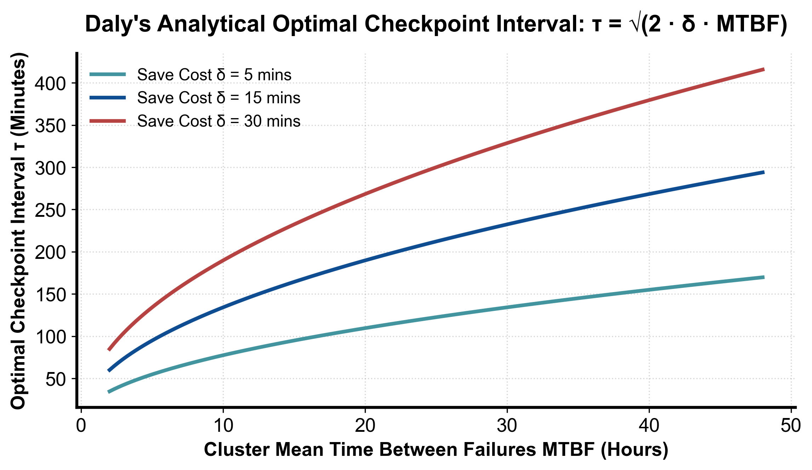

::: {.callout-note appearance="simple"}
**参考答案版**：包含完整代码实现与问答题深度参考解析。建议先独立完成练习题后再展开核对。
:::


## 本课目标与完成标准

本课产出：计算 Young 近似 checkpoint 间隔，并给出检测、隔离、恢复、复盘的端到端事故方案。

通过要求：唯一代码填空题通过给定检查；Q1～Q3 都给出因果链；能指出一个正确性边界和一个性能/运营取舍；总分至少 8/10。

## 与既有六条主线的边界

`rl/lesson12` 和 `train/` 提到 checkpoint；本课从平台 MTBF、恢复风暴、租户隔离和运营成本收束全套课程。

前置：Linux/网络基础、runtime 补充线、train 分布式章节。本课只补 AI Infra 缺口，不重复已经完成的 kernel 或并行算法推导。

## 核心心智模型


### 核心操作与执行流程图解

::: {.img-card}
{width="85%"}
<p class="caption">图 8-1：万卡集群 MTBF 故障率与 Daly 最优 Checkpoint 周期曲线模型（基于 scientific-figure-making 绘制）</p>
:::


<p class="caption" align="center"><em>图 8-2：万卡分布式集群节点崩溃自动容隔离、热替换与自愈恢复全流程</em></p>


### 核心操作与执行流程图解

::: {.img-card}
{width="85%"}
<p class="caption">图 8-1：万卡集群 MTBF 故障率与 Daly 最优 Checkpoint 周期曲线模型（基于 scientific-figure-making 绘制）</p>
:::

```{mermaid}
flowchart LR
    NodeFault["某计算节点发生 Xid 崩溃或通信断联"] --> Heartbeat["控制面探测器毫秒级发现心跳丢失"]
    Heartbeat --> Cordon["自动隔离污染坏节点 (Cordon & Taint)"]
    Cordon --> HotSpare["从冷备池动态调拨同规格健康节点加入拓扑"]
    HotSpare --> Reload["从最近持久化 Checkpoint 载入权重并重建 NCCL 通信环"]
    Reload --> Resume["作业恢复正常训练，全过程自动化自愈无需人工干预"]
```
<p class="caption" align="center"><em>图 8-2：万卡分布式集群节点崩溃自动容隔离、热替换与自愈恢复全流程</em></p>


### 它是什么、解决什么问题

周期 checkpoint 在写入成本 C 与故障丢失工作之间权衡，Young 近似 `sqrt(2·C·MTBF)`。事故流程是检测→止损隔离→恢复→验证→复盘/长期修复。

### 数据与控制如何流动

监控发现症状后先冻结自动重试风暴并隔离故障域，再选择已验证的 checkpoint 分批恢复；恢复后校验数据/模型游标和 SLO，最后把根因、时间线、行动项与演练回灌到容量和告警策略。

### 正确性条件与常见误区

checkpoint 必须可验证恢复，且恢复并发不能压垮存储/网络。多租户故障要限制 blast radius、凭证和数据边界；控制面重试必须有幂等和退避。

### 性能、成本与工程取舍

更频繁 checkpoint 少丢工作但占用 I/O/暂停；冗余和热备降低恢复时间却提高常态成本。可靠性目标应由业务损失而非“永不失败”驱动。

## 具体演示

C=300s、MTBF=7天，间隔约 sqrt(2×300×604800)=19050s≈5.3h。若恢复时间或 checkpoint 期间也会故障，需用更完整模型和实测修正。

请先独立复述“输入 → 状态变化 → 输出/指标”，再开始填空。

## 实践任务：唯一代码填空题

补齐 Young 近似 checkpoint 间隔并计算单位时间浪费比例近似。

只能修改 `TODO`/`______` 位置，不得删除断言或放宽通过条件。

```{python}
#| course_role: exercise
import math

def checkpoint_policy(checkpoint_s, mtbf_s):
    if checkpoint_s <= 0 or mtbf_s <= 0:
        raise ValueError("times must be positive")
    interval = math.sqrt(2 * checkpoint_s * mtbf_s)
    # TODO：平均浪费为 checkpoint 开销 C/T + 故障丢失工作 T/(2M)。
    waste_fraction = ______
    return interval, waste_fraction

interval, waste = checkpoint_policy(300, 7*24*3600)
assert 19000 < interval < 19100
assert 0 < waste < 0.1
```

### 检查方法

运行本单元格，所有断言必须通过；再补一个边界输入并解释预期。

### Q1

为什么 checkpoint 文件存在不等于恢复能力已验证？

**你的答案：**

### Q2

大规模故障后所有作业同时重启会造成什么二次事故？

**你的答案：**

### Q3

多租户平台的最小 blast-radius 控制有哪些？

**你的答案：**

## 评分规则

- 代码 4 分：正常输入 2 分、边界输入 1 分、解释 1 分；
- Q1～Q3 各 2 分；
- 一票否决：混淆测量与推测、忽略租户/请求隔离、用平均值掩盖尾延迟、删除失败路径。


::: {.callout-tip collapse="true" title="💡 点击展开参考答案与详细代码实现" icon="false"}
## 参考答案（仅 answer 分支）

先独立完成。核对后请改变一个规模或故障条件重新推演。

```{python}
#| course_role: solution
import math

def checkpoint_policy(checkpoint_s, mtbf_s):
    if checkpoint_s <= 0 or mtbf_s <= 0:
        raise ValueError("times must be positive")
    interval = math.sqrt(2 * checkpoint_s * mtbf_s)
    waste_fraction = checkpoint_s / interval + interval / (2 * mtbf_s)
    return interval, waste_fraction

interval, waste = checkpoint_policy(300, 7*24*3600)
assert 19000 < interval < 19100
assert 0 < waste < 0.1
```

### Q1 参考答案

文件可能不完整、manifest 不一致、数据/代码版本不匹配，或从未在目标规模加载。必须定期做 restore drill，校验模型/优化器/RNG/数据 cursor 和恢复时间。

### Q2 参考答案

形成 checkpoint read、镜像拉取、rendezvous、网络和调度 thundering herd，拖垮控制面/存储并让恢复反复失败。需要分批、抖动退避、容量预留和优先级。

### Q3 参考答案

资源 quota/cgroup、网络与身份隔离、租户数据/cache key 边界、最小权限、节点池/故障域分区、速率限制和审计；事故时能按租户/版本快速停流和撤销凭证。

## 参考资料

- [Google SRE Book](https://sre.google/sre-book/table-of-contents/)
- [PyTorch Distributed Checkpoint](https://docs.pytorch.org/docs/stable/distributed.checkpoint.html)
- [Google SRE Workbook: Alerting on SLOs](https://sre.google/workbook/alerting-on-slos/)

API 与平台能力会演进；部署前应按目标版本重新核对。
:::
