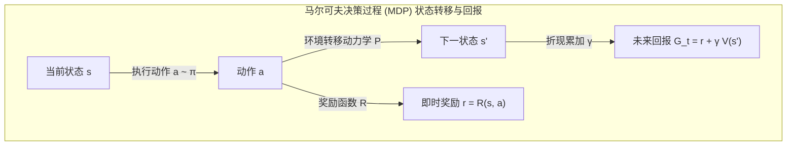

::: {.callout-note appearance="simple"}
**参考答案版**：包含完整代码实现与问答题深度参考解析。建议先独立完成练习题后再展开核对。
:::


## 本课目标与完成标准

学完后你应能：把轨迹写成 MDP 五元组，区分即时奖励、折扣回报与状态价值，并手推有限时域 Bellman 递推。

通过必须同时满足：

- 独立补齐本课唯一的代码填空题，并通过给定检查；
- 三个问答题均说明因果链，而不是只报术语；
- 能指出至少一个正确性边界和一个性能取舍；
- 总分不低于 8/10，且没有一票否决级概念错误。

## 前置关系

- 课程前置：Python、概率期望、基本深度学习
- 本课在路线中的作用：MDP 用状态、动作、转移、奖励和折扣描述顺序决策；它把“长期好坏”变成可递推的期望回报。

## 核心心智模型


### 核心操作与执行流程图解


<p class="caption" align="center"><em>图 1-1：MDP 状态转移五元组与 Bellman 期望方程分解拓扑</em></p>


<p class="caption" align="center"><em>图 1-2：有限时域轨迹回报逆序动态规划递推流程</em></p>


### 核心操作与执行流程图解

```{mermaid}
flowchart TD
    subgraph MDP["马尔可夫决策过程 (MDP) 状态转移与回报"]
        S["当前状态 s"] -->|执行动作 a ~ π| A["动作 a"]
        A -->|环境转移动力学 P| S_prime["下一状态 s'"]
        A -->|奖励函数 R| R["即时奖励 r = R(s, a)"]
        S_prime -->|折现累加 γ| G["未来回报 G_t = r + γ V(s')"]
    end
```
<p class="caption" align="center"><em>图 1-1：MDP 状态转移五元组与 Bellman 期望方程分解拓扑</em></p>

```{mermaid}
flowchart LR
    T["终止时刻 T: G_T = 0"] --> T1["倒数第一步: G_{T-1} = R_{T-1} + γ G_T"]
    T1 --> T2["倒数第二步: G_{T-2} = R_{T-2} + γ G_{T-1}"]
    T2 --> T0["时刻 0: G_0 = 累积折现回报"]
```
<p class="caption" align="center"><em>图 1-2：有限时域轨迹回报逆序动态规划递推流程</em></p>


### 1. 它是什么，解决什么问题

MDP 用状态、动作、转移、奖励和折扣描述顺序决策；它把“长期好坏”变成可递推的期望回报。

### 2. 它如何工作

轨迹回报从末端向前递推：G_t=r_t+γG_{t+1}；Bellman 方程则在状态/动作分布上对同一递推取期望。

### 3. 正确性条件与常见误区

终止状态之后不能继续 bootstrap；`terminated` 与因时间上限产生的 `truncated` 语义不同。

### 4. 性能与工程取舍

γ 越大越重视长期奖励，但估计方差和信用分配长度也会上升。

## 具体演示：从轨迹回报到 LLM 生成

奖励 `[1, 0, 2]`、γ=0.9 时，反向得到 G₂=2、G₁=1.8、G₀=2.62。

单轮语言模型生成也能写成 MDP：状态 sₜ=(prompt, 已生成前缀)，动作 aₜ=下一个 token，转移是把 token 拼到前缀，EOS 结束轨迹。策略是 token 分布；纯文本拼接转移确定，不意味着策略确定。工具调用后的观测则可能来自随机或变化的环境。

若只在回答完成后给奖励，也可以用 contextual bandit：prompt x 是上下文，完整回答 y 是一个动作。两种写法使用同一个自回归模型，且 logπ(y|x)=Σₜ logπ(yₜ|x,y<ₜ)。结果奖励可在 token MDP 的末步发放；过程奖励在中间推理步骤发放，不等于每个 token 都有独立质量标签。

LLM 后训练常取 γ=1；若末端正确性奖励为 1、前面全为 0，则每个位置的未折扣 return 都为 1。取 γ<1 会改变长短回答的回报权重，不能不加说明地沿用。

## 实践任务：唯一代码填空题

补齐折扣回报的反向扫描。

规则：只能修改 `TODO`/`______` 所在位置；不要删除断言或放宽误差。代码注释说明了每个边界条件。

```{python}
#| course_role: exercise
def discounted_returns(rewards, gamma):
    out = [0.0] * len(rewards)
    running = 0.0
    for t in range(len(rewards) - 1, -1, -1):
        running = rewards[t] + gamma * running
        out[t] = round(running, 10)
    return ______

assert discounted_returns([1., 0., 2.], 0.9) == [2.62, 1.8, 2.0]
assert discounted_returns([], 0.9) == []
```

### 检查方法

运行两个断言；空轨迹必须返回空列表。

提交时请给出：补齐后的代码、实际运行输出（环境不可用时注明“仅静态审查”）以及对失败用例的解释。

### Q1

不要背定义：请从输入、状态变化和输出三个阶段解释“MDP、回报与 Bellman 递推”的工作机制。

**你的答案：**

### Q2

把时间上限截断也当成真正终止并把末端价值设为 0，会产生什么偏差？

**你的答案：**

### Q3

若奖励整体乘 100，策略最优解可能不变，但学习动态会怎样变化？

**你的答案：**

## 评分与通过规则

- 代码 4 分：正常输入 2 分，边界输入 1 分，解释实现 1 分；
- Q1～Q3 各 2 分；
- 一票否决：结果碰巧正确但核心因果链错误、删除边界检查、把未运行结果说成实测。

需要提示时按四级机制请求：概念区域 → 具体方向 → 关键局部 → 完整答案。


::: {.callout-tip collapse="true" title="💡 点击展开参考答案与详细代码实现" icon="false"}
## 参考答案（仅 answer 分支）

先完成题目再核对。即使代码一致，也要能解释关键步骤，并尝试更换一个输入规模。

```{python}
#| course_role: solution
def discounted_returns(rewards, gamma):
    out = [0.0] * len(rewards)
    running = 0.0
    for t in range(len(rewards) - 1, -1, -1):
        running = rewards[t] + gamma * running
        out[t] = round(running, 10)
    return out

assert discounted_returns([1., 0., 2.], 0.9) == [2.62, 1.8, 2.0]
assert discounted_returns([], 0.9) == []
```

### Q1 参考答案

轨迹回报从末端向前递推：G_t=r_t+γG_{t+1}；Bellman 方程则在状态/动作分布上对同一递推取期望。

### Q2 参考答案

如果时间上限只是采样窗口结束，置零会漏掉 γV(s')：后续价值为正时低估，为负时高估。应使用截断前真实末状态的 bootstrap，而非自动 reset 后的状态。如果时限本身就是任务终点，则应按真正终止处理。

### Q3 参考答案

在奖励全部等比例缩放、没有其他固定尺度项的前提下，回报和价值也乘 100，最优策略不变。但未标准化的策略梯度约乘 100，价值误差平方约乘 10000；固定学习率、梯度裁剪与固定 β 的 KL 惩罚会改变相对作用。应重新核对优化尺度，而不是只比较最优解。

## 参考资料

- [Back to Basics：token MDP 与完整回答 bandit（§2）](https://arxiv.org/html/2402.14740v1)

资料用于建立事实基线；本课数值例子是教学计算，不是模型训练结果。
:::
