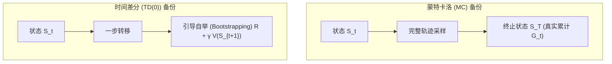
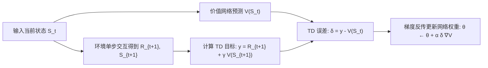

::: {.callout-note appearance="simple"}
**参考答案版**：包含完整代码实现与问答题深度参考解析。建议先独立完成练习题后再展开核对。
:::


## 本课目标与完成标准

学完后你应能：比较 MC 与 TD(0)，并实现带终止掩码的一步 TD 目标。

通过必须同时满足：

- 独立补齐本课唯一的代码填空题，并通过给定检查；
- 三个问答题均说明因果链，而不是只报术语；
- 能指出至少一个正确性边界和一个性能取舍；
- 总分不低于 8/10，且没有一票否决级概念错误。

## 前置关系

- 课程前置：Python、概率期望、基本深度学习
- 本课在路线中的作用：MC 等完整回报后监督价值；TD 用当前价值估计 bootstrap 下一状态，能在线更新。

## 核心心智模型


### 核心操作与执行流程图解


<p class="caption" align="center"><em>图 2-1：蒙特卡洛全轨迹采样与时间差分单步自举机制对比</em></p>


<p class="caption" align="center"><em>图 2-2：TD(0) 单步时序差分更新与闭环学习流程</em></p>


### 核心操作与执行流程图解

```{mermaid}
flowchart TD
    subgraph MC["蒙特卡洛 (MC) 备份"]
        S_mc["状态 S_t"] --> A_mc["完整轨迹采样"] --> End_mc["终止状态 S_T (真实累计 G_t)"]
    end
    subgraph TD["时间差分 (TD(0)) 备份"]
        S_td["状态 S_t"] --> A_td["一步转移"] --> S_next["引导自举 (Bootstrapping) R + γ V(S_{t+1})"]
    end
```
<p class="caption" align="center"><em>图 2-1：蒙特卡洛全轨迹采样与时间差分单步自举机制对比</em></p>

```{mermaid}
flowchart LR
    State["输入当前状态 S_t"] --> Pred["价值网络预测 V(S_t)"]
    State --> EnvStep["环境单步交互得到 R_{t+1}, S_{t+1}"]
    EnvStep --> Target["计算 TD 目标: y = R_{t+1} + γ V(S_{t+1})"]
    Pred & Target --> Loss["TD 误差: δ = y - V(S_t)"]
    Loss --> Grad["梯度反传更新网络权重: θ ← θ + α δ ∇V"]
```
<p class="caption" align="center"><em>图 2-2：TD(0) 单步时序差分更新与闭环学习流程</em></p>


### 1. 它是什么，解决什么问题

MC 等完整回报后监督价值；TD 用当前价值估计 bootstrap 下一状态，能在线更新。

### 2. 它如何工作

TD 目标是 r+γ(1-done)V(s')；TD error 是目标减当前 V(s)，它同时是学习信号和诊断量。

### 3. 正确性条件与常见误区

真正终止时必须关闭 bootstrap；时间截断通常仍应保留 bootstrap，具体取决于环境 API。

### 4. 性能与工程取舍

MC 近似无 bootstrap 偏差但方差高；TD 方差低、更新快，但会继承估计偏差。

## 具体演示

若 r=1、γ=.9、V(s')=5：非终止目标 5.5，终止目标 1；一个布尔位会改变 4.5。

请在阅读后先合上这一节，用自己的语言复述“输入状态 → 中间状态 → 输出状态”，再做练习。

## 实践任务：唯一代码填空题

补齐向量化 TD(0) 目标。

规则：只能修改 `TODO`/`______` 所在位置；不要删除断言或放宽误差。代码注释说明了每个边界条件。

```{python}
#| course_role: exercise
def td_target(reward, next_value, terminated, gamma):
    """标量版本；terminated 为 bool。"""
    # TODO：只补齐下面这个表达式。
    return ______

assert td_target(1., 5., False, .9) == 5.5
assert td_target(1., 5., True, .9) == 1.0
```

### 检查方法

运行本单元格；所有 `assert` 必须通过。另手工构造一个边界输入，解释预期结果。

提交时请给出：补齐后的代码、实际运行输出（环境不可用时注明“仅静态审查”）以及对失败用例的解释。

### Q1

不要背定义：请从输入、状态变化和输出三个阶段解释“Monte Carlo、TD 与偏差—方差”的工作机制。

**你的答案：**

### Q2

训练曲线突然高估所有终止前状态，首先检查哪个 mask？为什么？

**你的答案：**

### Q3

稀疏奖励长轨迹中，你会先用 MC 还是 n-step TD？给出选择依据。

**你的答案：**

## 评分与通过规则

- 代码 4 分：正常输入 2 分，边界输入 1 分，解释实现 1 分；
- Q1～Q3 各 2 分；
- 一票否决：结果碰巧正确但核心因果链错误、删除边界检查、把未运行结果说成实测。

需要提示时按四级机制请求：概念区域 → 具体方向 → 关键局部 → 完整答案。


::: {.callout-tip collapse="true" title="💡 点击展开参考答案与详细代码实现" icon="false"}
## 参考答案（仅 answer 分支）

先完成题目再核对。即使代码一致，也要能解释关键步骤，并尝试更换一个输入规模。

```{python}
#| course_role: solution
def td_target(reward, next_value, terminated, gamma):
    """标量版本；terminated 为 bool。"""
    # 参考实现：表达式直接对应上文不变量。
    return reward + gamma * (0.0 if terminated else next_value)

assert td_target(1., 5., False, .9) == 5.5
assert td_target(1., 5., True, .9) == 1.0
```

### Q1 参考答案

TD 目标是 r+γ(1-done)V(s')；TD error 是目标减当前 V(s)，它同时是学习信号和诊断量。

### Q2 参考答案

判断时先检查本课不变量：真正终止时必须关闭 bootstrap；时间截断通常仍应保留 bootstrap，具体取决于环境 API。  若不成立，最终数值或系统状态即使暂时正常也不可信。

### Q3 参考答案

迁移时先保证正确性，再比较代价。这里的核心取舍是：MC 近似无 bootstrap 偏差但方差高；TD 方差低、更新快，但会继承估计偏差。

## 参考资料

- [GAE paper](https://arxiv.org/abs/1506.02438)

资料用于建立事实基线；面试回答仍需用自己的语言组织。
:::
