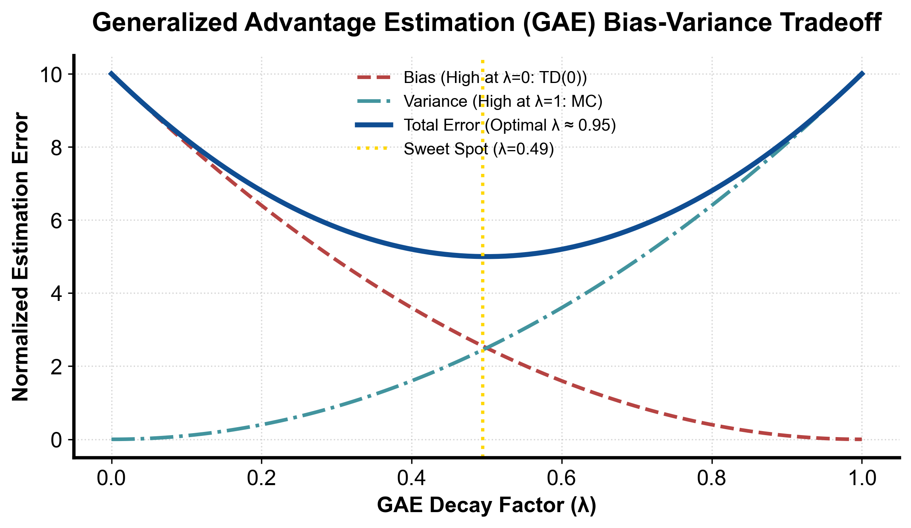

::: {.callout-note appearance="simple"}
**参考答案版**：包含完整代码实现与问答题深度参考解析。建议先独立完成练习题后再展开核对。
:::


## 本课目标与完成标准

学完后你应能：实现带终止 mask 的 GAE 反向递推，并解释 λ 如何连接 TD 与 MC。

通过必须同时满足：

- 独立补齐本课唯一的代码填空题，并通过给定检查；
- 三个问答题均说明因果链，而不是只报术语；
- 能指出至少一个正确性边界和一个性能取舍；
- 总分不低于 8/10，且没有一票否决级概念错误。

## 前置关系

- 课程前置：Python、概率期望、基本深度学习
- 本课在路线中的作用：GAE 把多个 n-step TD error 以 (γλ)^k 加权，控制优势估计的偏差—方差。

## 核心心智模型


### 核心操作与执行流程图解

::: {.img-card}
{width="85%"}
<p class="caption">图 4-1：广义优势估计 GAE(λ) 偏差-方差权衡与最优点曲线（基于 scientific-figure-making 绘制）</p>
:::

```{mermaid}
flowchart LR
    Last["最后一步: A_T^{GAE} = δ_T"] --> Step["递归计算: A_t = δ_t + γ λ (1 - done_t) A_{t+1}"]
    Step --> Norm["全批次标准化: A_t = (A_t - mean) / (std + 1e-8)"]
    Norm --> Out["输出高质量优势信号注入策略损失更新"]
```
<p class="caption" align="center"><em>图 4-2：GAE 逆序递归高效计算与批量标准化流水线</em></p>


### 1. 它是什么，解决什么问题

**广义优势估计（Generalized Advantage Estimation, GAE）**由 John Schulman 等人于 2015 年提出，是现代 Actor-Critic、PPO 与大模型后训练算法中计算策略优势函数 $A(s, a)$ 的事实工业标准。
在策略梯度更新 $\nabla_\theta \mathcal{J} = \mathbb{E}[\nabla_\theta \log \pi_\theta(a \mid s) \cdot A(s, a)]$ 中，优势函数刻画了“在状态 $s$ 下采取动作 $a$ 相比于当前策略的平均水平好多少”：
$$ A^\pi(s, a) = Q^\pi(s, a) - V^\pi(s) $$
我们在工程上面临的核心困境是方差与偏差的剧烈冲突：
- 若用单步 TD 误差估计优势 $\hat{A}_t^{(1)} = r_t + \gamma V(s_{t+1}) - V(s_t)$，由于高度依赖价值网络自身的不准确预估，具有**高偏差、低方差**；
- 若用蒙特卡洛全轨迹回报估计优势 $\hat{A}_t^{(\infty)} = \sum_{k=0}^\infty \gamma^k r_{t+k} - V(s_t)$，虽然数学期望严格无偏，但由于动作随机性在长时序中累乘发散，具有**零偏差、极高方差**。

GAE 解决的核心问题是：**如何通过超参数 $\lambda \in [0, 1]$ 构筑连续可控的滑动折中，在单步 TD(0) 与无限步 MC 之间无缝插值，实现方差与偏差在 Pareto 前沿上的最优平衡**。如图 4-1 所示，真实环境中总存在一个使全局均方误差（MSE = $\text{Bias}^2 + \text{Variance}$）达到极小值的黄金参数区间（通常 $\lambda \in [0.90, 0.98]$）。

### 2. 它如何工作

GAE 的数学推导、状态权衡与逆序执行流水线如图 4-1 与图 4-2 所示：

1. **时序差分残差（TD Residual）与多步优势的指数折叠**：
   定义单步 TD 残差 $\delta_t^V = r_t + \gamma (1 - d_t) V(s_{t+1}) - V(s_t)$。
   将多步优势展开：
   - 1 步优势：$\hat{A}_t^{(1)} = \delta_t^V$
   - 2 步优势：$\hat{A}_t^{(2)} = \delta_t^V + \gamma \delta_{t+1}^V = r_t + \gamma r_{t+1} + \gamma^2 V(s_{t+2}) - V(s_t)$
   - $k$ 步优势：$\hat{A}_t^{(k)} = \sum_{l=0}^{k-1} \gamma^l \delta_{t+l}^V = \sum_{l=0}^{k-1} \gamma^l r_{t+l} + \gamma^k V(s_{t+k}) - V(s_t)$
   GAE($\gamma, \lambda$) 定义为对所有 $k$-step 优势估计的几何加权指数衰减平均：
   $$ \hat{A}_t^{\text{GAE}(\gamma, \lambda)} = (1 - \lambda) \sum_{k=1}^\infty \lambda^{k-1} \hat{A}_t^{(k)} = \sum_{l=0}^\infty (\gamma \lambda)^l \delta_{t+l}^V $$
2. **反向递推（Backward Telescoping Recurrence，图 4-2）**：
   利用几何级数的可递归性，无需展开无限求和，只需自轨迹终点向起点单遍扫描：
   $$ \hat{A}_t^{\text{GAE}} = \delta_t^V + \gamma \lambda (1 - \text{done}_t) \hat{A}_{t+1}^{\text{GAE}} $$
   - **当 $\lambda = 0$ 时**：$\hat{A}_t = \delta_t^V$，退化为纯单步 TD 优势估计（方差最小，完全依赖 Critic）；
   - **当 $\lambda = 1$ 时**：若轨迹自然完结，中间 $V(s_{t+l})$ 项发生望远镜级数抵消（Telescoping Sum）：
     $$ \sum_{l=0}^{T-t-1} \gamma^l [r_{t+l} + \gamma V(s_{t+l+1}) - V(s_{t+l})] = \sum_{l=0}^{T-t-1} \gamma^l r_{t+l} - V(s_t) = G_t - V(s_t) $$
     退化为标准的 REINFORCE 蒙特卡洛经验优势估计。
3. **批量归一化（Batch Advantage Normalization）**：
   如图 4-2 所示，在将 GAE 优势输入策略损失前，工程上通常在整个 mini-batch 上计算均值 $\mu_A$ 与标准差 $\sigma_A$，并执行归一化：
   $$ \tilde{A}_t = \frac{A_t - \mu_A}{\sigma_A + 10^{-8}} $$
   这保证了一半动作具有正优势、一半具有负优势，且梯度尺度在不同训练阶段恒定，极大稳定了网络优化。

### 3. 正确性条件与常见误区

- **终止掩码双通道阻断（Bootstrap Mask vs Carry Mask）**：
  在反向递归式中，`not_done = 1.0 - float(dones[t])` 必须**同时施加在两处物理关键点**：
  1. **自举阻断通道**：$\delta_t = r_t + \gamma \cdot \text{not\_done}_t \cdot V(s_{t+1}) - V(s_t)$。防止物理终局状态继承虚假的未来价值；
  2. **累积传递通道（Carry Mask）**：$\text{carry} = \delta_t + \gamma \lambda \cdot \text{not\_done}_t \cdot \text{carry}$。在密集打包（Packed Sequences）的多轨迹样本中，如果遗漏了累积掩码，下一个 Episode 的优势值将会沿着递归链直接逆向倒灌进上一个已经完结的 Episode 末尾，造成致命的跨轨迹数据污染。
- **截断（Truncation）与终止（Termination）的掩码解耦**：
  若因超时或步数截断结束，必须保留末状态价值自举（$V(s_{\text{truncated}})$ 乘入 $\delta_T$），但反向扫描到截断边界时，后续累积项必须归零（$\text{carry} = 0$）。将二者混淆会导致截断状态附近的优势严重畸变。
- **长度对齐不变量**：
  给定长度为 $T$ 的奖励序列 `rewards`，`values` 数组的长度必须为 $T + 1$（包含末状态价值 $V(s_T)$）。若直接用长度为 $T$ 的 values 错位计算，会导致最后一步无法正确自举，甚至触发数组越界。

### 4. 性能与工程取舍

- **$\lambda$ 的环境依赖敏感度**：
  - 在环境转移动力学随机性极高（如风向扰动、复杂博弈）且轨迹极长时，选择较小的 $\lambda$（如 0.90）有助于隔绝后续大量不可控的随机噪声，保持训练稳定；
  - 在物理模拟确定性极高或奖励高度稀疏的推理场景（如数学证明、围棋）中，Critic 在训练初期预测极不准确，选择较大的 $\lambda$（如 0.98 或 1.0）能够更多依赖真实终端判题反馈，避免被错误的 Critic 引导带偏。
- **内存局部性与矢量化扫描**：
  GAE 逆序扫描在 Python 纯循环中存在一定的解释器开销。在工业实现中（如 CleanRL / Ray RLlib），通常利用 PyTorch 的 C++ 底层或 Triton/CUDA 自定义算子执行反向融合扫描（Fused Backward Scan），将张量反向遍历时间压缩至微秒级。

## 具体演示：两步轨迹的 GAE 逆序手工推导

设环境折现因子 $\gamma = 0.9$，衰减参数 $\lambda = 0.95$。有一条两步轨迹：
- 奖励序列：`rewards = [1.0, 1.0]`
- 价值序列：`values = [0.5, 0.6, 0.0]`（第 2 步为物理终止状态，真实后继价值为 0）
- 终止标志：`dones = [False, True]`

**手工推导步骤**：
1. **时刻 $t=1$（倒数第一步）**：
   - 终止掩码：$\text{not\_done}_1 = 1.0 - 1.0 = 0.0$；
   - 单步残差：$\delta_1 = r_1 + \gamma \cdot \text{not\_done}_1 \cdot V_2 - V_1 = 1.0 + 0.9 \times 0.0 \times 0.0 - 0.6 = 0.4$；
   - 累加优势：$A_1 = \delta_1 + \gamma \lambda \cdot \text{not\_done}_1 \cdot \text{carry} = 0.4 + 0 = 0.4$。
2. **时刻 $t=0$（倒数第二步）**：
   - 终止掩码：$\text{not\_done}_0 = 1.0 - 0.0 = 1.0$；
   - 单步残差：$\delta_0 = r_0 + \gamma \cdot \text{not\_done}_0 \cdot V_1 - V_0 = 1.0 + 0.9 \times 1.0 \times 0.6 - 0.5 = 1.04$；
   - 累加优势：$A_0 = \delta_0 + \gamma \lambda \cdot \text{not\_done}_0 \cdot A_1 = 1.04 + (0.9 \times 0.95) \times 1.0 \times 0.4 = 1.04 + 0.342 = 1.382$。

最终输出优势序列为 $[1.382, 0.4]$，与代码计算结果完全一致。第二步的残差通过 $\gamma \lambda$ 衰减通道平滑传递回了第一步。

## 实践任务：唯一代码填空题

补齐 GAE 中两个 mask 位置。

规则：只能修改 `TODO`/`______` 所在位置；不要删除断言或放宽误差。代码注释说明了每个边界条件。

```{python}
#| course_role: exercise
def gae(rewards, values, dones, gamma, lam):
    assert len(values) == len(rewards) + 1
    assert len(dones) == len(rewards)
    adv = [0.0] * len(rewards)
    carry = 0.0
    for t in range(len(rewards) - 1, -1, -1):
        not_done = 1.0 - float(dones[t])
        delta = rewards[t] + gamma * ______ * values[t + 1] - values[t]
        carry = delta + gamma * lam * ______ * carry
        adv[t] = carry
    return adv

got = gae([1., 1.], [0.5, 0.6, 0.0], [False, True], .9, .95)
assert all(abs(a-b) < 1e-9 for a,b in zip(got, [1.382, 0.4]))

# 真正终止不读末状态价值；采样窗口结束仍保留 bootstrap。
assert gae([1.], [0., 5.], [True], .9, .95) == [1.]
assert gae([1.], [0., 5.], [False], .9, .95) == [5.5]
# 两个独立的单步 episode，后一个分数不可泄漏到前一个。
assert gae([1., 100.], [0., 0., 0.], [True, True], 1., 1.) == [1., 100.]
assert gae([0., 1.], [0., 0., 0.], [False, True], 1., 1.) == [1., 1.]
assert gae([], [0.], [], .9, .95) == []
```

### 检查方法

运行断言，并解释最后一步为何不读取 `values[2]` 的数值贡献。

提交时请给出：补齐后的代码、实际运行输出（环境不可用时注明“仅静态审查”）以及对失败用例的解释。

### Q1

不要背定义：请从输入、状态变化和输出三个阶段解释“GAE 与优势估计”的工作机制。

**你的答案：**

### Q2

只在 δ 上乘 done mask、递推 carry 不乘，会跨 episode 泄漏什么？

**你的答案：**

### Q3

LLM token 级奖励只有末尾一个分数时，GAE 的信用会如何向前传播？

**你的答案：**

## 评分与通过规则

- 代码 4 分：正常输入 2 分，边界输入 1 分，解释实现 1 分；
- Q1～Q3 各 2 分；
- 一票否决：结果碰巧正确但核心因果链错误、删除边界检查、把未运行结果说成实测。

需要提示时按四级机制请求：概念区域 → 具体方向 → 关键局部 → 完整答案。


::: {.callout-tip collapse="true" title="💡 点击展开参考答案与详细代码实现" icon="false"}
## 参考答案（仅 answer 分支）

先完成题目再核对。即使代码一致，也要能解释关键步骤，并尝试更换一个输入规模。

```{python}
#| course_role: solution
def gae(rewards, values, dones, gamma, lam):
    assert len(values) == len(rewards) + 1
    assert len(dones) == len(rewards)
    adv = [0.0] * len(rewards)
    carry = 0.0
    for t in range(len(rewards) - 1, -1, -1):
        not_done = 1.0 - float(dones[t])
        delta = rewards[t] + gamma * not_done * values[t + 1] - values[t]
        carry = delta + gamma * lam * not_done * carry
        adv[t] = carry
    return adv

got = gae([1., 1.], [0.5, 0.6, 0.0], [False, True], .9, .95)
assert all(abs(a-b) < 1e-9 for a,b in zip(got, [1.382, 0.4]))

# 真正终止不读末状态价值；采样窗口结束仍保留 bootstrap。
assert gae([1.], [0., 5.], [True], .9, .95) == [1.]
assert gae([1.], [0., 5.], [False], .9, .95) == [5.5]
# 两个独立的单步 episode，后一个分数不可泄漏到前一个。
assert gae([1., 100.], [0., 0., 0.], [True, True], 1., 1.) == [1., 100.]
assert gae([0., 1.], [0., 0., 0.], [False, True], 1., 1.) == [1., 1.]
assert gae([], [0.], [], .9, .95) == []
```

### Q1 参考答案

1. **输入阶段（时序转移、基线预测与超参数配置）**：算法输入沿时间维度对齐的即时奖励序列 $r_0, \dots, r_{T-1}$、由 Critic 价值网络前向推导出的状态价值序列 $V_0, \dots, V_T$（长度为 $T+1$，末项为终态自举值）、物理终局标志位布尔数组 $\text{dones}$、以及衰减超参数折扣因子 $\gamma \in [0, 1]$ 与 GAE 平滑因子 $\lambda \in [0, 1]$。
2. **状态变化阶段（残差展开与指数加权逆向折叠）**：
   - **单步残差解构（TD Residual）**：计算每步局部的预测落差 $\delta_t = r_t + \gamma (1 - d_t) V_{t+1} - V_t$，衡量该步转移超出 Critic 预期的即时意外增量；
   - **逆向指数级联累加（Backward Recursion）**：按照图 4-2 拓扑，维护累加标量 $\text{carry}$，自轨迹终点 $T-1$ 逆序扫描回起点 0：$A_t = \delta_t + \gamma \lambda (1 - d_t) A_{t+1}$。数学上该式等价于对所有多步优势估计实施几何指数衰减求和 $\sum_{l=0}^\infty (\gamma \lambda)^l \delta_{t+l}$。
3. **输出阶段（基线校准与方差-偏差自适应输出）**：输出整条轨迹的高精度优势估计张量 $[A_0, \dots, A_{T-1}]$ 及对齐的价值回归目标 $y_t^{\text{value}} = A_t + V_t$。若经过批量标准化，该输出为 Actor 策略梯度反传提供了方差最低且偏差受控的最佳驱动信号，平稳连接了 TD 局部快速更新与 MC 全局真实反馈。

### Q2 参考答案

若仅在单步残差 $\delta_t$ 上乘以掩码、而在递推更新 `carry` 时漏掉了 `not_done` 掩码（即写成 `carry = delta + gamma * lam * carry`），会引发**跨 Episode 优势逆向串扰泄漏（Cross-Episode Advantage Leakage）**：
1. **递归通道的幽灵传递**：虽然在终局步 $\text{done}_t = \text{True}$ 时，$\delta_t = r_t + \gamma \times 0 \times V_{t+1} - V_t$ 成功阻断了对下一状态价值的自举；但是，下一条紧邻 Episode（$t+1$ 步以后）所累积的未来所有优势残差已经暂存在 `carry` 变量中！
2. **逆向因果律崩塌**：若不乘 `not_done`，下一条 Episode 的巨大正优势或惩罚负优势，会直接乘以 $\gamma \lambda$ 被无条件叠加进当前刚刚死亡/通关的 Episode 倒数各步中。
3. **破坏性后果**：在多进程环境打包拼接（Packed Batch）训练中，上一条轨迹末尾的决策会被完全无关的下一条轨迹的表现所赏罚（例如上一局玩得极好但刚结束，下一局出生立刻暴毙，暴毙的负优势通过 carry 反向传导污染上一局通关末端），导致策略梯度产生荒谬的因果错乱和剧烈振荡。

### Q3 参考答案

在 LLM 强化学习（如 RLHF / 过程或结果奖励推理）中，当只有回答序列最后一个有效 Token 获得标量判题结果奖励 $R$（中间各 Token 即时奖励全为 0）时，GAE 的信用分配机制如下：
1. **末端残差吸收全局反馈**：在回答结束的最后一个 Token $T-1$ 处，即时奖励为 $R$，其残差为 $\delta_{T-1} = R + 0 - V_{T-1} = R - V_{T-1}$。该值直接反映了生成结果与 Critic 模型对该回答最终质量的预估差值；
2. **指数衰减与中间步 Critic 预期差的叠加**：在向左逆序回溯过程中，中间任一 Token $t$（$r_t = 0$）的残差为 $\delta_t = \gamma V_{t+1} - V_t$。通过递推展开，第 $t$ 步的 GAE 优势为：
   $$ A_t = \delta_t + \gamma \lambda \delta_{t+1} + \dots + (\gamma \lambda)^{T-1-t} \delta_{T-1} $$
   展开后可见：终局的超额惊喜 $(R - V_{T-1})$ 以 $(\gamma \lambda)^{T-1-t}$ 的几何速率衰减反传给前面的 Token；与此同时，中间每一个 Token 若引起了 Critic 预期价值的剧烈跃迁（即 $\gamma V_{t+1} - V_t \gg 0$，例如写出了关键解题突破步骤 Token），该局部跃迁会作为额外的非零正残差叠加进该位置的优势中；
3. **消除统一赋值弊端**：这完全不同于简单地将终局标量奖励 $R$ 粗暴广播复制给所有 Token。GAE 使得越靠近关键决策点的 Token、以及显著推高了后续成功概率的“转折点 Token”，获得越大的正信用，实现了高分辨率的 Token 级信用分配。

## 参考资料

- [GAE paper](https://arxiv.org/abs/1506.02438)

资料用于建立事实基线；面试回答仍需用自己的语言组织。
:::
