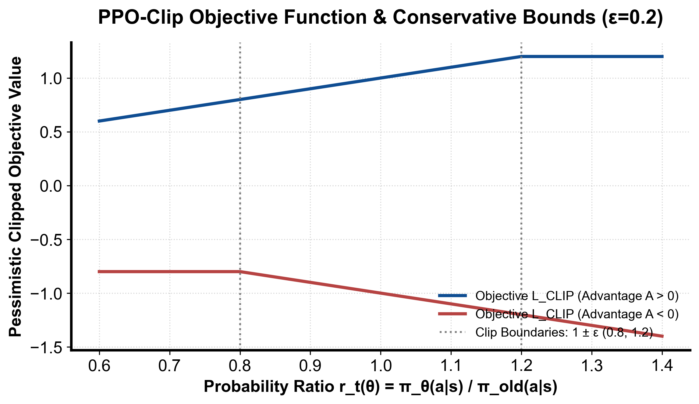

::: {.callout-note appearance="simple"}
**参考答案版**：包含完整代码实现与问答题深度参考解析。建议先独立完成练习题后再展开核对。
:::


## 本课目标与完成标准

学完后你应能：实现 clipped surrogate，并解释 old policy、epoch 与 on-policy 边界。

通过必须同时满足：

- 独立补齐本课唯一的代码填空题，并通过给定检查；
- 三个问答题均说明因果链，而不是只报术语；
- 能指出至少一个正确性边界和一个性能取舍；
- 总分不低于 8/10，且没有一票否决级概念错误。

## 前置关系

- 课程前置：Python、概率期望、基本深度学习
- 本课在路线中的作用：PPO 用新旧策略概率比率衡量更新幅度，并裁剪会让目标继续变好的过大比率。

## 核心心智模型


### 核心操作与执行流程图解

::: {.img-card}
{width="85%"}
<p class="caption">图 5-1：PPO 悲观裁剪目标函数曲线与截断边界（基于 scientific-figure-making 绘制）</p>
:::

```{mermaid}
flowchart TD
    ActorRollout["旧策略 π_old 采样收集轨迹缓冲 (Buffer)"] --> EvalGAE["计算价值标靶与 GAE 标准化优势"]
    EvalGAE --> EpochLoop["多轮 Epoch 小批次 Mini-batch 迭代"]
    EpochLoop --> ComputeLoss["计算 L_CLIP + c1*L_VF + c2*Entropy"]
    ComputeLoss --> Optimizer["AdamW 更新网络权重 θ"]
    Optimizer --> CheckKL{"KL(π_old || π_θ) > KL_阈值?"}
    CheckKL -->|是| EarlyStop["提前终止当前 Epoch 防止策略崩溃"]
    CheckKL -->|否| Continue["继续下一个 Mini-batch"]
```
<p class="caption" align="center"><em>图 5-2：PPO-Clip 训练内层循环与自适应早停保护时序流程</em></p>


### 1. 它是什么，解决什么问题

**近端策略优化（Proximal Policy Optimization, PPO）**是现代强化学习与大模型对齐（RLHF）中使用最广泛的 On-Policy 策略优化算法。
传统策略梯度（如 REINFORCE）的致命弱点是**样本效率低下与步长极度敏感**：
- 采样的轨迹数据在执行一次梯度反传后就必须全部抛弃，无法重用；
- 神经网络参数空间的微小扰动可能导致动作输出概率发生剧烈剧变。一旦发生一次灾难性坏步（Bad Step），策略性能会瞬间跳下悬崖且由于新样本均来自崩塌后的策略而永远无法自愈。
虽然 TRPO（Trust Region Policy Optimization）通过引入 Fisher 信息矩阵和二次二阶约束在理论上保证了单调改善（Monotonic Improvement），但在工程上计算量巨大且难以在大规模 Transformer 架构上稳定落地。

PPO 解决的核心工程问题是：**通过一阶优化计算与悲观截断代理目标（Clipped Surrogate Objective），以极低的计算开销实现近似置信域更新，允许对同一批 Rollout 采样轨迹安全地执行多个 Epoch 的小批次（Mini-batch）复用优化，大幅提升样本效率与训练稳定性**。

### 2. 它如何工作

PPO 目标函数结构与训练循环控制如图 5-1 与图 5-2 所示：

1. **重要性采样比率（Importance Sampling Ratio）**：
   定义新策略 $\pi_\theta$ 相对于采样时旧策略 $\pi_{\text{old}}$ 的概率密度比率：
   $$ r_t(\theta) = \frac{\pi_\theta(a_t \mid s_t)}{\pi_{\theta_{\text{old}}}(a_t \mid s_t)} = \exp \left( \log \pi_\theta(a_t \mid s_t) - \log \pi_{\theta_{\text{old}}}(a_t \mid s_t) \right) $$
   在每次 Rollout 采样刚结束时，$r_t(\theta_{\text{old}}) = 1.0$。随着参数 $\theta$ 的迭代更新，比率偏离 1.0。
2. **悲观裁剪下界（Pessimistic Clipped Surrogate，图 5-1）**：
   为了防止策略发生剧烈突变，PPO 将代理损失定义为两个项的极小值（下界保护）：
   $$ \mathcal{L}^{\text{CLIP}}(\theta) = \hat{\mathbb{E}}_t \left[ \min \left( r_t(\theta) \hat{A}_t, \, \text{clip}(r_t(\theta), 1 - \epsilon, 1 + \epsilon) \hat{A}_t \right) \right] $$
   如图 5-1 所示，根据优势符号分为两种非对称截断行为：
   - **当动作带来正优势（$A_t > 0$）时**：该动作比平均好，优化目标是提升其概率。但当比率 $r_t > 1 + \epsilon$ 时，目标饱和截断为 $(1 + \epsilon) A_t$，其对 $\theta$ 的梯度降为 0，**坚决阻止策略盲目过度放大已知好动作的概率**；反之若 $r_t < 1 - \epsilon$，截断不生效，梯度依然全力向上推拉；
   - **当动作带来负优势（$A_t < 0$）时**：该动作较差，优化目标是压低其概率。当比率 $r_t < 1 - \epsilon$ 时，目标截断为 $(1 - \epsilon) A_t$，**防止负梯度无休止地将动作对数概率推向负无穷大导致数值溢出**；反之若 $r_t > 1 + \epsilon$，截断不生效，梯度全力将错误动作概率压回置信域内。
3. **三类策略的严格物理职责解耦**：
   在系统工程中，必须严格区分三种完全不同的策略实例：
   - $\pi_\theta$（当前在线优化策略）：当前待求梯度的 PyTorch 网络，参数随每个 mini-batch 频繁刷新；
   - $\pi_{\text{old}}$（行为生成策略）：用于在推理环境或 vLLM 引擎中采样生成 Rollout 轨迹的冻结快照，每个 Rollout 阶段结束后更新一次，提供重要性采样分母；
   - $\pi_{\text{ref}}$（基线参考策略）：在 RLHF 对齐中通常冻结为 SFT 初始权重，用于施加全局 KL 散度约束惩罚 $D_{\text{KL}}(\pi_\theta \parallel \pi_{\text{ref}})$，防止大模型发生灾难性遗忘或 Reward Hacking。
4. **自适应早停训练循环（图 5-2）**：
   将轨迹拆分为 Mini-batch 后，在单批数据上迭代运行若干 Epoch（通常 3～5 轮）。每个 Mini-batch 评估 $\text{KL}(\pi_{\text{old}} \parallel \pi_\theta)$。一旦检测到新旧策略散度超出预设阈值（如 $1.5 \times \text{target\_KL}$），立即提前打断（Early Stop）当前 Epoch 循环，强制触发新一轮 Rollout 采样，确保训练始终处于 On-policy 信任域内。

### 3. 正确性条件与常见误区

- **未裁剪项的误杀（不是所有越界样本都丧失梯度）**：
  常见初学者误以为只要 $r_t \notin [1-\epsilon, 1+\epsilon]$ 就完全没有梯度。图 5-1 清晰证明：**PPO 只裁剪“过度改善”方向的梯度**。当 $A_t > 0$ 且 $r_t < 1 - \epsilon$（好动作由于梯度扰动概率被意外降得很低）时，$\min$ 项会选中未裁剪的 $r_t A_t$，依然保留强大的正向梯度以将其纠偏回正确区间；同理当 $A_t < 0$ 且 $r_t > 1 + \epsilon$ 时，也保留未裁剪项以强力惩罚。
- **比率分母与 KL 混淆（`pi_old` vs `pi_ref`）**：
  在开源代码实现中，常有把 PPO 比率分母错误替换为 `pi_ref` 的严重 Bug。比率 $r_t = \pi_\theta / \pi_{\text{old}}$ 是为了纠正当前步更新与本轮 Rollout 生成策略之间的分布漂移；而 $\pi_{\text{ref}}$ 只能作为正则化惩罚项参与损失计算。将分母写成 `pi_ref` 会直接破坏重要性采样有效性，导致策略更新崩溃。
- **优势张量必须 Detach**：
  优势张量 $\hat{A}_t$ 必须被严格冻结（`adv.detach()`）。如果未加 `detach()`，网络参数会试图通过改变 Critic 或改变旧策略来缩减优势，破坏整个算法逻辑。

### 4. 性能与工程取舍

- **Epoch 轮数与样本效率的平衡**：
  每个 Rollout 批次迭代的 Epoch 越多，显卡计算单元利用率越高，前向推理 Rollout 的等待开销摊薄越显著；但 Epoch 过多会导致 $\pi_\theta$ 剧烈漂移，使后续 Mini-batch 的重要性采样方差激增，clip 比例居高不下，引发样本有效性雪崩。大模型后训练中通常将 Epoch 控制在 1～2 轮。
- **显存重用与激活重计算**：
  在更新 Actor 与 Critic 时，若将长达数千 Token 的旧对数概率、掩码和中间激活全部缓存在 GPU 显存中，极易发生 OOM。现代大规模框架（如 Megatron-DeepSpeed / Ray）通常采用流水并行切分与 FlashAttention 融合，将旧对数概率在 Rollout 阶段固化保存至 CPU 主存或高带宽分布式存储，仅在 Mini-batch 反向计算时按需异步拉取。

## 具体演示：PPO 悲观裁剪的分段数值推导

设裁剪超参数 $\epsilon = 0.2$，有效区间为 $[0.8, 1.2]$：
- **案例 1（正优势且大幅改善）：$A = +2.0$，新旧对数概率差使得比率 $r = 1.4$**：
  - 未裁剪项：$r \times A = 1.4 \times 2.0 = 2.8$；
  - 裁剪项：$\text{clip}(r, 0.8, 1.2) \times A = 1.2 \times 2.0 = 2.4$；
  - 取极小值：$\min(2.8, 2.4) = 2.4$。因为策略已经过度放大了好动作概率，目标被强行截断在 2.4，局部梯度归零，阻止进一步盲目贪婪更新。
- **案例 2（负优势且大幅恶化）：$A = -2.0$，新旧对数概率差使得比率 $r = 0.6$**：
  - 未裁剪项：$r \times A = 0.6 \times (-2.0) = -1.2$；
  - 裁剪项：$\text{clip}(r, 0.8, 1.2) \times A = 0.8 \times (-2.0) = -1.6$；
  - 取极小值：$\min(-1.2, -1.6) = -1.6$。目标被截断在 $-1.6$，梯度归零，避免负惩罚过大力度破坏网络参数。
- **案例 3（负优势但被意外推高）：$A = -2.0$，$r = 1.4$**：
  - 未裁剪项：$1.4 \times (-2.0) = -2.8$；
  - 裁剪项：$1.2 \times (-2.0) = -2.4$；
  - 取极小值：$\min(-2.8, -2.4) = -2.8$。由于动作很差但概率却被意外推高，此时未被截断，保留高达 $-2.8$ 的强力梯度将该动作打回原形。

## 实践任务：唯一代码填空题

补齐标量 PPO clipped surrogate。

规则：只能修改 `TODO`/`______` 所在位置；不要删除断言或放宽误差。代码注释说明了每个边界条件。

```{python}
#| course_role: exercise
import math

def ppo_objective(logp_new, logp_old, advantage, eps):
    ratio = math.exp(logp_new - logp_old)
    clipped = min(max(ratio, 1.0 - eps), 1.0 + eps)
    # TODO：PPO 最大化两个 surrogate 中更保守的那个。
    return ______

assert abs(ppo_objective(math.log(1.4), 0.0, 2.0, .2) - 2.4) < 1e-9
assert abs(ppo_objective(math.log(.6), 0.0, -2.0, .2) - (-1.6)) < 1e-9

# 越界但不是改善方向时，仍使用未裁剪的 surrogate。
assert abs(ppo_objective(math.log(.6), 0., 2., .2) - 1.2) < 1e-9
assert abs(ppo_objective(math.log(1.4), 0., -2., .2) + 2.8) < 1e-9
assert ppo_objective(0., 0., 0., .2) == 0.
```

### 检查方法

运行正、负 advantage 两个断言；再画出 ratio∈[0.5,1.5] 的目标折线。

提交时请给出：补齐后的代码、实际运行输出（环境不可用时注明“仅静态审查”）以及对失败用例的解释。

### Q1

不要背定义：请从输入、状态变化和输出三个阶段解释“PPO：比率裁剪与训练循环”的工作机制。

**你的答案：**

### Q2

为什么“ratio 被 clip”不等于“策略 KL 一定小”？

**你的答案：**

### Q3

若 clip fraction 接近 0 但 reward 不升，应优先查哪些信号？

**你的答案：**

## 评分与通过规则

- 代码 4 分：正常输入 2 分，边界输入 1 分，解释实现 1 分；
- Q1～Q3 各 2 分；
- 一票否决：结果碰巧正确但核心因果链错误、删除边界检查、把未运行结果说成实测。

需要提示时按四级机制请求：概念区域 → 具体方向 → 关键局部 → 完整答案。


::: {.callout-tip collapse="true" title="💡 点击展开参考答案与详细代码实现" icon="false"}
## 参考答案（仅 answer 分支）

先完成题目再核对。即使代码一致，也要能解释关键步骤，并尝试更换一个输入规模。

```{python}
#| course_role: solution
import math

def ppo_objective(logp_new, logp_old, advantage, eps):
    ratio = math.exp(logp_new - logp_old)
    clipped = min(max(ratio, 1.0 - eps), 1.0 + eps)
    return min(ratio * advantage, clipped * advantage)

assert abs(ppo_objective(math.log(1.4), 0.0, 2.0, .2) - 2.4) < 1e-9
assert abs(ppo_objective(math.log(.6), 0.0, -2.0, .2) - (-1.6)) < 1e-9

# 越界但不是改善方向时，仍使用未裁剪的 surrogate。
assert abs(ppo_objective(math.log(.6), 0., 2., .2) - 1.2) < 1e-9
assert abs(ppo_objective(math.log(1.4), 0., -2., .2) + 2.8) < 1e-9
assert ppo_objective(0., 0., 0., .2) == 0.
```

### Q1 参考答案

1. **输入阶段（采样快照与张量输入）**：输入由旧策略 $\pi_{\text{old}}$ 生成的一批轨迹样本，包括状态观测序列 $s$、动作序列 $a$、冻结的旧对数概率 $\log \pi_{\text{old}}(a \mid s)$、经 GAE 估算并完成批次标准化的优势张量 $\hat{A}$、以及超参数裁剪阈值 $\epsilon$（通常取 0.1 或 0.2）。
2. **状态变化阶段（重要性采样比率与双重悲观代理下界）**：
   - **比率指数映射**：当前优化网络前向计算新对数概率 $\log \pi_\theta(a \mid s)$，求对数差后通过指数函数恢复为重要性采样比率 $r_t(\theta) = \exp(\log \pi_\theta - \log \pi_{\text{old}})$；
   - **分段悲观截断（Clipped Surrogate）**：计算未裁剪项 $r_t \hat{A}_t$ 与裁剪项 $\text{clip}(r_t, 1-\epsilon, 1+\epsilon) \hat{A}_t$。通过取二者的极小值 $\min$，构造出保守的优化下界。在正优势时限制比率上限为 $1+\epsilon$ 防止贪婪过载，在负优势时限制比率下限为 $1-\epsilon$ 防止惩罚过猛；
   - **小批次反向更新**：将轨迹切分为 Mini-batch，在多个 Epoch 内执行梯度上升更新 Actor 权重，并动态监控新旧策略间的 KL 散度。
3. **输出阶段（稳定策略与置信域演进）**：输出更新后的平滑策略参数 $\theta$。当单批更新步长触及置信域边界（KL 超过容忍阈值）时自适应早停，既充分压榨了采样数据的样本效率，又杜绝了策略因参数突变而发生不可逆的性能崩塌。

### Q2 参考答案

“单个样本的概率比率 $r_t$ 落在截断区间内或被饱和裁剪”，在数学上与系统层面上**绝对不等于全分布的策略 KL 散度 $\mathbb{E}_{s}[D_{\text{KL}}(\pi_{\text{old}} \parallel \pi_\theta)]$ 保持在安全范围**，原因如下：
1. **采样点约束 vs 全状态空间测度**：比率 $r_t$ 仅仅是在“已采样状态和已选具体动作”上的单点标量比值。深度神经网络具有高度复杂的参数非线性耦合，在优化当前已采样样本时，网络权重 $W$ 的改变会剧烈扭曲其他未采样动作的 Softmax 分母（Partition Function），以及未遍历状态的输出分布；
2. **多步 Mini-batch 更新的累积漂移（Compounding Drift）**：PPO 允许在同一批 Rollout 上迭代多个 Epoch。即使每一个 Mini-batch 内每个 Token 的比率看似都在 $[1-\epsilon, 1+\epsilon]$ 附近，但在跨越多轮反向传播后，参数累积变化量可能已经将策略推离原始分布数十倍；
3. **单向裁剪机制不抑制反向发散**：当优势 $A_t > 0$ 时，如果比率因为网络过度自信暴增到 10.0，虽然裁剪项将其有效值截断为 $1.2 A_t$ 使其不再提供进一步放大的梯度，但此时比率本身（即动作概率之比）已经失控膨胀为 10 倍，该状态下的 KL 散度早已严重爆炸。因此工业界必须在训练循环中实时计算全局经验近似 $\text{KL} \approx \frac{1}{B} \sum (\log \pi_{\text{old}} - \log \pi_\theta)$ 作为核心红线指标。

### Q3 参考答案

若检测到 Clip Fraction（比率被截断的样本比例）接近 0% 但训练奖励 Reward 完全不增长，说明**策略参数几乎没有发生实质性的有效更新，或者学习信号在整个流水线中发生了静默中断**。排查优先级顺序如下：
1. **排查优势与奖励链路的有效性（Signal Validity）**：
   - 检查环境即时奖励是否全为 0 或方差归零（如稀疏任务中智能体从未碰触到任何有效奖励，导致所有 $r_t = 0$）；
   - 检查优势张量 $\hat{A}$ 是否存在 NaN、Inf，或者全为常数 0；
   - 检查掩码 `action_mask` 是否发生全 0 遮挡，导致有效 Token 未被纳入损失求和。
2. **排查梯度与优化器链路（Optimization Linkage）**：
   - 检查策略网络参数的梯度范数 `grad_norm` 是否在反向传播中发生梯度下溢归零；
   - 检查学习率（Learning Rate）是否衰减过快接近 0，或者优化器是否因混合精度缩放错误（GradScaler Underflow）频繁跳过了 `optimizer.step()`。
3. **排查策略熵与探索度（Entropy & Exploration）**：
   - 检查当前策略的输出熵（Entropy）。若策略过早坍塌为确定性输出（Entropy 极低），动作缺乏任何多样性，即使有微弱梯度也无法探索出高奖励路径。
   盲目调大裁剪阈值 $\epsilon$ 毫无意义，因为 Clip Fraction 为 0 说明比率根本没有触碰现有边界，核心矛盾在于缺乏有效梯度的驱动源。

## 参考资料

- [PPO paper](https://arxiv.org/abs/1707.06347)

资料用于建立事实基线；面试回答仍需用自己的语言组织。
:::
