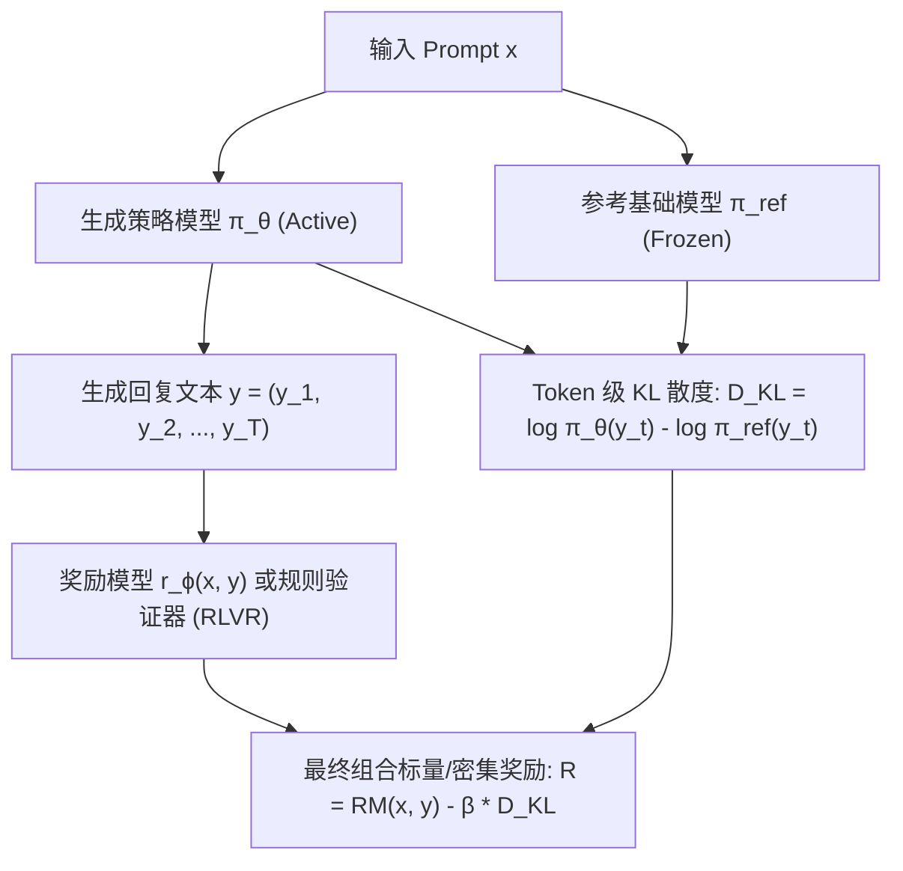
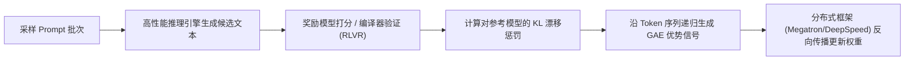

::: {.callout-note appearance="simple"}
**参考答案版**：包含完整代码实现与问答题深度参考解析。建议先独立完成练习题后再展开核对。
:::


## 本课目标与完成标准

学完后你应能：区分 RLHF/RLVR 与奖励粒度，解释 KL 估计的采样条件，并实现 token 对齐的 shaped reward。

通过必须同时满足：

- 独立补齐本课唯一的代码填空题，并通过给定检查；
- 三个问答题均说明因果链，而不是只报术语；
- 能指出至少一个正确性边界和一个性能取舍；
- 总分不低于 8/10，且没有一票否决级概念错误。

## 前置关系

- 课程前置：Python、概率期望、基本深度学习
- 本课在路线中的作用：把奖励来源、参考策略正则与 token 边界连接到策略更新；KL 约束偏移，不保证回答质量。

## 核心心智模型


### 核心操作与执行流程图解


<p class="caption" align="center"><em>图 10-1：大模型对齐 RLHF 四模型拓扑与 Token 级 KL 惩罚锚定</em></p>


<p class="caption" align="center"><em>图 10-2：RLHF / RLVR 后训练全链路端到端数据流水线</em></p>


### 核心操作与执行流程图解

```{mermaid}
flowchart TD
    Prompt["输入 Prompt x"] --> Actor["生成策略模型 π_θ (Active)"]
    Prompt --> Ref["参考基础模型 π_ref (Frozen)"]
    Actor --> Response["生成回复文本 y = (y_1, y_2, ..., y_T)"]
    Response --> RM["奖励模型 r_ϕ(x, y) 或规则验证器 (RLVR)"]
    Actor & Ref --> KL["Token 级 KL 散度: D_KL = log π_θ(y_t) - log π_ref(y_t)"]
    RM & KL --> FinalReward["最终组合标量/密集奖励: R = RM(x, y) - β * D_KL"]
```
<p class="caption" align="center"><em>图 10-1：大模型对齐 RLHF 四模型拓扑与 Token 级 KL 惩罚锚定</em></p>

```{mermaid}
flowchart LR
    PromptBatch["采样 Prompt 批次"] --> VLLM["高性能推理引擎生成候选文本"]
    VLLM --> RMScore["奖励模型打分 / 编译器验证 (RLVR)"]
    RMScore --> KLPenalty["计算对参考模型的 KL 漂移惩罚"]
    KLPenalty --> GAEAdv["沿 Token 序列递归生成 GAE 优势信号"]
    GAEAdv --> PPOUpdate["分布式框架 (Megatron/DeepSpeed) 反向传播更新权重"]
```
<p class="caption" align="center"><em>图 10-2：RLHF / RLVR 后训练全链路端到端数据流水线</em></p>


### 1. 奖励来源与优化器是两个轴

RLHF 先用偏好对训练 reward model（RM）；RLVR 用数学验证器、代码测试等规则给分。二者都可搭配 PPO/GRPO；GRPO 不等于 RLVR。单轮结果奖励和中间过程奖励则是奖励粒度这个独立轴。

RM 的常见偏好损失是 −logσ(rφ(x,y+)−rφ(x,y−))。经典链路为 SFT 初始化 → 偏好 RM → rollout 与策略更新；不是所有 RL 都必须先 SFT，例如 R1-Zero 从预训练模型开始。规则验证也可能被测试覆盖、答案解析或数据泄漏欺骗，不能把 deterministic 等同于无 reward hacking。

### 2. 对 reference 的 KL 正则

目标为 E[R]−β KL(πθ∥πref)。单个 token 的 sampled k1=logπθ−logπref，可能为负；在当前策略采样的动作上取期望才得到该前缀的 KL。令 d=logπref−logπθ，k3=exp(d)−d−1，每项非负，在相同采样与支持条件下期望也等于 KL；离策略数据不能无条件套用这个等式。

本课采用经典 PPO reward shaping：采样阶段每个有效 token 扣 β×k1，只在最后一个有效回答 token 加一次 RM/验证分数，再交给 GAE。原始 GRPO 把 KL 项直接加入 loss；若两处都加相同惩罚会重复计费。KL 不是所有配方都启用，也不是质量保证。

### 3. Causal shift 和 mask

input_ids 为 [B,L]，logits 为 [B,L,V]；logits[:, :-1] 对齐 labels=input_ids[:, 1:]。gather 后的 sampled log-prob 和回答 mask 都是 [B,L−1]。policy/ref 必须共享 tokenizer、前缀和 label 对齐语义。mask 按被预测的 label 是否属于回答确定，不能把预测首个回答 token 的位置误删。EOS 若属于采样回答就计入；prompt/padding 不计入。

### 4. 工程取舍

β 调整奖励与参考约束的相对权重，不能拿 RM reward 上升代替质量改善。开放任务可探索 rubric/LLM judge，但判断器依然是可被利用的代理，需要独立评估。

## 具体演示

输入 [P0,P1,A0,EOS,PAD] 时，shift 后 labels=[P1,A0,EOS,PAD]，回答 mask=[0,1,1,0]；结果分数加到 EOS，不能加到 PAD 或每个 token。

某 token logp=−1、ref_logp=−1.3，k1=.3，β=.1 扣 .03。若 logp 比 ref 更小，k1 可为负，这不是 KL 定义被推翻；检查的是采样分布、方向和期望，而不是把负值强行裁到零。

## 实践任务：唯一代码填空题

补齐每 token shaped reward。

规则：只能修改 `TODO`/`______` 所在位置；不要删除断言或放宽误差。代码注释说明了每个边界条件。

```{python}
#| course_role: exercise
import math

def shaped_token_reward(env_reward, logp, ref_logp, beta):
    """非末端 env_reward 通常为 0。"""
    # TODO：只补齐下面这个表达式。
    return ______

assert abs(shaped_token_reward(0., -1., -1.3, .1) + .03) < 1e-12
assert abs(shaped_token_reward(2., -1., -1.3, .1) - 1.97) < 1e-12

# 自构造有限分布，按当前策略概率加权验证期望，不是训练 benchmark。
p, q = [.8, .2], [.5, .5]
k1 = [math.log(a / b) for a, b in zip(p, q)]
d = [math.log(b / a) for a, b in zip(p, q)]
k3 = [math.expm1(x) - x for x in d]
exact_kl = sum(a * math.log(a / b) for a, b in zip(p, q))
assert min(k1) < 0.
assert all(x >= 0. for x in k3)
assert abs(sum(a*x for a, x in zip(p, k1)) - exact_kl) < 1e-12
assert abs(sum(a*x for a, x in zip(p, k3)) - exact_kl) < 1e-12

# Causal shift 后的 label 边界：首回答 token 和 EOS 都有效。
input_ids = [10, 11, 20, 2, 0]  # prompt, prompt, answer, EOS, PAD
labels = input_ids[1:]
mask = [0, 1, 1, 0]
assert [t for t, m in zip(labels, mask) if m] == [20, 2]
last = max(i for i, m in enumerate(mask) if m)
rewards = [shaped_token_reward(2. if i == last else 0., -1., -1.3, .1)
           if m else 0. for i, m in enumerate(mask)]
assert all(abs(a-b) < 1e-12 for a,b in zip(rewards, [0., -.03, 1.97, 0.]))
```

### 检查方法

运行本单元格；所有 `assert` 必须通过。另手工构造一个边界输入，解释预期结果。

提交时请给出：补齐后的代码、实际运行输出（环境不可用时注明“仅静态审查”）以及对失败用例的解释。

### Q1

把一次回答从 causal shift、奖励来源到 KL shaping、GAE 和策略更新串起来；说明 RLHF/RLVR 与 PPO/GRPO 为什么不是同一分类轴。

**你的答案：**

### Q2

policy/ref 的 padding mask 不一致会怎样污染 KL 与 advantage？

**你的答案：**

### Q3

RM reward 上升而人工胜率下降，你会如何设计诊断矩阵？

**你的答案：**

## 评分与通过规则

- 代码 4 分：正常输入 2 分，边界输入 1 分，解释实现 1 分；
- Q1～Q3 各 2 分；
- 一票否决：结果碰巧正确但核心因果链错误、删除边界检查、把未运行结果说成实测。

需要提示时按四级机制请求：概念区域 → 具体方向 → 关键局部 → 完整答案。


::: {.callout-tip collapse="true" title="💡 点击展开参考答案与详细代码实现" icon="false"}
## 参考答案（仅 answer 分支）

先完成题目再核对。即使代码一致，也要能解释关键步骤，并尝试更换一个输入规模。

```{python}
#| course_role: solution
import math

def shaped_token_reward(env_reward, logp, ref_logp, beta):
    """非末端 env_reward 通常为 0。"""
    # 参考实现：表达式直接对应上文不变量。
    return env_reward - beta * (logp - ref_logp)

assert abs(shaped_token_reward(0., -1., -1.3, .1) + .03) < 1e-12
assert abs(shaped_token_reward(2., -1., -1.3, .1) - 1.97) < 1e-12

# 自构造有限分布，按当前策略概率加权验证期望，不是训练 benchmark。
p, q = [.8, .2], [.5, .5]
k1 = [math.log(a / b) for a, b in zip(p, q)]
d = [math.log(b / a) for a, b in zip(p, q)]
k3 = [math.expm1(x) - x for x in d]
exact_kl = sum(a * math.log(a / b) for a, b in zip(p, q))
assert min(k1) < 0.
assert all(x >= 0. for x in k3)
assert abs(sum(a*x for a, x in zip(p, k1)) - exact_kl) < 1e-12
assert abs(sum(a*x for a, x in zip(p, k3)) - exact_kl) < 1e-12

# Causal shift 后的 label 边界：首回答 token 和 EOS 都有效。
input_ids = [10, 11, 20, 2, 0]  # prompt, prompt, answer, EOS, PAD
labels = input_ids[1:]
mask = [0, 1, 1, 0]
assert [t for t, m in zip(labels, mask) if m] == [20, 2]
last = max(i for i, m in enumerate(mask) if m)
rewards = [shaped_token_reward(2. if i == last else 0., -1., -1.3, .1)
           if m else 0. for i, m in enumerate(mask)]
assert all(abs(a-b) < 1e-12 for a,b in zip(rewards, [0., -.03, 1.97, 0.]))
```

### Q1 参考答案

shift 后取得回答 label 对应的 log-prob 和 mask；RM 或规则验证器给结果分数，每个有效 token 扣 sampled KL，末 token 加结果分数；critic/GAE 构造 detached 优势，PPO 用 new/old 比率更新。RLHF/RLVR 决定谁打分，PPO/GRPO 决定如何用分数更新；若用 GRPO，则以组相对优势替代 critic/GAE。

### Q2 参考答案

同一 sampled token 必须在相同前缀下比较两个模型。若 mask 错位或含 padding，KL 会混入非回答位置，结果分数可能加错末端，GAE 再把错误奖励向前传播。先核对 causal shift、首回答 token、EOS、padding 和有效长度，再检查数值。

### Q3 参考答案

固定 prompt、采样预算和解码配置，在独立 holdout 上分组比较 RM 分数、盲测人工胜率、正确性、回答长度及 KL；检查风格/冗长偏好、评估泄漏与少数任务退化。若只有训练 RM 上升，应按代理奖励被利用排查，不能宣称能力提升。

## 参考资料

- [InstructGPT](https://arxiv.org/abs/2203.02155)
- [DeepSeek-R1：规则奖励与训练阶段（§2）](https://arxiv.org/html/2501.12948v1)
- [DeepSeekMath：GRPO KL 项（§4.1）](https://arxiv.org/html/2402.03300v2)

奖励、KL 与 loss 的具体组织以所选算法配方为准。
:::
