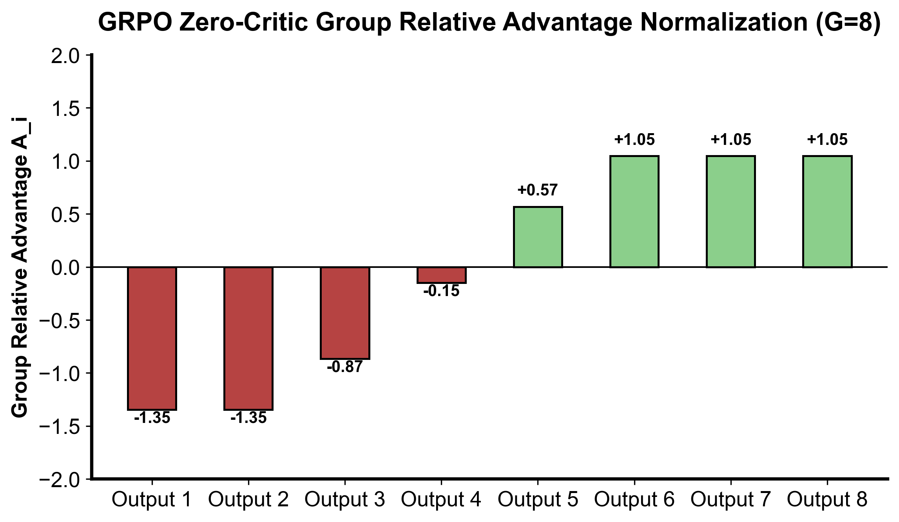

::: {.callout-note appearance="simple"}
**参考答案版**：包含完整代码实现与问答题深度参考解析。建议先独立完成练习题后再展开核对。
:::


## 本课目标与完成标准

学完后你应能：解释 GRPO 如何省掉独立 critic，并实现带零方差保护的组内标准化优势。

通过必须同时满足：

- 独立补齐本课唯一的代码填空题，并通过给定检查；
- 三个问答题均说明因果链，而不是只报术语；
- 能指出至少一个正确性边界和一个性能取舍；
- 总分不低于 8/10，且没有一票否决级概念错误。

## 前置关系

- 课程前置：Python、概率期望、基本深度学习
- 本课在路线中的作用：GRPO 对同一 prompt 采样一组回答，用组内相对奖励构造 advantage，省去单独价值模型。

## 核心心智模型


### 核心操作与执行流程图解

::: {.img-card}
{width="85%"}
<p class="caption">图 11-1：GRPO 无 Critic 组内相对优势打分分布与标准化（基于 scientific-figure-making 绘制）</p>
:::

```{mermaid}
flowchart LR
    BatchQ["获取一批查询 Questions"] --> Rollout["每个 Query 采样 G 份完整回答"]
    Rollout --> Eval["答案规则匹配 / 单元测试打分 (0/1 或浮点)"]
    Eval --> Norm["计算各 Prompt 组内部的 Z-score 优势"]
    Norm --> Loss["组装 GRPO 截断损失与参考模型 KL 约束"]
    Loss --> Grad["跨卡通信与模型参数更新"]
```
<p class="caption" align="center"><em>图 11-2：GRPO 高吞吐后训练执行与组间优势分配流程</em></p>


### 1. 它是什么，解决什么问题

**组相对策略优化（Group Relative Policy Optimization, GRPO）**由 DeepSeek 团队于 2024 年提出（发表于 DeepSeekMath 并作为 DeepSeek-R1 / R1-Zero 推理大模型的核心强化学习引擎）。
在传统 PPO 架构中，训练大语言模型必须同时维护一个与 Actor 策略网络同等规模的 Critic 价值网络（例如 70B 或 671B 参数）。Critic 网络的引入带来了极其沉重的工程代价：
1. **显存消耗翻倍**：Critic 网络的前向激活值、参数权重与 AdamW 优化器状态（FP32 Master Weights + 动量二阶矩）占据了至少 50% 的集群显存；
2. **训练复杂性与负迁移**：Critic 的价值自举（Bootstrapping）拟合延迟和方差极易破坏 Actor 的策略更新，且在多机多卡训练中带来了高昂的跨节点通信同步开销。

GRPO 解决的核心工程问题是：**彻底摒弃单独的 Critic 价值网络（Zero-Critic Architecture），改用对同一 Prompt 采样多个候选回答所构成的组内相对统计量（Group Relative Baseline）来构造优势函数，将大模型强化学习的显存与通信开销腰斩，解锁了在万卡集群上进行超大规模模型全量 RL 后训练的工程可行性**。

### 2. 它如何工作

GRPO 奖励分布标准化与端到端高吞吐流水线如图 11-1 与图 11-2 所示：

1. **组内采样与相对优势归一化（Group Normalization，图 11-1）**：
   对于给定的一个输入 Prompt $q$，Actor 策略 $\pi_{\theta_{\text{old}}}$ 独立并行采样生成 $G$ 个完整候选回答 $\{o_1, o_2, \dots, o_G\}$（在 DeepSeek 实践中通常取 $G = 8 \sim 64$）。
   外部奖励系统（如编译器沙箱测试 RLVR 或规则判题器）对这 $G$ 个回答分别评定标量结果奖励 $\{r_1, r_2, \dots, r_G\}$。
   第 $i$ 个回答的优势值不再依赖 Critic，而是直接通过**组内 Z-score 居中与缩放**计算：
   $$ \hat{A}_i = \frac{r_i - \text{mean}(\{r_1, \dots, r_G\})}{\text{std}(\{r_1, \dots, r_G\}) + \epsilon} $$
   得到的标量优势 $\hat{A}_i$ 随后被**广播（Broadcast）**给该回答包含的所有有效 Completion Token。
2. **GRPO 策略更新目标函数（图 11-2）**：
   在每个 Token 位置上，沿用 PPO 的悲观比率截断机制（Clipped Surrogate），并将参考模型 KL 散度作为显式正则项：
   $$ \mathcal{J}_{\text{GRPO}}(\theta) = \mathbb{E}_{q \sim P(Q), \{o_i\}_{i=1}^G \sim \pi_{\theta_{\text{old}}}(q)} \left[ \frac{1}{G} \sum_{i=1}^G \frac{1}{|o_i|} \sum_{t=1}^{|o_i|} \left\{ \min \left( \frac{\pi_\theta(o_{i,t})}{\pi_{\theta_{\text{old}}}(o_{i,t})} \hat{A}_i, \, \text{clip}\left(\frac{\pi_\theta(o_{i,t})}{\pi_{\theta_{\text{old}}}(o_{i,t})}, 1-\epsilon, 1+\epsilon\right) \hat{A}_i \right) - \beta D_{\text{KL}}(\pi_\theta \parallel \pi_{\text{ref}}) \right\} \right] $$
   其中 $D_{\text{KL}}(\pi_\theta \parallel \pi_{\text{ref}}) = \frac{\pi_{\text{ref}}(o_{i,t})}{\pi_\theta(o_{i,t})} - \log \frac{\pi_{\text{ref}}(o_{i,t})}{\pi_\theta(o_{i,t})} - 1$（即点态非负的 $k_3$ 估计量）。
3. **主流工业变体对比**：
   - **原始 GRPO**：组内除以标准差 $\text{std}(R)$，先在回答内对 Token 损失求均值，再在组内求均值；
   - **Dr. GRPO（2025）**：指出除以组标准差 $\text{std}$ 会人为放大原本方差极小的非重要 Prompt 的梯度，提倡移除除以 $\text{std}$，仅做中心化减均值；
   - **DAPO（2025）**：引入非对称裁剪与动态补采样，过滤组内全对/全错的零方差无效样本；
   - **GSPO（2025）**：在序列级别按 Token 几何均值构建重要性采样比率，消解长文本 Token 级比率相乘下溢问题。

### 3. 正确性条件与常见误区

- **零方差分支与数值除零保护（Zero-Variance Branch）**：
  若某个 Prompt 难度极高（所有 $G$ 个候选回答全错，奖励全为 0）或者过于简单（所有回答全对，奖励全为 1），组内样本方差严格为 0。
  若直接除以 $\text{std}$，即使加上 $10^{-8}$ 也会导致数值下溢或产生虚假爆炸。**系统必须显式判断 `std < eps`，并强制将该组内所有样本的优势归零（`advantages = [0.0] * G`）**。这意味着在完全同质的组内不产生任何策略梯度，仅由 KL 项负责约束。
- **回答级均值（Response Mean）vs Token 级均值（Token Mean）的加权偏置**：
  给定不同长度的回答序列，聚合损失时有两种写法：
  - 先在每个回答内除以长度 $|o_i|$ 得到单回答平均损失，再除以 $G$（原始 GRPO）；
  - 将整个 Batch 内所有回答的所有有效 Token 损失求和，统一除以有效 Token 总数。
  前者赋予短回答和长回答完全同等的样本权重；后者赋予长文本 Token 更多的累计权重。两者的梯度量纲与优化目标不同，混淆会导致模型产生意外的文本冗长或极短偏好。
- **与 RLOO 的数学本质差异**：
  初学者常把 GRPO 等同于第 3 课的 RLOO。实际上，RLOO 在计算基线时严格剔除了样本自身（Leave-One-Out），且未除以组标准差，其梯度数学期望是严格无偏的；而 GRPO 的组均值和方差包含了当前样本自身，在数学上是有偏估计，但获得了极强的工程稳定度与方差压缩效果。

### 4. 性能与工程取舍

- **Group Size $G$ 的算力与方差权衡**：
  在总采样预算 $N = B \times G$ 固定的前提下（例如每步生成 256 条回答）：
  - **增大 $G$（如 $G=16, 32$）**：同题比较更加充分，组内方差估计更准确，更容易在难题上碰巧采样出至少 1 个正确解（避免全 0 废组）；但代价值是 Batch 内覆盖的唯一样题数量 $B$ 骤降，削弱了 Prompt 多样性；
  - **减小 $G$（如 $G=2, 4$）**：Prompt 覆盖广，但组内统计波动巨大，极易频繁遭遇全错/全对组导致大量样本被置零浪费。

## 具体演示：GRPO 组内归一化数值演算

假设针对某道数学题 Prompt，采样了 3 个回答，规则打分分别为 $R = [1.0, 2.0, 3.0]$：
- 组均值：$\text{mean} = \frac{1.0 + 2.0 + 3.0}{3} = 2.0$；
- 总体方差：$\text{var} = \frac{(1-2)^2 + (2-2)^2 + (3-2)^2}{3} = \frac{1 + 0 + 1}{3} = \frac{2}{3} \approx 0.6667$；
- 总体标准差：$\text{std} = \sqrt{2/3}$；
- 各样本优势值：
  - $A_0 = \frac{1.0 - 2.0}{\sqrt{2/3}} = -\sqrt{1.5} \approx -1.2247$；
  - $A_1 = \frac{2.0 - 2.0}{\sqrt{2/3}} = 0.0$；
  - $A_2 = \frac{3.0 - 2.0}{\sqrt{2/3}} = +\sqrt{1.5} \approx +1.2247$。

优势总和严格为 0，高分回答获得正优势，低分回答获得对称负优势。
若奖励全为相同分（如 $[2.0, 2.0]$），标准差为 0，触发零方差防御，安全输出 $[0.0, 0.0]$。

## 实践任务：唯一代码填空题

补齐组内优势的方差与零方差分支。

规则：只能修改 `TODO`/`______` 所在位置；不要删除断言或放宽误差。代码注释说明了每个边界条件。

```{python}
#| course_role: exercise
import math

def group_advantages(rewards, eps=1e-8):
    if not rewards:
        raise ValueError("group cannot be empty")
    mean = sum(rewards) / len(rewards)
    var = ______
    std = math.sqrt(var)
    if std < eps:
        return ______
    return [(r - mean) / std for r in rewards]

assert group_advantages([2., 2.]) == [0.0, 0.0]
got = group_advantages([1., 2., 3.])
assert abs(sum(got)) < 1e-12

assert all(abs(a-b) < 1e-12 for a,b in zip(got, [-math.sqrt(1.5), 0., math.sqrt(1.5)]))
assert group_advantages([1.]) == [0.]
assert group_advantages([0., 1.]) == [-1., 1.]
try:
    group_advantages([])
except ValueError:
    pass
else:
    raise AssertionError("empty group must fail")

# 相同 token loss，不同分母：三个配方不能互换。
losses = [[2.], [0., 0., 0.]]
response_mean = sum(sum(x)/len(x) for x in losses) / len(losses)
token_mean = sum(map(sum, losses)) / sum(map(len, losses))
fixed_length_mean = sum(map(sum, losses)) / (len(losses) * 4)
assert (response_mean, token_mean, fixed_length_mean) == (1., .5, .25)
# GSPO 是几何均值，不是 token ratio 的算术均值。
ratios = [4., .25]
assert abs(math.exp(sum(map(math.log, ratios))/len(ratios)) - 1.) < 1e-12
assert sum(ratios)/len(ratios) == 2.125
```

### 检查方法

运行断言，核对总体方差、全同分、单元素和空组边界；再解释回答平均与 token 平均为什么不同。空组不代表零优势，应明确拒绝。

提交补齐后的代码、实际输出及边界解释；环境不可用时注明静态审查。

### Q1

不要背定义：请从输入、状态变化和输出三个阶段解释“GRPO 与组内相对优势”的工作机制。

**你的答案：**

### Q2

跨 prompt 减全局均值，与各 prompt 内减均值并除组 std，分别如何改变优势与 prompt 权重？

**你的答案：**

### Q3

固定 rollout 预算下，group size 与 prompt 数量如何权衡？

**你的答案：**

## 评分与通过规则

- 代码 4 分：正常输入 2 分，边界输入 1 分，解释实现 1 分；
- Q1～Q3 各 2 分；
- 一票否决：结果碰巧正确但核心因果链错误、删除边界检查、把未运行结果说成实测。

需要提示时按四级机制请求：概念区域 → 具体方向 → 关键局部 → 完整答案。


::: {.callout-tip collapse="true" title="💡 点击展开参考答案与详细代码实现" icon="false"}
## 参考答案（仅 answer 分支）

先完成题目再核对。即使代码一致，也要能解释关键步骤，并尝试更换一个输入规模。

```{python}
#| course_role: solution
import math

def group_advantages(rewards, eps=1e-8):
    if not rewards:
        raise ValueError("group cannot be empty")
    mean = sum(rewards) / len(rewards)
    var = sum((r - mean) ** 2 for r in rewards) / len(rewards)
    std = math.sqrt(var)
    if std < eps:
        return [0.0] * len(rewards)
    return [(r - mean) / std for r in rewards]

assert group_advantages([2., 2.]) == [0.0, 0.0]
got = group_advantages([1., 2., 3.])
assert abs(sum(got)) < 1e-12

assert all(abs(a-b) < 1e-12 for a,b in zip(got, [-math.sqrt(1.5), 0., math.sqrt(1.5)]))
assert group_advantages([1.]) == [0.]
assert group_advantages([0., 1.]) == [-1., 1.]
try:
    group_advantages([])
except ValueError:
    pass
else:
    raise AssertionError("empty group must fail")

# 相同 token loss，不同分母：三个配方不能互换。
losses = [[2.], [0., 0., 0.]]
response_mean = sum(sum(x)/len(x) for x in losses) / len(losses)
token_mean = sum(map(sum, losses)) / sum(map(len, losses))
fixed_length_mean = sum(map(sum, losses)) / (len(losses) * 4)
assert (response_mean, token_mean, fixed_length_mean) == (1., .5, .25)
# GSPO 是几何均值，不是 token ratio 的算术均值。
ratios = [4., .25]
assert abs(math.exp(sum(map(math.log, ratios))/len(ratios)) - 1.) < 1e-12
assert sum(ratios)/len(ratios) == 2.125
```

### Q1 参考答案

1. **输入阶段（组采样与离散规则评估）**：算法从数据集中抽取 Prompt $q$，利用行为策略 $\pi_{\theta_{\text{old}}}$ 独立并行采样生成 $G$ 份候选回答 $\{o_1, \dots, o_G\}$。规则判定器（如数学代码验证器）对各个回答独立评分给出标量结果奖励序列 $[r_1, \dots, r_G]$。
2. **状态变化阶段（无 Critic 组内标准化与优势广播）**：
   - **组内 Z-score 居中与方差防御**：计算当前 Prompt 组内的总体均值 $\mu$ 与标准差 $\sigma$。若检测到 $\sigma < \epsilon$（全对或全错组），触发防御机制将整组优势强制置零；否则计算归一化优势 $\hat{A}_i = (r_i - \mu) / \sigma$；
   - **序列广播与悲观裁剪损失**：将标量优势 $\hat{A}_i$ 沿时间轴广播给该回答的所有有效 Token，随后计算重要性采样比率 $r_t = \pi_\theta / \pi_{\text{old}}$，在 Token 级别施加 PPO 悲观裁剪与参考模型 KL 散度约束，执行反向传播。
3. **输出阶段（显存极简更新与高通量迭代）**：输出更新后的策略参数 $\theta$。整个生命周期彻底消除了 Critic 价值网络及其伴生的大规模通信开销与拟合误差，以极高的集群推理和训练吞吐驱动大模型推理能力的涌现。

### Q2 参考答案

两种不同的归一化方案对算法的学习动力学与 Prompt 难度权重具有决定性的因果重塑：
1. **方案 A（跨 Prompt 扣除全局 Batch 均值）**：
   - **保留了题目固有的绝对难度**：若一道极难的奥数竞赛题，模型采样的 $G$ 个回答中最好的一条得到了 0.5 分、其余全为 0 分。但若整个 Batch 内有大量简单题目获得了 1.0 的满分，Batch 全局均值可能高达 0.8。此时这道难题中好不容易摸索出的突破性回答（0.5 分）依然会因为 $0.5 - 0.8 = -0.3$ 而被判定为“负优势”，导致探索出关键解法的宝贵尝试被错误惩罚抑制；
2. **方案 B（各 Prompt 组内独立减均值并除以组标准差，即 GRPO 标准做法）**：
   - **完全消除了 Prompt 的加性基准偏移**：任何题目（无论难易）均以其自身组内表现为原点。在全错边缘只要有一条稍微更好的回答，立刻能获得显著的正优势；
   - **除以组标准差 $\text{std}$ 带来的隐式重加权偏置**：除以 $\text{std}$ 意味着题目对总梯度的贡献权重反比于其组内方差（Weight $\propto 1/\sigma$）。对于方差极小（例如只有 1 条回答偶然蒙对、其余全错，导致 $\sigma$ 极小）的边界题目，其标准化优势会被人为极度放大，使得模型将不成比例的巨大梯度耗费在小方差极端题上。这也是后续 Dr. GRPO 提倡“仅中心化减均值而不除以标准差”的核心动力。

### Q3 参考答案

在 GPU 集群固定的生成算力预算（总 Rollout 预算 $N = B \times G$ 恒定，例如 $N = 512$）约束下，Group Size $G$ 与唯一题目数量 $B$ 的工程权衡法则如下：
1. **大 Group Size（例如 $G=32, B=16$）的优劣势**：
   - **优势**：组内统计量极度稳定，均值和方差估计高保真；在复杂长推理任务中，单题采样 32 次能显著增大“至少命中一次正确答案”的概率，大幅减少全 0 废组的出现；
   - **劣势**：全局单批次仅能覆盖 16 道不同的 Prompt，数据多样性严重贫瘠，容易导致策略在少数题目类型的局部特征上过拟合。
2. **小 Group Size（例如 $G=4, B=128$）的优劣势**：
   - **优势**：单批覆盖 128 道多样化题目，泛化视野极其广阔；
   - **劣势**：方差估计极不稳定；在困难题目上，仅采样 4 次极大概率全部失败，导致大量 Prompt 沦为零方差组被直接丢弃，造成高达 60%～80% 的生成算力空转浪费。
3. **工业落地推荐策略**：
   - 训练初期（模型推理能力较弱）：推荐采用适度偏大的 $G$（如 $G = 8 \sim 16$），确保有足够的解题概率激活强化学习信号；
   - 训练中后期（基础能力已具备）：可逐步缩小 $G$ 并扩大 $B$，以提升题库覆盖广度与泛化效率。同时建议引入 DAPO 动态补采样机制，在检测到全 0 组时实时异步触发二次采样，防止预算浪费。

## 参考资料

- [DeepSeekMath / GRPO（§4.1）](https://arxiv.org/html/2402.03300v2)
- [DAPO（§3）](https://arxiv.org/html/2503.14476v1)
- [Dr. GRPO（§3）](https://arxiv.org/html/2503.20783v1)
- [GSPO（§4）](https://arxiv.org/html/2507.18071v2)
- [MiniMax-M1 / CISPO](https://arxiv.org/html/2506.13585v1)

这里只比较目标结构，不声称这些配方在任意模型/任务上都有收益。
:::
