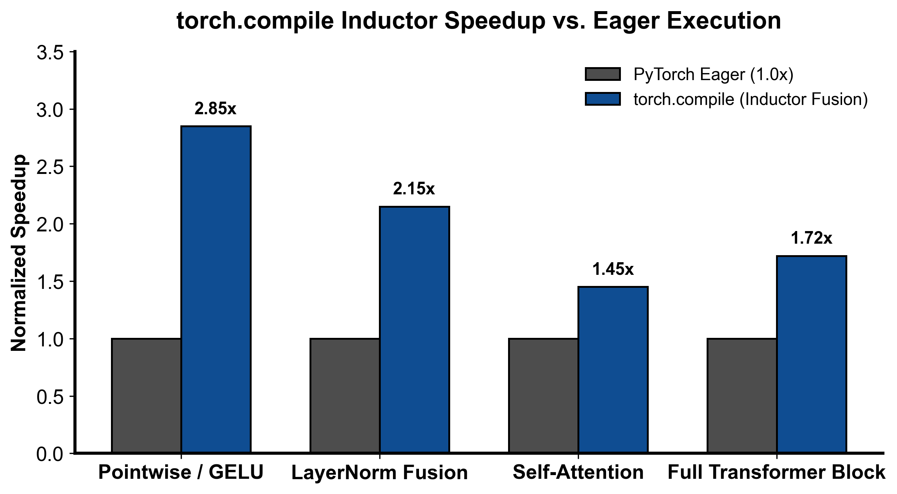

::: {.callout-note appearance="simple"}
**参考答案版**：包含完整代码实现与问答题深度参考解析。建议先独立完成练习题后再展开核对。
:::


## 本课目标与完成标准

本课产出：模拟 shape guard cache key，解释 graph capture、重新编译和 eager fallback 的诊断方法。

通过要求：唯一代码填空题通过给定检查；Q1～Q3 都给出因果链；能指出一个正确性边界和一个性能/运营取舍；总分至少 8/10。

## 与既有六条主线的边界

`mlir/` 讲通用 IR；本课只讲 PyTorch 运行时如何从 Python frame 捕获图、建立 guards，并把图交给后端。

前置：Python、PyTorch、train 第 1～5 课、CUDA 基础。本课只补 AI Infra 缺口，不重复已经完成的 kernel 或并行算法推导。

## 核心概念与运行机制

### 核心操作与执行流程图解

::: {.img-card}
{width="85%"}
<p class="caption">图 2-1：torch.compile Inductor 融合算子对比 Eager 原生执行加速比（基于 scientific-figure-making 绘制）</p>
:::

```{mermaid}
flowchart LR
    Call["调用已编译模型 fn(*args)"] --> CheckGuards{"Guard 快速校验是否全部通过?"}
    CheckGuards -->|命中缓存| FastPath["直接执行已编译高性能 Triton 机器码 (极速)"]
    CheckGuards -->|Guard 失效| Recompile["触发重新捕获与重编译 (Recompilation)"]
    Recompile --> DynamicCheck{"是否出现动态维度漂移 (Dynamic Shapes)?"}
    DynamicCheck -->|是| SymInt["引入符号整数 (SymInt) 生成泛化内核"]
    DynamicCheck -->|否| Specialize["针对当前固定尺寸特化编译"]
```
<p class="caption" align="center"><em>图 2-2：torch.compile Guard 命中判定与自适应特化重编译时序</em></p>

### 1. 它是什么，解决什么问题

PyTorch 标志性的即时执行模式（Eager Mode）赋予了算法开发者极致的 Python 交互性与调试便利性，但在大规模 AI Infra 与生产部署中暴露出两大核心性能劣势：
1. **显存读写瓶颈（Memory Bandwidth Wall）**：在由大量细粒度算子（如 Bias-Add、LayerNorm、GELU、Residual Add）构成的网络中，GPU 大部分时间都在将中间激活从 HBM 读入 SRAM、计算后又写回 HBM，产生了海量冗余的高带宽访存往返；
2. **CPU 调度发射瓶颈（CPU Overhead Wall）**：每个小算子都需要穿透 Python 解释器与 Dispatcher，当底层 Kernel 仅执行几微秒时，CPU 发射延迟超过了 GPU 运算时间，造成严重的 GPU 计算流水线饥饿。

**`torch.compile`（PyTorch 2.0 编译器技术栈）**在彻底保持 Python 动态语法与原生开发体验的前提下，实现了媲美静态图引擎的高性能：
- **三层协同架构**：由 **TorchDynamo**（基于 CPython PEP 523 字节码重写前端捕获 FX 计算图）、**AOTAutograd**（在编译期捕获前向与反向联合图并生成高效重计算方案）与 **TorchInductor**（后端深度学习编译器代码生成器，自动将算子编译并融合为高性能 Triton / C++ 内核）三位一体构成；
- **算子极致融合**：如图 2-1 所示，通过将多个连续的点元运算（Pointwise）与归约运算（Reduction）在 SRAM 层面彻底融合为单个 Triton 内核，消除中间 HBM 往返，可取得 1.5x~2.5x 的稳定吞吐跃升；
- **守卫验证与安全边界**：通过 **Guards** 机制构建严密的前提契约，并在遭遇不可追踪代码时通过 **Graph Break** 安全分区降级。

### 2. 它如何工作

`torch.compile` 的执行流涵盖了从字节码捕获、Guard 校验到动态重编译的完整生命周期（时序如图 2-2 所示）：

1. **TorchDynamo 字节码拦截与 FX 图提取**：
   - 当调用 `@torch.compile` 装饰的函数时，TorchDynamo 拦截 CPython 栈帧（Frame Evaluation）；
   - Dynamo 模拟执行 Python 字节码，将纯张量运算提取为 `torch.fx.GraphModule`，同时针对执行路径所依赖的环境前提生成一系列断言条件，即 **Guards**；
   - 生成的静态图交由后端 Inductor 生成融合 Triton 内核，并将编译产物与 Guards 关联存入进程级代码缓存。
2. **Guard 快速校验与极速路径（Fast Path）**：
   - 如图 2-2 所示，在后续调用 `fn(*args)` 时，系统不会重新解析代码，而是以纳秒级速度执行编译期生成的 Guard 判定树（`CheckGuards`）：
     - 检查输入张量的属性：`dtype == torch.bfloat16`、`device == cuda:0`、`requires_grad == True`；
     - 检查张量内存布局：`stride == (..., 1)`（是否连续）；
     - 检查未被标记为动态维度的静态形状、以及引用的 Python 全局变量与模块属性是否保持未修改。
   - 若全部 Guard 命中，执行跳转至极速路径（Fast Path），直接调用已加载的 Triton 二进制代码，零 Python 解释与零 Dispatcher 冗余开销。
3. **Guard 失效与符号动态推导（Recompilation & SymInt）**：
   - 若新传入的张量尺寸或属性打破了现有 Guard（例如 Batch 尺寸从 2 变为 8），系统触发 **Guard Failure** 并启动重新编译（Recompilation）；
   - 若开启了动态维度支持（`dynamic=True`），Dynamo 将该变化维度抽象为符号整数（`SymInt`，如 $s_0, s_1$），生成参数化泛型 Triton 内核，使得后续任意合法 Batch Size 均可命中同一个泛型 Guard，避免重编译风暴；
   - 若未开启或算子强依赖静态常量，系统将针对当前尺寸编译出新的特化代码变体（Specialized Variant）。
4. **Graph Break 的发生与分区执行**：
   - 当 Dynamo 在 Python 字节码中遇到无法被安全抽象为符号图的语法结构时（例如调用了未被追踪的 C-Extension、打印了 `print(x.item())`、或基于张量具体浮点数值进行数据依赖的分支跳转 `if x.sum() > 0:`）；
   - Dynamo 无法将后续计算统一打包，被迫触发 **Graph Break**：将当前函数切分为“前向图片段 1 $\to$ Python 原生解释器回退执行 $\to$ 前向图片段 2”，以破坏算子全局融合为代价确保程序运行的绝对语义正确。

### 3. 正确性条件与常见误区

- **编译特化与 Guards 前提的数学等价性**：
  - Inductor 生成的优化内核并非无条件成立，其有效性完全绑定在 Guard 集合的真值空间内。例如，Inductor 在假设张量在物理内存中是行连续（Contiguous）的前提下生成了合并访存指令；若输入一个经过转置但未 `contiguous()` 的张量且 Guard 未能拦截，将导致 GPU 读取到完全错位的内存脏数据。
- **“设置 `dynamic=True` 就能一劳永逸阻止重编译”的伪常识**：
  - *常见误区*：误以为只要传入 `dynamic=True`，任何维度变化都不会触发重新编译。
  - *实际情况*：
    1. **0/1 特化保护**：PyTorch 编译器对维度为 0 或 1 的情况执行强制特化（因为 Batch=1 时无需考虑跨批次循环，且能消除大量广播代码）。当维度从 1 变为 2 时，必定触发重编译；
    2. **非张量依赖与全局状态漂移**：若函数内部读取了 Python 标量、布尔开关或全局字典，这些状态的改变同样会直接击穿 Guard；
    3. **算子原生约束**：某些特定底层算子（如特定版本的 FlashAttention 或硬件要求特定分块对齐的 GEMM）硬性要求输入维度必须是 16 或 64 的整数倍，迫使编译器在此处强制专门化。
- **`fullgraph=True` 的正确定位**：
  - `fullgraph=True` 绝非性能增强开关，而是一个**严格的静态断言调试工具**。开启后一旦发生任何 Graph Break，程序立即抛出异常崩溃。它适合在 CI/CD 中验证网络是否完全可编译，严禁直接在包含日志、动态打印或外部系统调用的复杂生产主循环中强行开启。

### 4. 性能与工程取舍

- **静态特化（Specialization） vs. 动态泛化（Dynamic Shapes）**：
  - **静态特化**：为固定的 $M, N, K$ 形状编译独占内核。Inductor 可以执行深度的常量折叠、展开循环（Loop Unrolling）、并选择最优的 Thread Block Tile 大小，Kernel 执行时间达到物理极致；但在服务动态输入（如不定长对话）时会导致严重的“首请求长卡顿”与编译风暴（Compilation Storm），甚至耗尽磁盘缓存与主机内存。
  - **动态泛化（`dynamic=True`）**：引入 `SymInt` 生成通用代码，显著收敛编译变体数量（通常仅需编译 1~2 次）；但代价是无法将维度作为常量内联，可能错失部分极限激进的编译器 Tile 调优机会。
- **JIT 编译时延与冷启动惩罚（Warmup Latency Overhead）**：
  - 在大模型训练或推理服务冷启动阶段，首个 Step 往往需要经历长达数十秒甚至数分钟的 Dynamo 追踪与 Inductor Triton 代码生成。工程落地必须采用预热输入（Warmup Inputs）进行预先捕获，或利用 PyTorch AOTInductor / 预存编译缓存（Persistent Cache）跳过生产运行时的实时编译。

## 具体演示

设输入张量几何维度为 `shape = (B, S, H)`，其中隐层维度 `H = 4096` 固定，而 Batch `B` 与序列长度 `S` 支持动态变长（`dynamic_dims = {0, 1}`）：
1. 编译期构建的教学版 Guard Key 将动态维度抽象为通配符通配：
   $$\text{GuardKey} = (("*", "*", 4096), \text{"bfloat16"}, \text{"cuda"})$$
2. 运行时请求判定：
   - 请求 1：`shape = (2, 128, 4096), dtype = "bfloat16", device = "cuda"` $\to$ 匹配 Guard Key，命中缓存，直接发射内核；
   - 请求 2：`shape = (8, 256, 4096), dtype = "bfloat16", device = "cuda"` $\to$ 维度 0 和 1 虽变但被通配符覆盖，且静态维度 4096、精度与设备完全一致 $\to$ **再次命中缓存，零重编译**；
   - 请求 3：`shape = (2, 128, 2048), dtype = "bfloat16", device = "cuda"` $\to$ 静态隐层维度 $H$ 改变 $\to$ **Guard 失效，触发重编译**并生成新的特化变体。

## 实践任务：唯一代码填空题

补齐教学版 guard key：动态维用 `*`，静态维保留精确大小。

只能修改 `TODO`/`______` 位置，不得删除断言或放宽通过条件。

```{python}
#| course_role: exercise
def guard_key(shape, dynamic_dims, dtype, device):
    if any(i < 0 or i >= len(shape) for i in dynamic_dims):
        raise ValueError("dynamic dim out of range")
    dynamic_dims = set(dynamic_dims)
    guarded_shape = tuple("*" if i in dynamic_dims else size
                          for i, size in enumerate(shape))
    # TODO：dtype/device 仍属于 guard。
    return ______

assert guard_key((2, 128, 4096), {0, 1}, "bf16", "cuda") == (("*", "*", 4096), "bf16", "cuda")
assert guard_key((8, 256, 4096), {0, 1}, "bf16", "cuda") == (("*", "*", 4096), "bf16", "cuda")
```

### 检查方法

运行本单元格，所有断言必须通过；再补一个边界输入并解释预期。

### Q1

graph break 与 guard failure 有什么区别？

**你的答案：**

### Q2

把 `dynamic=True` 打开后仍重新编译，可能有哪些原因？

**你的答案：**

### Q3

什么时候先用 `fullgraph=True`，什么时候不适合长期打开？

**你的答案：**

## 评分规则

- 代码 4 分：正常输入 2 分、边界输入 1 分、解释 1 分；
- Q1～Q3 各 2 分；
- 一票否决：混淆测量与推测、忽略租户/请求隔离、用平均值掩盖尾延迟、删除失败路径。


::: {.callout-tip collapse="true" title="💡 点击展开参考答案与详细代码实现" icon="false"}
## 参考答案（仅 answer 分支）

先独立完成。核对后请改变一个规模或故障条件重新推演。

```{python}
#| course_role: solution
def guard_key(shape, dynamic_dims, dtype, device):
    if any(i < 0 or i >= len(shape) for i in dynamic_dims):
        raise ValueError("dynamic dim out of range")
    dynamic_dims = set(dynamic_dims)
    guarded_shape = tuple("*" if i in dynamic_dims else size
                          for i, size in enumerate(shape))
    return guarded_shape, dtype, device

assert guard_key((2, 128, 4096), {0, 1}, "bf16", "cuda") == (("*", "*", 4096), "bf16", "cuda")
assert guard_key((8, 256, 4096), {0, 1}, "bf16", "cuda") == (("*", "*", 4096), "bf16", "cuda")
```

### Q1 参考答案

Graph Break 与 Guard Failure 是 `torch.compile` 运行时在完全不同生命周期阶段遭遇的两种本质不同的系统事件：
1. **发生阶段与触发主体不同（Tracing Time vs. Runtime Execution）**：
   - **Graph Break（图截断）**：发生在 TorchDynamo 静态分析 Python 字节码并构造 FX 图的**捕获/追踪期（Tracing Phase）**。当遇到 Dynamo 无法安全符号化的高级语言构造（如基于 Tensor 标量值的数据依赖分支 `if x.item() > 0:`、非受控 C-Extension、未追踪的三方库调用、全局属性动态注入）时触发；
   - **Guard Failure（守卫失效）**：发生在图编译已成功完成后的**运行时调用期（Runtime Invocation Phase）**。当传入一组新输入张量时，系统快速运行之前生成的一串布尔校验条件（Guards），发现当前输入的某些物理属性（如张量 Dtype、内存 Stride、静态 Shape、或引用的全局变量）与原编译假设不符；
2. **系统后果与处理机制不同（Partitioning vs. Recompilation）**：
   - Graph Break 会将单一函数的计算图强行撕裂为多个不连续的子图（Subgraphs），子图之间被迫退化回原生的 CPython 解释器循环，破坏了全局算子融合与跨算子内存重排；
   - Guard Failure 不一定会切裂图。系统发现 Guard 失效后，若尚未达到重编译上限（`cache_size_limit`），会为新输入启动重新编译（Recompilation），生成新的特化变体或泛化变体并加入缓存；只有当重编译次数超限时，才会彻底放弃编译回退到 Eager 模式执行；
3. **诊断观测工具链**：
   - 排查 Graph Break 使用 `TORCH_LOGS="graph_breaks"` 或调用 `torch._dynamo.explain(fn)(*args)`；
   - 排查 Guard Failure 与重编译原因使用 `TORCH_LOGS="guards,recompiles"` 查看具体触发失效的表达式。

### Q2 参考答案

开启 `dynamic=True` 后系统依然发生重新编译，通常是由以下四类深层系统与数学约束导致的：
1. **0/1 特化保护机制（0/1 Specialization Invariant）**：
   - 编译器对尺寸为 0 或 1 的维度具有强制特化逻辑（因为 $B=1$ 可以消除批处理广播与循环展开开销）。若先前追踪时的 Batch Size 为 1，后续传入 Batch Size 为 4，即使开启 `dynamic=True`，系统也会因为脱离单批次特化而触发一次重编译；
2. **物理内存布局与连续性漂移（Stride / Layout Drift）**：
   - `dynamic=True` 仅将 Tensor 的 `shape` 抽象为符号整数（`SymInt`），但并没有放宽内存步长（Stride）的排列。若输入的张量由于切片或转置导致内存步长（Stride）模式改变（如从行优先连续存储变为转置后的非连续存储），底层 Triton 内核的指针寻址公式失效，必定触发 Guard Failure 并重新编译；
3. **非张量参数与全局 Python 状态改变（Non-Tensor & Global Drift）**：
   - 函数的输入参数中包含未被忽略的 Python 标量（如学习率 `lr`、`dropout_p`、布尔开关 `training`），或者模块内部读取了全局环境变量与类静态属性。这些非张量值的改变均直接击穿 Guard；
4. **底层硬件算子硬约束（Backend Kernel Alignment）**：
   - 某些底层融合算子（如 FlashAttention 或硬件对齐 GEMM）强依赖分块对齐（例如要求序列长度 $S$ 必须被 16 或 64 整除）。当动态维度跨越不同对齐约束或打破符号断言（如符号求解器推导出 $s_0 > 16$ 与 $s_0 \le 16$ 分属不同分支）时，编译器被迫生成新变体。

### Q3 参考答案

`fullgraph=True` 是高价值的调试与质量门禁工具，但绝非适合在复杂生产环境长期全局开启的开关：
1. **最佳适用场景——离线测试、CI/CD 与架构质量门禁（Quality Gate & Continuous Integration）**：
   - 在将新模型架构上线、或编写关键 Transformer 算子模块时，开发者通过设置 `torch.compile(model, fullgraph=True)` 作为严苛的防御性断言；
   - 一旦代码中存在任何暗藏的 Graph Break（如隐式调用 `.item()`、未注册的第三方扩展或不当的 Python 分支），程序立即以清晰的栈追踪抛出异常崩溃。这能强制算法工程师在离线阶段清除所有图截断，确保整张模型能够实现端到端跨层算子全局融合；
2. **不适合长期打开的生产场景——复杂服务主循环与工程弹性（Resilience in Production Serving）**：
   - 在实际生产的推理服务或分布式训练大循环中，往往不可避免地包含日志打印（`logging`）、动态指标采样、异常探测（如梯度范数 NaN 检查）、动态 Early-Stopping、或与分布式通信控制面（Slurm/Kubernetes 健康检查）的交互；
   - 若在整个主流程中长期开启 `fullgraph=True`，任何非核心的动态 Python 调试或轻量 I/O 操作都会瞬间击垮整个分布式集群，造成服务硬性中断。在生产中应当对模型的核心计算前向子模块（`model.forward`）局部使用 `torch.compile`，并允许合理的子图安全分区执行。

## 参考资料

- [torch.compile documentation](https://docs.pytorch.org/docs/stable/generated/torch.compile.html)
- [TorchDynamo Troubleshooting and Graph Breaks](https://pytorch.org/docs/stable/torch.compiler_troubleshooting.html)
- [PyTorch Dynamic Shapes Guide](https://docs.pytorch.org/docs/stable/torch.compiler_dynamic_shapes.html)
- [TorchInductor Architecture](https://dev-discuss.pytorch.org/t/torchinductor-a-compiler-for-pytorch/533)

API 与平台能力会演进；部署前应按目标版本重新核对。
:::
