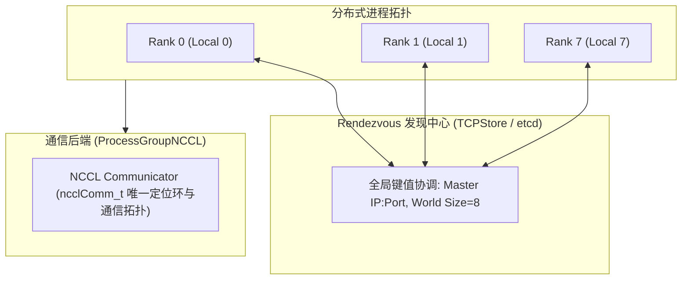
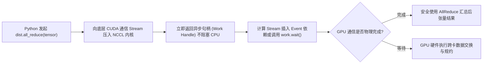

::: {.callout-note appearance="simple"}
**参考答案版**：包含完整代码实现与问答题深度参考解析。建议先独立完成练习题后再展开核对。
:::


## 本课目标与完成标准

本课产出：实现跨 rank collective 合同校验，并解释为何 rank 不一致通常表现为挂起而非普通异常。

通过要求：唯一代码填空题通过给定检查；Q1～Q3 都给出因果链；能指出一个正确性边界和一个性能/运营取舍；总分至少 8/10。

## 与既有六条主线的边界

`train/lesson03` 已推导 collective 数据语义；本课关注进程如何形成 group、调用顺序/shape 合同和失败传播。

前置：Python、PyTorch、train 第 1～5 课、CUDA 基础。本课只补 AI Infra 缺口，不重复已经完成的 kernel 或并行算法推导。

## 核心心智模型


### 核心操作与执行流程图解


<p class="caption" align="center"><em>图 3-1：分布式训练集合通信初始化与 ProcessGroup 物理拓扑映射</em></p>


<p class="caption" align="center"><em>图 3-2：异步集合通信下发、流同步契约与句柄等待流程</em></p>


### 核心操作与执行流程图解

```{mermaid}
flowchart TD
    subgraph Rendezvous["Rendezvous 发现中心 (TCPStore / etcd)"]
        Store["全局键值协调: Master IP:Port, World Size=8"]
    end
    subgraph Cluster["分布式进程拓扑"]
        R0["Rank 0 (Local 0)"] <--> Store
        R1["Rank 1 (Local 1)"] <--> Store
        R7["Rank 7 (Local 7)"] <--> Store
    end
    subgraph Backends["通信后端 (ProcessGroupNCCL)"]
        Comm["NCCL Communicator (ncclComm_t 唯一定位环与通信拓扑)"]
    end
    Cluster --> Backends
```
<p class="caption" align="center"><em>图 3-1：分布式训练集合通信初始化与 ProcessGroup 物理拓扑映射</em></p>

```{mermaid}
flowchart LR
    Host["Python 发起 dist.all_reduce(tensor)"] --> Enqueue["向底层 CUDA 通信 Stream 压入 NCCL 内核"]
    Enqueue --> ReturnWork["立即返回异步句柄 (Work Handle) 不阻塞 CPU"]
    ReturnWork --> ComputeStream["计算 Stream 插入 Event 依赖或调用 work.wait()"]
    ComputeStream --> SyncCheck{"GPU 通信是否物理完成?"}
    SyncCheck -->|完成| Next["安全使用 AllReduce 汇总后张量结果"]
    SyncCheck -->|等待| GPUWait["GPU 硬件执行跨卡数据交换与规约"]
```
<p class="caption" align="center"><em>图 3-2：异步集合通信下发、流同步契约与句柄等待流程</em></p>


### 它是什么、解决什么问题

Rendezvous 建立 rank/world 信息，process group 管理通信 backend。collective 要求组内所有 rank 以兼容的操作、顺序、count、dtype 参与。

### 数据与控制如何流动

控制面先通过 rendezvous 形成成员与 rank，随后每个 rank 创建同一 process group；数据面按相同序列号提交 collective，backend 匹配参与者、搬运数据并通过 work handle/stream 报告完成或失败。

### 正确性条件与常见误区

某 rank 跳过 collective 或顺序不同会让其他 rank 等待匹配调用；timeout 只是发现问题，不修复状态。失败后 communicator 可能必须 abort/recreate。

### 性能、成本与工程取舍

全局 barrier 便于定位却会序列化并放大 straggler；异步 collective 可重叠，但必须管理 stream、work handle 与 tensor 生命周期。

## 具体演示

rank0 调 all_reduce(1024 fp16)，rank1 调 all_gather 或 count=512：两端并不知道对方 Python 意图一致，可能挂起、崩溃或数据损坏。

请先独立复述“输入 → 状态变化 → 输出/指标”，再开始填空。

## 实践任务：唯一代码填空题

补齐 collective 合同校验；每个调用为 `(op,count,dtype,sequence)`。

只能修改 `TODO`/`______` 位置，不得删除断言或放宽通过条件。

```{python}
#| course_role: exercise
def validate_collective(calls_by_rank):
    if not calls_by_rank:
        raise ValueError("empty process group")
    reference = calls_by_rank[0]
    # TODO：所有 rank 的合同必须与 rank0 完全一致。
    return ______

ok = [("all_reduce", 1024, "fp16", 7)] * 4
bad = ok[:3] + [("all_reduce", 512, "fp16", 7)]
assert validate_collective(ok)
assert not validate_collective(bad)
```

### 检查方法

运行本单元格，所有断言必须通过；再补一个边界输入并解释预期。

### Q1

为什么某 rank 先进入下一次 all-reduce 可能让错误看起来发生在后一次调用？

**你的答案：**

### Q2

增加 barrier 为什么有助定位但不应当成最终修复？

**你的答案：**

### Q3

进程超时后直接重试同一个 communicator 有何风险？

**你的答案：**

## 评分规则

- 代码 4 分：正常输入 2 分、边界输入 1 分、解释 1 分；
- Q1～Q3 各 2 分；
- 一票否决：混淆测量与推测、忽略租户/请求隔离、用平均值掩盖尾延迟、删除失败路径。


::: {.callout-tip collapse="true" title="💡 点击展开参考答案与详细代码实现" icon="false"}
## 参考答案（仅 answer 分支）

先独立完成。核对后请改变一个规模或故障条件重新推演。

```{python}
#| course_role: solution
def validate_collective(calls_by_rank):
    if not calls_by_rank:
        raise ValueError("empty process group")
    reference = calls_by_rank[0]
    return all(call == reference for call in calls_by_rank)

ok = [("all_reduce", 1024, "fp16", 7)] * 4
bad = ok[:3] + [("all_reduce", 512, "fp16", 7)]
assert validate_collective(ok)
assert not validate_collective(bad)
```

### Q1 参考答案

collective 匹配依赖全局顺序。前一次分支不一致后，rank 的序列号错位，某个后续调用才遇到 count/op 不兼容或 timeout；真正根因通常是最早的控制流分叉。

### Q2 参考答案

barrier 缩小哪个阶段开始分叉，并让失败更靠近根因；但它不修复不一致，还引入同步和 straggler 成本。最终要保证控制流/数据合同一致或把不同参与集合拆成不同 group。

### Q3 参考答案

未完成工作、异步错误和各 rank 状态可能不一致，communicator 已不可用。应按 backend 文档检查 async error、abort/destroy，并由统一协调恢复全部相关 ranks。

## 参考资料

- [PyTorch distributed](https://docs.pytorch.org/docs/stable/distributed.html)
- [NCCL User Guide](https://docs.nvidia.com/deeplearning/nccl/user-guide/index.html)

API 与平台能力会演进；部署前应按目标版本重新核对。
:::
