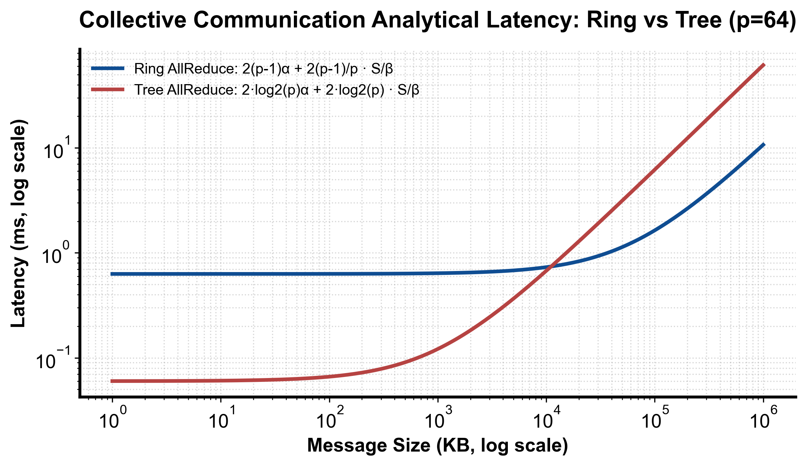

::: {.callout-note appearance="simple"}
**参考答案版**：包含完整代码实现与问答题深度参考解析。建议先独立完成练习题后再展开核对。
:::


## 本课目标与完成标准

本课产出：实现 ring/tree 的 α-β 粗模型，并解释为什么模型只能筛选、不能替代 nccl-tests。

通过要求：唯一代码填空题通过给定检查；Q1～Q3 都给出因果链；能指出一个正确性边界和一个性能/运营取舍；总分至少 8/10。

## 与既有六条主线的边界

`train/` 已计算通信量；本课把 latency α、带宽 β、消息大小和拓扑 hop 连接到 runtime algorithm 选择。

前置：Python、PyTorch、train 第 1～5 课、CUDA 基础。本课只补 AI Infra 缺口，不重复已经完成的 kernel 或并行算法推导。

## 核心心智模型


### 核心操作与执行流程图解

::: {.img-card}
{width="85%"}
<p class="caption">图 4-1：Ring 与 Tree 集合通信算法理论时延模型与报文尺度分界（基于 scientific-figure-making 绘制）</p>
:::

```{mermaid}
flowchart TD
    Msg["待规约报文尺寸 S 与集群卡数 P"] --> Threshold{"S 是否大于环/树分界阈值?"}
    Threshold -->|"S 较小 (小包)"| SelectTree["选择 Tree / CollNet 算法 (极小化延迟 α)"]
    Threshold -->|"S 较大 (大张量)"| SelectRing["选择 Ring 环形切分流水 (极大化总线带宽利用率 β)"]
    SelectTree & SelectRing --> PipeCheck{"跨机网络是否支持 NVLink + RoCE 异构层次?"}
    PipeCheck -->|支持| TwoLevel["启用分层规约: 节点内 NVLink 规约 -> 节点间跨机网络 -> 节点内广播"]
```
<p class="caption" align="center"><em>图 4-2：通信报文尺度判定与层次化集合通信算法路由决策流</em></p>


### 它是什么、解决什么问题

Ring all-reduce 近似 `2(p-1)α + 2(p-1)/p·n/B`；tree 近似 `2log₂p·α + 2log₂p·n/B_tree`。真实 NCCL 会按拓扑、协议和 channel 调整。

### 数据与控制如何流动

把 world size、消息字节、候选算法的步骤数和实测有效带宽代入粗模型，先筛掉明显不合适的选择；再用目标拓扑上的 nccl-tests 与训练 trace 校准 α、B 和层级边界。

### 正确性条件与常见误区

B 必须是有效单流/路径带宽而非宣传总带宽；跨节点层级、共享 NIC、rail 和 PCIe root 会改变模型。collective 各 rank count/dtype 仍需满足合同。

### 性能、成本与工程取舍

大消息 ring 带宽利用好；小消息 tree 步数少。层级算法可先节点内 reduce、再跨节点、再广播，但增加阶段和调度复杂度。

## 具体演示

p=64、α=5μs 时 ring 延迟项 630μs，tree 约 60μs；消息足够大后带宽项可能反转选择。

请先独立复述“输入 → 状态变化 → 输出/指标”，再开始填空。

## 实践任务：唯一代码填空题

补齐 ring/tree 粗略时间，并返回更快算法名。单位统一为秒、字节、字节/秒。

只能修改 `TODO`/`______` 位置，不得删除断言或放宽通过条件。

```{python}
#| course_role: exercise
import math

def choose_allreduce(world, nbytes, alpha_s, ring_bw, tree_bw):
    if world < 2 or nbytes < 0 or alpha_s < 0 or ring_bw <= 0 or tree_bw <= 0:
        raise ValueError("invalid model")
    ring = 2 * (world - 1) * alpha_s + 2 * (world - 1) / world * nbytes / ring_bw
    levels = math.ceil(math.log2(world))
    tree = 2 * levels * alpha_s + 2 * levels * nbytes / tree_bw
    # TODO：同时返回选择和两种估算，便于审计。
    return ______

name, ring_t, tree_t = choose_allreduce(64, 1024, 5e-6, 100e9, 100e9)
assert name == "tree" and tree_t < ring_t
```

### 检查方法

运行本单元格，所有断言必须通过；再补一个边界输入并解释预期。

### Q1

为什么把 NVLink 总双向带宽直接代入 B 会过度乐观？

**你的答案：**

### Q2

小消息 tree 更快的核心原因是什么？

**你的答案：**

### Q3

模型预测 ring 快，实测却慢，排查顺序是什么？

**你的答案：**

## 评分规则

- 代码 4 分：正常输入 2 分、边界输入 1 分、解释 1 分；
- Q1～Q3 各 2 分；
- 一票否决：混淆测量与推测、忽略租户/请求隔离、用平均值掩盖尾延迟、删除失败路径。


::: {.callout-tip collapse="true" title="💡 点击展开参考答案与详细代码实现" icon="false"}
## 参考答案（仅 answer 分支）

先独立完成。核对后请改变一个规模或故障条件重新推演。

```{python}
#| course_role: solution
import math

def choose_allreduce(world, nbytes, alpha_s, ring_bw, tree_bw):
    if world < 2 or nbytes < 0 or alpha_s < 0 or ring_bw <= 0 or tree_bw <= 0:
        raise ValueError("invalid model")
    ring = 2 * (world - 1) * alpha_s + 2 * (world - 1) / world * nbytes / ring_bw
    levels = math.ceil(math.log2(world))
    tree = 2 * levels * alpha_s + 2 * levels * nbytes / tree_bw
    return ("ring" if ring <= tree else "tree"), ring, tree

name, ring_t, tree_t = choose_allreduce(64, 1024, 5e-6, 100e9, 100e9)
assert name == "tree" and tree_t < ring_t
```

### Q1 参考答案

单 collective 的有效路径、方向、协议、channel、拓扑争用和 GPU/NIC 注入率都有限；总双向峰值不是某 rank 某时刻可用的单流带宽。应由 nccl-tests/trace 测有效 B。

### Q2 参考答案

主要是同步/启动步数从 O(p) 降为 O(log p)，α 项小。若 tree 每层带宽低或消息大，多次传完整消息的 β 项会抵消优势。

### Q3 参考答案

先确认 rank-GPU/NIC 绑定和拓扑，再看消息大小、NCCL algorithm/protocol、跨 rail、网络错误/重传、共享流量和 GPU 时钟；最后校准 α/B，而不是立即改训练算法。

## 参考资料

- [NCCL User Guide](https://docs.nvidia.com/deeplearning/nccl/user-guide/index.html)
- [PyTorch distributed](https://docs.pytorch.org/docs/stable/distributed.html)

API 与平台能力会演进；部署前应按目标版本重新核对。
:::
