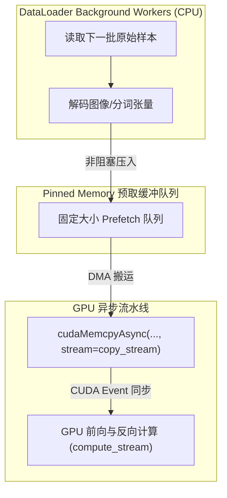

::: {.callout-note appearance="simple"}
**参考答案版**：包含完整代码实现与问答题深度参考解析。建议先独立完成练习题后再展开核对。
:::


## 本课目标与完成标准

本课产出：用流水阶段模型识别数据瓶颈，并计算串行与稳态 step time。

通过要求：唯一代码填空题通过给定检查；Q1～Q3 都给出因果链；能指出一个正确性边界和一个性能/运营取舍；总分至少 8/10。

## 与既有六条主线的边界

`platform/` 后续讲存储硬件；本课关注单训练进程如何通过 shard、decode、collate、pin、async H2D 和 prefetch 喂满 GPU。

前置：Python、PyTorch、train 第 1～5 课、CUDA 基础。本课只补 AI Infra 缺口，不重复已经完成的 kernel 或并行算法推导。

## 核心心智模型


### 核心操作与执行流程图解


<p class="caption" align="center"><em>图 6-1：数据从外部介质经锁页内存直达 GPU 的四层物理搬运通道</em></p>


<p class="caption" align="center"><em>图 6-2：CPU 数据预处理与 GPU 计算三级异步重叠流水线</em></p>


### 核心操作与执行流程图解

```{mermaid}
flowchart LR
    Storage["远端对象存储 / NVMe SSD"] -->|Read/IO| PageCache["操作系统 Page Cache (CPU)"]
    PageCache -->|Decode/Process| PageableRAM["常规 CPU 内存 (可换页分页内存)"]
    PageableRAM -->|Fast Copy| PinnedMem["锁页内存 (Pinned / Page-Locked Memory)"]
    PinnedMem -->|PCIe DMA 极速拷贝| VRAM["GPU 显存 (HBM / GDDR)"]
```
<p class="caption" align="center"><em>图 6-1：数据从外部介质经锁页内存直达 GPU 的四层物理搬运通道</em></p>

```{mermaid}
flowchart TD
    subgraph WorkerThreads["DataLoader Background Workers (CPU)"]
        W1["读取下一批原始样本"] --> W2["解码图像/分词张量"]
    end
    subgraph PinnedQueue["Pinned Memory 预取缓冲队列"]
        Q["固定大小 Prefetch 队列"]
    end
    subgraph GPUSync["GPU 异步流水线"]
        DMA["cudaMemcpyAsync(..., stream=copy_stream)"]
        Compute["GPU 前向与反向计算 (compute_stream)"]
    end
    W2 -->|非阻塞压入| Q
    Q -->|DMA 搬运| DMA
    DMA -->|CUDA Event 同步| Compute
```
<p class="caption" align="center"><em>图 6-2：CPU 数据预处理与 GPU 计算三级异步重叠流水线</em></p>


### 它是什么、解决什么问题

串行路径把各阶段时间相加；理想双缓冲稳态由最慢阶段决定。`pin_memory` 让 H2D 可更高效，`non_blocking` 只有在内存/stream 条件满足时才可能重叠。

### 数据与控制如何流动

worker 从存储读取并解码，主进程 collate 后把 batch 放入 pinned memory，copy stream 异步搬到 GPU；event 建立 copy 与 compute 的依赖，双缓冲让第 n 批计算与第 n+1 批准备重叠。

### 正确性条件与常见误区

预取数据的生命周期必须覆盖异步 copy；自定义 batch 要实现 pinning；worker 随机种子、文件句柄和 fork/spawn 行为影响正确性与稳定性。

### 性能、成本与工程取舍

增加 worker 只到 CPU/存储饱和为止；过多 worker 增加内存、上下文切换和随机 I/O。大 shard 顺序读吞吐高但恢复/负载均衡粒度粗。

## 具体演示

read=12ms、decode=8ms、H2D=5ms、GPU=20ms：串行 45ms，理想流水稳态 20ms；若 GPU timeline 每 20ms 前空 12ms，说明流水尚未建立或输入不足。

请先独立复述“输入 → 状态变化 → 输出/指标”，再开始填空。

## 实践任务：唯一代码填空题

补齐串行与理想流水稳态时间；阶段时间必须非负。

只能修改 `TODO`/`______` 位置，不得删除断言或放宽通过条件。

```{python}
#| course_role: exercise
def pipeline_times(stage_times):
    if not stage_times or any(t < 0 for t in stage_times):
        raise ValueError("invalid stage times")
    serial = sum(stage_times)
    # TODO：无限稳态、阶段完全可重叠时由最慢阶段限速。
    steady_state = ______
    return serial, steady_state

assert pipeline_times([0.012, 0.008, 0.005, 0.020]) == (0.045, 0.020)
assert pipeline_times([0.0, 1.0]) == (1.0, 1.0)
```

### 检查方法

运行本单元格，所有断言必须通过；再补一个边界输入并解释预期。

### Q1

`pin_memory=True` 为什么不保证 H2D 与计算重叠？

**你的答案：**

### Q2

num_workers 从 8 加到 32 后吞吐下降，可能有哪些资源争用？

**你的答案：**

### Q3

如何区分数据不足与 GPU kernel 本身慢？

**你的答案：**

## 评分规则

- 代码 4 分：正常输入 2 分、边界输入 1 分、解释 1 分；
- Q1～Q3 各 2 分；
- 一票否决：混淆测量与推测、忽略租户/请求隔离、用平均值掩盖尾延迟、删除失败路径。


::: {.callout-tip collapse="true" title="💡 点击展开参考答案与详细代码实现" icon="false"}
## 参考答案（仅 answer 分支）

先独立完成。核对后请改变一个规模或故障条件重新推演。

```{python}
#| course_role: solution
def pipeline_times(stage_times):
    if not stage_times or any(t < 0 for t in stage_times):
        raise ValueError("invalid stage times")
    serial = sum(stage_times)
    steady_state = max(stage_times)
    return serial, steady_state

assert pipeline_times([0.012, 0.008, 0.005, 0.020]) == (0.045, 0.020)
assert pipeline_times([0.0, 1.0]) == (1.0, 1.0)
```

### Q1 参考答案

还需要异步 copy、独立/正确 stream、数据依赖同步和足够预取；若立即在默认流等待、CPU 生产太慢或 batch 类型未真正 pin，仍会串行。

### Q2 参考答案

CPU 核、内存带宽、page cache、文件句柄、存储 IOPS、解压库线程和进程 IPC 都可能饱和；每 worker 的 prefetch 还扩大 RAM 占用。应分阶段测量而非只扫 worker 数。

### Q3 参考答案

看 GPU timeline 是否有空洞、DataLoader wait、H2D 和 kernel 的相对位置；用预生成 GPU resident batch 对照。如果 resident batch 仍慢是 compute，若明显变快是输入路径。

## 参考资料

- [torch.utils.data](https://docs.pytorch.org/docs/stable/data.html)
- [PyTorch CUDA semantics](https://docs.pytorch.org/docs/stable/notes/cuda.html)

API 与平台能力会演进；部署前应按目标版本重新核对。
:::
