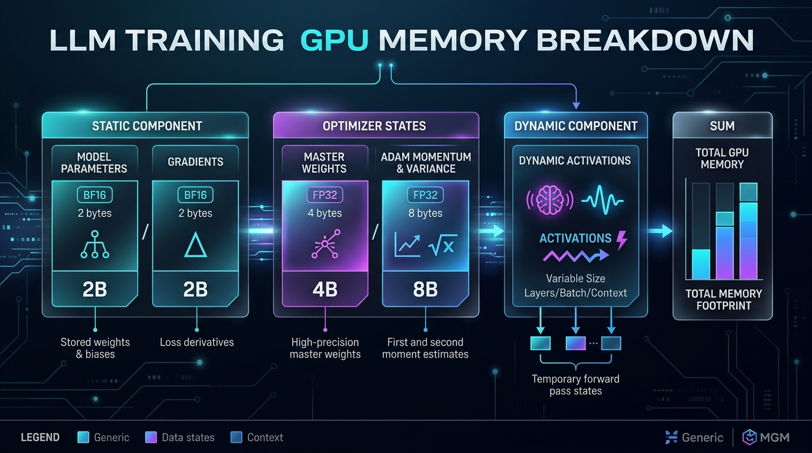

::: {.callout-note appearance="simple"}
**参考答案版**：包含完整代码实现与问答题深度参考解析。建议先独立完成练习题后再展开核对。
:::


::: {.callout-important title="统一完成标准与及格线"}
代码 4 分、Q1～Q3 各 2 分，通过线 8/10。必须解释正确性边界、显存/通信公式中的单位与分片维度；未实际运行的内容只能标记为静态审查。

:::


- 对应官方章节：First Steps: Training on One GPU → Memory usage in transformers（静态部分）、附录 A2
- 前置：Python 基础、神经网络训练的大致概念
- 状态：学习中（代码工作簿 `ch1.ipynb`）

## 本课目标

完成后你需要能够：

- 解释一次训练迭代的三个阶段。
- 区分四类主要显存占用。
- 根据参数量和精度估算静态训练显存。
- 说明估算结果的边界，避免把理论值冒充峰值显存。

## 核心概念


### 核心操作与执行流程图解

::: {.img-card}
{width="95%"}
<p class="caption">图 1-1：大模型训练显存账本构成（静态参数、梯度、优化器状态与动态激活）</p>
:::

```{mermaid}
sequenceDiagram
    autonumber
    participant F as 前向传播 (Forward)
    participant B as 反向传播 (Backward)
    participant O as 优化器更新 (Optimizer Step)
    participant M as 显存占用 (GPU Memory)
    
    Note over F,M: 典型训练步显存动态生命周期
    F->>M: 申请激活值内存 (随层数累加至峰值)
    Note right of M: 激活峰值达到最高点
    B->>M: 逐层释放激活值，并申请梯度存储空间
    Note right of M: 激活释放与梯度建立交替
    O->>M: 申请 Master Weights 与 FP32 Adam 动量/方差状态 (8N bytes)
    O->>M: 更新参数完毕，清空/归零梯度 (释放 2N/4N bytes)
    Note over F,M: 回到基线静态常驻显存状态
```
<p class="caption" align="center"><em>图 1-2：训练单步生命周期中的显存峰值与状态释放时序流</em></p>


### 1. 训练迭代的三阶段与显存生命周期

一次标准的深度学习模型训练迭代由三个紧密耦合的阶段构成（如上图 1-2 所示）：

1. **前向传播（Forward Pass）**：根据输入微批次数据逐层执行矩阵乘与激活计算，输出预测值与 Loss。在此过程中，必须在 GPU 显存中保存反向传播求导所需的中间隐藏状态（即**动态激活值 Activation**）。随着网络深度推进，动态显存占用持续攀升至整个训练周期的最高点（激活峰值）。
2. **反向传播（Backward Pass）**：从标量 Loss 出发，沿着计算图逆向逐层应用链式法则计算参数梯度。在此阶段，上一层的激活值在完成求导后立即被显式释放，同时申请显存用于存放计算出的梯度（Gradient）。激活释放与梯度建立交替进行，显存曲线呈现锯齿状回落。
3. **优化器更新（Optimizer Step）**：在累积完全部梯度后，优化器遍历所有参数张量，结合历史动量与方差状态执行数值更新。更新完成后立即将梯度缓冲区清零或释放，显存回落至基线静态常驻状态。

### 2. 训练显存的四大支柱与静态账本

在整个训练生命周期中，显存需求由四个核心部分构成：

$$\text{总显存需求} = \text{模型参数 (Model Parameters)} + \text{梯度 (Gradients)} + \text{优化器状态 (Optimizer States)} + \text{动态激活值 (Activations)}$$

其中前三项仅取决于模型架构参数量 $N$ 与数值精度，与输入的 Batch Size 和序列长度无关，构成了大模型训练的**静态显存账本（Static Memory Footprint）**。第四项动态激活值则与 Batch Size、序列长度紧密相关，将在第 2 课深入拆解。

#### 方案一：标准全精度训练（FP32 + Adam）

设模型参数总量为 $N$。在传统的单精度训练中：

$$\begin{aligned}
\text{FP32 模型参数} &: 4N \text{ bytes} \quad (4 \text{ bytes/param}) \\
\text{FP32 参数梯度} &: 4N \text{ bytes} \quad (4 \text{ bytes/param}) \\
\text{Adam 一阶动量 } m_t &: 4N \text{ bytes} \quad (\text{FP32 均值估算}) \\
\text{Adam 二阶动量 } v_t &: 4N \text{ bytes} \quad (\text{FP32 方差估算}) \\
\hline
\mathbf{静态显存总计} &: \mathbf{16N \text{ bytes}}
\end{aligned}$$

#### 方案二：工业级主流混合精度训练（BF16 / FP16 + Adam）

在现代大模型分布式预训练中，计算普遍采用 16 位浮点（BF16 或 FP16）以充分释放 Tensor Core 算力。此时显存构成如下：

$$\begin{aligned}
\text{BF16 / FP16 模型参数} &: 2N \text{ bytes} \quad (\text{用于前向与反向高效计算}) \\
\text{BF16 / FP16 参数梯度} &: 2N \text{ bytes} \quad (\text{用于反向计算与通信}) \\
\text{FP32 主权重 (Master Weights)} &: 4N \text{ bytes} \quad (\text{高精度参数副本，防止数值下溢}) \\
\text{FP32 Adam 一阶动量 } m_t &: 4N \text{ bytes} \quad (\text{必须保持单精度以保证数值稳定性}) \\
\text{FP32 Adam 二阶动量 } v_t &: 4N \text{ bytes} \quad (\text{梯度平方累加极易溢出，必须单精度}) \\
\hline
\mathbf{静态显存总计} &: \mathbf{16N \text{ bytes}}
\end{aligned}$$

若开启高精度梯度累积（保留一个独立的 FP32 梯度缓冲区以避免跨微批次累加时的舍入误差），则需额外增加 $4N$ bytes，总计达到 **$20N$ bytes**。

> **核心认知与面试关键考点**：  
> **混合精度训练并不必然减少模型的静态显存占用！**  
> 为什么？因为当学习率 $\eta \sim 10^{-4}$、梯度 $g \sim 10^{-3}$ 时，参数单步更新量 $\Delta W = -\eta \cdot g \sim 10^{-7}$。BF16 的尾数仅有 7 位有效数字，直接在 BF16 上做加法会导致该增量被截断归零（Underflow / 浮点加法下溢）。因此必须维持一份 FP32 Master Weights，导致混合精度下的静态账本仍然高达 $16N$ 甚至 $20N$ 字节。混合精度的核心价值在于**将张量算力翻倍、通信带宽压力减半、并将动态激活显存压减为原来的 $50\%$**。

### 3. 静态显存与物理峰值的真实边界

上述 $16N \sim 20N$ 仅是纯数学理论下界，在生产环境中，显存物理峰值还包括以下必要开销：

- **动态激活显存（Activation Memory）**：多层 Transformer 的注意力与 MLP 中间张量，长序列下往往显著反超静态账本。
- **CUDA Context 与运行时驻留**：cuBLAS、NCCL 等底层库的驱动上下文与执行内核，通常常驻占用约 $1 \sim 2\text{ GB}$。
- **临时与通信工作缓冲区（Workspace / Scratchpad）**：GEMM 内核计算缓冲、跨卡通信聚合分桶（如 DDP 的 Bucket，默认 25MB）。
- **显存内存池碎片（Allocator Fragmentation）**：PyTorch Caching Allocator 采用分块复用机制，频繁申请/释放变长张量时通常会产生 $10\% \sim 25\%$ 的物理显存碎片。

## 具体演示：7B 模型的显存估算推演

以标准的 LLaMA-7B 模型（$N = 7 \times 10^9$）为例，采用无额外 FP32 累积缓冲区的 BF16 + Adam 配置：

$$\begin{aligned}
\text{静态显存总量} &= 7 \times 10^9 \text{ 参数} \times 16 \text{ 字节/参数} \\
&= 112 \times 10^9 \text{ bytes} \\
&= 112.0 \text{ GB (十进制)} \approx 104.3 \text{ GiB (二进制，} 112 \times 10^9 / 1024^3 \text{)}
\end{aligned}$$

一台配备 80 GB 显存的 NVIDIA A100/H100 SXM 节点，实际可用物理显存约为 $80 \times 10^9 \text{ bytes} \approx 74.5\text{ GiB}$。这意味着：
- 单张 80GB 卡甚至连 7B 模型的静态权重和优化器状态都无法完整装入（$104.3\text{ GiB} > 74.5\text{ GiB}$），尚未运行任何前向计算就会直接 OOM！
- **严谨的系统设计推论**：标准、全参数、单副本的 7B 模型训练**绝不可能单卡完成**，必须引入参数与优化器分片（ZeRO / FSDP，详见第 5 课）或多维并行拆分。只有在采用 LoRA（冻结基座、仅更新约 $1\%$ 参数）、8-bit 优化器（如 bitsandbytes 将优化器状态压减至 $2N$）或模型卸载（CPU Offloading）等特殊手段下，单卡 80GB 才能跑通训练。

## 代码填空题

补全以下程序。不得删除某个显存分量，也不要直接写死最终总数。

```{python}
#| course_role: exercise
from dataclasses import dataclass


@dataclass(frozen=True)
class MemoryBreakdown:
    """所有字段的单位都是 byte。"""

    model_bf16: int
    grad_bf16: int
    master_weights_fp32: int
    adam_m_fp32: int
    adam_v_fp32: int
    grad_accum_fp32: int

    @property
    def total(self) -> int:
        # 不能手写"每参数共多少 byte"；
        # 应从各分量求和，以便检查每一项是否被重复或遗漏。
        return ______________________________


def estimate_adam_memory(
    num_params: int,
    use_fp32_grad_accum: bool,
) -> MemoryBreakdown:
    """
    估算 BF16 混合精度训练的静态显存。

    假设：
    1. 前向、反向使用 BF16 参数和梯度。
    2. 保留 FP32 master weights。
    3. Adam 的一阶、二阶状态均为 FP32。
    4. 可选一个额外的 FP32 梯度累积缓冲区。
    5. 不包含激活、临时 buffer、CUDA context 和碎片。
    """
    if num_params <= 0:
        raise ValueError("num_params must be positive")

    # 每个 BF16 数值占多少 byte？
    bf16_bytes = ______

    # 每个 FP32 数值占多少 byte？
    fp32_bytes = ______

    model_bf16 = num_params * ______
    grad_bf16 = num_params * ______

    # master weights 是用于稳定更新的 FP32 参数副本。
    master_weights_fp32 = num_params * ______

    # Adam 为每个参数分别维护一阶矩和二阶矩。
    adam_m_fp32 = num_params * ______
    adam_v_fp32 = num_params * ______

    # 注意：这是额外缓冲区，不能拿它替代 BF16 梯度。
    grad_accum_fp32 = (
        num_params * ______ if use_fp32_grad_accum else 0
    )

    return MemoryBreakdown(
        model_bf16=model_bf16,
        grad_bf16=grad_bf16,
        master_weights_fp32=master_weights_fp32,
        adam_m_fp32=adam_m_fp32,
        adam_v_fp32=adam_v_fp32,
        grad_accum_fp32=grad_accum_fp32,
    )


def bytes_to_gb(num_bytes: int) -> float:
    """十进制 GB，硬件和原文表格常使用这个单位。"""
    return num_bytes / __________________


def bytes_to_gib(num_bytes: int) -> float:
    """二进制 GiB；1 GiB = 1024^3 bytes。"""
    return num_bytes / __________________


for size in (1_000_000_000, 7_000_000_000):
    for fp32_accum in (False, True):
        result = estimate_adam_memory(size, fp32_accum)
        print(
            f"params={size / 1e9:.0f}B, "
            f"fp32_grad_accum={fp32_accum}, "
            f"{bytes_to_gb(result.total):.1f} GB, "
            f"{bytes_to_gib(result.total):.1f} GiB"
        )
```

## 三个问答题

### Q1

为什么推理一个 7B BF16 模型可能只需约 14 GB 参数显存，而使用 Adam 训练时静态状态可能达到 112 GB？请逐项说明多出来的内容。

### Q2

BF16 混合精度在本课账本中可能仍是每参数 16 bytes。既然静态总量没有下降，为什么训练系统仍广泛使用它？至少说明两个收益，并指出一个不能由此推出的错误结论。

### Q3

某模型在第一轮 forward/backward 成功，但第一次 optimizer step 后，第二轮训练 OOM。请回答：

1. 哪类显存状态可能是在第一次 optimizer step 附近才完整建立？
2. 为什么"第一轮成功"不能证明后续训练一定能运行？
3. 你至少还需要测量哪两类信息，才能给出可信诊断？

## 检查与通过标准

总分 10 分：

- 代码正确、分量无遗漏：4 分
- 三个问题：每题 2 分
- 通过线：8 分

即使总分达到 8 分，以下任一关键误解仍会导致暂不通过：

- 混淆 GB 和 GiB。
- 把静态账本称为峰值显存。
- 遗漏 master weights 或 Adam 的某个状态。
- 根据单一配置断言某模型"绝对无法训练"。


::: {.callout-tip collapse="true" title="💡 点击展开参考答案与详细代码实现" icon="false"}
## 参考答案（仅 answer 分支）

先完成题目再核对；核对后必须解释关键公式，并改一个规模重新计算。

```{python}
#| course_role: solution
from dataclasses import dataclass


@dataclass(frozen=True)
class MemoryBreakdown:
    """所有字段的单位都是 byte。"""

    model_bf16: int
    grad_bf16: int
    master_weights_fp32: int
    adam_m_fp32: int
    adam_v_fp32: int
    grad_accum_fp32: int

    @property
    def total(self) -> int:
        # 不能手写"每参数共多少 byte"；
        # 应从各分量求和，以便检查每一项是否被重复或遗漏。
        return self.model_bf16 + self.grad_bf16 + self.master_weights_fp32 + self.adam_m_fp32 + self.adam_v_fp32 + self.grad_accum_fp32


def estimate_adam_memory(
    num_params: int,
    use_fp32_grad_accum: bool,
) -> MemoryBreakdown:
    """
    估算 BF16 混合精度训练的静态显存。

    假设：
    1. 前向、反向使用 BF16 参数和梯度。
    2. 保留 FP32 master weights。
    3. Adam 的一阶、二阶状态均为 FP32。
    4. 可选一个额外的 FP32 梯度累积缓冲区。
    5. 不包含激活、临时 buffer、CUDA context 和碎片。
    """
    if num_params <= 0:
        raise ValueError("num_params must be positive")

    # 每个 BF16 数值占多少 byte？
    bf16_bytes = 2

    # 每个 FP32 数值占多少 byte？
    fp32_bytes = 4

    model_bf16 = num_params * bf16_bytes
    grad_bf16 = num_params * bf16_bytes

    # master weights 是用于稳定更新的 FP32 参数副本。
    master_weights_fp32 = num_params * fp32_bytes

    # Adam 为每个参数分别维护一阶矩和二阶矩。
    adam_m_fp32 = num_params * fp32_bytes
    adam_v_fp32 = num_params * fp32_bytes

    # 注意：这是额外缓冲区，不能拿它替代 BF16 梯度。
    grad_accum_fp32 = (
        num_params * fp32_bytes if use_fp32_grad_accum else 0
    )

    return MemoryBreakdown(
        model_bf16=model_bf16,
        grad_bf16=grad_bf16,
        master_weights_fp32=master_weights_fp32,
        adam_m_fp32=adam_m_fp32,
        adam_v_fp32=adam_v_fp32,
        grad_accum_fp32=grad_accum_fp32,
    )


def bytes_to_gb(num_bytes: int) -> float:
    """十进制 GB，硬件和原文表格常使用这个单位。"""
    return num_bytes / 1e9


def bytes_to_gib(num_bytes: int) -> float:
    """二进制 GiB；1 GiB = 1024^3 bytes。"""
    return num_bytes / 1024 ** 3


for size in (1_000_000_000, 7_000_000_000):
    for fp32_accum in (False, True):
        result = estimate_adam_memory(size, fp32_accum)
        print(
            f"params={size / 1e9:.0f}B, "
            f"fp32_grad_accum={fp32_accum}, "
            f"{bytes_to_gb(result.total):.1f} GB, "
            f"{bytes_to_gib(result.total):.1f} GiB"
        )
```


## 补全后的代码

```python
from dataclasses import dataclass


@dataclass(frozen=True)
class MemoryBreakdown:
    """所有字段的单位都是 byte。"""

    model_bf16: int
    grad_bf16: int
    master_weights_fp32: int
    adam_m_fp32: int
    adam_v_fp32: int
    grad_accum_fp32: int

    @property
    def total(self) -> int:
        # 从各分量求和，避免手写常数导致某项被重复或遗漏
        return (
            self.model_bf16
            + self.grad_bf16
            + self.master_weights_fp32
            + self.adam_m_fp32
            + self.adam_v_fp32
            + self.grad_accum_fp32
        )


def estimate_adam_memory(num_params, use_fp32_grad_accum):
    if num_params <= 0:
        raise ValueError("num_params must be positive")

    bf16_bytes = 2
    fp32_bytes = 4

    model_bf16 = num_params * bf16_bytes
    grad_bf16 = num_params * bf16_bytes
    master_weights_fp32 = num_params * fp32_bytes
    adam_m_fp32 = num_params * fp32_bytes
    adam_v_fp32 = num_params * fp32_bytes
    grad_accum_fp32 = num_params * fp32_bytes if use_fp32_grad_accum else 0

    return MemoryBreakdown(
        model_bf16=model_bf16,
        grad_bf16=grad_bf16,
        master_weights_fp32=master_weights_fp32,
        adam_m_fp32=adam_m_fp32,
        adam_v_fp32=adam_v_fp32,
        grad_accum_fp32=grad_accum_fp32,
    )


def bytes_to_gb(num_bytes: int) -> float:
    return num_bytes / 1e9


def bytes_to_gib(num_bytes: int) -> float:
    return num_bytes / 1024 ** 3
```

## 程序输出

```python
params=1B, fp32_grad_accum=False, 16.0 GB, 14.9 GiB
params=1B, fp32_grad_accum=True, 20.0 GB, 18.6 GiB
params=7B, fp32_grad_accum=False, 112.0 GB, 104.3 GiB
params=7B, fp32_grad_accum=True, 140.0 GB, 130.4 GiB
```

## Q1

推理只需 BF16 参数：7B × 2 B = 14 GB。训练（BF16 混合精度 + Adam，无 FP32 梯度累积）多出：

- BF16 梯度：14 GB（前向/反向都要它）；
- FP32 master weights：28 GB（低精度权重更新会丢精度/被 ulp 吸收，需要 FP32 副本记账）；
- Adam 一阶矩 m：28 GB；
- Adam 二阶矩 v：28 GB。

合计 14+14+28+28+28 = 112 GB。若再加 FP32 梯度累积缓冲区则为 140 GB。此账本不含激活与运行时开销。

## Q2

- 收益 1：前向/反向用低精度（BF16）计算路径，GPU 吞吐更高（Tensor Core 等）；
- 收益 2：激活每个元素只占 2 字节（FP32 的一半），大幅降低激活显存——长序列下激活是最大头；
- 收益 3（可选）：低精度访存量减半，缓解 memory-bound。
- 不能推出的错误结论：不能因"BF16 混合精度"就断言训练峰值显存下降或一定放得进单卡——master weights、Adam 状态（甚至 FP32 梯度累积）加起来仍是 16–20 N bytes；激活以外的静态账本不变甚至增加。

## Q3

1. 最可能是 Adam 的优化器状态（m、v，以及 master weights 的首次完整建立）——第一轮 optimizer step 前它们要么未分配、要么尚未占据显存；第一轮的 profile 与后续不同还有 caching allocator 预热的原因。
2. "第一轮成功"只证明该时刻的显存占用 < 上限；显存是动态的（激活/梯度/优化器状态在不同阶段交替），峰值可能出现在 step 2 及以后（优化器状态常驻 + 缓存碎片累积）。
3. 至少测量：a) 每轮峰值显存（torch.cuda.max_memory_allocated 与 reserved）；b) 内存 profile 曲线（哪些阶段、哪类张量占用）。必要时再看分配器碎片与 CUDA context。

## 通过要点

- GB（1e9）与 GiB（1024³）分开处理；112 GB ≈ 104.3 GiB。
- 静态账本 ≠ 峰值显存（不含激活/CUDA context/临时 buffer/碎片/通信缓冲区）。
- 结论限定前提："标准、未切分、未卸载的配置放不进 80 GB 卡"；不能说"7B 绝对无法训练"（ZeRO/TP/量化/卸载/冻结都可改变前提）。

## 官方主参考

- [Ultra-Scale Playbook](https://huggingface.co/spaces/nanotron/ultrascale-playbook)
- [PyTorch distributed documentation](https://pytorch.org/docs/stable/distributed.html)
:::
