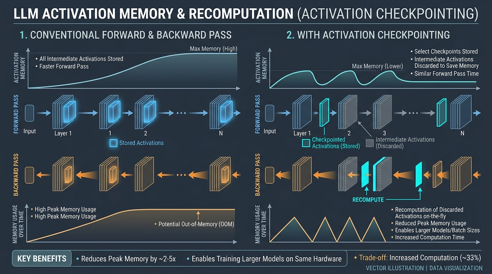

::: {.callout-note appearance="simple"}
**参考答案版**：包含完整代码实现与问答题深度参考解析。建议先独立完成练习题后再展开核对。
:::


::: {.callout-important title="统一完成标准与及格线"}
代码 4 分、Q1～Q3 各 2 分，通过线 8/10。必须解释正确性边界、显存/通信公式中的单位与分片维度；未实际运行的内容只能标记为静态审查。

:::


# 第 2 课：激活、重计算与梯度累积

- 对应官方章节：Memory usage in transformers（激活部分）/ Activation recomputation / Gradient accumulation
- 前置：第 1 课（静态显存账本）
- 状态：未开始

## 本课目标

完成后你需要能够：

- 使用激活显存公式估算并说明其随 batch size 与序列长度的增长方式。
- 解释 full / selective 重计算的内存-计算取舍，并说明与 FlashAttention 的关系。
- 用代码实现正确的梯度累积（含平均、清零时机），理解其与 DP 的关系（第 4 课展开）。
- 区分"峰值显存"与"平均/静态显存"，并知道如何测量峰值。

## 核心概念

### 1. 激活为什么需要保存

反向传播要用到前向的中间结果。若每个可学习操作之间都保存一份隐藏状态，则激活显存随模型层数 L 线性增长，并且**随序列长度近似二次、随 batch size 线性增长**——这与第 1 课的静态账本（与 batch/序列无关）形成鲜明对比。

Playbook 给出的混合精度近似公式（L 层、seq、bs、隐藏维度 h、注意力头数 n_heads）：

$$m_{\text{act}} \approx L \cdot s \cdot b \cdot h \cdot \left(34 + 5 \cdot \frac{n_{\text{heads}} \cdot s}{h}\right) \quad \text{bytes}$$

- 第一项 `34·L·seq·bs·h`：逐层中间激活的线性部分。
- 第二项 `5·n_heads·seq²·bs`：注意力分数矩阵 `QK^T` 的贡献，它使激活随序列长度**二次增长**。

### 2. 重计算（activation recomputation / gradient checkpointing / rematerialization）

::: {.img-card}
{width="95%"}
<p class="caption">图 2-1：激活重计算（Activation Checkpointing）机制与显存曲线对比</p>
:::


- 思想：前向时**丢弃部分激活**，反向时从最近保存的检查点**重新计算**。用额外计算换内存。
- Full：只在每层边界保存激活，反向时每层重算一遍前向。内存最省，计算开销通常 +30~40%。
- Selective：选择"占内存大且重算便宜"的激活丢弃。注意力计算正好属于这一类。对 GPT-3(175B)：激活内存降 70%，计算开销仅 +2.7%。
- **FlashAttention 本身就在反向时重算注意力分数**，所以"用了 FlashAttention 的人已经默认在享受 selective 重计算"。
- 反直觉点：重计算常**不降速甚至提速**，因为 GPU 上访存（HBM）往往比计算更贵；少访存 + 多计算可能更快。MFU/HFU 的区分（重计算计入 HFU 不计入 MFU）在第 12 课展开。

### 3. 梯度累积

- 把一个大 batch 拆成 `grad_acc` 个 micro-batch，逐个 forward/backward，梯度**累加**，攒够后做一次 optimizer step。
- `gbs = mbs × grad_acc`。优化步更新时用**平均**（除以 grad_acc），使结果与 grad_acc 无关。
- 内存收益：任意时刻只保留一个 micro-batch 的激活，激活内存与 gbs 无关。
- 代价：多个前后向串行执行，计算总开销增加、训练变慢。无免费午餐。
- 注意：梯度累积需要**跨 micro-batch 持久的梯度缓冲区**；若不累积，反向时梯度随激活一起被释放，峰值更低。
- 与 DP 的关系：DP 就是"并行版梯度累积"（第 4 课）。

### 4. 峰值显存与第一轮的特殊性

- 训练中显存是动态的：前向时激活上升 → 反向时激活释放、梯度建立 → optimizer step 需要全部梯度与优化器状态。
- **第一轮的 profile 与后续不同**：CUDA caching allocator 在第一轮做大量准备（预热）；optimizer 状态在第一次 step 后才会完整出现在显存里——这就是"第一轮成功、第二轮 OOM"的常见原因之一。
- 测量峰值用 `torch.cuda.max_memory_allocated()`，而不是看 `nvidia-smi` 的瞬时占用；`reserved` 与 `allocated` 的差是 caching allocator 预留（碎片来源之一）。

## 具体演示

以 Llama 类模型为例（h=4096，n_heads=32，L=32，bs=1），每 token 系数 = 34 + 5·n_heads·seq/h，总激活 ≈ L·seq·bs·h·系数：

- seq=512 时激活约 3.6 GB；seq=2048 时约 31 GB；seq=4096 时约 104 GB（注意力二次项已占大头）；seq=8192 时约 380 GB。而静态账本（如 7B 模型）与序列长度无关，始终 ~112 GB。
- 结论：短序列下激活几乎可忽略；2k–4k token 起激活开始显著；超长序列下激活成为最大负担（第 8 课 CP 的动机）。

## 代码填空题

补全以下程序。注意：不要在估算函数里写死常数总和，所有分量都要显式出现。

```{python}
#| course_role: exercise
import torch


def estimate_activation_memory(
    num_layers: int,
    seq_len: int,
    micro_batch: int,
    hidden: int,
    num_heads: int,
    recompute: str = "none",
) -> float:
    """
    估算混合精度下激活显存（bytes），并可选应用重计算。

    公式（Playbook）：
        m_act ≈ L * seq * bs * h * (34 + 5 * n_heads * seq / h)

    recompute 取值：
        "none"     : 不重计算，保存全部中间激活
        "full"     : 只在层边界保存，约为 none 的 1/num_layers（近似）
        "selective": 丢弃注意力相关激活，约为 none 的 30%（GPT-3 数据，
                     70% 削减、2.7% 计算开销）
    """
    # 每层激活的"每 token 每隐藏单元"系数（含注意力分数二次项）
    per_token_coeff = ______  # 提示：把公式按 L*seq*bs 提出公因子

    base = num_layers * seq_len * micro_batch * hidden * per_token_coeff

    if recompute == "none":
        return base
    elif recompute == "full":
        # full 重计算：只在层边界保留一份激活，约等于每层中间激活全部丢弃
        return ______
    elif recompute == "selective":
        # selective：丢弃注意力激活（约 70%），保留其余
        return ______
    else:
        raise ValueError(f"unknown recompute mode: {recompute}")


def run_gradient_accumulation(
    compute_grads,       # 函数：输入 micro-batch 编号，返回梯度 dict {name: tensor}
    num_microbatches: int,
    grad_accum: int,
    optimizer_step,      # 函数：输入平均后的梯度 dict
) -> None:
    """
    模拟梯度累积训练循环。

    正确性要求：
    1. 每 grad_accum 个 micro-batch 做一次 optimizer step；
    2. optimizer step 使用的是【平均】梯度（除以 grad_accum），
       保证结果与 grad_accum 无关；
    3. step 后必须清零累积缓冲区（否则梯度会被重复计入下一轮）。
    """
    accumulated = None          # 跨 micro-batch 持久的梯度累积缓冲区
    assert num_microbatches % grad_accum == 0

    for mb in range(num_microbatches):
        grads = compute_grads(mb)

        if accumulated is None:
            # 首个 micro-batch：深拷贝作为累积起点
            accumulated = {k: v.clone() for k, v in grads.items()}
        else:
            # 后续 micro-batch：累加
            for k in accumulated:
                accumulated[k] = ______

        # 每攒够 grad_accum 个 micro-batch，做一次优化
        if ______:
            for k in accumulated:
                # 平均，使更新与 grad_accum 无关
                accumulated[k] = ______
            optimizer_step(accumulated)
            # 清零：绝不能漏
            accumulated = ______


def demo_grad_accumulation():
    """用小例子验证：grad_accum=2 时的平均梯度 == 整批一次算出的梯度。"""
    torch.manual_seed(0)
    x = torch.randn(8, 4)
    w = torch.randn(4, 1, requires_grad=True)

    def grads_of(idx):
        w.grad = None
        y = x[idx] @ w
        loss = y.square().mean()
        loss.backward()
        return w.grad.clone()

    # 参照：一次算完整 batch
    full = grads_of(slice(0, 8))

    # 梯度累积：两个 micro-batch 各自 backward 后取平均
    g1 = grads_of(slice(0, 4))
    g2 = grads_of(slice(4, 8))
    accumulated = (g1 + g2) / 2

    print("full:", full.flatten()[:3])
    print("accumulated:", accumulated.flatten()[:3])
    assert torch.allclose(full, accumulated)
    print("梯度累积（平均后）与整批一次 backward 一致 ✓")


if __name__ == "__main__":
    # 验证激活估算的趋势：seq 翻倍时激活近似翻倍以上（二次项），而静态账本不变
    for seq in (512, 1024, 2048, 4096):
        act = estimate_activation_memory(32, seq, 1, 4096, 32)
        print(f"seq={seq:5d}  activations={act / 1e9:8.2f} GB")
    demo_grad_accumulation()
```

## 三个问答题

### Q1

激活显存公式 `L·seq·bs·h·(34 + 5·n_heads·seq/h)` 中，两项分别来自哪里？为什么说激活随序列长度近似二次增长、而第 1 课的静态账本完全不受序列长度影响？在什么序列长度下激活会反超静态账本（用 7B、L=32、h=4096、n_heads=32、bs=1 粗算）？

### Q2

Full 与 selective 重计算各存什么、丢什么、代价分别是什么？为什么说"FlashAttention 用户已经默认在使用 selective 重计算"？重计算增加了 FLOPs，为什么反而可能让训练更快？

### Q3

用 `torch.cuda.max_memory_allocated()` 测出的"峰值"与 `nvidia-smi` 看到的"当前占用"有什么区别？为什么第一轮训练的显存 profile 与后续轮不同（至少给出两个原因）？这对"第一轮不 OOM 就认为配置安全"的推断意味着什么？

## 检查与通过标准

总分 10 分：代码正确 4 分（激活公式、重计算系数、梯度累积平均/清零/触发时机各占一部分）、三题各 2 分、通过线 8 分。

一票否决项：

- 梯度累积不平均（直接求和后 step）且说不出理由。
- 认为重计算"必然变慢"或"必然变快"，不讨论访存-计算取舍。
- 把激活公式中的二次项忽略，声称激活随 seq 线性增长。
- 用"第一轮成功"直接证明配置安全，未提及 optimizer 状态与缓存分配器预热。


::: {.callout-tip collapse="true" title="💡 点击展开参考答案与详细代码实现" icon="false"}
## 参考答案（仅 answer 分支）

先完成题目再核对；核对后必须解释关键公式，并改一个规模重新计算。

```{python}
#| course_role: solution
import torch


def estimate_activation_memory(
    num_layers: int,
    seq_len: int,
    micro_batch: int,
    hidden: int,
    num_heads: int,
    recompute: str = "none",
) -> float:
    """
    估算混合精度下激活显存（bytes），并可选应用重计算。

    公式（Playbook）：
        m_act ≈ L * seq * bs * h * (34 + 5 * n_heads * seq / h)

    recompute 取值：
        "none"     : 不重计算，保存全部中间激活
        "full"     : 只在层边界保存，约为 none 的 1/num_layers（近似）
        "selective": 丢弃注意力相关激活，约为 none 的 30%（GPT-3 数据，
                     70% 削减、2.7% 计算开销）
    """
    # 每层激活的"每 token 每隐藏单元"系数（含注意力分数二次项）
    per_token_coeff = 34 + 5 * num_heads * seq_len / hidden  # 提示：把公式按 L*seq*bs 提出公因子

    base = num_layers * seq_len * micro_batch * hidden * per_token_coeff

    if recompute == "none":
        return base
    elif recompute == "full":
        # full 重计算：只在层边界保留一份激活，约等于每层中间激活全部丢弃
        return base / num_layers
    elif recompute == "selective":
        # selective：丢弃注意力激活（约 70%），保留其余
        return base * 0.3
    else:
        raise ValueError(f"unknown recompute mode: {recompute}")


def run_gradient_accumulation(
    compute_grads,       # 函数：输入 micro-batch 编号，返回梯度 dict {name: tensor}
    num_microbatches: int,
    grad_accum: int,
    optimizer_step,      # 函数：输入平均后的梯度 dict
) -> None:
    """
    模拟梯度累积训练循环。

    正确性要求：
    1. 每 grad_accum 个 micro-batch 做一次 optimizer step；
    2. optimizer step 使用的是【平均】梯度（除以 grad_accum），
       保证结果与 grad_accum 无关；
    3. step 后必须清零累积缓冲区（否则梯度会被重复计入下一轮）。
    """
    accumulated = None          # 跨 micro-batch 持久的梯度累积缓冲区
    assert num_microbatches % grad_accum == 0

    for mb in range(num_microbatches):
        grads = compute_grads(mb)

        if accumulated is None:
            # 首个 micro-batch：深拷贝作为累积起点
            accumulated = {k: v.clone() for k, v in grads.items()}
        else:
            # 后续 micro-batch：累加
            for k in accumulated:
                accumulated[k] = accumulated[k] + grads[k]

        # 每攒够 grad_accum 个 micro-batch，做一次优化
        if (mb + 1) % grad_accum == 0:
            for k in accumulated:
                # 平均，使更新与 grad_accum 无关
                accumulated[k] = accumulated[k] / grad_accum
            optimizer_step(accumulated)
            # 清零：绝不能漏
            accumulated = None


def demo_grad_accumulation():
    """用小例子验证：grad_accum=2 时的平均梯度 == 整批一次算出的梯度。"""
    torch.manual_seed(0)
    x = torch.randn(8, 4)
    w = torch.randn(4, 1, requires_grad=True)

    def grads_of(idx):
        w.grad = None
        y = x[idx] @ w
        loss = y.square().mean()
        loss.backward()
        return w.grad.clone()

    # 参照：一次算完整 batch
    full = grads_of(slice(0, 8))

    # 梯度累积：两个 micro-batch 各自 backward 后取平均
    g1 = grads_of(slice(0, 4))
    g2 = grads_of(slice(4, 8))
    accumulated = (g1 + g2) / 2

    print("full:", full.flatten()[:3])
    print("accumulated:", accumulated.flatten()[:3])
    assert torch.allclose(full, accumulated)
    print("梯度累积（平均后）与整批一次 backward 一致 ✓")


if __name__ == "__main__":
    # 验证激活估算的趋势：seq 翻倍时激活近似翻倍以上（二次项），而静态账本不变
    for seq in (512, 1024, 2048, 4096):
        act = estimate_activation_memory(32, seq, 1, 4096, 32)
        print(f"seq={seq:5d}  activations={act / 1e9:8.2f} GB")
    demo_grad_accumulation()
```

# 第 2 课参考答案（复盘用，先提交再打开）

## 补全后的代码（关键填空处）

```python
def estimate_activation_memory(num_layers, seq_len, micro_batch, hidden, num_heads, recompute="none"):
    per_token_coeff = 34 + 5 * num_heads * seq_len / hidden   # 提出 L*seq*bs 公因子
    base = num_layers * seq_len * micro_batch * hidden * per_token_coeff
    if recompute == "none":
        return base
    elif recompute == "full":
        return base / num_layers          # 只在层边界保存，近似 1/L
    elif recompute == "selective":
        return base * 0.3                 # 丢弃注意力激活，保留 30%（GPT-3 数据）
    else:
        raise ValueError(...)
```

梯度累积：

```python
else:
            for k in accumulated:
                accumulated[k] = accumulated[k] + grads[k]     # 或 +=

        if (mb + 1) % grad_accum == 0:
            for k in accumulated:
                accumulated[k] = accumulated[k] / grad_accum   # 平均
            optimizer_step(accumulated)
            accumulated = None                                 # 清零
```

## 三个问答题要点

### Q1

- 第一项 `34·L·seq·bs·h`：逐层中间激活（线性层输入/输出、LN 输出等）的线性部分；
- 第二项 `5·n_heads·seq²·bs`：注意力分数矩阵 S=QKᵀ（每头 seq×seq）的贡献，随 seq 二次增长。
- 静态账本（参数/梯度/优化器状态）与 batch、seq 无关；激活随 bs 线性、随 seq 近似二次。
- 粗算：7B（L=32, h=4096, 头=32, bs=1）在 seq≈2048 时激活 ≈ 32·2048·1·4096·(34+5·32·2048/4096) ≈ 32·2048·4096·(34+80) ≈ 30.6 GB；seq=4096 时 ≈ 32·4096·4096·(34+160) ≈ 104 GB；反超 112 GB 静态账本大约发生在 seq≈4k 附近（具体数值随模型结构浮动，重点是趋势与量级判断）。

### Q2

- Full：只存层边界激活（每层重算一遍前向），内存最小、计算 +30~40%；
- Selective：丢弃"占内存大且重算便宜"的激活（注意力类），GPT-3 上激活 −70%、计算 +2.7%；
- FlashAttention 反向本就重算注意力分数（不存 S），所以用 FA 等于默认 selective；
- 重计算"多算反而更快"的原因：GPU 上 HBM 访存比计算更贵，少写读 HBM 可以抵消多余 FLOPs；FLOPs 不是唯一成本。

### Q3

- `max_memory_allocated` 是分配器视角的峰值（本进程逻辑占用），`nvidia-smi` 是设备实时占用（含 CUDA context、其他进程、分配器预留）；两者量级和语义都不同；
- 第一轮不同：a) caching allocator 预热/预分配；b) optimizer 状态在第一次 step 后才完整建立；c) 首次 kernel/context 初始化；
- 结论：不能把"第一轮不 OOM"当作配置安全证明——必须看稳态多轮的峰值曲线（max_memory_allocated），并预留碎片/预留缓冲的余量。

## 通过要点

- 梯度累积必须平均（除以 grad_acc）且 step 后清零；触发时机是"第 (mb+1) 个 micro-batch 结束时"。
- 重计算的本质是访存-计算权衡，方向因硬件而定。
- 峰值显存需实测（max_memory_allocated），公式给出的是组成/下界。

## 官方主参考

- [Ultra-Scale Playbook](https://huggingface.co/spaces/nanotron/ultrascale-playbook)
- [PyTorch distributed documentation](https://pytorch.org/docs/stable/distributed.html)
:::
