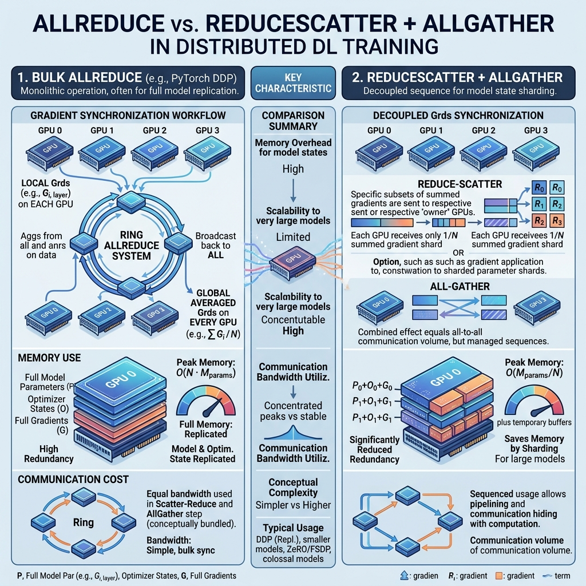
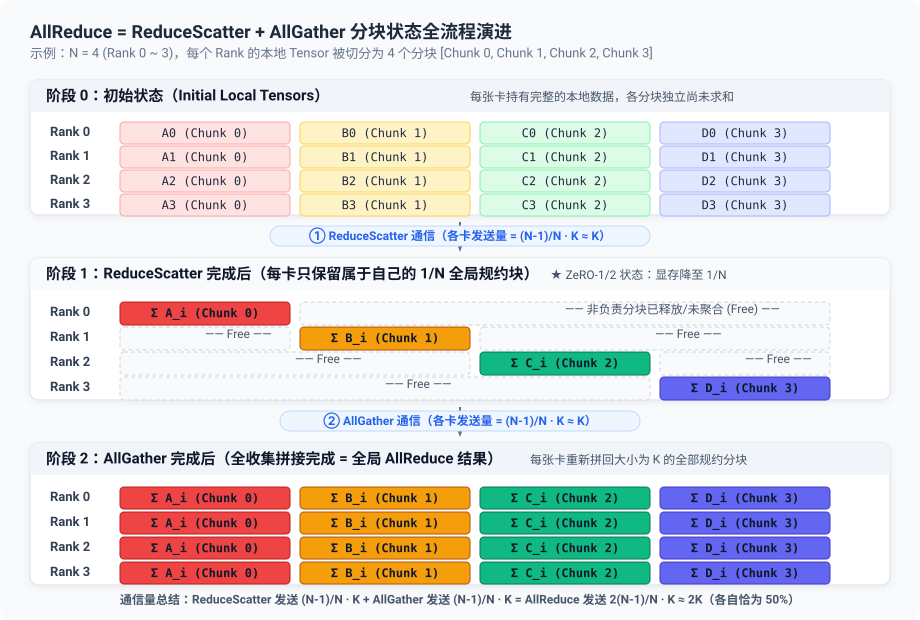
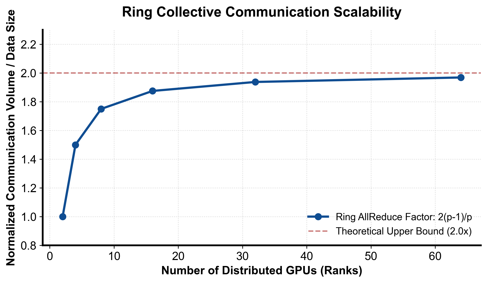

::: {.callout-note appearance="simple"}
**参考答案版**：包含完整代码实现与问答题深度参考解析。建议先独立完成练习题后再展开核对。
:::


::: {.callout-important title="统一完成标准与及格线"}
代码 4 分、Q1～Q3 各 2 分，通过线 8/10。必须解释正确性边界、显存/通信公式中的单位与分片维度；未实际运行的内容只能标记为静态审查。

:::


- 对应官方章节：附录 A0（Parallel Programming Crash Course，原书附录，本课程提前到此课）
- 前置：第 1 课
- 状态：未开始

> 原书把本课内容放在附录，但它是理解数据并行（第 4 课）的必要前置：DP 的梯度同步就是 all-reduce，ZeRO 的梯度分片就是 reduce-scatter。所以提前。

## 本课目标

完成后你需要能够：

- 说清 broadcast / reduce / all-reduce / gather / all-gather / scatter / reduce-scatter 的输入、输出与语义。
- 推演 Ring AllReduce 的两个阶段，计算每卡通信量约 \(2K\)。
- 区分 latency 与 bandwidth 两个通信成本来源。
- 解释 NCCL / Gloo / MPI 的适用场景。

## 核心概念


### 核心操作与执行流程图解

::: {.img-card}

<p class="caption">图 3-1：AllReduce vs ReduceScatter + AllGather 机制与显存/通信对比（本地生图模型生成）</p>
:::

::: {.img-card}

<p class="caption">图 3-2：Ring 算法各 Rank 分块在 ReduceScatter 与 AllGather 两个阶段的流转状态</p>
:::


### 1. 分布式通信的三大基本模式

在分布式集群中，各 GPU 节点（Rank）通过高速互联网络（NVLink / NVSwitch / RoCE / InfiniBand）交换张量数据。最基础的原语包括：

- **Broadcast（一对多广播）**：指定的 Root 节点将其持有的完整张量复制发送到组内所有其他 Rank。张量内容在通信前后保持一致，主要用于初始化时同步模型参数、广播全局配置与随机数种子。
- **Reduce（多对一归约）**：组内所有 Rank 的同构张量按元素应用二元归约算子（如求和 SUM、求最大值 MAX、乘积 PROD）进行规约合并，最终汇总结果仅输出保存在 Root 节点上，其他节点数据不改变。
- **AllReduce（多对多全局规约）**：等价于执行一次 Reduce 将全局结果汇总后，再执行一次 Broadcast 分发至所有 Rank。在数据并行（DDP）中，每步反向传播计算完毕后，正是利用 AllReduce(SUM) 同步并平均所有卡上的梯度。

### 2. 分块数据分发与收集原语

在大模型并行（如 ZeRO-3、张量并行 TP、序列并行 SP）中，张量通常被切分为多份碎片，需要更加细粒度的切分与收集原语：

- **Gather（多对一收集）**：Root 节点按 Rank 编号顺序收集各个 Rank 各自持有的不同张量切片，并在本地拼接为一个连续大张量。
- **AllGather（多对多全收集）**：组内每个 Rank 将自己持有的分块张量广播给其他所有 Rank。通信完成后，**每个 Rank 都获得了全局完整拼接的完整张量**。在 ZeRO-3 / FSDP 的前向传播中，每层正是通过 AllGather 动态重建完整权重。
- **Scatter（一对多分发）**：Gather 的逆操作。Root 节点将本地的一个大张量均等切分为 $N$ 份，分别分发给组内的各个 Rank。
- **ReduceScatter（多对多规约分片）**：组内各 Rank 先对各自对应的数据块进行全局规约（求和），但**最终并不广播全量结果，而是每个 Rank 仅保留属于自己的那一份规约切片**。通信量严格等于 AllReduce 的一半！
- **Barrier（全局同步屏障）**：用于阻塞所有 Rank，直到组内所有卡都到达该同步点。在工业训练中应极力避免显式 Barrier，以防止短板节点导致严重的集群空转与 GPU 降频。

### 3. Ring AllReduce 算法原理与通信量数学推导

在早期的朴素实现中，若采用 Parameter Server（主从架构）或两两全互联（All-to-All），网络连接数和 Root 带宽瓶颈随节点数 $N$ 线性暴增，无法横向扩展。

**Ring AllReduce（环形规约算法）** 将 $N$ 个 Rank 逻辑连接为一个单向环，每个 Rank 仅与左右邻居通信，如上图 3-1 与 3-2 所示。算法分为两个核心阶段，每个阶段迭代 $N-1$ 步：

1. **ReduceScatter 阶段（$N-1$ 步环形累加）**：  
   每个 Rank 将大小为 $K$ 的数据均匀切分为 $N$ 个块。在每一步中，Rank $i$ 将自己当前累积的块发送给相邻的 Rank $i+1$，同时接收来自 Rank $i-1$ 的块并累加到本地对应块中。  
   经过 $N-1$ 步传输后，环上每个 Rank 恰好持有了某一个数据块在全局所有卡上的**完整规约总和**（例如 Rank 0 持有 $\sum B_0$，Rank 1 持有 $\sum B_1$）。
2. **AllGather 阶段（$N-1$ 步环形全收集）**：  
   每个 Rank 将刚刚得到的完整规约块沿环继续转发给邻居，邻居接收后存入对应位置并继续下发。  
   经过 $N-1$ 步后，所有 Rank 的所有 $N$ 个分块都被完整填满。

#### 理论通信量与网络延迟模型

设通信张量总数据量为 $K$ 字节，网络单向延迟为 $\alpha$，网络带宽倒数（传输每字节耗时）为 $\beta$：

- 在每个阶段的每一步中，每张卡仅发送 $K/N$ 字节的数据。
- 两个阶段各经历 $N-1$ 步，总单卡发送通信量为：

$$\text{单卡发送通信量} = 2 \cdot \frac{N-1}{N} \cdot K \approx 2K \quad (N \gg 1)$$

$$\text{总通信耗时} T_{\text{Ring}} = 2(N-1)\alpha + 2 \cdot \frac{N-1}{N} K \beta \approx 2(N-1)\alpha + 2K\beta$$

由此可得两个极其关键的系统结论：
1. **通信带宽成本与节点数 $N$ 无关**：无论集群有 8 卡还是 1024 卡，每卡传输的数据总量始终恒定在 $2K$ 左右！
2. **延迟成本随 $N$ 线性增长**：总时延受跳数 $2(N-1)\alpha$ 约束，这解释了为什么千卡规模下纯 Ring 算法会因环太长而效率衰减，现代 NCCL 会在节点内采用 Tree AllReduce 或跨节点双环拓扑来抑制延迟。

::: {.img-card}
{width="85%"}
<p class="caption">图 3-3：Ring 集合通信理论通信量因子随 Rank 数量扩展曲线（基于 scientific-figure-making 绘制）</p>
:::

#### 各阶段分块状态对照表（以 4 个 Rank 为例）

| 阶段 | Rank 0 持有内容 | Rank 1 持有内容 | Rank 2 持有内容 | Rank 3 持有内容 | 单卡发送通信量 |
| :--- | :--- | :--- | :--- | :--- | :--- |
| **初始状态** | 本地 $B_0^{(0)}, B_1^{(0)}, B_2^{(0)}, B_3^{(0)}$ | 本地 $B_0^{(1)}, B_1^{(1)}, B_2^{(1)}, B_3^{(1)}$ | 本地 $B_0^{(2)}, B_1^{(2)}, B_2^{(2)}, B_3^{(2)}$ | 本地 $B_0^{(3)}, B_1^{(3)}, B_2^{(3)}, B_3^{(3)}$ | 0 |
| **ReduceScatter 之后** | **全局求和 $\sum B_0$** (仅保留分块 0) | **全局求和 $\sum B_1$** (仅保留分块 1) | **全局求和 $\sum B_2$** (仅保留分块 2) | **全局求和 $\sum B_3$** (仅保留分块 3) | $\frac{N-1}{N} K \approx K$ |
| **AllGather 之后** | 完整 $\sum B_0, \sum B_1, \sum B_2, \sum B_3$ | 完整 $\sum B_0, \sum B_1, \sum B_2, \sum B_3$ | 完整 $\sum B_0, \sum B_1, \sum B_2, \sum B_3$ | 完整 $\sum B_0, \sum B_1, \sum B_2, \sum B_3$ | $\frac{N-1}{N} K \approx K$ |

> **核心差异与工程意义**：
> 1. **数学等价性**：纯网络通信量完全相等，$\text{AllReduce} (2K) = \text{ReduceScatter} (K) + \text{AllGather} (K)$。
> 2. **显存峰值（最关键区别）**：
>    - **AllReduce (DDP)**：每卡全程必须常驻 $O(N)$ 完整参数和梯度，单卡装不下超大模型。
>    - **ReduceScatter + AllGather (ZeRO-3/FSDP)**：常驻只需 $O(N/P)$。反向算完立刻 ReduceScatter 聚合分片并释放全量大梯度；前向计算该层时再按需 AllGather 拼全量参数，前向算完立刻丢弃临时全量权重。
> 3. **计算/通信重叠（Overlap）**：拆开后允许更细粒度的异步调度流水线。


### 4. 通信成本的两个来源

- **Latency（延迟）**：发起一次通信的固定开销。消息多而小 → latency 主导；rank 越多，环的跳数越多，延迟累积。
- **Bandwidth（带宽）**：单位时间能搬多少数据。消息大 → bandwidth 主导。

这解释了为什么梯度要打包成 bucket（第 4 课）、为什么 DP 规模过大后会被 ring latency 拖累（第 4 课）、以及为什么小模型/大批次时通信更藏不住（第 12 课的重叠数学）。

### 5. NCCL / Gloo / MPI

- **NCCL**：NVIDIA Collective Communications Library，为 GPU-GPU 通信优化，PyTorch GPU 训练的默认选择。
- **Gloo**：Meta 出品，CPU（也可 GPU）场景。
- **MPI**：经典消息传递标准，CPU 集群/传统 HPC。
- 经验法则：GPU 训练用 NCCL，CPU 训练用 Gloo。

## 具体演示

3 个 rank、每个持有 `[r+1]*5`（r 为 rank 号）：

- Broadcast(src=0)：所有 rank 都变成 `[1,1,1,1,1]`。
- Reduce(dst=0, SUM)：只有 rank 0 变成 `[6,6,6,6,6]`，其余不变。
- AllReduce(SUM)：所有 rank 都变成 `[6,6,6,6,6]`。
- AllGather：每个 rank 都持有三份 `[1..] [2..] [3..]`。
- ReduceScatter：rank r 只持有第 r 块的汇总（教材示例：rank 0 → `[6,12]`，rank 1 → `[14,56]`…）。

## 代码填空题

用纯 torch（CPU 即可）模拟 Ring AllReduce，验证结果与直接求和一致，并统计每卡通信量。

```{python}
#| course_role: exercise
import torch


def ring_all_reduce(tensors: list[torch.Tensor]) -> torch.Tensor:
    """
    模拟 N 个 rank 的 Ring AllReduce（op=SUM）。

    tensors[r] 是 rank r 的本地张量（形状相同，首维可整除 N）。
    返回：每个 rank 最终应持有的完整汇总结果（即 sum(tensors)）。

    环的方向：rank r 的下一个邻居是 (r+1) % N，上一个邻居是 (r-1) % N。
    数据切块：每个 rank 把自己的张量沿首维切成 N 块，块编号 0..N-1。
    """
    N = len(tensors)
    K_total = tensors[0].numel()
    assert K_total % N == 0

    # 每 rank 的本地块列表：chunks[r][c] = rank r 的第 c 块（可原地累加）
    chunks = [t.clone().view(N, -1) for t in tensors]

    # 统计每卡总通信量（发送的数值个数）
    bytes_sent_per_rank = [0] * N

    # ---------- 阶段 1：ReduceScatter（N-1 步） ----------
    # 每步 s（0 起）：rank r 把块 (r - s) mod N 发给下一个邻居；
    # 从上一个邻居收到块 (r - s - 1) mod N，并把它累加到本地对应块。
    for s in range(N - 1):
        for r in range(N):
            send_idx = ______          # rank r 本步要发送的块编号
            recv_idx = ______          # rank r 本步要接收并累加的块编号
            src = (r - 1) % N          # 数据来自上一个邻居
            chunk = chunks[src][recv_idx].clone()   # 邻居发来的块
            chunks[r][recv_idx] += chunk            # 累加
            bytes_sent_per_rank[r] += chunks[r][send_idx].numel()

    # 阶段 1 结束后，rank r 持有【完整的】汇总块，块编号是 (r + 1) % N。
    # （原因：每块数据沿环走了 N-1 步，正好访问过所有 rank；
    #   编号 (r+1) 那块最后到达 rank r。）

    # ---------- 阶段 2：AllGather（N-1 步） ----------
    # 每步 s：rank r 把【上一块】继续转发给下一个邻居：
    #   第 0 步发自己持有的归约块 (r + 1) mod N；
    #   第 s 步发 (r + 1 - s) mod N（即第 s-1 步收到的块）。
    # 从上一个邻居收到块 (r - s) mod N，存入自己的对应槽位。
    # 注意：上游发送的块编号恰好也是 (r - s) mod N（= 本 rank 的 recv_idx），
    # 所以拷贝源是 chunks[src][recv_idx]，而不是 chunks[src][send_idx]。
    for s in range(N - 1):
        for r in range(N):
            send_idx = ______          # 填空：本步发送的块编号
            recv_idx = ______          # 填空：本步接收并存放的块编号
            src = (r - 1) % N
            chunks[r][recv_idx] = chunks[src][recv_idx].clone()
            bytes_sent_per_rank[r] += chunks[r][send_idx].numel()

    # 阶段 2 结束后，每 rank 都持有全部 N 块汇总结果
    result = torch.cat([chunks[0][c] for c in range(N)])

    # ---------- 验证 ----------
    expected = sum(tensors)
    assert torch.allclose(result, expected), "Ring AllReduce 结果错误"
    print("结果与直接求和一致 ✓")

    # 每卡通信量（数值个数）：约 2*K_total
    print("每卡发送数值个数:", bytes_sent_per_rank)
    print(f"理论值 2*(N-1)*K/N = {2 * (N - 1) * K_total // N}")

    # 通信时间模型：t = 步数*latency + 总量/带宽
    latency_us, bw_gbps = 10.0, 25.0   # 假设的环上每跳延迟与带宽
    vol_bytes = bytes_sent_per_rank[0] * 4   # 假设 FP32，4 字节/数值
    t_ring_us = 2 * (N - 1) * latency_us + vol_bytes / (bw_gbps * 1e3) * 1e6
    print(f"Ring AllReduce 模型时间 ≈ {t_ring_us:.1f} us")
    return result


def demo_communication_volume():
    """通信量随 N 的变化：数据总量 K 固定时，每卡通信量 ≈ 2K（与 N 基本无关）。"""
    K = 1024 * 1024
    for N in (4, 8, 16, 32):
        per_rank = 2 * (N - 1) * K // N
        print(f"N={N:3d}  每卡通信量 = {per_rank / K:.3f} K")


if __name__ == "__main__":
    torch.manual_seed(0)
    N = 4
    tensors = [torch.randn(8, 16) * (r + 1) for r in range(N)]
    ring_all_reduce(tensors)
    demo_communication_volume()
```

## 三个问答题

### Q1

为什么说 Ring AllReduce 的每卡通信量约为 \(2K\)（与 rank 数 N 基本无关），而朴素"每对 rank 直接通信"的方式通信量随 N 增长？在什么条件下（数据量、N、延迟）通信会从 bandwidth 主导变成 latency 主导？

### Q2

"ReduceScatter + AllGather 等价于 AllReduce，且每一步的通信量都只有 AllReduce 的一半"——请用每卡发送数值个数证明这句话，并解释"reduce-scatter 比 all-reduce 快两倍"这一表述的准确含义与常见误解。这对第 5 课 ZeRO 有什么意义（可以先给方向，不展开）？

### Q3

GPU 训练时 PyTorch 为什么默认用 NCCL 而不是 Gloo 或 MPI？如果进程组初始化后没有调用 `destroy_process_group`、或者某 rank 提前退出了，会发生什么？这与你看到的"训练脚本卡死/超时"类问题有什么联系？

## 检查与通过标准

总分 10 分：代码正确 4 分（两个阶段的收发块编号、通信量统计、验证通过）、三题各 2 分、通过线 8 分。

一票否决项：

- 混淆 Broadcast 与 AllGather（一个 root 的数据 vs 各 rank 的独有数据）。
- 认为 AllReduce 是"每对 rank 直接互传"，不知道 ring 的两阶段结构。
- 把通信量算成随 N 线性/平方增长，而不区分 latency 与 bandwidth。
- 说不出 NCCL/Gloo/MPI 的适用场景。


::: {.callout-tip collapse="true" title="💡 点击展开参考答案与详细代码实现" icon="false"}
## 参考答案（仅 answer 分支）

先完成题目再核对；核对后必须解释关键公式，并改一个规模重新计算。

```{python}
#| course_role: solution
import torch


def ring_all_reduce(tensors: list[torch.Tensor]) -> torch.Tensor:
    """
    模拟 N 个 rank 的 Ring AllReduce（op=SUM）。

    tensors[r] 是 rank r 的本地张量（形状相同，首维可整除 N）。
    返回：每个 rank 最终应持有的完整汇总结果（即 sum(tensors)）。

    环的方向：rank r 的下一个邻居是 (r+1) % N，上一个邻居是 (r-1) % N。
    数据切块：每个 rank 把自己的张量沿首维切成 N 块，块编号 0..N-1。
    """
    N = len(tensors)
    K_total = tensors[0].numel()
    assert K_total % N == 0

    # 每 rank 的本地块列表：chunks[r][c] = rank r 的第 c 块（可原地累加）
    chunks = [t.clone().view(N, -1) for t in tensors]

    # 统计每卡总通信量（发送的数值个数）
    bytes_sent_per_rank = [0] * N

    # ---------- 阶段 1：ReduceScatter（N-1 步） ----------
    # 每步 s（0 起）：rank r 把块 (r - s) mod N 发给下一个邻居；
    # 从上一个邻居收到块 (r - s - 1) mod N，并把它累加到本地对应块。
    for s in range(N - 1):
        # 同一步的所有 send 必须先快照；否则按 rank 顺序原地更新会读到“未来”数据。
        sent = [chunks[r][(r - s) % N].clone() for r in range(N)]
        for r in range(N):
            send_idx = (r - s) % N          # rank r 本步要发送的块编号
            recv_idx = (r - s - 1) % N          # rank r 本步要接收并累加的块编号
            src = (r - 1) % N          # 数据来自上一个邻居
            chunk = sent[src]   # 上一步快照中的邻居发送块
            chunks[r][recv_idx] += chunk            # 累加
            bytes_sent_per_rank[r] += chunks[r][send_idx].numel()

    # 阶段 1 结束后，rank r 持有【完整的】汇总块，块编号是 (r + 1) % N。
    # （原因：每块数据沿环走了 N-1 步，正好访问过所有 rank；
    #   编号 (r+1) 那块最后到达 rank r。）

    # ---------- 阶段 2：AllGather（N-1 步） ----------
    # 每步 s：rank r 把【上一块】继续转发给下一个邻居：
    #   第 0 步发自己持有的归约块 (r + 1) mod N；
    #   第 s 步发 (r + 1 - s) mod N（即第 s-1 步收到的块）。
    # 从上一个邻居收到块 (r - s) mod N，存入自己的对应槽位。
    # 注意：上游发送的块编号恰好也是 (r - s) mod N（= 本 rank 的 recv_idx），
    # 所以拷贝源是 chunks[src][recv_idx]，而不是 chunks[src][send_idx]。
    for s in range(N - 1):
        sent = [chunks[r][(r + 1 - s) % N].clone() for r in range(N)]
        for r in range(N):
            send_idx = (r + 1 - s) % N          # 填空：本步发送的块编号
            recv_idx = (r - s) % N          # 填空：本步接收并存放的块编号
            src = (r - 1) % N
            chunks[r][recv_idx] = sent[src]
            bytes_sent_per_rank[r] += chunks[r][send_idx].numel()

    # 阶段 2 结束后，每 rank 都持有全部 N 块汇总结果
    result = torch.cat([chunks[0][c] for c in range(N)]).view_as(tensors[0])

    # ---------- 验证 ----------
    expected = sum(tensors)
    assert torch.allclose(result, expected), "Ring AllReduce 结果错误"
    print("结果与直接求和一致 ✓")

    # 每卡通信量（数值个数）：约 2*K_total
    print("每卡发送数值个数:", bytes_sent_per_rank)
    print(f"理论值 2*(N-1)*K/N = {2 * (N - 1) * K_total // N}")

    # 通信时间模型：t = 步数*latency + 总量/带宽
    latency_us, bw_gbps = 10.0, 25.0   # 假设的环上每跳延迟与带宽
    vol_bytes = bytes_sent_per_rank[0] * 4   # 假设 FP32，4 字节/数值
    t_ring_us = 2 * (N - 1) * latency_us + vol_bytes / (bw_gbps * 1e3)
    print(f"Ring AllReduce 模型时间 ≈ {t_ring_us:.1f} us")
    return result


def demo_communication_volume():
    """通信量随 N 的变化：数据总量 K 固定时，每卡通信量 ≈ 2K（与 N 基本无关）。"""
    K = 1024 * 1024
    for N in (4, 8, 16, 32):
        per_rank = 2 * (N - 1) * K // N
        print(f"N={N:3d}  每卡通信量 = {per_rank / K:.3f} K")


if __name__ == "__main__":
    torch.manual_seed(0)
    N = 4
    tensors = [torch.randn(8, 16) * (r + 1) for r in range(N)]
    ring_all_reduce(tensors)
    demo_communication_volume()
```


## 补全后的代码（关键填空处）

```python
# ---------- 阶段 1：ReduceScatter ----------
    for s in range(N - 1):
        for r in range(N):
            send_idx = (r - s) % N
            recv_idx = (r - s - 1) % N
            src = (r - 1) % N
            chunk = chunks[src][recv_idx].clone()
            chunks[r][recv_idx] += chunk
            bytes_sent_per_rank[r] += chunks[r][send_idx].numel()

    # ---------- 阶段 2：AllGather ----------
    for s in range(N - 1):
        for r in range(N):
            send_idx = (r + 1 - s) % N     # 第 0 步发归约块 (r+1)，之后转发上一块
            recv_idx = (r - s) % N         # 上游发送的块编号恰为 (r-s)
            src = (r - 1) % N
            chunks[r][recv_idx] = chunks[src][recv_idx].clone()
            bytes_sent_per_rank[r] += chunks[r][send_idx].numel()
```

验证（numpy 模拟，N=2/3/4/5/7 全部通过）：结果与 `sum(tensors)` 一致；每卡发送数值个数 = `2·(N−1)·K/N`，与理论完全吻合。

## 三个问答题要点

### Q1

- Ring：每步只与邻居通信；每卡发送 `2(N−1)·K/N ≈ 2K`，与 N 基本无关——因为每块数据在环上恰好转一圈，总量不变。
- 朴素 all-to-all：每卡与 N−1 个 rank 直接传 K/N，总发送 ≈ K（每卡）？错——朴素全互联每卡要对每个对端传整份（或分片后每对端 K/N，则每卡共 K）；真实瓶颈是**连接数与同步点随 N 增长**、以及某些实现中 root/汇聚点的带宽放大。可扩展性差的本质：通信次数/连接数 O(N)，且没有流水线化。
- 延迟主导条件：消息小（bucket 小）或 N 大（环跳数多）时，`t ≈ N·latency + vol/bw` 中 latency 项占优。

### Q2

- 每卡发送量：AllReduce = 2(N−1)·K/N ≈ 2K；ReduceScatter 与 AllGather 各 ≈ K（教材原话："reduce-scatter 是 all-reduce 的两倍快"指的是通信量减半，不是延迟减半）；
- 常见误解：把"快两倍"理解为 wall-time 减半（实际还有 latency、拓扑因素）；
- 对 ZeRO 的意义：ZeRO-1/2 用 reduce-scatter（梯度）替代 all-reduce，再在优化后 all-gather 参数——每步总通信仍是 2Ψ，但每张卡只持有 1/N_d 的梯度与优化器状态（内存省了，通信没增）。

### Q3

- NCCL 为 GPU-GPU（NVLink/IB）优化，Gloo 偏 CPU/通用，MPI 是传统 HPC 标准；PyTorch GPU 训练用 NCCL。
- 未 destroy 进程组、rank 提前退出/挂起：collective 是全局同步的，一个 rank 不参与会导致全体阻塞（卡死/超时），NCCL 还会因超时 abort。
- 与"训练脚本卡死"的关联：先查是否 collective 不匹配（不同分支执行不同数量的通信）、rank 崩溃后 NCCL 超时、barrier 滥用。

## 通过要点

- 本课代码为模拟实现（纯 Python/torch CPU），真实 NCCL 行为（异步、带宽模型、拓扑感知）留待多卡环境统一验证。
- 记住四个数：AllReduce ≈ 2K；RS/AG 各 ≈ K；Ring 与 N 无关；latency 与 bandwidth 双成本模型。

## 官方主参考

- [Ultra-Scale Playbook](https://huggingface.co/spaces/nanotron/ultrascale-playbook)
- [PyTorch distributed documentation](https://pytorch.org/docs/stable/distributed.html)
:::
