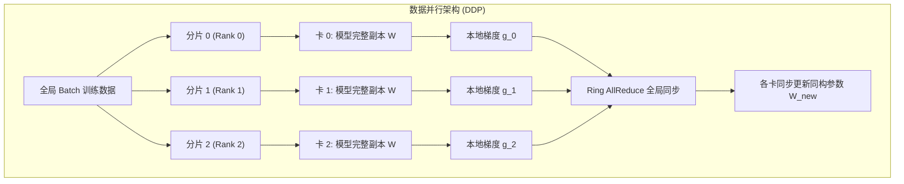
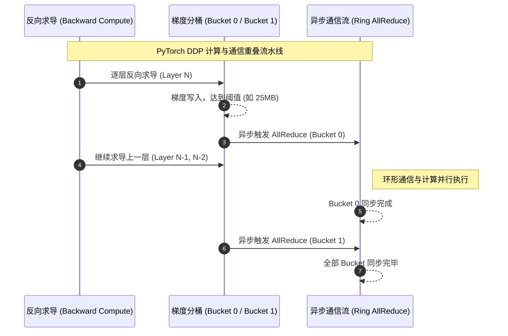

::: {.callout-note appearance="simple"}
**参考答案版**：包含完整代码实现与问答题深度参考解析。建议先独立完成练习题后再展开核对。
:::


::: {.callout-important title="统一完成标准与及格线"}
代码 4 分、Q1～Q3 各 2 分，通过线 8/10。必须解释正确性边界、显存/通信公式中的单位与分片维度；未实际运行的内容只能标记为静态审查。

:::


- 对应官方章节：Data Parallelism（含 Revisiting global batch size、Our journey up to now）
- 前置：第 2 课（梯度累积）、第 3 课（all-reduce）
- 状态：未开始

## 本课目标

完成后你需要能够：

- 把 DP 表述为"并行版梯度累积"，写出 `gbs = mbs × grad_acc × dp`。
- 解释为什么梯度 all-reduce 必须在 optimizer step 之前完成，但可以与 backward 重叠。
- 实现并解释两个优化：逐参数 hook 重叠、梯度 bucketing。
- 解释 `no_sync` 在"DP + 梯度累积"中的正确性作用。
- 说明 DP 的边界：不降低每卡静态显存，规模过大（512+）时效率下降。

## 核心概念


<p class="caption" align="center"><em>图 4-1：数据并行（DDP）同构副本前向与全量梯度归约架构</em></p>


<p class="caption" align="center"><em>图 4-2：PyTorch DDP 梯度分桶与异步 AllReduce 计算通信重叠流水</em></p>

<p class="caption" align="center"><em>图 4-1：数据并行（DDP）同构副本前向与全量梯度归约架构</em></p>

```{mermaid}
sequenceDiagram
    autonumber
    participant B as 反向求导 (Backward Compute)
    participant Bucket as 梯度分桶 (Bucket 0 / Bucket 1)
    participant NCCL as 异步通信流 (Ring AllReduce)
    Note over B,NCCL: PyTorch DDP 计算与通信重叠流水线
    B->>Bucket: 逐层反向求导 (Layer N)
    Bucket-->>Bucket: 梯度写入，达到阈值 (如 25MB)
    Bucket->>NCCL: 异步触发 AllReduce (Bucket 0)
    B->>Bucket: 继续求导上一层 (Layer N-1, N-2)
    Note right of NCCL: 环形通信与计算并行执行
    NCCL-->>NCCL: Bucket 0 同步完成
    Bucket->>NCCL: 异步触发 AllReduce (Bucket 1)
    NCCL-->>NCCL: 全部 Bucket 同步完毕
```
<p class="caption" align="center"><em>图 4-2：PyTorch DDP 梯度分桶与异步 AllReduce 计算通信重叠流水</em></p>

### 1. DP = 并行的梯度累积

每个 GPU 复制一份完整模型（模型实例），各跑不同的 micro-batch。前向/反向互相独立 → 天然并行，吞吐随 dp 增长；但各卡的梯度不同，必须在 optimizer step 前同步——对梯度做 **AllReduce（SUM 后除以 dp 即平均）**。

```{python}
gbs = mbs × grad_acc × dp
```

- 相同 gbs 下，DP 与 grad_acc 可以互换：优先加大 dp（并行）而不是 grad_acc（串行），直到 GPU 用完或通信成为瓶颈。
- 全局 batch 大小一般以 token 计：`bst = gbs × seq`。

### 2. 朴素实现的问题：先算完再通信

backward 全部结束 → 一次性 all-reduce → optimizer step。GPU 在通信期间空闲。**计算-通信不重叠是大忌**。

### 3. 优化一：与 backward 重叠（hook）

反向是从最后一层往前算的。最后一层的梯度一出来，就可以开始同步它，不必等前面层的梯度。PyTorch 做法：给每个参数注册 `register_post_accumulate_grad_hook`，梯度一就绪就触发该参数的 all-reduce。于是大部分通信被 backward 计算掩盖。

### 4. 优化二：bucketing

小张量通信效率低（latency 主导）。把多个梯度拼成一个 bucket（默认约 25 MB），一次 all-reduce 一个 bucket，减少通信次数。教材比喻：装箱运输，大箱少次优于小箱多次。

### 5. 优化三：与梯度累积的配合（no_sync）

DP + 梯度累积时，若每个 micro-batch 的 backward 都自动触发 all-reduce，是浪费——第 1、2、3 个 micro-batch 的同步结果在最终 step 前就会被覆盖。正确做法：前 grad_acc−1 次 backward 用 `model.no_sync()` 关闭同步，最后一次才 reduce。因为求和满足结合律，效果与每次都同步完全一致，但通信量减少到 1/grad_acc。

### 6. 工程细节与边界

- 通信张量必须连续（contiguous）；常预分配连续 buffer 用于通信，这部分也会占峰值显存。
- **DP 不降低每卡静态显存**：每个副本都持有完整参数/梯度/优化器状态。模型放不下时 DP 无能为力（mbs=1 也 OOM）→ 第 5 课 ZeRO。
- DP 规模增大 → ring latency 累积、网络需求变大 → 超过约 512 卡后效率明显下降（第 12 课用重叠数学量化）。
- 教材给出的最优 DP 配方：1) 文献或实验定 gbs（token）；2) 定 seq（2–8k 常见）；3) 单卡内存实验找最大 mbs；4) dp = GPU 数，`grad_acc = gbs / (mbs × dp)`。

## 具体演示

目标 gbs = 4M tokens、seq = 4k → 1,024 samples。单卡 mbs=2：

- 128 卡：`grad_acc = 1024 / (2×128) = 4`。
- 512 卡：`grad_acc = 1`，训练更快（同步次数相同、并行度更高）。
- 但 512+ 卡时 all-reduce 开始受 ring latency 限制，无法完全重叠 → 需要其他并行维度（第 5 课起）。

## 代码填空题

补全以下程序：梯度分桶 + 朴素/重叠两种方案的完成时间模拟。

```{python}
#| course_role: exercise
from dataclasses import dataclass


@dataclass
class Bucket:
    names: list[str]      # 桶内梯度名（按反向完成顺序）
    total_bytes: int


def bucket_gradients(
    grads: list[tuple[str, int]],   # [(参数名, 梯度字节数)]，按反向完成顺序（最后一层在前）
    bucket_bytes: int = 25 * 1024 * 1024,   # 默认桶大小 25 MB
) -> list[Bucket]:
    """
    贪心分桶：尽量把连续的梯度装进一个桶，直到装不下就开新桶。
    单个梯度超过桶上限时，单独成桶（不拆分）。
    """
    buckets: list[Bucket] = []
    cur_names: list[str] = []
    cur_bytes = 0

    for name, size in grads:
        if size > bucket_bytes:
            # 超大梯度：先把当前桶收尾，再单独成桶
            if cur_names:
                buckets.append(Bucket(cur_names, cur_bytes))
                cur_names, cur_bytes = [], 0
            buckets.append(Bucket([name], size))
        elif ______:      # 填空：判断当前桶是否还装得下
            cur_names.append(name)
            cur_bytes += size
        else:
            # 装不下：封桶，开新桶
            buckets.append(Bucket(cur_names, cur_bytes))
            cur_names, cur_bytes = ______   # 填空：新桶初始状态
            cur_names.append(name)
            cur_bytes += size

    if cur_names:
        buckets.append(Bucket(cur_names, cur_bytes))
    return buckets


def simulate_dp_step(
    layer_backward_s: list[float],    # 每层 backward 时长（顺序：最后一层 → 第一层）
    bucket_comm_s: list[float],       # 每桶 all-reduce 时长（顺序与分桶一致）
    overlap: bool,
) -> float:
    """
    模拟一次训练步的时间。

    - 反向是串行的：层 i 的 backward 必须等层 i-1 完成。
    - 每桶的通信可以在"该桶最后一层 backward 完成"后立即开始；
      多个桶的通信在同一通信流上串行排队。
    - naive（overlap=False）：先全部 backward，再全部通信。
    - overlapped（overlap=True）：通信在释放后立即开始，尽量与后续 backward 重叠。
    """
    # 每层 backward 的累计完成时刻
    finish = []
    acc = 0.0
    for t in layer_backward_s:
        acc += t
        finish.append(acc)

    if not overlap:
        # naive：总时间 = 全部 backward + 全部通信
        return ______

    # overlapped：通信任务按释放时间排队
    # 释放时刻 = 该桶所属最后一层 backward 完成时刻。
    # 简化模型：把层分成 len(bucket_comm_s) 段，每段一层或均分；
    # 桶 b 的释放时刻 = 该段最后一层的 finish。
    release = []
    seg = max(1, len(layer_backward_s) // len(bucket_comm_s))
    for b in range(len(bucket_comm_s)):
        end_layer = min(len(layer_backward_s) - 1, (b + 1) * seg - 1)
        release.append(finish[end_layer])

    # 通信流上串行执行：t = max(当前时间, 释放时刻) + 通信时长
    t_comm = 0.0
    for b in range(len(bucket_comm_s)):
        t_comm = ______(t_comm, release[b]) + bucket_comm_s[b]

    # 总时间 = max(backward 全部完成时刻, 通信流结束时刻)
    return max(finish[-1], t_comm)


def gbs_tokens(mbs: int, grad_acc: int, dp: int, seq: int) -> int:
    """全局 batch 大小（token 数）。"""
    return ______


if __name__ == "__main__":
    # 例：30 层，每层 backward 10ms；分 6 桶，每桶通信 12ms
    layer_t = [0.010] * 30
    bucket_comm = [0.012] * 6

    t_naive = simulate_dp_step(layer_t, bucket_comm, overlap=False)
    t_over = simulate_dp_step(layer_t, bucket_comm, overlap=True)
    print(f"naive = {t_naive * 1e3:.0f} ms, overlapped = {t_over * 1e3:.0f} ms")

    # 分桶统计
    grads = [(f"p{i}", 2 * 1024 * 1024) for i in range(40)]  # 每梯度 2MB
    buckets = bucket_gradients(grads, bucket_bytes=10 * 1024 * 1024)
    print("桶数:", len(buckets), "（不分组会是 40 次通信）")
    print("每桶字节:", [b.total_bytes // (1024 * 1024) for b in buckets])

    # 全局 batch 示例
    print("gbs_tokens:", gbs_tokens(mbs=2, grad_acc=4, dp=128, seq=4096))
```

## 三个问答题

### Q1

为什么梯度同步必须在 optimizer step 之前完成？为什么它可以（部分）与 backward 重叠，而第 6 课将看到 TP 的通信"在关键路径上、难以重叠"？两者有什么本质区别？

### Q2

DP + 梯度累积时，为什么可以用 `no_sync()` 只在最后一次 backward 后 all-reduce？请从运算性质（结合律）说明正确性，并定量比较：grad_acc=8、dp=64 时，"每次都同步"与"只同步一次"的通信次数差多少倍？

### Q3

教材说 DP 在 512+ 卡时效率明显下降，且 DP 不降低每卡显存。请解释这两个限制分别来自哪里，并说明：一个 70B 模型在 8×80GB 节点上训练，为什么纯 DP（含 grad_acc）无法解决"模型装不下"的问题？此时应该转向哪些技术（给出名字即可）？

## 检查与通过标准

总分 10 分：代码正确 4 分（分桶条件、时间模拟、gbs 公式）、三题各 2 分、通过线 8 分。

一票否决项：

- 认为 DP 可以降低每卡参数/优化器显存。
- 认为"每次 backward 都同步"与"最后一次同步"在结果上不等价。
- 不知道 all-reduce 是求和（平均需要再除以 dp）或同步时机错误。
- 声称"DP 规模可以无限扩展"或"DP 能解决模型放不下单卡的问题"。


::: {.callout-tip collapse="true" title="💡 点击展开参考答案与详细代码实现" icon="false"}
## 参考答案（仅 answer 分支）

先完成题目再核对；核对后必须解释关键公式，并改一个规模重新计算。

```{python}
#| course_role: solution
from dataclasses import dataclass


@dataclass
class Bucket:
    names: list[str]      # 桶内梯度名（按反向完成顺序）
    total_bytes: int


def bucket_gradients(
    grads: list[tuple[str, int]],   # [(参数名, 梯度字节数)]，按反向完成顺序（最后一层在前）
    bucket_bytes: int = 25 * 1024 * 1024,   # 默认桶大小 25 MB
) -> list[Bucket]:
    """
    贪心分桶：尽量把连续的梯度装进一个桶，直到装不下就开新桶。
    单个梯度超过桶上限时，单独成桶（不拆分）。
    """
    buckets: list[Bucket] = []
    cur_names: list[str] = []
    cur_bytes = 0

    for name, size in grads:
        if size > bucket_bytes:
            # 超大梯度：先把当前桶收尾，再单独成桶
            if cur_names:
                buckets.append(Bucket(cur_names, cur_bytes))
                cur_names, cur_bytes = [], 0
            buckets.append(Bucket([name], size))
        elif cur_bytes + size <= bucket_bytes:      # 填空：判断当前桶是否还装得下
            cur_names.append(name)
            cur_bytes += size
        else:
            # 装不下：封桶，开新桶
            buckets.append(Bucket(cur_names, cur_bytes))
            cur_names, cur_bytes = ([], 0)   # 填空：新桶初始状态
            cur_names.append(name)
            cur_bytes += size

    if cur_names:
        buckets.append(Bucket(cur_names, cur_bytes))
    return buckets


def simulate_dp_step(
    layer_backward_s: list[float],    # 每层 backward 时长（顺序：最后一层 → 第一层）
    bucket_comm_s: list[float],       # 每桶 all-reduce 时长（顺序与分桶一致）
    overlap: bool,
) -> float:
    """
    模拟一次训练步的时间。

    - 反向是串行的：层 i 的 backward 必须等层 i-1 完成。
    - 每桶的通信可以在"该桶最后一层 backward 完成"后立即开始；
      多个桶的通信在同一通信流上串行排队。
    - naive（overlap=False）：先全部 backward，再全部通信。
    - overlapped（overlap=True）：通信在释放后立即开始，尽量与后续 backward 重叠。
    """
    # 每层 backward 的累计完成时刻
    finish = []
    acc = 0.0
    for t in layer_backward_s:
        acc += t
        finish.append(acc)

    if not overlap:
        # naive：总时间 = 全部 backward + 全部通信
        return sum(layer_backward_s) + sum(bucket_comm_s)

    # overlapped：通信任务按释放时间排队
    # 释放时刻 = 该桶所属最后一层 backward 完成时刻。
    # 简化模型：把层分成 len(bucket_comm_s) 段，每段一层或均分；
    # 桶 b 的释放时刻 = 该段最后一层的 finish。
    release = []
    seg = max(1, len(layer_backward_s) // len(bucket_comm_s))
    for b in range(len(bucket_comm_s)):
        end_layer = min(len(layer_backward_s) - 1, (b + 1) * seg - 1)
        release.append(finish[end_layer])

    # 通信流上串行执行：t = max(当前时间, 释放时刻) + 通信时长
    t_comm = 0.0
    for b in range(len(bucket_comm_s)):
        t_comm = max(t_comm, release[b]) + bucket_comm_s[b]

    # 总时间 = max(backward 全部完成时刻, 通信流结束时刻)
    return max(finish[-1], t_comm)


def gbs_tokens(mbs: int, grad_acc: int, dp: int, seq: int) -> int:
    """全局 batch 大小（token 数）。"""
    return mbs * grad_acc * dp * seq


if __name__ == "__main__":
    # 例：30 层，每层 backward 10ms；分 6 桶，每桶通信 12ms
    layer_t = [0.010] * 30
    bucket_comm = [0.012] * 6

    t_naive = simulate_dp_step(layer_t, bucket_comm, overlap=False)
    t_over = simulate_dp_step(layer_t, bucket_comm, overlap=True)
    print(f"naive = {t_naive * 1e3:.0f} ms, overlapped = {t_over * 1e3:.0f} ms")

    # 分桶统计
    grads = [(f"p{i}", 2 * 1024 * 1024) for i in range(40)]  # 每梯度 2MB
    buckets = bucket_gradients(grads, bucket_bytes=10 * 1024 * 1024)
    print("桶数:", len(buckets), "（不分组会是 40 次通信）")
    print("每桶字节:", [b.total_bytes // (1024 * 1024) for b in buckets])

    # 全局 batch 示例
    print("gbs_tokens:", gbs_tokens(mbs=2, grad_acc=4, dp=128, seq=4096))
```


## 补全后的代码（关键填空处）

```python
def bucket_gradients(grads, bucket_bytes=25 * 1024 * 1024):
    ...
    for name, size in grads:
        if size > bucket_bytes:
            if cur_names:
                buckets.append(Bucket(cur_names, cur_bytes))
                cur_names, cur_bytes = [], 0
            buckets.append(Bucket([name], size))
        elif cur_bytes + size <= bucket_bytes:     # 填空：还装得下
            cur_names.append(name)
            cur_bytes += size
        else:
            buckets.append(Bucket(cur_names, cur_bytes))
            cur_names, cur_bytes = [], 0           # 填空：新桶初始状态
            cur_names.append(name)
            cur_bytes += size
    ...
```

时间模拟：

```python
if not overlap:
        return sum(layer_backward_s) + sum(bucket_comm_s)   # naive

    # overlapped：通信释放后立即排队（同一通信流）
    t_comm = 0.0
    for b in range(len(bucket_comm_s)):
        t_comm = max(t_comm, release[b]) + bucket_comm_s[b]
    return max(finish[-1], t_comm)
```

gbs：`return mbs * grad_acc * dp * seq`。

运行示例（30 层 × 10ms、6 桶 × 12ms）：naive = 372 ms，overlapped = 312 ms（部分通信被隐藏；全部隐藏时 = 300 ms）。40 个 2MB 梯度、10MB 桶 → 8 个桶（8 次通信而非 40 次）。

## 三个问答题要点

### Q1

- 正确性：优化器 step 必须用"所有副本梯度的平均"，所以 all-reduce 是 step 前的同步点。
- 可重叠性：梯度是按层产生的（反向从后往前），每层的同步只依赖该层梯度就绪，不依赖前面层的 backward——可以用 hook 逐参数触发，通信与剩余 backward 并行；
- 与 TP 的本质区别：TP 的 all-reduce 之后**紧接着就有必须等待该结果的计算**（如 LayerNorm/下一层 matmul），同步点嵌在计算链内部、每层多次；DP 的同步点在一个训练步中只有一批、且之后没有立即依赖它的计算（等的是整个 backward 完成后的 step）。

### Q2

- 正确性：all-reduce（SUM）是结合律运算——`Σ_mb Σ_rank` 与先局部累加再一次性 reduce 结果相同；平均 = SUM/(dp·grad_acc) 在最后一次统一做即可；
- 定量：每次都同步 → 每步 grad_acc 次 all-reduce（每次 2Ψ 通信量）；只最后一次同步 → 1 次。grad_acc=8 时通信次数/通信量差 8 倍（每次同步的通信量相同）。

### Q3

- 效率下降：ring latency 随 N 累积（每步 2(N−1) 次消息的固定开销），网络需求（总带宽 = N·2Ψ/步）随 N 增长，超过一定规模后通信无法再被 backward 完全隐藏；
- 显存不变：每个 DP 副本都持有完整参数/梯度/优化器状态，dp 增加只分摊 batch，不分摊模型；
- 70B 放不下：静态账本 70B×16B ≈ 1120 GB ≫ 80 GB，mbs=1 也 OOM → 需要 ZeRO（第 5 课）、TP（第 6 课）、PP（第 9 课）等。

## 通过要点

- 教材配方顺序：gbs → seq → 单卡最大 mbs → dp → grad_acc = gbs/(mbs·dp·seq)。
- "DP 是并行版梯度累积"：gbs = mbs × grad_acc × dp；优先 dp 后 grad_acc。

## 官方主参考

- [Ultra-Scale Playbook](https://huggingface.co/spaces/nanotron/ultrascale-playbook)
- [PyTorch distributed documentation](https://pytorch.org/docs/stable/distributed.html)
:::
