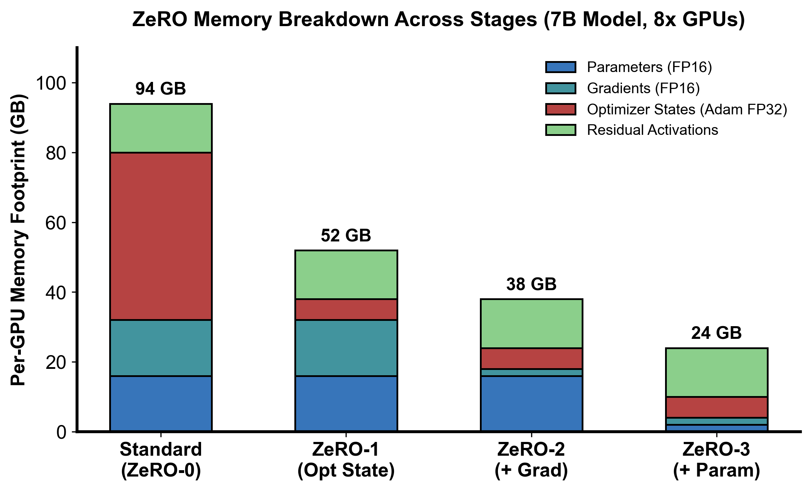

::: {.callout-note appearance="simple"}
**参考答案版**：包含完整代码实现与问答题深度参考解析。建议先独立完成练习题后再展开核对。
:::


::: {.callout-important title="统一完成标准与及格线"}
代码 4 分、Q1～Q3 各 2 分，通过线 8/10。必须解释正确性边界、显存/通信公式中的单位与分片维度；未实际运行的内容只能标记为静态审查。

:::


- 对应官方章节：Zero Redundancy Optimizer (ZeRO)
- 前置：第 4 课（DP、all-reduce/reduce-scatter/all-gather）
- 状态：未开始

## 本课目标

完成后你需要能够：

- 推导 ZeRO-1/2/3 的每卡静态显存公式并解释每项来源。
- 计算各阶段每步的通信量（2Ψ 与 3Ψ）并说明它们从哪里来。
- 解释为什么激活不能被 ZeRO 分片。
- 说明 FSDP 就是 ZeRO-3 的 PyTorch 实现，以及 prefetch 如何隐藏参数 all-gather。
- 对比 ZeRO-3 与流水线并行（第 9 课展开细节）。

## 核心概念


### 核心操作与执行流程图解

::: {.img-card}

<p class="caption">图 5-1：ZeRO-3 (FSDP) 每训练步通信与显存状态图解</p>
:::

::: {.img-card}

<p class="caption">图 5-2：ZeRO-3 阶段 1（前向）、阶段 2（反向）、阶段 3（优化器更新）分块状态与通信算子流转全景</p>
:::


### 1. 显存状态冗余的根源与 ZeRO 的核心洞见

在朴素数据并行（DDP）架构中，为了实现各 Rank 间前向与反向计算的完全解耦，整个集群在 $N_d$ 张显卡上各自保存了一份完整的模型状态镜像。这构成了极大的存储冗余：
- **静态状态全量复制**：每张显卡都必须同时持有 $1\times$ 参数、$1\times$ 梯度以及 $1\times$ 优化器状态（FP32 Master 权重、动量、方差），总计达 $16\Psi$ 字节（以 BF16 + Adam 为例）。
- **扩展性悖论**：随着训练集群从 8 卡扩展到 1024 卡，虽然算力呈线性增长，但每张卡上的静态显存开销**完全没有任何下降**。对于 70B 模型，单卡仅静态状态就需要 $1120\text{ GB}$，在任何现有机型上都会直接 OOM。

微软提出的 **ZeRO（Zero Redundancy Optimizer）** 技术提出了一个颠覆性的见解：**既然各 Rank 本质上共同维护全局模型，那么完全可以沿数据并行（DP）维度将这些状态分片切分，用时动态重构，从而彻底消除冗余！**

如**图 5-1** 与**图 5-2** 所示，ZeRO 将模型状态拆解为三个逐级深入的消除阶段。

### 2. ZeRO 阶段 1、2、3 的显存拆解与数学推导

设全模型参数量为 $\Psi$，数据并行规模为 $N_d$。在经典的 BF16/FP16 混合精度与 AdamW 优化器配置下（状态乘数 $k=12$：4 字节 FP32 Master 权重 + 4 字节一阶动量 $m$ + 4 字节二阶方差 $v$）：

1. **ZeRO-0（朴素 DDP）**：无任何状态分片，每张卡承担全量开销：
   $$M_0 = \underbrace{2\Psi}_{\text{BF16 参数}} + \underbrace{2\Psi}_{\text{BF16 梯度}} + \underbrace{12\Psi}_{\text{FP32 优化器状态}} = 16\Psi \text{ 字节/卡}$$

2. **ZeRO-1（优化器状态分片，$\text{P}_{\text{os}}$）**：
   - 优化器的动量和方差以及 FP32 Master 权重按 $1/N_d$ 均分到各 Rank。
   - 每张卡依然保留全量 BF16 参数与全量 BF16 梯度：
   $$M_1 = 2\Psi + 2\Psi + \frac{12\Psi}{N_d} = 4\Psi + \frac{12\Psi}{N_d}$$
   - 当 $N_d = 64$ 时，优化器状态显存从 $12\Psi$ 骤降至 $0.1875\Psi$，显存从 $16\Psi$ 降至约 $4.19\Psi$（节省约 74% 显存）。

3. **ZeRO-2（优化器状态 + 梯度分片，$\text{P}_{\text{os+g}}$）**：
   - 在 ZeRO-1 的基础上，进一步将梯度切片。
   - 反向传播计算过程中，各层梯度通过 **Reduce-Scatter** 同步后，每个 Rank 仅保留属于自己负责的 $1/N_d$ 梯度切片，其余 $N_d-1$ 份梯度被立刻释放：
   $$M_2 = 2\Psi + \frac{2\Psi + 12\Psi}{N_d} = 2\Psi + \frac{14\Psi}{N_d}$$
   - 当 $N_d = 64$ 时，显存进一步压缩至约 $2.22\Psi$。

4. **ZeRO-3（优化器状态 + 梯度 + 参数全分片，$\text{P}_{\text{os+g+p}}$，即 PyTorch FSDP）**：
   - 连前向与反向所需的模型参数本身也彻底分片！
   - 每张卡常驻显存中仅持有 $1/N_d$ 的参数切片。仅在计算某一层的前向或反向时，通过 **All-Gather** 临时动态拼出全量参数，计算完毕后**立即销毁释放**：
   $$M_3 = \frac{2\Psi + 2\Psi + 12\Psi}{N_d} = \frac{16\Psi}{N_d}$$
   - 当 $N_d \to \infty$ 时，静态模型显存理论上趋近于 0（实际受限于单层参数峰值）。

*注：若开启 FP32 梯度累积，ZeRO-1 因梯度全量驻留需额外增加 $4\Psi$；而 ZeRO-2/3 因梯度分片仅需额外增加 $\frac{4\Psi}{N_d}$。*

::: {.img-card}
{width="85%"}
<p class="caption">图 5-3：ZeRO 各阶段单卡显存占用对比（7B 模型 8 卡环境，基于 scientific-figure-making 绘制）</p>
:::

### 3. 通信账本严密推导：为什么 ZeRO-1/2 是 $2\Psi$，而 ZeRO-3 是 $3\Psi$

许多工程师误以为分片必然导致网络通信量剧增，但严谨的集合通信分析揭示了惊人的结论：

#### ZeRO-1 与 ZeRO-2 的通信等价性（总通信量 = $2\Psi$）
- 朴素 DDP：每个 step 反向传播结束后，发射一次全局 **AllReduce** 同步全量梯度。通信量为：
  $$V_{\text{DDP}} = 2 \times \frac{N_d - 1}{N_d} \Psi \approx 2\Psi$$
- ZeRO-1/2：
  1. 反向传播产出各层梯度后，系统不再发射 AllReduce，而是发射 **Reduce-Scatter**。每个 Rank 只接收并聚合自己所负责的 $1/N_d$ 梯度切片。其通信量恰好为 AllReduce 的一半：
     $$V_{\text{RS}} = \frac{N_d - 1}{N_d} \Psi \approx \Psi$$
  2. 各卡使用自己的 $1/N_d$ 梯度切片，在本地独立更新各自持有的 $1/N_d$ FP32 优化器状态与 Master 权重，并将其就地转换为 BF16 格式。此时每张卡拥有更新后的 $1/N_d$ 模型参数。
  3. 系统发射一次 **All-Gather** 算子，在所有卡之间互通有无，将各自的 $1/N_d$ 新参数拼回全量模型参数副本。其通信量同样为：
     $$V_{\text{AG}} = \frac{N_d - 1}{N_d} \Psi \approx \Psi$$
  - **总通信量计算**：
    $$V_{\text{ZeRO-1/2}} = V_{\text{RS}} + V_{\text{AG}} = \Psi + \Psi = 2\Psi$$
  - **关键结论**：ZeRO-1 与 ZeRO-2 的总通信量与朴素 DDP **完全一致**！且 ZeRO-2 比 ZeRO-1 额外节省了近 $2\Psi$ 的梯度显存，却没有任何额外的网络传输开销。因此在工程实践中，**ZeRO-2 总是无条件优于 ZeRO-1**。

#### ZeRO-3（FSDP）的通信代价（总通信量 = $3\Psi$）
ZeRO-3 为了将参数显存从 $2\Psi$ 砍到 $2\Psi / N_d$，付出了额外的通信代价：
1. **前向传播（All-Gather 参数）**：由于每卡仅存 $1/N_d$ 参数，在计算第 $l$ 层前向之前，必须先对该层权重执行一次 All-Gather，瞬时拼出完整的参数张量。整网前向累计通信量为：
   $$V_{\text{Fwd\_AG}} = \frac{N_d - 1}{N_d} \Psi \approx \Psi$$
   该层前向计算完毕后，非本地参数被立即释放，显存回落。
2. **反向传播（再次 All-Gather 参数）**：反向传播链式求导必须再次用到前向时的权重张量 $W_l$。因此在反向逐层推进时，必须再次对第 $l$ 层执行 All-Gather。整网反向参数通信量为：
   $$V_{\text{Bwd\_AG}} = \frac{N_d - 1}{N_d} \Psi \approx \Psi$$
   计算完该层的输入导数与权重导数后，非本地参数再次被立即丢弃。
3. **反向传播（Reduce-Scatter 梯度）**：计算出的梯度立即执行 Reduce-Scatter，各卡只留属于自己的 $1/N_d$ 梯度切片。通信量为：
   $$V_{\text{Bwd\_RS}} = \frac{N_d - 1}{N_d} \Psi \approx \Psi$$
4. **优化器更新（零通信）**：各卡直接在本地更新属于自己的 $1/N_d$ 状态，没有任何网络通信。

- **总通信量计算**：
  $$V_{\text{ZeRO-3}} = V_{\text{Fwd\_AG}} + V_{\text{Bwd\_AG}} + V_{\text{Bwd\_RS}} = \Psi + \Psi + \Psi = 3\Psi$$
- ZeRO-3 的通信量相比 DDP / ZeRO-2 增加了 **50%（从 $2\Psi$ 升至 $3\Psi$）**。

### 4. 异步流水预取（Prefetching）与重叠原理

如**图 5-2** 的执行全景所示，PyTorch FSDP（ZeRO-3）在实际运行时依靠专用的 CUDA Stream 建立流水线，尽可能隐藏这额外的通信：
- **前向预取（Forward Prefetch）**：当 GPU 计算流在第 $l$ 层执行 GEMM 矩阵乘时，通信流已经提前在后台对第 $l+1$ 层参数发射异步 `All-Gather`。
- **反向预取（Backward Prefetch）**：当 GPU 计算流在计算第 $l$ 层的反向导数时，通信流一方面异步对第 $l$ 层的梯度发射 `Reduce-Scatter`，另一方面并行对上一层（Layer $l-1$）的参数发射 `All-Gather` 预取。
- **重叠成功的先决条件**：单层的计算时间必须大于通信时间（$T_{\text{compute}} \ge T_{\text{comm}}$）。如果网络总线较慢（如跨节点 PCIe 或以太网），或者 $N_d$ 过大导致 Ring Latency 累积，计算流将被迫空转等待参数到齐，训练吞吐大幅滑坡。

### 5. 为什么激活显存（Activation）无法被 ZeRO 分片？

这是一个极为经典的面试陷阱：**ZeRO-3 能否解决长文本（如 32k/128k 上下文）带来的显存爆炸？**

**答案是：绝对不能！**
- **状态的语义差异**：ZeRO 的本质是消除数据并行副本间的“重复信息（Redundancy）”。模型参数、优化器状态在各 DP Rank 之间原本是完全相同的，所以切片后可以通过集合通信按需重构。
- **激活的独占性**：每个 DP 节点处理的是互不重叠的 Micro-Batch 数据。Rank 0 上的输入样本与 Rank 1 上的输入样本完全不同，因此产生的中间层激活值 $X_l$ 也**各不相同**。它们之间**没有任何冗余**可供消除！
- **长序列的内存归宿**：在长文本或大 Batch 场景下，激活显存随序列长度 $s$ 呈二次方增长（$O(s^2)$）。在 ZeRO-3 消除模型静态状态后，显存瓶颈将**完全转移至激活显存**。必须结合第 2 课的选择性激活重计算、第 6 课的张量并行（TP）以及第 8 课的序列/上下文并行（CP），才能彻底解开激活显存的束缚。

### 6. 工程选型准则：FSDP 与扩展边界

1. **单层参数上限约束**：ZeRO-3（FSDP）在执行某一层的计算时，必须临时容纳该层的全量参数与全量激活。如果单层的参数量本身就超过了单卡显存（例如某些超大 MoE 层的专家权重），ZeRO-3 将彻底无能为力，必须借助张量并行（TP）在机内切分单层矩阵。
2. **512 卡扩展性红线**：在大规模集群中，当 $N_d > 512$ 时，跨节点频繁发射小层的 All-Gather 与 Reduce-Scatter 会使通信延迟项 $2(N_d-1)\alpha$ 剧烈放大，Prefetch 无法完全掩盖通信开销。业内主流做法是采用 **FSDP / ZeRO-3 与 TP / PP 构成的 3D 混合并行**。

## 具体演示与数值推演

以一个 7B 模型（$\Psi = 7 \times 10^9$ 参数）为例，在 BF16 混合精度与 AdamW 优化器（$k=12$）配置下，无 FP32 梯度累积时，各阶段单卡静态显存（以 GB 计，换算系数 $10^9$）对比：

| 数据并行度 $N_d$ | ZeRO-0 (朴素 DP) | ZeRO-1 (分片优化器) | ZeRO-2 (分片优化器+梯度) | ZeRO-3 (全分片 FSDP) | 单步通信量 |
|:---:|:---:|:---:|:---:|:---:|:---:|
| **$N_d = 1$ (单卡基准)** | $112.0\text{ GB}$ | $112.0\text{ GB}$ | $112.0\text{ GB}$ | $112.0\text{ GB}$ | $0\text{ (无通信)}$ |
| **$N_d = 8$ (单机 8 卡)** | $112.0\text{ GB}$ | $38.5\text{ GB}$ | $26.3\text{ GB}$ | $14.0\text{ GB}$ | $2\Psi \text{ (Z1/2)} \ / \ 3\Psi \text{ (Z3)}$ |
| **$N_d = 64$ (8 节点集群)** | $112.0\text{ GB}$ | $29.3\text{ GB}$ | $15.5\text{ GB}$ | $1.75\text{ GB}$ | $2\Psi \text{ (Z1/2)} \ / \ 3\Psi \text{ (Z3)}$ |

- **公式验算**：
  - $N_d = 8$ 时：
    - ZeRO-1: $2\times 7 + 2\times 7 + \frac{12\times 7}{8} = 14 + 14 + 10.5 = 38.5\text{ GB}$
    - ZeRO-2: $2\times 7 + \frac{(2+12)\times 7}{8} = 14 + 12.25 = 26.25 \approx 26.3\text{ GB}$
    - ZeRO-3: $\frac{16\times 7}{8} = 14.0\text{ GB}$
  - $N_d = 64$ 时：
    - ZeRO-3 静态显存仅需 $1.75\text{ GB}$，使得在 24GB 消费级显卡（如 RTX 4090）上微调 70B 大模型成为可能。
  - 通信量对比：$2\Psi = 14\text{G 数值}$（BF16 下为 $28\text{ GB}$ 通信），$3\Psi = 21\text{G 数值}$（BF16 下为 $42\text{ GB}$ 通信）。

## 代码填空题

补全以下程序：各阶段每卡静态显存与通信量计算，并生成上表。

```{python}
#| course_role: exercise
def zero_memory_per_gpu(
    num_params: int,
    dp: int,
    stage: int,                     # 0=朴素DP, 1, 2, 3
    k: int = 12,                    # Adam 混合精度优化器状态乘数（4 master + 4 m + 4 v）
    fp32_grad_accum: bool = False,
) -> float:
    """
    返回每个 GPU 的静态显存（bytes）。

    公式（BF16 参数/梯度 + FP32 master weights + FP32 Adam 状态）：
        ZeRO-0: 2Ψ + 2Ψ + kΨ
        ZeRO-1: 2Ψ + 2Ψ + kΨ/dp
        ZeRO-2: 2Ψ + (2Ψ + kΨ)/dp
        ZeRO-3: (2Ψ + 2Ψ + kΨ)/dp
    可选 FP32 梯度累积：
        ZeRO-1 的梯度不分片，额外加 4Ψ；
        ZeRO-2/3 梯度分片，额外加 4Ψ/dp。
    """
    if num_params <= 0 or dp <= 0:
        raise ValueError("num_params and dp must be positive")
    if stage not in (0, 1, 2, 3):
        raise ValueError("stage must be 0..3")

    params_bf16 = 2 * num_params
    grads_bf16 = 2 * num_params
    opt_fp32 = k * num_params

    extra = 0.0
    if fp32_grad_accum:
        extra = 4 * num_params if stage <= 1 else 4 * num_params / dp

    if stage == 0:
        per_gpu = params_bf16 + grads_bf16 + opt_fp32 + extra
    elif stage == 1:
        per_gpu = ______                      # 填空：优化器状态分片
    elif stage == 2:
        per_gpu = ______                      # 填空：优化器状态 + 梯度分片
    else:
        per_gpu = ______                      # 填空：三者全分片
    return per_gpu


def zero_communication_volume(num_params: int, stage: int) -> int:
    """
    每训练步每卡通信量（数值个数）。

    ZeRO-1/2: reduce-scatter(Ψ) + all-gather(Ψ) = 2Ψ
    ZeRO-3:   forward all-gather(Ψ) + backward all-gather(Ψ)
              + reduce-scatter(Ψ) = 3Ψ
    """
    if stage in (1, 2):
        return ______
    if stage == 3:
        return ______
    if stage == 0:
        return 2 * num_params      # 朴素 DP：一次全量 all-reduce ≈ 2Ψ
    raise ValueError("stage must be 0..3")


def make_table():
    """生成 7B 模型各 DP 度下的每卡静态显存表（GB）。"""
    P = 7_000_000_000
    print(f"{'dp':>4} {'Z1 GB':>8} {'Z2 GB':>8} {'Z3 GB':>8} {'comm 2Ψ/3Ψ (G)':>16}")
    for dp in (1, 8, 64):
        z1 = zero_memory_per_gpu(P, dp, 1) / 1e9
        z2 = zero_memory_per_gpu(P, dp, 2) / 1e9
        z3 = zero_memory_per_gpu(P, dp, 3) / 1e9
        comm = zero_communication_volume(P, 3) / 1e9
        print(f"{dp:>4} {z1:>8.1f} {z2:>8.1f} {z3:>8.1f} {comm:>16.1f}")


if __name__ == "__main__":
    make_table()
    # 交叉验证：dp=1 时三档必须相等
    P = 1_000_000
    assert zero_memory_per_gpu(P, 1, 1) == zero_memory_per_gpu(P, 1, 2) == zero_memory_per_gpu(P, 1, 3)
    print("dp=1 时三档相等 ✓")
```

## 三个问答题

### Q1

为什么 ZeRO 不能分片激活？请从"冗余"的定义出发解释。既然不能分片激活，训练超长序列时 ZeRO-3 会把内存瓶颈留在哪里？第 2 课的哪些技术与它正交？

### Q2

ZeRO-1 为什么把朴素 DP 的一次 all-reduce 换成 reduce-scatter + all-gather，而总通信量不变（都是 2Ψ）？"reduce-scatter 比 all-reduce 快两倍"在这里意味着什么？ZeRO-2 相比 ZeRO-1 又省了什么、通信为什么不变？

### Q3

ZeRO-3 的 3Ψ 通信量由哪三部分组成？prefetch 为什么能隐藏其中两部分？为什么 DP 规模超过约 512 后这套隐藏会失效？结合第 4 课 Q3，说明"ZeRO-3 让模型装得下"与"ZeRO-3 让训练快"是两回事。

## 检查与通过标准

总分 10 分：代码正确 4 分（三档公式、FP32 累积分支、通信量、dp=1 交叉验证）、三题各 2 分、通过线 8 分。

一票否决项：

- 把 ZeRO 各档的分片对象搞错（如 ZeRO-2 分片了参数）。
- 说 ZeRO-3 激活也被分片。
- 通信量算错（不知道 2Ψ/3Ψ 从哪来）。
- 认为 ZeRO-3 的 N_d→∞ 可以把总显存（含激活与运行时）降到任意低。


::: {.callout-tip collapse="true" title="💡 点击展开参考答案与详细代码实现" icon="false"}
## 参考答案（仅 answer 分支）

先完成题目再核对；核对后必须解释关键公式，并改一个规模重新计算。

```{python}
#| course_role: solution
def zero_memory_per_gpu(
    num_params: int,
    dp: int,
    stage: int,                     # 0=朴素DP, 1, 2, 3
    k: int = 12,                    # Adam 混合精度优化器状态乘数（4 master + 4 m + 4 v）
    fp32_grad_accum: bool = False,
) -> float:
    """
    返回每个 GPU 的静态显存（bytes）。

    公式（BF16 参数/梯度 + FP32 master weights + FP32 Adam 状态）：
        ZeRO-0: 2Ψ + 2Ψ + kΨ
        ZeRO-1: 2Ψ + 2Ψ + kΨ/dp
        ZeRO-2: 2Ψ + (2Ψ + kΨ)/dp
        ZeRO-3: (2Ψ + 2Ψ + kΨ)/dp
    可选 FP32 梯度累积：
        ZeRO-1 的梯度不分片，额外加 4Ψ；
        ZeRO-2/3 梯度分片，额外加 4Ψ/dp。
    """
    if num_params <= 0 or dp <= 0:
        raise ValueError("num_params and dp must be positive")
    if stage not in (0, 1, 2, 3):
        raise ValueError("stage must be 0..3")

    params_bf16 = 2 * num_params
    grads_bf16 = 2 * num_params
    opt_fp32 = k * num_params

    extra = 0.0
    if fp32_grad_accum:
        extra = 4 * num_params if stage <= 1 else 4 * num_params / dp

    if stage == 0:
        per_gpu = params_bf16 + grads_bf16 + opt_fp32 + extra
    elif stage == 1:
        per_gpu = params_bf16 + grads_bf16 + opt_fp32 / dp + extra                      # 填空：优化器状态分片
    elif stage == 2:
        per_gpu = params_bf16 + (grads_bf16 + opt_fp32) / dp + extra                      # 填空：优化器状态 + 梯度分片
    else:
        per_gpu = (params_bf16 + grads_bf16 + opt_fp32) / dp + extra                      # 填空：三者全分片
    return per_gpu


def zero_communication_volume(num_params: int, stage: int) -> int:
    """
    每训练步每卡通信量（数值个数）。

    ZeRO-1/2: reduce-scatter(Ψ) + all-gather(Ψ) = 2Ψ
    ZeRO-3:   forward all-gather(Ψ) + backward all-gather(Ψ)
              + reduce-scatter(Ψ) = 3Ψ
    """
    if stage in (1, 2):
        return 2 * num_params
    if stage == 3:
        return 3 * num_params
    if stage == 0:
        return 2 * num_params      # 朴素 DP：一次全量 all-reduce ≈ 2Ψ
    raise ValueError("stage must be 0..3")


def make_table():
    """生成 7B 模型各 DP 度下的每卡静态显存表（GB）。"""
    P = 7_000_000_000
    print(f"{'dp':>4} {'Z1 GB':>8} {'Z2 GB':>8} {'Z3 GB':>8} {'comm 2Ψ/3Ψ (G)':>16}")
    for dp in (1, 8, 64):
        z1 = zero_memory_per_gpu(P, dp, 1) / 1e9
        z2 = zero_memory_per_gpu(P, dp, 2) / 1e9
        z3 = zero_memory_per_gpu(P, dp, 3) / 1e9
        comm = zero_communication_volume(P, 3) / 1e9
        print(f"{dp:>4} {z1:>8.1f} {z2:>8.1f} {z3:>8.1f} {comm:>16.1f}")


if __name__ == "__main__":
    make_table()
    # 交叉验证：dp=1 时三档必须相等
    P = 1_000_000
    assert zero_memory_per_gpu(P, 1, 1) == zero_memory_per_gpu(P, 1, 2) == zero_memory_per_gpu(P, 1, 3)
    print("dp=1 时三档相等 ✓")
```


## 补全后的代码（关键填空处）

```python
if stage == 0:
        per_gpu = params_bf16 + grads_bf16 + opt_fp32 + extra
    elif stage == 1:
        per_gpu = params_bf16 + grads_bf16 + opt_fp32 / dp + extra
    elif stage == 2:
        per_gpu = params_bf16 + (grads_bf16 + opt_fp32) / dp + extra
    else:
        per_gpu = (params_bf16 + grads_bf16 + opt_fp32) / dp + extra
```

通信量：`2 * num_params`（stage 1/2）；`3 * num_params`（stage 3）。

输出表（7B、k=12、无 FP32 梯度累积）：

```python
dp   Z1 GB    Z2 GB    Z3 GB   comm 2Ψ/3Ψ (G)
   1    112.0    112.0    112.0         21.0
   8     38.5     26.3     14.0         21.0
  64     29.3     15.5      1.75        21.0
```

## 三个问答题要点

### Q1

- 冗余定义：ZeRO 消除的是"跨 DP 副本重复存储的相同数据"。激活在 DP 各副本上是**不同的**（不同 micro-batch），没有冗余可消除；
- 后果：ZeRO-3 之后内存瓶颈留在激活上 → 长序列需要第 2 课的重计算/梯度累积 + 第 6/8 课的 TP/CP；
- 正交性：ZeRO（管参数/梯度/优化器状态）× 重计算/TP/CP（管激活）可以叠加。

### Q2

- 正确性：优化 step 只需要自己的 1/N_d 梯度分片 → 用 reduce-scatter（每卡只留所需分片，通信量 K）替代 all-reduce（每卡全量，通信量 2K）；
- 参数同步：优化后各卡持有不同的 1/N_d 新参数 → all-gather 补全；
- 总量：K + K = 2K，与 all-reduce 相同——"通信没变多，内存省了"；
- ZeRO-2：梯度也分片 → 每卡只需存 1/N_d 梯度；reduce-scatter 后立刻释放其余分片；通信与 ZeRO-1 完全相同（都是 RS+AG=2Ψ），所以 ZeRO-2 无额外通信代价，通常直接选 ZeRO-2。

### Q3

- 3Ψ = 前向逐层 all-gather 参数（Ψ）+ 反向再次 all-gather（Ψ，用完即弃）+ reduce-scatter 梯度（Ψ）；
- prefetch：算第 n 层时提前 all-gather 第 n+1 层参数（前向）/第 n−1 层（反向），把通信藏进计算；
- 失效条件：DP 太大 → 每步 all-gather 数据量相对单层计算时间过大、且 ring latency 累积 → 隐藏窗口装不下；
- "装得下"（内存分片）与"快"（通信能否隐藏）是两回事：ZeRO-3 在 512+ 卡上能装但效率掉。

## 通过要点

- k=12 的构成：4（master）+ 4（m）+ 4（v）；FP32 梯度累积在 Z2/Z3 是 4Ψ/N_d、在 Z1 是 4Ψ。
- FSDP = ZeRO-3 的 PyTorch 实现；ZeRO 只沿 DP 维分片。

## 官方主参考

- [Ultra-Scale Playbook](https://huggingface.co/spaces/nanotron/ultrascale-playbook)
- [PyTorch distributed documentation](https://pytorch.org/docs/stable/distributed.html)
:::
