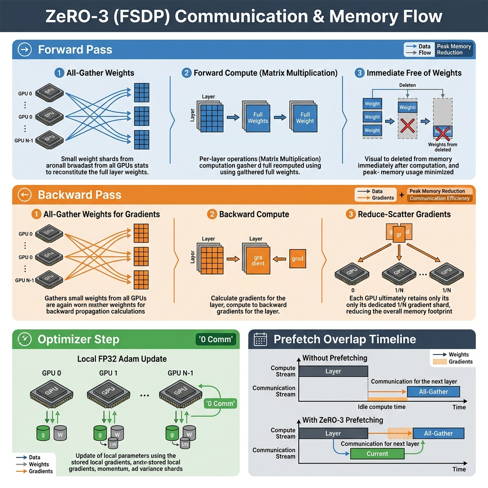
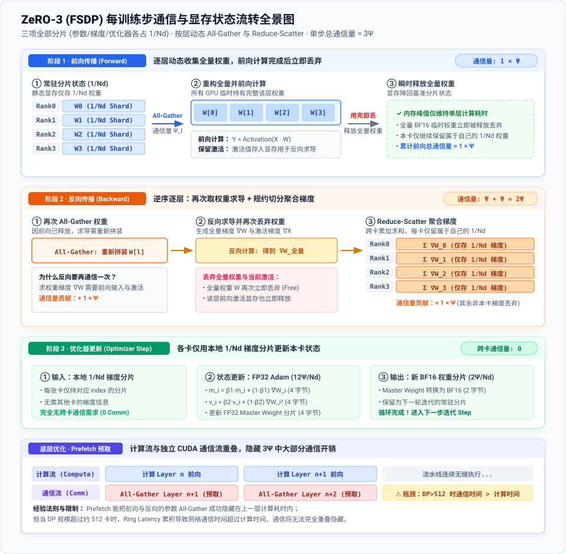

> 状态：**参考答案版**  
> 一次只完成一课；未通过前不要打开下一课答案。


## 统一完成标准

代码 4 分、Q1～Q3 各 2 分，通过线 8/10。必须解释正确性边界、显存/通信公式中的单位与分片维度；未实际运行的内容只能标记为静态审查。

# 第 5 课：ZeRO 与 FSDP

- 对应官方章节：Zero Redundancy Optimizer (ZeRO)
- 前置：第 4 课（DP、all-reduce/reduce-scatter/all-gather）
- 状态：未开始

## 本课目标

完成后你需要能够：

- 推导 ZeRO-1/2/3 的每卡静态显存公式并解释每项来源。
- 计算各阶段每步的通信量（2Ψ 与 3Ψ）并说明它们从哪里来。
- 解释为什么激活不能被 ZeRO 分片。
- 说明 FSDP 就是 ZeRO-3 的 PyTorch 实现，以及 prefetch 如何隐藏参数 all-gather。
- 对比 ZeRO-3 与流水线并行（第 9 课展开细节）。

## 核心概念

### 1. 冗余问题

朴素 DP 中，每个副本都持有完整的优化器状态、梯度、参数——`N_d` 份冗余。ZeRO 沿 **DP 维度** 分片这些状态，用时再重建。

记号：Ψ = 参数量，N_d = DP 度，k = 优化器状态乘数（Adam 混合精度 = 12：4 字节 FP32 master weights + 4 一阶矩 + 4 二阶矩）。

### 2. 三个阶段（混合精度 + Adam，无 FP32 梯度累积）

```{python}
ZeRO-0（朴素 DP）：2Ψ + 2Ψ + 12Ψ                 = 16Ψ / 卡
ZeRO-1：分片优化器状态   2Ψ + 2Ψ + 12Ψ/N_d
ZeRO-2：+ 分片梯度       2Ψ + (2Ψ + 12Ψ)/N_d
ZeRO-3：+ 分片参数       (2Ψ + 2Ψ + 12Ψ)/N_d
```

- 有 FP32 梯度累积时：ZeRO-2/3 的梯度项再加 `4Ψ/N_d`（分片后累积）；ZeRO-1 梯度不分片，加完整 `4Ψ`。
- N_d 足够大时 ZeRO-3 理论上可把模型相关显存降到任意低，但**激活仍然完整存在**——激活靠第 2 课的重计算/梯度累积与第 6/8 课的 TP/CP 处理。
- ZeRO-2 相对 ZeRO-1 没有额外通信开销，通常是更优选择。

### 3. 通信账本（每训练步、每卡）

```{python}
ZeRO-1：reduce-scatter 梯度（Ψ）+ all-gather BF16 参数（Ψ）= 2Ψ
ZeRO-2：同上（通信量相同，只是梯度分片后立刻释放）= 2Ψ
ZeRO-3：forward 中按层 all-gather 参数（Ψ）
      + backward 中再次 all-gather 参数（Ψ，用完即丢）
      + reduce-scatter 梯度（Ψ）= 3Ψ
```

- 教材原话："Reduce-scatter 比 all-reduce 快两倍"——因为 reduce-scatter 只需 all-reduce 一半的通信量（第 3 课），ZeRO-1/2 用 reduce-scatter + all-gather 替代 all-reduce，总通信量不变（2Ψ 对 2Ψ）。
- ZeRO-3 的 3Ψ 比 2Ψ 多出的 Ψ 来自参数的前向 all-gather 与反向 all-gather。**prefetch**（算第 n 层时预取第 n+1 层参数）可以把它们藏在计算后面；但 DP 太大（经验法则 >512）时隐藏不住。

---

### 4. 训练步流程对比（ZeRO-1 vs ZeRO-3）

- **ZeRO-1 流程**：  
  forward（全量 BF16 参数）→ backward（全量梯度）→ reduce-scatter 梯度（通信量 Ψ）→ 各卡只更新自己的 1/N_d 优化器状态与 FP32 参数 → 转成 BF16 → all-gather 补全参数（通信量 Ψ）。总通信量 = 2Ψ。

- **ZeRO-3 通信与显存流转（按层拆解）**：  
  在 ZeRO-3（以及 FSDP）中，参数、梯度、优化器状态**三者全部按 1/N_d 分片**。每张卡常驻显存中仅持有自己的分片。为了前向/反向计算，必须**逐层动态重构全量参数，用完即弃**。

<div align="center">
  
  <p><em>图 1：ZeRO-3 (FSDP) 每训练步通信与显存状态图解（生图模型生成）</em></p>
</div>

<div align="center">
  
  <p><em>图 2：ZeRO-3 阶段 1（前向）、阶段 2（反向）、阶段 3（优化器更新）分块状态与通信算子流转全景（矢量架构图）</em></p>
</div>

#### ZeRO-3 通信账本与显存行为

| 阶段 (Stage) | 通信算子 (Primitive) | 通信量 (Volume) | 显存行为 (Memory Behavior) |
|---|---|---|---|
| **1. 前向传播** | All-Gather（逐层） | $\Psi$ | 临时申请全量权重空间，该层计算完成后立即释放 |
| **2. 反向传播（参数恢复）** | All-Gather（逐层逆序） | $\Psi$ | 再次临时申请全量权重空间，反向链式求导完毕后立即释放 |
| **3. 反向传播（梯度聚合）** | Reduce-Scatter（逐层） | $\Psi$ | 各卡只累加并保留自己负责的 $1/N_d$ 梯度分片，丢弃其余部分 |
| **4. 优化器更新** | **无（纯本地操作）** | **0** | 各卡独立使用本地梯度分片更新本地 $1/N_d$ 优化器状态与参数 |
| **单步通信总量** | - | **$3\Psi$** | 比 ZeRO-1/2 的 $2\Psi$ 多出前向/反向两次 All-Gather 之一的开销 |

> **Prefetch（预取）重叠优化**：  
> 在实际工程实现（如 PyTorch FSDP）中，通信与计算是在不同的 CUDA Stream 上并行执行的：
> - **前向计算与通信重叠**：在 GPU 计算第 $l$ 层前向时，通信流已经异步 `All-Gather` 预取第 $l+1$ 层的权重。
> - **反向计算与通信重叠**：在计算第 $l$ 层梯度的同时，通信流异步 `All-Gather` 预取第 $l-1$ 层的权重，同时异步 `Reduce-Scatter` 发送第 $l$ 层的梯度。
> - **局限**：当 DP 规模过大（如 >512）时，网络延迟（Ring Latency）和通信带宽开销会超过单层的计算时间，计算流被迫等待通信流，Prefetch 隐藏失效。

### 5. 为什么激活不能分片

DP 各副本的 micro-batch 不同 → 激活本来就不同，没有冗余可去。ZeRO 只能消除"跨副本重复"的状态。所以 ZeRO 与激活问题（重计算、梯度累积、TP/CP）是正交的。

### 6. FSDP 与限制

- PyTorch 的 FSDP = ZeRO-3 的官方实现（可以理解成"ZeRO-3 即 FSDP"）。
- 限制：DP 度不宜超过 ~512（ring latency）；ZeRO 管不了激活；单层参数也必须能放进一张卡（每个 all-gather 单元要能容纳）。

## 具体演示

7B 模型（Ψ=7e9），BF16 混合精度 + Adam（k=12），无 FP32 梯度累积，每卡静态显存（GB）：

| N_d | ZeRO-1 | ZeRO-2 | ZeRO-3 |
|---|---|---|---|
| 1 | 112.0 | 112.0 | 112.0 |
| 8 | 38.5 | 26.3 | 14.0 |
| 64 | 29.3 | 15.5 | 1.75 |

（验算：Z1=2Ψ+2Ψ+12Ψ/N_d；Z2=2Ψ+(2Ψ+12Ψ)/N_d；Z3=16Ψ/N_d）

注意 N_d=1 时三档相同（没有分片）；N_d=64 时 ZeRO-3 每卡仅 1.75 GB（不含激活与运行时），但通信量 3Ψ=21e9 数值。

## 代码填空题

补全以下程序：各阶段每卡静态显存与通信量计算，并生成上表。

```{python}
#| course_role: exercise
def zero_memory_per_gpu(
    num_params: int,
    dp: int,
    stage: int,                     # 0=朴素DP, 1, 2, 3
    k: int = 12,                    # Adam 混合精度优化器状态乘数（4 master + 4 m + 4 v）
    fp32_grad_accum: bool = False,
) -> float:
    """
    返回每个 GPU 的静态显存（bytes）。

    公式（BF16 参数/梯度 + FP32 master weights + FP32 Adam 状态）：
        ZeRO-0: 2Ψ + 2Ψ + kΨ
        ZeRO-1: 2Ψ + 2Ψ + kΨ/dp
        ZeRO-2: 2Ψ + (2Ψ + kΨ)/dp
        ZeRO-3: (2Ψ + 2Ψ + kΨ)/dp
    可选 FP32 梯度累积：
        ZeRO-1 的梯度不分片，额外加 4Ψ；
        ZeRO-2/3 梯度分片，额外加 4Ψ/dp。
    """
    if num_params <= 0 or dp <= 0:
        raise ValueError("num_params and dp must be positive")
    if stage not in (0, 1, 2, 3):
        raise ValueError("stage must be 0..3")

    params_bf16 = 2 * num_params
    grads_bf16 = 2 * num_params
    opt_fp32 = k * num_params

    extra = 0.0
    if fp32_grad_accum:
        extra = 4 * num_params if stage <= 1 else 4 * num_params / dp

    if stage == 0:
        per_gpu = params_bf16 + grads_bf16 + opt_fp32 + extra
    elif stage == 1:
        per_gpu = ______                      # 填空：优化器状态分片
    elif stage == 2:
        per_gpu = ______                      # 填空：优化器状态 + 梯度分片
    else:
        per_gpu = ______                      # 填空：三者全分片
    return per_gpu


def zero_communication_volume(num_params: int, stage: int) -> int:
    """
    每训练步每卡通信量（数值个数）。

    ZeRO-1/2: reduce-scatter(Ψ) + all-gather(Ψ) = 2Ψ
    ZeRO-3:   forward all-gather(Ψ) + backward all-gather(Ψ)
              + reduce-scatter(Ψ) = 3Ψ
    """
    if stage in (1, 2):
        return ______
    if stage == 3:
        return ______
    if stage == 0:
        return 2 * num_params      # 朴素 DP：一次全量 all-reduce ≈ 2Ψ
    raise ValueError("stage must be 0..3")


def make_table():
    """生成 7B 模型各 DP 度下的每卡静态显存表（GB）。"""
    P = 7_000_000_000
    print(f"{'dp':>4} {'Z1 GB':>8} {'Z2 GB':>8} {'Z3 GB':>8} {'comm 2Ψ/3Ψ (G)':>16}")
    for dp in (1, 8, 64):
        z1 = zero_memory_per_gpu(P, dp, 1) / 1e9
        z2 = zero_memory_per_gpu(P, dp, 2) / 1e9
        z3 = zero_memory_per_gpu(P, dp, 3) / 1e9
        comm = zero_communication_volume(P, 3) / 1e9
        print(f"{dp:>4} {z1:>8.1f} {z2:>8.1f} {z3:>8.1f} {comm:>16.1f}")


if __name__ == "__main__":
    make_table()
    # 交叉验证：dp=1 时三档必须相等
    P = 1_000_000
    assert zero_memory_per_gpu(P, 1, 1) == zero_memory_per_gpu(P, 1, 2) == zero_memory_per_gpu(P, 1, 3)
    print("dp=1 时三档相等 ✓")
```

## 三个问答题

### Q1

为什么 ZeRO 不能分片激活？请从"冗余"的定义出发解释。既然不能分片激活，训练超长序列时 ZeRO-3 会把内存瓶颈留在哪里？第 2 课的哪些技术与它正交？

### Q2

ZeRO-1 为什么把朴素 DP 的一次 all-reduce 换成 reduce-scatter + all-gather，而总通信量不变（都是 2Ψ）？"reduce-scatter 比 all-reduce 快两倍"在这里意味着什么？ZeRO-2 相比 ZeRO-1 又省了什么、通信为什么不变？

### Q3

ZeRO-3 的 3Ψ 通信量由哪三部分组成？prefetch 为什么能隐藏其中两部分？为什么 DP 规模超过约 512 后这套隐藏会失效？结合第 4 课 Q3，说明"ZeRO-3 让模型装得下"与"ZeRO-3 让训练快"是两回事。

## 检查与通过标准

总分 10 分：代码正确 4 分（三档公式、FP32 累积分支、通信量、dp=1 交叉验证）、三题各 2 分、通过线 8 分。

一票否决项：

- 把 ZeRO 各档的分片对象搞错（如 ZeRO-2 分片了参数）。
- 说 ZeRO-3 激活也被分片。
- 通信量算错（不知道 2Ψ/3Ψ 从哪来）。
- 认为 ZeRO-3 的 N_d→∞ 可以把总显存（含激活与运行时）降到任意低。

## 参考答案（仅 answer 分支）

先完成题目再核对；核对后必须解释关键公式，并改一个规模重新计算。

```{python}
#| course_role: solution
def zero_memory_per_gpu(
    num_params: int,
    dp: int,
    stage: int,                     # 0=朴素DP, 1, 2, 3
    k: int = 12,                    # Adam 混合精度优化器状态乘数（4 master + 4 m + 4 v）
    fp32_grad_accum: bool = False,
) -> float:
    """
    返回每个 GPU 的静态显存（bytes）。

    公式（BF16 参数/梯度 + FP32 master weights + FP32 Adam 状态）：
        ZeRO-0: 2Ψ + 2Ψ + kΨ
        ZeRO-1: 2Ψ + 2Ψ + kΨ/dp
        ZeRO-2: 2Ψ + (2Ψ + kΨ)/dp
        ZeRO-3: (2Ψ + 2Ψ + kΨ)/dp
    可选 FP32 梯度累积：
        ZeRO-1 的梯度不分片，额外加 4Ψ；
        ZeRO-2/3 梯度分片，额外加 4Ψ/dp。
    """
    if num_params <= 0 or dp <= 0:
        raise ValueError("num_params and dp must be positive")
    if stage not in (0, 1, 2, 3):
        raise ValueError("stage must be 0..3")

    params_bf16 = 2 * num_params
    grads_bf16 = 2 * num_params
    opt_fp32 = k * num_params

    extra = 0.0
    if fp32_grad_accum:
        extra = 4 * num_params if stage <= 1 else 4 * num_params / dp

    if stage == 0:
        per_gpu = params_bf16 + grads_bf16 + opt_fp32 + extra
    elif stage == 1:
        per_gpu = params_bf16 + grads_bf16 + opt_fp32 / dp + extra                      # 填空：优化器状态分片
    elif stage == 2:
        per_gpu = params_bf16 + (grads_bf16 + opt_fp32) / dp + extra                      # 填空：优化器状态 + 梯度分片
    else:
        per_gpu = (params_bf16 + grads_bf16 + opt_fp32) / dp + extra                      # 填空：三者全分片
    return per_gpu


def zero_communication_volume(num_params: int, stage: int) -> int:
    """
    每训练步每卡通信量（数值个数）。

    ZeRO-1/2: reduce-scatter(Ψ) + all-gather(Ψ) = 2Ψ
    ZeRO-3:   forward all-gather(Ψ) + backward all-gather(Ψ)
              + reduce-scatter(Ψ) = 3Ψ
    """
    if stage in (1, 2):
        return 2 * num_params
    if stage == 3:
        return 3 * num_params
    if stage == 0:
        return 2 * num_params      # 朴素 DP：一次全量 all-reduce ≈ 2Ψ
    raise ValueError("stage must be 0..3")


def make_table():
    """生成 7B 模型各 DP 度下的每卡静态显存表（GB）。"""
    P = 7_000_000_000
    print(f"{'dp':>4} {'Z1 GB':>8} {'Z2 GB':>8} {'Z3 GB':>8} {'comm 2Ψ/3Ψ (G)':>16}")
    for dp in (1, 8, 64):
        z1 = zero_memory_per_gpu(P, dp, 1) / 1e9
        z2 = zero_memory_per_gpu(P, dp, 2) / 1e9
        z3 = zero_memory_per_gpu(P, dp, 3) / 1e9
        comm = zero_communication_volume(P, 3) / 1e9
        print(f"{dp:>4} {z1:>8.1f} {z2:>8.1f} {z3:>8.1f} {comm:>16.1f}")


if __name__ == "__main__":
    make_table()
    # 交叉验证：dp=1 时三档必须相等
    P = 1_000_000
    assert zero_memory_per_gpu(P, 1, 1) == zero_memory_per_gpu(P, 1, 2) == zero_memory_per_gpu(P, 1, 3)
    print("dp=1 时三档相等 ✓")
```

# 第 5 课参考答案（复盘用，先提交再打开）

## 补全后的代码（关键填空处）

```python
if stage == 0:
        per_gpu = params_bf16 + grads_bf16 + opt_fp32 + extra
    elif stage == 1:
        per_gpu = params_bf16 + grads_bf16 + opt_fp32 / dp + extra
    elif stage == 2:
        per_gpu = params_bf16 + (grads_bf16 + opt_fp32) / dp + extra
    else:
        per_gpu = (params_bf16 + grads_bf16 + opt_fp32) / dp + extra
```

通信量：`2 * num_params`（stage 1/2）；`3 * num_params`（stage 3）。

输出表（7B、k=12、无 FP32 梯度累积）：

```python
dp   Z1 GB    Z2 GB    Z3 GB   comm 2Ψ/3Ψ (G)
   1    112.0    112.0    112.0         21.0
   8     38.5     26.3     14.0         21.0
  64     29.3     15.5      1.75        21.0
```

## 三个问答题要点

### Q1

- 冗余定义：ZeRO 消除的是"跨 DP 副本重复存储的相同数据"。激活在 DP 各副本上是**不同的**（不同 micro-batch），没有冗余可消除；
- 后果：ZeRO-3 之后内存瓶颈留在激活上 → 长序列需要第 2 课的重计算/梯度累积 + 第 6/8 课的 TP/CP；
- 正交性：ZeRO（管参数/梯度/优化器状态）× 重计算/TP/CP（管激活）可以叠加。

### Q2

- 正确性：优化 step 只需要自己的 1/N_d 梯度分片 → 用 reduce-scatter（每卡只留所需分片，通信量 K）替代 all-reduce（每卡全量，通信量 2K）；
- 参数同步：优化后各卡持有不同的 1/N_d 新参数 → all-gather 补全；
- 总量：K + K = 2K，与 all-reduce 相同——"通信没变多，内存省了"；
- ZeRO-2：梯度也分片 → 每卡只需存 1/N_d 梯度；reduce-scatter 后立刻释放其余分片；通信与 ZeRO-1 完全相同（都是 RS+AG=2Ψ），所以 ZeRO-2 无额外通信代价，通常直接选 ZeRO-2。

### Q3

- 3Ψ = 前向逐层 all-gather 参数（Ψ）+ 反向再次 all-gather（Ψ，用完即弃）+ reduce-scatter 梯度（Ψ）；
- prefetch：算第 n 层时提前 all-gather 第 n+1 层参数（前向）/第 n−1 层（反向），把通信藏进计算；
- 失效条件：DP 太大 → 每步 all-gather 数据量相对单层计算时间过大、且 ring latency 累积 → 隐藏窗口装不下；
- "装得下"（内存分片）与"快"（通信能否隐藏）是两回事：ZeRO-3 在 512+ 卡上能装但效率掉。

## 通过要点

- k=12 的构成：4（master）+ 4（m）+ 4（v）；FP32 梯度累积在 Z2/Z3 是 4Ψ/N_d、在 Z1 是 4Ψ。
- FSDP = ZeRO-3 的 PyTorch 实现；ZeRO 只沿 DP 维分片。

## 官方主参考

- [Ultra-Scale Playbook](https://huggingface.co/spaces/nanotron/ultrascale-playbook)
- [PyTorch distributed documentation](https://pytorch.org/docs/stable/distributed.html)

