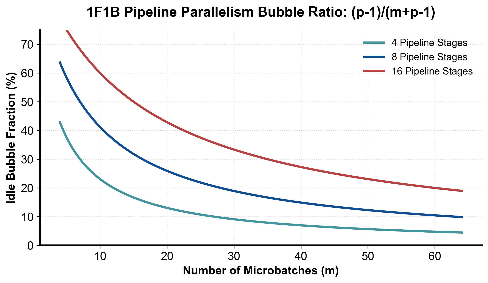
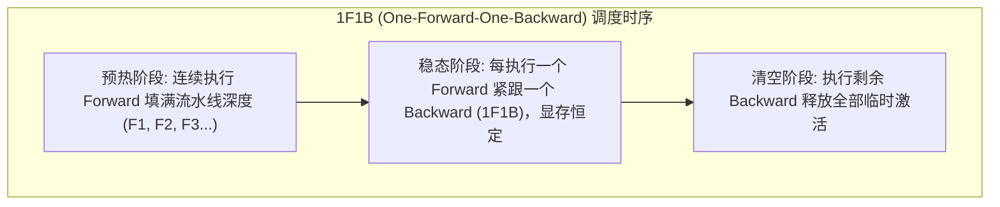

::: {.callout-note appearance="simple"}
**参考答案版**：包含完整代码实现与问答题深度参考解析。建议先独立完成练习题后再展开核对。
:::


::: {.callout-important title="统一完成标准与及格线"}
代码 4 分、Q1～Q3 各 2 分，通过线 8/10。必须解释正确性边界、显存/通信公式中的单位与分片维度；未实际运行的内容只能标记为静态审查。

:::


- 对应官方章节：Pipeline Parallelism（AFAB、1F1B、Interleaving、Zero bubble & DualPipe）
- 前置：第 2 课（激活）、第 3 课（P2P 通信）、第 5 课（与 ZeRO-3 的对比）
- 状态：未开始

## 本课目标

完成后你需要能够：

- 推导 naive / AFAB / 1F1B / interleaved 四种调度的 bubble 公式。
- 解释为什么 AFAB 有激活爆炸、1F1B 没有（内存从 m 降到 p 个微批次）。
- 说明 interleaved 的通信代价（×v）与 depth-first / breadth-first 调度选择。
- 解释 zero bubble（B/W 拆分）与 DualPipe（双向双流）的核心思想。
- 对比 PP 与 ZeRO-3，说明各自适合的场景。

## 核心概念

::: {.img-card}
{width="85%"}
<p class="caption">图 9-1：1F1B 流水线并行空闲气泡（Bubble）占比与 Microbatch 关系曲线（基于 scientific-figure-making 绘制）</p>
:::


<p class="caption" align="center"><em>图 9-2：1F1B 调度器稳态执行与微批次（Micro-Batch）显存收敛机制</em></p>

<p class="caption" align="center"><em>图 9-2：1F1B 调度器稳态执行与微批次（Micro-Batch）显存收敛机制</em></p>


### 1. PP 是什么

把模型的**层**切分到多卡（如 8 卡各放 1/8 层）。通信是**激活张量**沿模型深度的 P2P 传递（每层边界一小段），带宽需求低——这正是它适合跨节点（低带宽网络）的原因。对比：ZeRO-3 传权重，TP 传激活但每层多次且需要高带宽。

### 2. 理想时间与 bubble

- 完美流水线理想时间：`t_id = m·(t_f + t_b)`（m 个微批次，t_b ≈ 2·t_f）。
- bubble 时间：GPU 等待其他 GPU 计算的时间。
- **Naive**（无微批次拆分）：`r_bubble = (p−1)`（相对单微批次理想时间）。

### 3. AFAB：All Forward, All Backward

- 先全部前向、再全部反向。调度实现简单（保持常规训练循环结构）。
- bubble：`r_bubble = (p−1)/m`——m 越大 bubble 越小。
- **致命问题**：所有 m 个微批次的激活都要留到反向阶段 → 激活 = m 份 → 内存爆炸。
- 每卡激活 ≈ PP × (activs/PP) ≈ activs，与不用 PP 一样——PP 不省激活。

### 4. 1F1B：One Forward, One Backward

- 稳态交替做前向、反向，尽早开始反向、尽早释放激活。
- bubble 大小**不变**（(p−1)/m），但激活内存从 m 个微批次降到 **p 个微批次**，之后可放心加大 m 来缩 bubble。
- 代价：代码结构复杂（各设备独立切换 F/B），需要专门的调度器。Llama 3.1 用的就是 1F1B + interleaved + 可调 priority（depth-first / breadth-first）。

### 5. Interleaved：交错分片

- 不再把 1–4 层给卡 1、5–8 层给卡 2；而是奇偶交错（1,3,5,7 / 2,4,6,8）——每卡持有 v 个模型分片，微批次在环里转圈。
- `r_bubble = (p−1)/(v·m)`；通信量 ×v（每次前向/反向多路过 v−1 次设备边界）。
- 调度要选 priority：depth-first（尽快推出完成的批次）vs breadth-first（尽快填满流水线）。

### 6. Zero bubble 与 DualPipe（DeepSeek-V3）

- 观察：反向的矩阵乘法其实包含两个独立运算——**B**（对输入的梯度）与 **W**（对权重的梯度）。B 必须按层序传下去；W 只服务于优化器 step，可以**延迟到任何方便的时刻**执行。
- 把 W 插进 1F1B 的空闲槽 → 理论 bubble → 0（ZB-H2 调度）。
- DualPipe：从 PP 维度的**两端同时**注入两个微批次流，交错执行，进一步填满空闲；最优调度用整数线性规划（ILP）求解。DeepSeek-V3 报告"近零通信开销"（这里的开销指 bubble 损失）。
- 这些调度太复杂，生产实现靠框架支持，面试只需讲清 B/W 拆分与双流思想。

### 7. PP vs ZeRO-3（教材表格）

| | ZeRO-3 | PP |
|---|---|---|
| 每计算单元存 | 层的分片 | 完整层 |
| 通信传 | 权重 | 激活 |
| 调度 | 与模型无关 | 需要 schedule |
| 扩展偏好 | 大 mbs / 长 seq 隐藏通信 | 大 grad_acc 隐藏 bubble |

两者很少组合（需要很大的 gbs 摊薄通信）；ZeRO-1/2 与 PP 则天然互补（DeepSeek-V3 = PP + ZeRO-1）。

## 具体演示

p=4、m=8、t_b=2·t_f：AFAB/1F1B 的 bubble 额外时间/理想时间 = (p−1)/m = 3/8 = 37.5%（教材定义；若按"占实际总时间"算则是 (p−1)/(m+p−1) = 3/11 ≈ 27.3%）；v=2 interleaved → (p−1)/(v·m) = 3/16 ≈ 18.8%。教材基准：m=32 ≫ p−1 时低 PP 度性能良好；从 8 卡到 16 卡（跨节点）性能只降 14%——远好于 TP 的跨节点表现（~43%）。

## 代码填空题

推导并验证各调度的 bubble 公式；生成 AFAB 调度矩阵并统计空闲比例。

```{python}
#| course_role: exercise
def bubble_ratio(scheme: str, p: int, m: int, v: int = 1) -> float:
    """
    bubble 相对理想时间的比例 r_bubble = 额外时间 / 理想时间。

    - naive: m=1（不分微批次），r = (p-1)/1
    - afab / 1f1b: r = (p-1)/m
    - interleaved: r = (p-1)/(v*m)
    """
    if scheme == "naive":
        return (p - 1) / 1
    if scheme in ("afab", "1f1b"):
        return ______          # 填空
    if scheme == "interleaved":
        return ______          # 填空
    raise ValueError(scheme)


def afab_schedule(p: int, m: int, tf: int = 1, tb: int = 1) -> list[list[int]]:
    """
    生成 AFAB 调度矩阵 busy[stage][t]，1 = 该时刻该 stage 在计算。
    tf、tb 为前向/反向时长（整数，单位时间槽）。

    时序（0 起）：
      stage i 的第 j 个前向  F_j 开始于 t = i + (j-1)*tf
      stage i 的第 j 个反向  B_j 开始于 t = (m + p - 1) + (p - 1 - i) + (j-1)*tb
    （先想清楚：最后一段前向在 t = m+p-2 结束；之后 stage p-1 立刻开始反向，
      反向像前向的镜像一样沿 stage 阶梯传播。）
    """
    total = (m + p - 1) * (tf + tb)
    busy = [[0] * total for _ in range(p)]
    for i in range(p):
        for j in range(m):
            t_f = i + (j - 1) * tf          # 填空点：如理解有出入可自行修正
            for u in range(tf):
                busy[i][t_f + u] = 1
            t_b = (m + p - 1) + (p - 1 - i) + (j - 1) * tb   # 填空点
            for u in range(tb):
                busy[i][t_b + u] = 1
    return busy


def idle_fraction(busy: list[list[int]]) -> float:
    """空闲槽位占比。"""
    total = sum(len(row) for row in busy)
    work = sum(sum(row) for row in busy)
    return ______                            # 填空


if __name__ == "__main__":
    p, m = 4, 8
    busy = afab_schedule(p, m)
    print("空闲比例:", f"{idle_fraction(busy):.3f}")
    # 理论值：bubble 比例（相对理想时间） = (p-1)/m；空闲占比 = (p-1)/(m+p-1)
    print("理论 (p-1)/(m+p-1) =", (p - 1) / (m + p - 1))
    assert abs(idle_fraction(busy) - (p - 1) / (m + p - 1)) < 1e-9

    for scheme, v in (("naive", 1), ("afab", 1), ("interleaved", 2)):
        r = bubble_ratio(scheme, p, m, v)
        print(f"{scheme:12s} v={v}  r_bubble = {r:.3f}")

    # 教材结论验证：m 远大于 p-1 时 bubble 小；v 再减半
    print("m=32:", f"{bubble_ratio('1f1b', 8, 32):.3f}")
    print("v=2 interleaved, m=32:", f"{bubble_ratio('interleaved', 8, 32, 2):.3f}")
```

## 三个问答题

### Q1

为什么 AFAB 的激活显存随 m 增长而爆炸，1F1B 却能把它控制在约 p 个微批次的激活？请结合"各卡需要先做 PP 次前向才能开始第一次反向"解释教材的"每卡激活 ≈ activs（与不用 PP 相同）"这句话。

### Q2

依次推导 naive、AFAB/1F1B、interleaved 的 bubble 比例公式，并说明每个公式里分子与分母的含义。为什么 1F1B 的 bubble 与 AFAB 相同，却仍然优于 AFAB？

### Q3

zero bubble 的核心观察是什么？为什么 backward 中 W（权重梯度）可以在 B（输入梯度）之后任意时刻执行而不影响正确性？DualPipe 在此基础上又加了什么？最后对比：什么场景选 PP 而不是 ZeRO-3（至少两个依据）？

## 检查与通过标准

总分 10 分：代码正确 4 分（bubble 公式、AFAB 时序、空闲占比与理论一致）、三题各 2 分、通过线 8 分。

一票否决项：

- 认为 1F1B 减少 bubble（它与 AFAB 的 bubble 相同，省的是内存）。
- 把 bubble 公式中的 m 与 p 弄反。
- 说不出 interleaved 的通信代价是 ×v。
- 把 zero bubble 说成"消除了通信"（消除的是 bubble 空闲）。
- 认为 PP 会降低激活显存（PP 按层分片，激活不省）。


::: {.callout-tip collapse="true" title="💡 点击展开参考答案与详细代码实现" icon="false"}
## 参考答案（仅 answer 分支）

先完成题目再核对；核对后必须解释关键公式，并改一个规模重新计算。

```{python}
#| course_role: solution
def bubble_ratio(scheme: str, p: int, m: int, v: int = 1) -> float:
    """
    bubble 相对理想时间的比例 r_bubble = 额外时间 / 理想时间。

    - naive: m=1（不分微批次），r = (p-1)/1
    - afab / 1f1b: r = (p-1)/m
    - interleaved: r = (p-1)/(v*m)
    """
    if scheme == "naive":
        return (p - 1) / 1
    if scheme in ("afab", "1f1b"):
        return (p - 1) / m          # 填空
    if scheme == "interleaved":
        return (p - 1) / (v * m)          # 填空
    raise ValueError(scheme)


def afab_schedule(p: int, m: int, tf: int = 1, tb: int = 1) -> list[list[int]]:
    """
    生成 AFAB 调度矩阵 busy[stage][t]，1 = 该时刻该 stage 在计算。
    tf、tb 为前向/反向时长（整数，单位时间槽）。

    时序（0 起）：
      stage i 的第 j 个前向  F_j 开始于 t = i + (j-1)*tf
      stage i 的第 j 个反向  B_j 开始于 t = (m + p - 1) + (p - 1 - i) + (j-1)*tb
    （先想清楚：最后一段前向在 t = m+p-2 结束；之后 stage p-1 立刻开始反向，
      反向像前向的镜像一样沿 stage 阶梯传播。）
    """
    total = (m + p - 1) * (tf + tb)
    busy = [[0] * total for _ in range(p)]
    for i in range(p):
        for j in range(m):
            t_f = i + j * tf          # 填空点：如理解有出入可自行修正
            for u in range(tf):
                busy[i][t_f + u] = 1
            t_b = (m + p - 1) + (p - 1 - i) + j * tb   # 填空点
            for u in range(tb):
                busy[i][t_b + u] = 1
    return busy


def idle_fraction(busy: list[list[int]]) -> float:
    """空闲槽位占比。"""
    total = sum(len(row) for row in busy)
    work = sum(sum(row) for row in busy)
    return (total - work) / total                            # 填空


if __name__ == "__main__":
    p, m = 4, 8
    busy = afab_schedule(p, m)
    print("空闲比例:", f"{idle_fraction(busy):.3f}")
    # 理论值：bubble 比例（相对理想时间） = (p-1)/m；空闲占比 = (p-1)/(m+p-1)
    print("理论 (p-1)/(m+p-1) =", (p - 1) / (m + p - 1))
    assert abs(idle_fraction(busy) - (p - 1) / (m + p - 1)) < 1e-9

    for scheme, v in (("naive", 1), ("afab", 1), ("interleaved", 2)):
        r = bubble_ratio(scheme, p, m, v)
        print(f"{scheme:12s} v={v}  r_bubble = {r:.3f}")

    # 教材结论验证：m 远大于 p-1 时 bubble 小；v 再减半
    print("m=32:", f"{bubble_ratio('1f1b', 8, 32):.3f}")
    print("v=2 interleaved, m=32:", f"{bubble_ratio('interleaved', 8, 32, 2):.3f}")
```


## 补全后的代码（关键填空处）

```python
def bubble_ratio(scheme, p, m, v=1):
    if scheme == "naive":
        return (p - 1) / 1
    if scheme in ("afab", "1f1b"):
        return (p - 1) / m
    if scheme == "interleaved":
        return (p - 1) / (v * m)
```

AFAB 调度时序（已验证与理论一致）：

```python
t_f = i + (j - 1) * tf                     # stage i 的 F_j
            t_b = (m + p - 1) + (p - 1 - i) + (j - 1) * tb   # stage i 的 B_j
```

空闲占比：`1 - work/total`，与理论 `(p−1)/(m+p−1)` 完全吻合（p=4,m=8 → 0.2727）。

```python
naive        v=1  r_bubble = 3.000
afab         v=1  r_bubble = 0.375
interleaved  v=2  r_bubble = 0.188
m=32:        0.219   （1f1b, p=8）
v=2 interleaved, m=32: 0.109
```

## 三个问答题要点

### Q1

- AFAB 把 m 个微批次的前向全部做完才开始反向 → 所有 m 份激活同时驻留 → 显存 ∝ m；
- 1F1B 反向尽早开始 → 每卡任意时刻最多持有约 p 个微批次的激活（前向刚喂进来的 + 反向还没算完的）；
- 教材"每卡激活 ≈ activs"：每卡负责 1/PP 的层，但要攒 PP 个微批次才能开始反向 → PP × (activs/PP) ≈ activs——PP 本身不省激活，1F1B 的价值是让 m 可以继续加大（从而缩 bubble）而显存不涨。

### Q2

- naive：无微批次，理想时间 t_f+t_b，bubble (p−1)(t_f+t_b) → r = p−1；
- AFAB/1F1B：理想 m(t_f+t_b)，bubble (p−1)(t_f+t_b) → r = (p−1)/m；分子是"流水线灌满/排空"的等待，分母是总工作量；
- interleaved：每卡 v 个分片，前向/反向被拆细、交错更密 → bubble 除以 v，r = (p−1)/(v·m)；
- 1F1B 优于 AFAB 的原因：bubble 相同但内存少（p vs m 个微批次的激活）→ 可以加大 m 真正缩小 bubble；AFAB 加 m 会 OOM。

### Q3

- 观察：backward 的 matmul 拆成 B（输入梯度，必须沿层序传播）与 W（权重梯度，只服务于 optimizer step）；
- W 的执行时机不受层间依赖约束，可以插到任何空闲槽 → 填 bubble → ZB 理论调度；
- DualPipe：再从 PP 两端各注入一个微批次流、交错执行，把 idle 进一步压掉；最优调度用 ILP 求解；
- PP vs ZeRO-3：a) PP 传激活（带宽需求低）适合跨节点，ZeRO-3 传权重（需高带宽/可 prefetch 但 512+ 隐藏不住）；b) PP 需要复杂调度与层均衡，ZeRO-3 模型无关；c) PP 不省激活，ZeRO-3 省参数侧内存；d) 组合规则：PP+ZeRO-1/2 互补（DeepSeek-V3），PP+ZeRO-3 需极大 gbs 很少用。

## 通过要点

- 1F1B 与 AFAB 的 bubble 相同（都是 (p−1)/m），1F1B 赢在内存；
- bubble 公式的分母是"理想时间"，所以 naive 的 r 可以 >1。

## 官方主参考

- [Ultra-Scale Playbook](https://huggingface.co/spaces/nanotron/ultrascale-playbook)
- [PyTorch distributed documentation](https://pytorch.org/docs/stable/distributed.html)
:::
