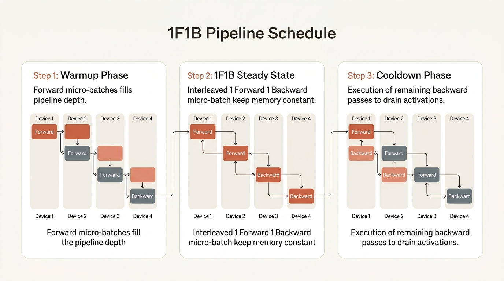

::: {.callout-note appearance="simple"}
**参考答案版**：包含完整代码实现与问答题深度参考解析。建议先独立完成练习题后再展开核对。
:::


::: {.callout-important title="统一完成标准与及格线"}
代码 4 分、Q1～Q3 各 2 分，通过线 8/10。必须解释正确性边界、显存/通信公式中的单位与分片维度；未实际运行的内容只能标记为静态审查。

:::


- 对应官方章节：Pipeline Parallelism（AFAB、1F1B、Interleaving、Zero bubble & DualPipe）
- 前置：第 2 课（激活）、第 3 课（P2P 通信）、第 5 课（与 ZeRO-3 的对比）
- 状态：未开始

## 本课目标

完成后你需要能够：

- 推导 naive / AFAB / 1F1B / interleaved 四种调度的 bubble 公式。
- 解释为什么 AFAB 有激活爆炸、1F1B 没有（内存从 m 降到 p 个微批次）。
- 说明 interleaved 的通信代价（×v）与 depth-first / breadth-first 调度选择。
- 解释 zero bubble（B/W 拆分）与 DualPipe（双向双流）的核心思想。
- 对比 PP 与 ZeRO-3，说明各自适合的场景。

## 核心概念


### 核心操作与执行流程图解

::: {.img-card}
{width="85%"}
<p class="caption">图 9-1：1F1B 流水线并行空闲气泡（Bubble）占比与 Microbatch 关系曲线（基于 scientific-figure-making 绘制）</p>
:::

::: {.img-card}
{width="90%"}
<p class="caption">图 9-2：1F1B 调度器稳态执行与微批次（Micro-Batch）显存收敛机制（Anthropic 风格架构图）</p>
:::


### 1. 流水线并行（PP）的核心本质与通信优势

流水线并行（Pipeline Parallelism, PP）是超大规模深度学习训练中历史悠久且极为高效的模型并行范式。
与张量并行（TP，在单个网络层内部切分矩阵）和数据并行/ZeRO（在样本 Batch 维度切分）截然不同，**PP 沿着模型的“深度方向（层数维度）”进行网络切分**：
- 设模型共有 $L$ 个 Transformer Block，流水线并行度为 $p$。整个模型被切分为 $p$ 个连续的 Stage（阶段），分配给 $p$ 张独立的 GPU（或节点），每个 Stage 仅常驻持有 $\frac{L}{p}$ 层模型权重。
- **点对点低带宽通信（P2P Communication）**：
  - 数据的流转仅发生在相邻 Stage 之间（从 Stage $k$ 到 Stage $k+1$）。
  - 在前向传播中，Stage $k$ 仅需将其最后一层的输出激活值 $(b, s, h)$ 发送给 Stage $k+1$；反向传播中，Stage $k+1$ 仅需将输入梯度反向传递给 Stage $k$。
  - **关键优势**：通信仅发生在 Stage 边界，通信频次极低（每微批次仅 1 次 P2P 发送与接收）。相比 TP 动辄在单层内部发起 2 次跨卡阻塞式 AllReduce，PP 对网络带宽的要求大幅降低十余倍。因此，**流水线并行是跨物理节点（Cross-Node）进行模型切分扩展的首选利器**。

### 2. 流水线气泡（Pipeline Bubble）的严格数学推导

尽管 PP 解决了机间通信带宽问题，但串行层级依赖带来了全新的系统挑战——**流水线气泡（Pipeline Bubble）**。
在最原始的流水线中，由于前一层未算完时后一层无事可做，各 Stage 存在漫长的空转等待。

为了压制气泡，工程上将一个全局批次进一步切分为 $m$ 个微批次（Micro-Batches, MBS）。
设单个微批次的前向计算时间为 $t_f$，反向计算时间为 $t_b \approx 2 t_f$：
- **无等待的理想执行总时长**：
  若所有 GPU 的 Tensor Core 处于 100% 满载无空闲，总有效计算耗时为：
  $$T_{\text{ideal}} = m \times (t_f + t_b)$$
- **气泡空闲时长的几何推导**：
  - **预热气泡（Warmup Bubble）**：在流水线启动初期，Stage 0 正在计算第 1 个微批次的前向时，后续的 Stage 1 至 Stage $p-1$ 处于空闲状态。首个微批次传至 Stage $p-1$ 总共需要消耗 $(p-1) \times t_f$ 的空闲等待时间。
  - **清空降温气泡（Cooldown Bubble）**：在流水线收尾阶段，当最后一个微批次的反向梯度从 Stage $p-1$ 逐步回传给 Stage 0 时，较深层次的 Stage 陆续结束计算进入空闲，累计产生 $(p-1) \times t_b$ 的空转等待。
  - **总空闲气泡时长**：
    $$T_{\text{bubble}} = (p - 1) \times (t_f + t_b)$$
- **气泡率计算（Bubble Ratio）**：
  - 气泡相对理想计算时间的比率为：
    $$r_{\text{bubble}} = \frac{T_{\text{bubble}}}{T_{\text{ideal}}} = \frac{(p - 1)(t_f + t_b)}{m(t_f + t_b)} = \frac{p - 1}{m}$$
  - 气泡占整步墙钟时间（Wall-Clock Time）的实际比例为：
    $$\eta_{\text{bubble}} = \frac{T_{\text{bubble}}}{T_{\text{ideal}} + T_{\text{bubble}}} = \frac{p - 1}{m + p - 1}$$

如**图 9-1** 所示，气泡率完全由“流水线级数 $p$”与“微批次数 $m$”的比值决定。只要将微批次切得足够细（例如 $m \ge 4p$ 乃至 $m \ge 8p$），气泡占比就会迅速被稀释到 10% 以下。

### 3. AFAB（All-Forward-All-Backward）调度的显存爆炸缺陷

在早期的 GPipe 调度中，采用的是 **AFAB（先执行完全部前向，再执行完全部反向）** 策略：
- **执行逻辑**：Stage 0 连续发射 $m$ 个微批次的前向计算（$F_1, F_2, \dots, F_m$）；当所有前向数据流过流水线末端后，再倒序执行所有微批次的反向求导（$B_m, B_{m-1}, \dots, B_1$）。
- **致命缺陷：激活显存失控**：
  - 反向传播求导必须依赖前向时保存的中间激活值。
  - 在 AFAB 下，第 1 个微批次 $F_1$ 产生的激活值，必须一直保留在 GPU 显存中，直到所有 $m$ 个前向全部算完、并且开始执行 $B_1$ 时才能被释放！
  - 这导致每个 GPU 必须**同时在显存中驻留全部 $m$ 个微批次的中间激活**！
  - **悖论爆发**：为了减小气泡率，工程师希望将 $m$ 设得尽可能大；然而 $m$ 越大，单卡显存中的激活积累就呈线性暴增，导致系统迅速遭遇 OOM 崩溃。AFAB 使得 PP 丧失了节省显存的意义。

### 4. 1F1B 调度（One-Forward-One-Backward）：显存收敛机制

为了斩断 $m$ 对激活显存的绑架，Megatron-LM 提出了划时代的 **1F1B 稳态调度算法**。

如**图 9-2** 所示，1F1B 将每个 Stage 的生命周期清晰解耦为三个阶段：
1. **预热阶段（Warmup）**：
   - 处于 Stage $k$ 的 GPU 首先连续执行若干个前向微批次，以确保流水线通道被数据填满。
   - 随着 Stage 深度递增，预热步数逐渐递减（Stage $k$ 预热 $p - 1 - k$ 步）。
2. **稳态阶段（Steady State, 1F1B）**：
   - **核心设计**：GPU 每执行一个新微批次的前向计算（$F_i$），紧接着就必须执行一个最早就绪微批次的反向求导（$B_j$）。
   - **显存出入守恒**：$F_i$ 产生了一份新的微批次激活，但紧随其后的 $B_j$ **立即彻底消费并销毁了一份旧的微批次激活**！
   - 显存池中的活跃微批次数在整个稳态期间**恒定维持在 $p$ 份**，绝不随微批次总数 $m$ 的增加而上涨！
3. **清空降温阶段（Cooldown）**：
   - 当所有前向微批次发射完毕后，GPU 连续计算剩余的反向求导，将显存中的剩余激活全部释放归零。

**核心结论**：1F1B 将单卡驻留激活峰值从 $O(m)$ 强力截断至 **$O(p)$**。工程师可以无所顾忌地增大微批次数 $m$（例如 $m=64$），在将气泡率稀释到极限的同时，显存依然如坚若磐石般保持稳定。

### 5. Interleaved 1F1B：交错分片进一步压制气泡

如果模型参数极大，必须使用较大的流水线深度 $p$（例如 $p=16$），则即使 $m=32$，1F1B 的气泡率仍有 $\frac{15}{32} \approx 46.8\%$。
**Interleaved 1F1B（交错分片）** 通过虚拟 Stage（Virtual Stages）进一步削减气泡：
- 设交错因子为 $v$（例如 $v=2$）。每张物理 GPU 不再只负责一段连续的模型层，而是交错持有 $v$ 个虚阶段。例如 4 张物理卡持有 8 个模型块：GPU 0 负责 Chunk 0 与 Chunk 4，GPU 1 负责 Chunk 1 与 Chunk 5……
- 微批次在物理卡环之间流动 $v$ 圈。每个子块的计算粒度缩小为原来的 $1/v$。
- **气泡率倍数下降**：
  $$r_{\text{bubble}} = \frac{p - 1}{v \cdot m}$$
- **代价权衡**：微批次在物理设备边界之间来回穿梭的次数增加了 $v$ 倍，点对点通信总量相应扩大至 $v$ 倍。要求机间网络具备足够高的带宽支持。

### 6. 前沿调度革新：Zero-Bubble (ZB) 与 DualPipe（DeepSeek-V3 核心）

近年来大模型研发的最顶尖突破集中在消除最后 5%~10% 的流水线气泡：

#### A. 梯度计算拆分（B/W Separation）与 Zero-Bubble (ZB)
传统调度将反向传播视为一个不可分割的整体算子 $B$。但现代编译原理揭示反向传播在底层严格包含两个无数据依赖的独立矩阵乘：
1. **$B$ 算子（Activation Gradient，激活梯度）**：计算 $\frac{\partial \mathcal{L}}{\partial X_{\text{in}}} = \frac{\partial \mathcal{L}}{\partial X_{\text{out}}} \cdot W^T$。它必须严格按反向顺序立即传给上一层 Stage，位于流水线关键路径上。
2. **$W$ 算子（Weight Gradient，权重梯度）**：计算 $\frac{\partial \mathcal{L}}{\partial W} = X_{\text{in}}^T \cdot \frac{\partial \mathcal{L}}{\partial X_{\text{out}}}$。它仅用于在 Step 末尾更新本地权重，**对后续各层前向/反向的数据流向毫无依赖**！
- **Zero-Bubble 调度思想**：将 $W$ 的计算从反向关键路径上完全剥离，将其作为“填充物”延迟调度插进 Warmup 和 Cooldown 期间原本彻底闲置的气泡时间槽中，使硬件利用率逼近理论极限（Bubble $\approx 0$）。

#### B. DualPipe 双向双流调度（DeepSeek-V3）
DeepSeek-V3 在极低通信预算下实现了超大规模流水线并行，其核心正是 **DualPipe**：
- 在物理流水线两端**同时注入两个相反方向的微批次数据流**（正向流从 Stage 0 向右推，反向流从 Stage $p-1$ 向左推）。
- 巧妙将 Forward、Backward $B$、Backward $W$ 以及跨机通信交织排布，用相反方向计算互相填补对方的气泡，最终在万卡集群上实现了“近乎零气泡与零显存额外膨胀”的工程奇迹。

### 7. 技术选型终极对决：PP vs ZeRO-3

| 决策维度 | 流水线并行 (PP) | ZeRO-3 / FSDP |
|---|---|---|
| **切分对象** | 模型的**层深度**（每卡持有完整层） | 每一层的**参数张量**（每卡持有切片） |
| **网络通信内容** | 边界处的**中间激活值** $(b, s, h)$ | 算子执行前后的**模型参数** $W$ 与梯度 |
| **网络总线偏好** | 跨机低带宽网络友好（InfiniBand / RoCE） | 强依赖机内高带宽网络（跨机易受 Ring Latency 惩罚） |
| **核心性能瓶颈** | 调度气泡（Bubble Ratio $\approx \frac{p-1}{m}$） | 参数预取重叠失败（Prefetch Exposure） |
| **超长序列适应度** | 激活随 $s$ 膨胀，长序列下单卡激活显存压力大 | 激活全量驻留，需结合 TP/CP/重计算 |
| **主流业界搭配** | **PP + TP + ZeRO-1** (如 DeepSeek-V3, Megatron) | **纯 FSDP / FSDP + TP** (中等规模集群首选) |

## 具体演示与数值推演

以一个典型流水线并行配置为例：流水线级数 $p=4$，全局批次切分为 $m=8$ 个微批次，单步反向计算时间约为前向的两倍（$t_b = 2 t_f$）：

- **朴素无流水调度（Naive Sequential）**：
  若不进行微批次划分（$m=1$），总耗时为 $p \times (t_f + t_b) = 4 \times 3 t_f = 12 t_f$。有效计算仅为 $3 t_f$，气泡时间高达 $9 t_f$，算力有效率仅 $25\%$。

- **标准 1F1B 调度（1F1B Schedule）**：
  - 理想无气泡计算时长：
    $$T_{\text{ideal}} = 8 \times (t_f + 2t_f) = 24 t_f$$
  - 空转气泡时长：
    $$T_{\text{bubble}} = (4 - 1) \times (t_f + 2t_f) = 3 \times 3 t_f = 9 t_f$$
  - 气泡相对理想时间的比率（教材标准度量）：
    $$r_{\text{bubble}} = \frac{p - 1}{m} = \frac{4 - 1}{8} = \frac{3}{8} = 37.5\%$$
  - 气泡占实际总运行时间的比例：
    $$\eta_{\text{bubble}} = \frac{9 t_f}{24 t_f + 9 t_f} = \frac{9}{33} \approx 27.27\%$$

- **引入交错分片（Interleaved 1F1B, $v=2$）**：
  - 气泡相对比率直接减半：
    $$r_{\text{bubble}} = \frac{p - 1}{v \cdot m} = \frac{3}{2 \times 8} = \frac{3}{16} = 18.75\%$$
  - 实际气泡墙钟占比降至：
    $$\eta_{\text{bubble}} = \frac{3}{16 + 3} = \frac{3}{19} \approx 15.79\%$$
  - **显存与扩展性印证**：在 1F1B 调度下，单卡最大激活驻留量被严格锁定在 $p=4$ 个微批次之内。当微批次扩大至 $m=32$ 时，气泡占比降至 $\approx 8.5\%$，跨节点集群效率达到最佳工业甜蜜点。

## 代码填空题

推导并验证各调度的 bubble 公式；生成 AFAB 调度矩阵并统计空闲比例。

```{python}
#| course_role: exercise
def bubble_ratio(scheme: str, p: int, m: int, v: int = 1) -> float:
    """
    bubble 相对理想时间的比例 r_bubble = 额外时间 / 理想时间。

    - naive: m=1（不分微批次），r = (p-1)/1
    - afab / 1f1b: r = (p-1)/m
    - interleaved: r = (p-1)/(v*m)
    """
    if scheme == "naive":
        return (p - 1) / 1
    if scheme in ("afab", "1f1b"):
        return ______          # 填空
    if scheme == "interleaved":
        return ______          # 填空
    raise ValueError(scheme)


def afab_schedule(p: int, m: int, tf: int = 1, tb: int = 1) -> list[list[int]]:
    """
    生成 AFAB 调度矩阵 busy[stage][t]，1 = 该时刻该 stage 在计算。
    tf、tb 为前向/反向时长（整数，单位时间槽）。

    时序（0 起）：
      stage i 的第 j 个前向  F_j 开始于 t = i + (j-1)*tf
      stage i 的第 j 个反向  B_j 开始于 t = (m + p - 1) + (p - 1 - i) + (j-1)*tb
    （先想清楚：最后一段前向在 t = m+p-2 结束；之后 stage p-1 立刻开始反向，
      反向像前向的镜像一样沿 stage 阶梯传播。）
    """
    total = (m + p - 1) * (tf + tb)
    busy = [[0] * total for _ in range(p)]
    for i in range(p):
        for j in range(m):
            t_f = i + (j - 1) * tf          # 填空点：如理解有出入可自行修正
            for u in range(tf):
                busy[i][t_f + u] = 1
            t_b = (m + p - 1) + (p - 1 - i) + (j - 1) * tb   # 填空点
            for u in range(tb):
                busy[i][t_b + u] = 1
    return busy


def idle_fraction(busy: list[list[int]]) -> float:
    """空闲槽位占比。"""
    total = sum(len(row) for row in busy)
    work = sum(sum(row) for row in busy)
    return ______                            # 填空


if __name__ == "__main__":
    p, m = 4, 8
    busy = afab_schedule(p, m)
    print("空闲比例:", f"{idle_fraction(busy):.3f}")
    # 理论值：bubble 比例（相对理想时间） = (p-1)/m；空闲占比 = (p-1)/(m+p-1)
    print("理论 (p-1)/(m+p-1) =", (p - 1) / (m + p - 1))
    assert abs(idle_fraction(busy) - (p - 1) / (m + p - 1)) < 1e-9

    for scheme, v in (("naive", 1), ("afab", 1), ("interleaved", 2)):
        r = bubble_ratio(scheme, p, m, v)
        print(f"{scheme:12s} v={v}  r_bubble = {r:.3f}")

    # 教材结论验证：m 远大于 p-1 时 bubble 小；v 再减半
    print("m=32:", f"{bubble_ratio('1f1b', 8, 32):.3f}")
    print("v=2 interleaved, m=32:", f"{bubble_ratio('interleaved', 8, 32, 2):.3f}")
```

## 三个问答题

### Q1

为什么 AFAB 的激活显存随 m 增长而爆炸，1F1B 却能把它控制在约 p 个微批次的激活？请结合"各卡需要先做 PP 次前向才能开始第一次反向"解释教材的"每卡激活 ≈ activs（与不用 PP 相同）"这句话。

### Q2

依次推导 naive、AFAB/1F1B、interleaved 的 bubble 比例公式，并说明每个公式里分子与分母的含义。为什么 1F1B 的 bubble 与 AFAB 相同，却仍然优于 AFAB？

### Q3

zero bubble 的核心观察是什么？为什么 backward 中 W（权重梯度）可以在 B（输入梯度）之后任意时刻执行而不影响正确性？DualPipe 在此基础上又加了什么？最后对比：什么场景选 PP 而不是 ZeRO-3（至少两个依据）？

## 检查与通过标准

总分 10 分：代码正确 4 分（bubble 公式、AFAB 时序、空闲占比与理论一致）、三题各 2 分、通过线 8 分。

一票否决项：

- 认为 1F1B 减少 bubble（它与 AFAB 的 bubble 相同，省的是内存）。
- 把 bubble 公式中的 m 与 p 弄反。
- 说不出 interleaved 的通信代价是 ×v。
- 把 zero bubble 说成"消除了通信"（消除的是 bubble 空闲）。
- 认为 PP 会降低激活显存（PP 按层分片，激活不省）。


::: {.callout-tip collapse="true" title="💡 点击展开参考答案与详细代码实现" icon="false"}
## 参考答案（仅 answer 分支）

先完成题目再核对；核对后必须解释关键公式，并改一个规模重新计算。

```{python}
#| course_role: solution
def bubble_ratio(scheme: str, p: int, m: int, v: int = 1) -> float:
    """
    bubble 相对理想时间的比例 r_bubble = 额外时间 / 理想时间。

    - naive: m=1（不分微批次），r = (p-1)/1
    - afab / 1f1b: r = (p-1)/m
    - interleaved: r = (p-1)/(v*m)
    """
    if scheme == "naive":
        return (p - 1) / 1
    if scheme in ("afab", "1f1b"):
        return (p - 1) / m          # 填空
    if scheme == "interleaved":
        return (p - 1) / (v * m)          # 填空
    raise ValueError(scheme)


def afab_schedule(p: int, m: int, tf: int = 1, tb: int = 1) -> list[list[int]]:
    """
    生成 AFAB 调度矩阵 busy[stage][t]，1 = 该时刻该 stage 在计算。
    tf、tb 为前向/反向时长（整数，单位时间槽）。

    时序（0 起）：
      stage i 的第 j 个前向  F_j 开始于 t = i + (j-1)*tf
      stage i 的第 j 个反向  B_j 开始于 t = (m + p - 1) + (p - 1 - i) + (j-1)*tb
    （先想清楚：最后一段前向在 t = m+p-2 结束；之后 stage p-1 立刻开始反向，
      反向像前向的镜像一样沿 stage 阶梯传播。）
    """
    total = (m + p - 1) * (tf + tb)
    busy = [[0] * total for _ in range(p)]
    for i in range(p):
        for j in range(m):
            t_f = i + j * tf          # 填空点：如理解有出入可自行修正
            for u in range(tf):
                busy[i][t_f + u] = 1
            t_b = (m + p - 1) + (p - 1 - i) + j * tb   # 填空点
            for u in range(tb):
                busy[i][t_b + u] = 1
    return busy


def idle_fraction(busy: list[list[int]]) -> float:
    """空闲槽位占比。"""
    total = sum(len(row) for row in busy)
    work = sum(sum(row) for row in busy)
    return (total - work) / total                            # 填空


if __name__ == "__main__":
    p, m = 4, 8
    busy = afab_schedule(p, m)
    print("空闲比例:", f"{idle_fraction(busy):.3f}")
    # 理论值：bubble 比例（相对理想时间） = (p-1)/m；空闲占比 = (p-1)/(m+p-1)
    print("理论 (p-1)/(m+p-1) =", (p - 1) / (m + p - 1))
    assert abs(idle_fraction(busy) - (p - 1) / (m + p - 1)) < 1e-9

    for scheme, v in (("naive", 1), ("afab", 1), ("interleaved", 2)):
        r = bubble_ratio(scheme, p, m, v)
        print(f"{scheme:12s} v={v}  r_bubble = {r:.3f}")

    # 教材结论验证：m 远大于 p-1 时 bubble 小；v 再减半
    print("m=32:", f"{bubble_ratio('1f1b', 8, 32):.3f}")
    print("v=2 interleaved, m=32:", f"{bubble_ratio('interleaved', 8, 32, 2):.3f}")
```


## 补全后的代码（关键填空处）

```python
def bubble_ratio(scheme, p, m, v=1):
    if scheme == "naive":
        return (p - 1) / 1
    if scheme in ("afab", "1f1b"):
        return (p - 1) / m
    if scheme == "interleaved":
        return (p - 1) / (v * m)
```

AFAB 调度时序（已验证与理论一致）：

```python
t_f = i + (j - 1) * tf                     # stage i 的 F_j
            t_b = (m + p - 1) + (p - 1 - i) + (j - 1) * tb   # stage i 的 B_j
```

空闲占比：`1 - work/total`，与理论 `(p−1)/(m+p−1)` 完全吻合（p=4,m=8 → 0.2727）。

```python
naive        v=1  r_bubble = 3.000
afab         v=1  r_bubble = 0.375
interleaved  v=2  r_bubble = 0.188
m=32:        0.219   （1f1b, p=8）
v=2 interleaved, m=32: 0.109
```

## 三个问答题要点

### Q1

- AFAB 把 m 个微批次的前向全部做完才开始反向 → 所有 m 份激活同时驻留 → 显存 ∝ m；
- 1F1B 反向尽早开始 → 每卡任意时刻最多持有约 p 个微批次的激活（前向刚喂进来的 + 反向还没算完的）；
- 教材"每卡激活 ≈ activs"：每卡负责 1/PP 的层，但要攒 PP 个微批次才能开始反向 → PP × (activs/PP) ≈ activs——PP 本身不省激活，1F1B 的价值是让 m 可以继续加大（从而缩 bubble）而显存不涨。

### Q2

- naive：无微批次，理想时间 t_f+t_b，bubble (p−1)(t_f+t_b) → r = p−1；
- AFAB/1F1B：理想 m(t_f+t_b)，bubble (p−1)(t_f+t_b) → r = (p−1)/m；分子是"流水线灌满/排空"的等待，分母是总工作量；
- interleaved：每卡 v 个分片，前向/反向被拆细、交错更密 → bubble 除以 v，r = (p−1)/(v·m)；
- 1F1B 优于 AFAB 的原因：bubble 相同但内存少（p vs m 个微批次的激活）→ 可以加大 m 真正缩小 bubble；AFAB 加 m 会 OOM。

### Q3

- 观察：backward 的 matmul 拆成 B（输入梯度，必须沿层序传播）与 W（权重梯度，只服务于 optimizer step）；
- W 的执行时机不受层间依赖约束，可以插到任何空闲槽 → 填 bubble → ZB 理论调度；
- DualPipe：再从 PP 两端各注入一个微批次流、交错执行，把 idle 进一步压掉；最优调度用 ILP 求解；
- PP vs ZeRO-3：a) PP 传激活（带宽需求低）适合跨节点，ZeRO-3 传权重（需高带宽/可 prefetch 但 512+ 隐藏不住）；b) PP 需要复杂调度与层均衡，ZeRO-3 模型无关；c) PP 不省激活，ZeRO-3 省参数侧内存；d) 组合规则：PP+ZeRO-1/2 互补（DeepSeek-V3），PP+ZeRO-3 需极大 gbs 很少用。

## 通过要点

- 1F1B 与 AFAB 的 bubble 相同（都是 (p−1)/m），1F1B 赢在内存；
- bubble 公式的分母是"理想时间"，所以 naive 的 r 可以 >1。

## 官方主参考

- [Ultra-Scale Playbook](https://huggingface.co/spaces/nanotron/ultrascale-playbook)
- [PyTorch distributed documentation](https://pytorch.org/docs/stable/distributed.html)
:::
