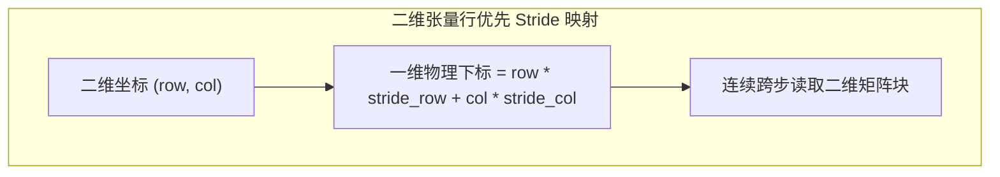

::: {.callout-note appearance="simple"}
**参考答案版**：包含完整代码实现与问答题深度参考解析。建议先独立完成练习题后再展开核对。
:::


## 本课目标与完成标准

学完后你应能：实现矩阵按列广播 bias，区分逻辑边界与物理 stride。

通过必须同时满足：

- 独立补齐本课唯一的代码填空题，并通过给定检查；
- 三个问答题均说明因果链，而不是只报术语；
- 能指出至少一个正确性边界和一个性能取舍；
- 总分不低于 8/10，且没有一票否决级概念错误。

## 前置关系

- 课程前置：Python、PyTorch 张量、CUDA 基本线程/内存概念
- 本课在路线中的作用：广播不复制 bias；每行 program 使用相同列下标读取 b，并按 x stride 找输入。

## 核心心智模型


### 核心操作与执行流程图解


<p class="caption" align="center"><em>图 4-1：Triton 二维 Block 与行优先 Stride 计算代数</em></p>


<p class="caption" align="center"><em>图 4-2：Triton 广播机制（Broadcasting）执行流</em></p>


### 核心操作与执行流程图解

```{mermaid}
flowchart TD
    subgraph Stride2D["二维张量行优先 Stride 映射"]
        Coord["二维坐标 (row, col)"] --> Formula["一维物理下标 = row * stride_row + col * stride_col"]
        Formula --> Mem["连续跨步读取二维矩阵块"]
    end
```
<p class="caption" align="center"><em>图 4-1：Triton 二维 Block 与行优先 Stride 计算代数</em></p>

```{mermaid}
flowchart LR
    Bias["1D 偏置 (BLOCK_N,)"] --> Expand["切片扩展维度 [None, :] 变成 (1, BLOCK_N)"]
    Expand --> Broad["沿行方向自动广播与 (BLOCK_M, BLOCK_N) 矩阵相加"]
```
<p class="caption" align="center"><em>图 4-2：Triton 广播机制（Broadcasting）执行流</em></p>


### 1. 它是什么，解决什么问题

广播不复制 bias；每行 program 使用相同列下标读取 b，并按 x stride 找输入。

### 2. 它如何工作

grid 的第 0 维映射行，lane 映射列；x 地址由 row*sxm+col*sxn，bias 只由 col 定位。

### 3. 正确性条件与常见误区

mask 比较逻辑 N 而不是 stride；输出布局必须与地址公式一致。

### 4. 性能与工程取舍

一 program 一整行减少 grid 维度，但超宽 N 可能超出单 program 资源，需列分块。

## 具体演示

M=3,N=17 时每行一个 program，17 个 bias 值被三行复用。

请在阅读后先合上这一节，用自己的语言复述“输入状态 → 中间状态 → 输出状态”，再做练习。

## 实践任务：唯一代码填空题

补齐 bias 地址。

规则：只能修改 `TODO`/`______` 所在位置；不要删除断言或放宽误差。代码注释说明了每个边界条件。

```{python}
#| course_role: exercise
import torch
import triton
import triton.language as tl

@triton.jit
def bias_kernel(x, b, out, M: tl.constexpr, N: tl.constexpr,
                sxm: tl.constexpr, sxn: tl.constexpr, BLOCK: tl.constexpr):
    row = tl.program_id(0)
    cols = tl.arange(0, BLOCK)
    mask = cols < N
    xoffs = row * sxm + cols * sxn
    xv = tl.load(x + xoffs, mask=mask)
    bv = tl.load(b + ______, mask=mask)  # TODO: bias 只依赖列
    tl.store(out + row * N + cols, xv + bv, mask=mask)

def add_bias(x, b):
    assert x.ndim == 2 and b.ndim == 1 and x.shape[1] == b.numel()
    M, N = x.shape
    out = torch.empty((M, N), device=x.device, dtype=x.dtype)
    block = triton.next_power_of_2(N)
    bias_kernel[(M,)](x, b, out, M, N, x.stride(0), x.stride(1), BLOCK=block)
    return out

for shape in ((3, 17), (4, 128)):
    x = torch.randn(shape, device="cuda"); b = torch.randn(shape[1], device="cuda")
    torch.testing.assert_close(add_bias(x, b), x + b)
```

### 检查方法

在 CUDA/Triton 环境运行本单元格；断言覆盖规则尺寸和非规则尾块。首次 JIT 不计入性能。

提交时请给出：补齐后的代码、实际运行输出（环境不可用时注明“仅静态审查”）以及对失败用例的解释。

### Q1

不要背定义：请从输入、状态变化和输出三个阶段解释“二维 Grid、Stride 与广播”的工作机制。

**你的答案：**

### Q2

把 mask 写成 `cols < sxm` 为什么对 padding stride 错？

**你的答案：**

### Q3

N 很大时怎样扩展为二维 grid 并保持输出地址正确？

**你的答案：**

## 评分与通过规则

- 代码 4 分：正常输入 2 分，边界输入 1 分，解释实现 1 分；
- Q1～Q3 各 2 分；
- 一票否决：结果碰巧正确但核心因果链错误、删除边界检查、把未运行结果说成实测。

需要提示时按四级机制请求：概念区域 → 具体方向 → 关键局部 → 完整答案。


::: {.callout-tip collapse="true" title="💡 点击展开参考答案与详细代码实现" icon="false"}
## 参考答案（仅 answer 分支）

先完成题目再核对。即使代码一致，也要能解释关键步骤，并尝试更换一个输入规模。

```{python}
#| course_role: solution
import torch
import triton
import triton.language as tl

@triton.jit
def bias_kernel(x, b, out, M: tl.constexpr, N: tl.constexpr,
                sxm: tl.constexpr, sxn: tl.constexpr, BLOCK: tl.constexpr):
    row = tl.program_id(0)
    cols = tl.arange(0, BLOCK)
    mask = cols < N
    xoffs = row * sxm + cols * sxn
    xv = tl.load(x + xoffs, mask=mask)
    bv = tl.load(b + cols, mask=mask)
    tl.store(out + row * N + cols, xv + bv, mask=mask)

def add_bias(x, b):
    assert x.ndim == 2 and b.ndim == 1 and x.shape[1] == b.numel()
    M, N = x.shape
    out = torch.empty((M, N), device=x.device, dtype=x.dtype)
    block = triton.next_power_of_2(N)
    bias_kernel[(M,)](x, b, out, M, N, x.stride(0), x.stride(1), BLOCK=block)
    return out

for shape in ((3, 17), (4, 128)):
    x = torch.randn(shape, device="cuda"); b = torch.randn(shape[1], device="cuda")
    torch.testing.assert_close(add_bias(x, b), x + b)
```

### Q1 参考答案

grid 的第 0 维映射行，lane 映射列；x 地址由 row*sxm+col*sxn，bias 只由 col 定位。

### Q2 参考答案

判断时先检查本课不变量：mask 比较逻辑 N 而不是 stride；输出布局必须与地址公式一致。  若不成立，最终数值或系统状态即使暂时正常也不可信。

### Q3 参考答案

迁移时先保证正确性，再比较代价。这里的核心取舍是：一 program 一整行减少 grid 维度，但超宽 N 可能超出单 program 资源，需列分块。

## 参考资料

- [Triton Tutorials](https://triton-lang.org/main/getting-started/tutorials/)
- [Triton language API](https://triton-lang.org/main/python-api/triton.language.html)

资料用于建立事实基线；面试回答仍需用自己的语言组织。
:::
