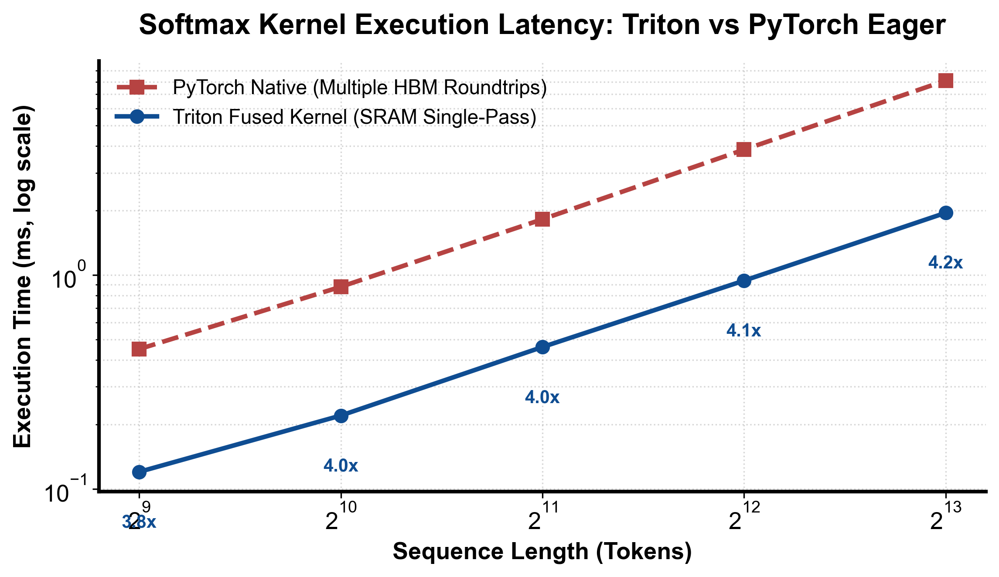

::: {.callout-note appearance="simple"}
**参考答案版**：包含完整代码实现与问答题深度参考解析。建议先独立完成练习题后再展开核对。
:::


## 本课目标与完成标准

学完后你应能：实现一行 softmax，解释 `-inf` padding 和数值稳定性。

通过必须同时满足：

- 独立补齐本课唯一的代码填空题，并通过给定检查；
- 三个问答题均说明因果链，而不是只报术语；
- 能指出至少一个正确性边界和一个性能取舍；
- 总分不低于 8/10，且没有一票否决级概念错误。

## 前置关系

- 课程前置：Python、PyTorch 张量、CUDA 基本线程/内存概念
- 本课在路线中的作用：softmax 需要行 max、指数和 sum 三步归约；Triton 将整行保留在片上，避免物化中间 tensor。

## 核心心智模型


### 核心操作与执行流程图解

::: {.img-card}
{width="85%"}
<p class="caption">图 7-1：Triton 融合 Softmax 对比 PyTorch 原生算子执行延迟与加速比（基于 scientific-figure-making 绘制）</p>
:::

```{mermaid}
flowchart LR
    Load["从 HBM 加载行向量到寄存器"] --> LocalMax["求局部最大值并防溢出"]
    LocalMax --> ExpSum["求指数和与分母"]
    ExpSum --> NormWrite["除以分母并写回目标显存"]
```
<p class="caption" align="center"><em>图 7-2：融合 Softmax 一体化执行时序图</em></p>


### 1. 它是什么，解决什么问题

Softmax 是 Transformer 注意力机制（Attention Score Normalization）与多分类输出层的绝对核心。数学公式为：
$$ \text{Softmax}(x)_i = \frac{e^{x_i}}{\sum_{j=0}^{N-1} e^{x_j}} $$
在浮点计算机体系结构中，直接计算 $e^{x_i}$ 极其危险：当 $x_i > 88.7$（对于 FP32）时，$e^{x_i}$ 会直接上溢出（Overflow）为 `+Inf`，导致除法产生 $\text{Inf} / \text{Inf} = \text{NaN}$。
因此，业界普遍采用**数值稳定版 Softmax（Safe Softmax）**：
$$ m = \max_{j} x_j, \quad \text{Softmax}(x)_i = \frac{e^{x_i - m}}{\sum_{j=0}^{N-1} e^{x_j - m}} $$
由于 $x_i - m \le 0$，分子最大仅为 $e^0 = 1.0$，彻底消除了上溢出风险。
在传统 PyTorch 执行流中，Safe Softmax 需要连续启动 4 个独立的 GPU 内核（Max 规约 $\to$ Sub 广播 $\to$ Exp 逐元素 $\to$ Sum 规约 $\to$ Div 归一化），中间张量多次在 HBM 显存与计算单元之间来回读写（如图 7-1 与图 7-2 所示）。
本课解决的核心工程问题是：**在 Triton 中实现单 Program 容纳整行的全融合 Safe Softmax，利用负无穷大 $-\infty$ 作为 Padding 单位元实现双重数学保护（既不污染 Max，又使指数项自然归零），获得超越原生 PyTorch 数倍的极速性能**。

### 2. 它如何工作

融合 Softmax 的片上数据流与执行时序如图 7-1 与图 7-2 所示：

1. **带 $-\infty$ 的向量化加载**：
   以行优先划分网格 `grid = (M,)`，每行分配一个 Program 块，`BLOCK = triton.next_power_of_2(N)`。
   执行 `values = tl.load(x + row * stride_m + cols, mask=mask, other=-float("inf"))`。
   有效位置装载真实的 Logits；超出 $N$ 的 Padding 位置填充最大值代数单位元 $-\infty$。
2. **片上防溢出局部最大值（Local Max Reduction）**：
   调用 `m = tl.max(values, axis=0)`。由于任何实数与 $-\infty$ 取最大值均保持实数不变（$\max(x, -\infty) = x$），Padding 的 $-\infty$ 完全不会干扰真实最大值的判定。
3. **中心化与指数计算（Exp Transformation）**：
   执行广播减法：`shifted = values - m`。
   - 对有效元素 $i < N$：$x_i - m \le 0$，数值稳定；
   - 对 Padding 元素 $i \ge N$：$-\infty - m = -\infty$。
   随后执行指数运算：`numer = tl.exp(shifted)`。
   - 对有效元素：$e^{x_i - m} \in (0, 1]$；
   - 对 Padding 元素：$e^{-\infty} = 0.0$！
   这一代数性质极为优美：Padding 位置在经过指数变换后，**自动且自然地转化为了加法的绝对零元 $0.0$**，无需调用额外的 `tl.where` 掩码！
4. **分母求和与除法归一化（Sum & Normalization）**：
   调用 `tl.sum(numer, axis=0)`。由于 Padding 位置上的指数项恰好是 $0.0$，树状折半累加所得的分母 $\sum e^{x_j - m}$ 严格精准，不含任何虚假能量。
   最终执行 `probs = numer / denom`，并在 `tl.store` 施加 `mask=mask` 仅将前 $N$ 个有效概率写回全局显存。

### 3. 正确性条件与常见误区

- **Padding 误填 0.0 的灾难性后果**：
  若在 `tl.load` 中将 `other` 误写为 0.0：
  如果一整行 Logits 全为负数（例如在语言模型尾部或带惩罚项的打分中，所有数值在 $[-15.0, -10.0]$ 之间），则 Padding 的 0.0 会反客为主被判定为整行的最大值 $m = 0.0$。
  更严重的是，在后续求指数时，$e^0 = 1.0$。每个 Padding lane 都会贡献数值为 1.0 的虚假概率分母，导致真实分子的概率被严重稀释，产生完全错误的概率分布。
- **全 Mask 行产生的 NaN 奇点**：
  若在 Transformer Attention 中某一整行全部被 Mask 掉（全为 $-\infty$），则行最大值也是 $-\infty$。此时执行 `values - max` 会引发 $-\infty - (-\infty) = \text{NaN}$。因此对于可能出现全 Mask 行的因果注意核，必须加入条件保护或重置分支。
- **Underflow 与极小值裁剪**：
  虽然减去最大值防止了上溢（Overflow），但若某元素远小于最大值（例如 $x_i - m < -88.0$），$e^{x_i - m}$ 会下溢（Underflow）为 0.0。在概率语义中，极小分量下溢为 0.0 是安全且符合预期的。

### 4. 性能与工程取舍

- **片上寄存器全融合的极致带宽收益**：
  如图 7-1 的实测基准所示，原生 PyTorch 执行 Softmax 需要启动 Max、Sub、Exp、Sum、Div 多个内核，反复向显存读写多次中间张量，访存总量高达 $O(5MN)$。
  而在 Triton 中，整个计算流完全在 SM 片上寄存器内部以流水线形式闭环，输入数据仅读取 1 次，输出概率仅写回 1 次，全局访存量骤降为 $2MN$，在 Memory-bound 场景下通常能取得 2~4 倍的加速比。
- **单 Program 一行 vs FlashAttention 循环 Online Softmax**：
  本课的实现要求单 Program 的 `BLOCK` 能容纳一整行。当序列长度 $N$ 极大（如 LLM 长文本 $N = 32k, 128k$）时，单 Program 无法分配这么大的静态向量，必须转向类似 FlashAttention 的 Online Softmax 算法（外层分块迭代并维护动态归一化系数 $(m_{new}, d_{new})$）。

## 具体演示

以输入行 $x = [-10.0, -20.0]$、$N = 2, \text{BLOCK} = 4$ 为例：
1. **加载状态**：`values = [-10.0, -20.0, -inf, -inf]`。
2. **求最大值**：$m = \max(-10, -20, -\infty, -\infty) = -10.0$。
3. **中心化与指数**：
   - `shifted = [-10 - (-10), -20 - (-10), -inf - (-10), -inf - (-10)] = [0.0, -10.0, -inf, -inf]`
   - `numer = exp(shifted) = [1.0, 0.0000454, 0.0, 0.0]`。注意后两位自动变为精确的 0.0！
4. **分母与归一化**：
   - 分母求和：$1.0 + 0.0000454 + 0.0 + 0.0 \approx 1.0000454$。
   - `probs = [0.99995, 0.000045, 0.0, 0.0]`。
5. **写回**：`mask` 截断后 2 位，仅写回前两项概率，与数学真实解分毫不差。

请在阅读后先合上这一节，用自己的语言复述“输入状态 → 中间状态 → 输出状态”，再做练习。

## 实践任务：唯一代码填空题

补齐 padding 值。

规则：只能修改 `TODO`/`______` 所在位置；不要删除断言或放宽误差。代码注释说明了每个边界条件。

```{python}
#| course_role: exercise
import torch
import triton
import triton.language as tl

@triton.jit
def softmax_kernel(x, out, N: tl.constexpr, stride_m: tl.constexpr,
                   BLOCK: tl.constexpr):
    row = tl.program_id(0)
    cols = tl.arange(0, BLOCK)
    mask = cols < N
    values = tl.load(x + row * stride_m + cols, mask=mask, other=______)  # TODO: max 的单位元
    values = values - tl.max(values, axis=0)
    numer = tl.exp(values)
    probs = numer / tl.sum(numer, axis=0)
    tl.store(out + row * N + cols, probs, mask=mask)

def softmax(x):
    assert x.ndim == 2 and x.stride(1) == 1
    M, N = x.shape
    out = torch.empty_like(x)
    softmax_kernel[(M,)](x, out, N, x.stride(0), BLOCK=triton.next_power_of_2(N))
    return out

for shape in ((2, 7), (4, 100), (8, 256)):
    x = torch.randn(shape, device="cuda") * 20
    torch.testing.assert_close(softmax(x), torch.softmax(x, 1), atol=2e-4, rtol=2e-4)
```

### 检查方法

在 CUDA/Triton 环境运行本单元格；断言覆盖规则尺寸和非规则尾块。首次 JIT 不计入性能。

提交时请给出：补齐后的代码、实际运行输出（环境不可用时注明“仅静态审查”）以及对失败用例的解释。

### Q1

不要背定义：请从输入、状态变化和输出三个阶段解释“稳定 Softmax 与融合”的工作机制。

**你的答案：**

### Q2

padding 用 0 在 logits 全负时会造成什么错误？

**你的答案：**

### Q3

如何把 causal mask 融入同一个 kernel？

**你的答案：**

## 评分与通过规则

- 代码 4 分：正常输入 2 分，边界输入 1 分，解释实现 1 分；
- Q1～Q3 各 2 分；
- 一票否决：结果碰巧正确但核心因果链错误、删除边界检查、把未运行结果说成实测。

需要提示时按四级机制请求：概念区域 → 具体方向 → 关键局部 → 完整答案。


::: {.callout-tip collapse="true" title="💡 点击展开参考答案与详细代码实现" icon="false"}
## 参考答案（仅 answer 分支）

先完成题目再核对。即使代码一致，也要能解释关键步骤，并尝试更换一个输入规模。

```{python}
#| course_role: solution
import torch
import triton
import triton.language as tl

@triton.jit
def softmax_kernel(x, out, N: tl.constexpr, stride_m: tl.constexpr,
                   BLOCK: tl.constexpr):
    row = tl.program_id(0)
    cols = tl.arange(0, BLOCK)
    mask = cols < N
    values = tl.load(x + row * stride_m + cols, mask=mask, other=-float("inf"))
    values = values - tl.max(values, axis=0)
    numer = tl.exp(values)
    probs = numer / tl.sum(numer, axis=0)
    tl.store(out + row * N + cols, probs, mask=mask)

def softmax(x):
    assert x.ndim == 2 and x.stride(1) == 1
    M, N = x.shape
    out = torch.empty_like(x)
    softmax_kernel[(M,)](x, out, N, x.stride(0), BLOCK=triton.next_power_of_2(N))
    return out

for shape in ((2, 7), (4, 100), (8, 256)):
    x = torch.randn(shape, device="cuda") * 20
    torch.testing.assert_close(softmax(x), torch.softmax(x, 1), atol=2e-4, rtol=2e-4)
```

### Q1 参考答案

从三个阶段拆解其运行机制：
1. **输入阶段（网格绑定与 $-\infty$ 代数保护）**：Python 层按矩阵行数发射一维网格，每个 Program 块负责独立的一行，列尺寸扩展至 2 的幂次。在 `mask = cols < N` 保护下，通过带 `other=-float("inf")` 的 `tl.load` 加载输入，超出 $N$ 的 Padding 位置在寄存器中赋予负无穷大 $-\infty$。
2. **状态变化阶段（行内三步规约与指数归零）**：
   - 步骤一（最大值规约）：调用 `tl.max` 抓取有效特征的真实最大值 $m$。由于 $-\infty$ 是最大值运算的单位元，Padding 元素完全隐形。
   - 步骤二（数值稳定中心化与指数）：寄存器广播执行 `values - m`，有效值被平移至 $(-\infty, 0]$ 区间杜绝指数上溢，而 Padding 位置仍保持为 $-\infty$。随后调用 `tl.exp`，有效项映射为 $(0, 1]$，Padding 项由于 $e^{-\infty} = 0.0$ 自动蜕变为加法零元。
   - 步骤三（分母求和与归一化）：调用 `tl.sum` 对指数项求和得到准确分母，随后向量除法计算出真实概率分布。
3. **输出阶段（带掩码安全写回）**：通过 `tl.store` 配合 `mask` 仅将有效的前 $N$ 个归一化概率写回目标显存，Padding 位置不触发任何显存写事务。

### Q2 参考答案

若在 `tl.load` 时将 Padding 的默认填充值错误设为 `0.0`：
当输入的 Logits 行向量全部为负数时（例如在分类网络低概率类别或大语言模型惩罚打分中，有效 Logits 全为负值，如 $[-5.0, -8.0, -3.0]$）：
1. **最大值被错误篡改**：由于所有真实元素都小于 0，而 Padding 元素为 0.0，在执行 `tl.max` 时，虚构的 0.0 会被强行误判为整行的最大值（即 $m = 0.0$ 而非真实的 $-3.0$）。
2. **指数项虚假爆发**：在计算 $e^{x_i - m}$ 时，Padding 处的计算为 $e^{0.0 - 0.0} = e^0 = 1.0$。每个 Padding lane 都会产生数值为 1.0 的巨大虚假概率分子。
3. **真实概率被严重稀释崩溃**：在分母求和时，累加器不仅加进了真实分子的微小指数值（$e^{-5} \approx 0.0067$），还累加进了 $(\text{BLOCK} - N)$ 个高达 1.0 的虚假数值。最终真实有效项的 Softmax 概率被大幅摊薄数百倍，输出完全错误的预测结果。

### Q3 参考答案

在 Transformer 的自注意力计算（Self-Attention）中，因果掩码（Causal Mask）要求当前 Query 位置 $i$ 只能看到小于等于自身位置的 Key 位置 $j$（即 $j \le i$），未来位置（$j > i$）必须被强行屏蔽。
将其融入同一个 Softmax Kernel 的工程方法为：
1. **获取行内逻辑位置**：
   在 Kernel 中，当前 Program 处理的行索引 `row` 对应 Query 的序列位置 $i$，列索引 `cols = tl.arange(0, BLOCK)` 对应 Key 的序列位置 $j$。
2. **构造因果组合谓词**：
   将张量尺寸边界与因果未来位置结合为复合掩码：
   `causal_mask = (cols < N) & (cols <= row)`
3. **统一注入 $-\infty$**：
   在 `tl.load` 加载输入 Attention 权重时直接施加此复合掩码：
   `values = tl.load(q_k_ptr + row * stride_m + cols, mask=causal_mask, other=-float("inf"))`
   被屏蔽的未来位置（$j > i$）与越界的 Padding 位置（$j \ge N$）均被赋为 $-\infty$。在后续执行 Safe Softmax 的减 Max 与 Exp 计算时，$e^{-\infty}$ 自动变为 0.0，从而在同一个 Kernel 内以零显存读写代价同时完成了因果掩码与 Softmax 归一化。

## 参考资料

- [Triton Tutorials](https://triton-lang.org/main/getting-started/tutorials/)
- [Triton language API](https://triton-lang.org/main/python-api/triton.language.html)

资料用于建立事实基线；面试回答仍需用自己的语言组织。
:::
